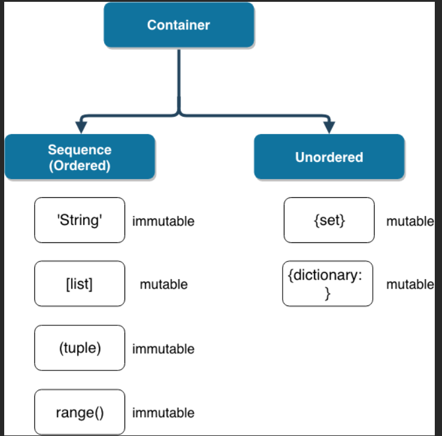

파이썬 과목평가는 이전의 web과목 평가와 같은 구성으로 객관식, 주관식, 서술형문제가 출제됩니다. 출제 범위는 파이썬 수업과정에서 작성했던 jupyter notebook파일의 01.python_intro 부터 08.OOP_advanced 까지입니다. 시험공부를 위한 주요 키워드를 **우선순위**에 따라 정리해보았습니다.

# 01_python_intro

### 시퀀스 자료형의 특징과 활용방법

- 리스트는 대괄호`[]` 및 `list()` 를 통해 만들 수 있습니다.

  값에 대한 접근은 `list[i]`를 통해 합니다.

- 튜플은 리스트와 유사하지만, `()`로 묶어서 표현합니다.

  그리고 tuple은 수정 불가능(불변, immutable)하고, 읽을 수 밖에 없습니다.

  직접 사용하기 보다는 파이썬 내부에서 사용하고 있습니다.

- 세트는 수학에서의 집합과 동일하게 처리된다.

  세트는 중괄호`{}`를 통해 만들며, 순서가 없고 중복된 값이 없다.

  빈 집합을 만들려면 `set()`을 사용해야 합니다. `{}`로 사용 불가능.

  `dictionary`의 `key`처럼 불변한 값만이 원소가 될 수 있습니다.

- 딕셔너리는 `key`와 `value`가 쌍으로 이뤄져있으며, 궁극의 자료구조이다.

  `{}`를 통해 만들며, `dict()`로 만들 수도 있다.

  `key`는 불변(immutable)한 모든 것이 가능하다. (불변값 : string, integer, float, boolean, tuple, range)

  `value`는 `list`, `dictionary`를 포함한 모든 것이 가능하다.

### 파이썬에서 독특하게 사용되는 연산자

| 연산자  | 내용                         |
| ------- | ---------------------------- |
| a and b | a와 b 모두 True시만 True     |
| a or b  | a 와 b 모두 False시만 False  |
| not a   | True -> False, False -> True |

-  단축평가
  - 파이썬에서 and는 a가 거짓이면 a를 리턴하고, 참이면 b를 리턴한다.
  - 파이썬에서 or은 a가 참이면 a를 리턴하고, 거짓이면 b를 리턴한다.
- 숫자가 아닌 자료형은 `+` 연산자를 통해 합칠 수 있습니다.
- `in` 연산자를 통해 요소가 속해있는지 여부를 확인할 수 있습니다.
- `is` 연산자를 통해 동일한 object인지 확인할 수 있습니다.(int 형의 경우 256까지는 같은 주소 사용


# 07_oop_basic

### 클래스의 정의

- 선언과 동시에 클래스 객체가 생성된다.
- 또한, 선언된 공간은 지역 스코프(local scope)로 사용된다.
- 정의된 어트리뷰트 중 변수는 멤버 변수로 불린다.
- 정의된 함수(`def`)는 메서드로 불린다.

### 클래스와 인스턴스

- 인스턴스 객체는 `ClassName()`을 호출함으로써 생성된다.
- 인스턴스 객체와 클래스 객체는 서로 다른 이름 공간을 가지고 있다.
- **인스턴스(instance) => 클래스(class) => 전역(global) 순으로 탐색을 한다.**

```python
# 인스턴스 = 클래스()
puppy = Dog()
```

- 클래스는 특정 개념을 표현하는 껍데기고 실제 사용하려면 인스턴스를 생성해야 한다.
- 인스턴스는 실제 값을 가지고 있는 덩어리라고 이해하면 된다.
- 인스턴스와 객체는 같은 것을 의미한다.
- 보통 객체만 지칭할 때는 단순히 객체(object)라고 부른다.
- 하지만 클래스와 연관지어서 말할 때는 인스턴스(instance)라고 부른다.
- 클래스 변수
  - 클래스의 모든 인스턴스에서 공유되는 어트리뷰트와 메서드를 위한 것
  - 모든 인스턴스가 공유

- 인스턴스 변수
  - 인스턴스별 데이터를 위한 것
  - 각 인스턴스들의 고유 변수

### 생성자

- ```
  __init__()
  ```

  - 초기화
  - 인스턴스 객체가 만들어진 후에 호출되는 함수.
  - 인스턴스에서 사용할 초기 값들을 초기화 함으로써 초기화 된 새 인스턴스를 얻을 수 있음.

- ```
  __del__()
  ```

  - 소멸자, 파괴자
  - 인스턴스 객체가 소멸(파괴)되기 직전에 호출되는 함수.

```python
def __init__(self):
    print('인스턴스가 생성된 후 자동으로 호출되는 메서드입니다.')

def __del__(self):
    print('인스턴스가 소멸되기 직전에 자동으로 호출되는 메서드입니다.')
```

위의 형식처럼 양쪽에 언더스코어가 있는 메서드는 특별한 일을 하기 위해 만들어진 메서드이기 때문에 `스페셜 메서드` 혹은 `매직 메서드`라고 불립니다.

- 매직(스페셜) 메서드 형태: `__someting__`

# 08_oop_advanced

### 클래스 변수, 인스턴스 변수

- 클래스변수

  - 클래스의 속성
  - 모든 인스턴스가 공유
  - 클래스 선언 블록 최상단에 위치
  - `Class.class_variable` 과 같이 접근(할당)

- 인스턴스변수

  - 인스턴스의 속성

  - 각 인스턴스들의 고유한 변수

  - 메서드 정의에서 `self.instance_variable` 로 접근(할당)

  - 인스턴스가 생성된 이후 `instance.instance_variable` 로 접근(할당)

    

### 스태틱메소드, 클래스메소드, 인스턴스메소드

- 인스턴스 메소드

  - 인스턴스가 사용할 메서드이다.
  - 메서드 정의 위에 어떠한 데코레이터도 없으면, 자동으로 인스턴스 메서드가 된다.
  - **첫 번째 인자로 `self` 를 받도록 정의합니다. 이 때, 자동으로 인스턴스 객체가 `self` 가 된다.**

- 클래스메소드

  - 클래스가 사용할 메서드다.(클래스를 수정할 때 사용??)
  - 정의 위에 `@classmethod` 데코레이터를 사용한다.
  - **첫 번째 인자로 클래스(`cls`) 를 받도록 정의합니다. 이 때, 자동으로 클래스 객체가 `cls` 가 된다.**
  - 클래스도 3가지 메서드 모두에 접근할 수 있다.
  - 클래스가 할 행동은 다음 원칙에 따라 설계한다.
    - 클래스 자체(`cls`)와 그 속성에 접근할 필요가 있다면 **클래스 메서드**로 정의한다.
    - 클래스와 클래스 속성에 접근할 필요가 없다면 **스태틱 메서드**로 정의한다.
  
- 스태틱메소드

  - 클래스가 사용할 메서드다.

  - 정의 위에 `@staticmethod` 데코레이터를 사용한다.

  - **어떠한 인자도 자동으로 넘어가지 않는다.**

  - 클래스 내에서 독립적인 역할을 하는 메소드를 스태틱 메소드로 만든다. 다른 클래스 변수 및 인스턴스 변수에 영향을 끼치지 않음.

    

  ### 상속

- **활용법**

  ```python
  class DerivedClassName(부모클래스):
      code block
  ```

- super()

  - 자식 클래스에 메서드를 추가로 구현할 수 있다.

  - 부모 클래스의 내용을 사용하고자 할 때, `super()`를 사용할 수 있다.

  - **활용법**

    ```python
    class BabyClass(ParentClass):
        def method(self, arg):
            super().method(arg) 
    ```

- 메서드 오버라이딩

  - 상속 받은 클래스에서 메서드를 덮어쓴다.

- 상속관계에서의 이름공간

  - 인스턴스 -> 자식 클래스 -> 부모 클래스 -> 전역 순으로 탐색해 나간다.

- 다중 상속

  - `class FirstChild(Dad, Mom):` 이런식으로 여러개의 부모클래스로부터 상속을 받을 수 있다.
  - 중복으로 상속되는 클래스 변수가 존재한다면 첫번째 부모의 클래스 변수를 상속받습니다.


# 03_function

### 함수 인자의 종류

- 위치 인자(기본 인자)

  - 함수는 기본적으로 인자를 위치로 판단합니다.

- 키워드 인자 (Keyword Arguments)(기본 인자값을 지닌 인자)

  - 함수가 호출될 때, 인자를 지정하지 않아도 기본 값을 설정할 수 있습니다.

  - **활용법**

    ```python
    def func(name='두표'):
        return name
    ```

  - **단, 기본 인자 이후에 기본 값이 없는 인자를 사용할 수는 없습니다.**

    - 왜냐하면 기본 값 인자를 앞에 사용 시, 인자를 1개만 사용할 때, 인자가 기본값 인자인지 뒤쪽의 인자인지 구분이 불가능하기 때문

- 가변 인자 리스트

  - **활용법**

    ```python
    def func(a, b, *args):
    ```

    > `*args` : 임의의 개수의 위치인자를 받음을 의미
    >
    > 보통, 이 가변인자 리스트는 형식 인자 목록의 마지막에 옵니다.

  - 내부적으로 튜플로 처리됨.
  - **가변 인자 리스트 주의사항**
    - 만약 *objects 보다 키워드 인자 혹은 위치 인자가 먼저 나오면 에러가 발생한다.
    - 함수 사용시, 가변 인자 리스트를 제일 먼저 쳐야함.
    - 정의 시에는 순서 상관이 없음.

- 정의되지 않은 키워드 인자

  - 정의지지 않은 키워드 인자들은 `dict` 형태로 처리가 되며, `**`로 표현합니다.

    주로 `kwagrs`라는 이름을 사용하며, `**kwargs`를 통해 인자를 받아 처리할 수 있습니다.

    **활용법**

    ```python
    def func(**kwargs):
    ```

    > `**kwargs` : 임의의 개수의 키워드 인자를 받음을 의미.(key word args의 약자)

### 함수의 리턴

- 앞서 설명한 것과 마찬가지로 함수는 반환되는 값이 있으며, 이는 어떠한 종류의 객체여도 상관없습니다.

  단, **오직 한 개의 객체**만 반환됩니다.

  함수가 return 되거나 종료되면, 함수를 호출한 곳으로 돌아갑니다.

### 스코프

- 파이썬에서 사용되는 이름들은 이름공간(namespce)에 저장되어 있습니다.

  그리고, `LEGB Rule` 을 가지고 있습니다.

  변수에서 값을 찾을 때 아래와 같은 순서대로 이름을 찾아나갑니다.

  - `L`ocal scope: 정의된 함수

  - `E`nclosed scope: 상위 함수

  - `G`lobal scope: 함수 밖의 변수 혹은 import된 모듈

  - `B`uilt-in scope: 파이썬안에 내장되어 있는 함수 또는 속성


# 04_data_structure

### map, zip, filter

- map
  - Iterable의 모든 요소에 function을 적용한 후 그 결과를 돌려준다.
  - 대표적으로 iterable한 타입 - list, dict, set, str, bytes, tuple, range
  - return은 `map_object` 형태이다.(따라서 리스트 형태로 바꿔주려면 `list()`로 감싸 주어야 한다.)

- zip

  - 복수의 iterable 객체를 모아준다. (여러개의 이터러블을 받아 새로운 이차 배열 생성.)

  - 결과는 튜플의 모음으로 구성된 `zip object` 를 반환한다.

    - ```python
      girls = ['여1', '여2', '여3']
      boys = ['남1', '남2', '남3']
      print(list(zip(girls, boys))
      
      [('여1', '남1'), ('여2', '남2'), ('여3', '남3')]
      ```

  - zip은 반드시 길이가 같을 때 사용해야한다. 다르다면 가장 짧은 것을 기준으로 구성한다.

- filter

  - ```python
    filter(function, iterable)
    ```

  - iterable에서 function의 반환된 결과가 `True` 인 것들만 구성하여 반환한다.

  - `filter object` 를 반환한다.

### comprehension

- 리스트 컴프리헨션

  - List Comprehension은 리스트안에 식, for 문을 지정합니다. 여러 줄의 코드를 한 줄로 줄일 수 있습니다.

  - **활용법**

    ```python
    [식 for 변수 in iterable if 조건식]
    
    [식 if 조건식 else 식 for 변수 in iterable]
    
    # elif 는 다음과 같이 사용해야 합니다. (if else 열거)
    [식 if 조건식 else 식 if 조건식 else 식 if ... else ... for 변수 in iterable]
    ```

- 딕셔너리 컴프리헨션

  - **활용법**

    ```python
    {키: 값 for 키, 값 in 딕셔너리}
    
    dict({키: 값 for 키, 값 in 딕셔너리})
    
    {키: 값 for 키, 값 in 딕셔너리 if 조건식}
    
    {키: 값 if 조건식 else 값 for 키, 값 in 딕셔너리}
    ```

### 리스트 메소드

- `.append(x)` : 리스트에 값을 추가할 수 있습니다.

- `.extend(iterable)` : extend는 append와 달리 iterable 객체의 내부 element를 호출합니다.
  - 풀려서 하나하나 더해진다는 뜻입니다.
- `.insert(i, x)` : 위치(인덱스) `i`에 값 `x`을 추가합니다.
  - 리스트의 길이를 넘어서는 인덱스는 마지막에만 X가 추가됩니다.
-  `.remove(x)` : 리스트에서 값이 x인 첫번째 항목을 삭제합니다.
-  `.pop(i)` : 정해진 위치 `i`에 있는 값을 삭제하며, 그 항목을 반환합니다.
- `.clear()` : 가변 시퀀스(list)의 모든 항목을 삭제합니다.
  - `del list[:]`와 동일 합니다.
- `.index(x, i = 0, j = len(self))` : (인덱스 i 또는 그 이후에, 인덱스 j 전에 등장하는) x 값을 찾아 해당 index 값을 반환합니다.
- `.count(x)` : 가변 시퀀스에 등장하는 x의 총 개수를 확인할 수 있습니다.
- `.sort(reverse=false)` : 항목 간의 '>' 비교만을 사용하여 리스트를 제자리에서 정렬합니다.
- `.reverse()` : 반대로 뒤집습니다. **(정렬 아님)**

### 딕셔너리 메소드

- `.pop(key[, default])` : key가 딕셔너리에 있으면 제거하고 그 값을 돌려줍니다. (`[ ]` 생략가능하다는 뜻)
  - 그렇지 않으면 default를 반환합니다.(default 없을시 에러)
- `.update(*key = value)` : 주어진 key값이 존재하면 value를 주어진 value로 덮어 씌웁니다.
  - key값이 없을 경우 새로 key값과 value값을 추가합니다.
- `.get(key[, default])` : key를 통해 value를 가져옵니다.(없을시  default 호출)
  - 에러가 발생하지 않습니다.

### copy

- `b = a[:]` : 이런식으로 복사합니다.

- 이중 배열의 경우 이런식으로 복사합니다.

- ```python
  import copy
  
  a = [1, 2, [1, 2]]
  b = copy.deepcopy(a)
  ```

- ```python
  a = [1, 2, [1, 2]]
  b = c[:] for c in a
  ```


# 06_errors

### 문법에러와 예외의 이름

- ```python
  if True
      print('거짓')
  
  invalid syntax
  ```
  - `:, ;`을 빼먹거나 추가하여 문법에 어긋나는 코드 작성시 나타납니다.

- ```python
  print('hi)
  
  EOL while scanning string literal
  ```
  - (End Of Line)의 약자로 끝나는 따옴표를 쓰지 않을 시 나타납니다.

- ```python
  print('hi'
  
  unexpected EOF while parsing
  ```

  - EOF 괄호를 닫지 않을 경우 나타납니다.

### 복수의 예외처리

- ```python
  try:
      num = input('100으로 나눌 값을 입력하시오 : ')
      print(100/int(num))
  except (ValueError, ZeroDivisionError):
      print('에러 발생!')
  ```

- 위의 방식으로 예외를 여러게 지정하여 예외 처리 가능합니다.

- ```python
  try:
      num = input('100으로 나눌 값을 입력하시오 : ')
      print(100/int(num))
  except Exception:
      print('0으로 숫자를 나눌수는 없어')
  except ValueError:
      print('숫자를 넣어')
  ```

- 이런식으로 여러개의 에러를 순차적으로 다른 오류를 출력하게 할 수 있습니다.

- 여기서 중요한 내용은 **에러가 순차적으로 수행됨**으로, 가장 작은 범주부터 시작해야 합니다.


# 05_module

### 모듈 가져오기

- ```python
  import module
  ```

  1. 그냥 모듈가져오기

- `import pakage1.module1, pakage2.module2`

  - 상대주소 참조하여 모듈1, 모듈 2 한번에 가져오기

- `from module import var`

  `from module import function`

  `from module import Class`

  - 원하는 어트리뷰트(변수, 함수, 클래스) 만 가져오기

- from module import *

  - 모듈의 모든 어트리뷰트 참조하기

- from pakage.module import var, function, Class

  - 상대주소를 참조한 서브 모듈에서 원하는 변수, 함수, 클래스 참조하기

- 1.  상대 주소 참조하여

02_control_of_flow

- 기본적인 반복문과 조건문

특히 파이썬의 가장 기초가 되는 01.python_intro와 앞으로 장고 수업에서 많이 활용될 클래스의 개념을 설명하는 07.oop_basic 파트의 문제 비중이 높은 편입니다. 참고하여 시험 준비 해주시면 됩니다. 