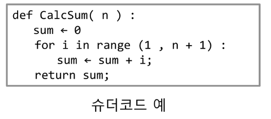
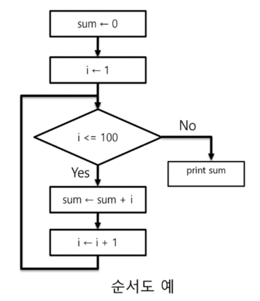
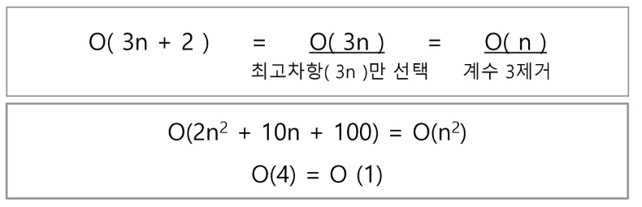

# 알고리즘

- 알고리즘 : **유한한 단계**를 통해 문제를 해결하기 위한 절차, 방법

- 표현 방법 : 슈더 코드 와 순서도

  - 슈더 코드(의사 코드)

    정해진 문법이 없음. 자신이 편한방식으로 공유하고자 하는 그룹에 익숙할 수 있게 설명을 붙여줌.

     

  

  - 순서도

    단점 : 이해하기 좋은 것 처럼 보이나 알고리즘이 복잡해질 수록 그림이 커지면 알아보기가 힘들어짐.

    

    마름모에서 판단을 통해 컴퓨터의 코드 실행의 흐름을 알려줌.

    

- 좋은 알고리즘의 판단 과정

  1. **정확성** : 얼마나 정확하게 동작하는가?

  2. **작업량** : 얼마나 적은 연산으로 원하는 결과를 얻어내는가?
  3. 메모리 사용량 : 얼마나 적은 메모리를 사용하는가?
  4. 단순성 : 얼마나 단순한가?  ( 가독성의 수준 알아보기 쉬워야 함. )
  5. 최적성 : 개선의 여지가 얼마나 적은가? (시험의 수준에서는 중요함.)


- 시간 복잡도

  - 좋은 알고리즘을 판단하기 위한 객관적인 판단 기준 필요 -> 시간복잡도로 판단.

  - 실행되는 명령문의 개수를 계산.

  - 빅-오(O)

    - n에 대한 항만을 표시하며 계수는 생략하여 표시.

    

    - 세타 ()  ,오메가 () 등이 있지만 배우지는 않겠다.


# 배열

- 일정한 자료형의 변수들을 하나의 이름으로 열거하여 사용하는 자료구조

- 배열의 기본은 *같은 자료형*(**파이썬은 예외**)의 변수들을 하나의 이름으로 선언 하는 것.

  - 파이썬은 리스트에 리스트 및 다른 자료형들도 클래스들로 지정이 되어 있기 때문에 저장할 수 있음!

    > 절차지향형 언어 -> 기본 자료형(Data types)만을 가지고 있음 
    >
    > 객체지향형 언어 -> 기본 자료형 + 객체, 클래스 등으로 다양한 자료형을 지닐 수 있음.

  - 메모리에 저장이 랜덤하게 되지 않고 순서대로 저장이 되기 때문에 호출에 유리하다.

- 배열의 필요성
  - 여러번의 변수 명명이 필요 없으므로 가독성이 좋아짐.


## 완전 검색

- 완전 검색 방법은 문제의 해법으로 생각할 수 있는 **모든 경우의 수**를 나열해 보고 확인하는 기법이다.
- 완전 검색으로 접근하여 해답을 도출한 후, 성능 개선을 위해 다른 알고리즘을 사용해라.


## 탐욕(Greedy)알고리즘

- 일반적으로, 머릿속에 떠오르는 생각을 검증없이 바로 구현하는 것.
- 여러 경우 중 하나를 결정해야 할 때 마다, 그 **순간에 최적이라고 판단하는 것**을 선택하여 해답에 도달 하는 것.
- 검증이 된 greedy한 것을 사용하는 건 좋다.
- 검증이 필수! 인 알고리즘.


## 정렬

- 2개 이상의 자료를 특정 기준에 의해 작은 값부터 큰 값(오름차순)혹은 그 반대의 순서대로 재배열 하는 것.
- **키** : 자료를 정렬하는 기준이 되는 특정 값

##### - 버블 정렬

- 인접한 두 개의 원소를 비교하며 자리를 계속 교환하는 방식
- 시간 복잡도 =  O(n**2)

##### - 카운팅 정렬


# 입력값

```python
import sys
인풋 받기
sys.stdin = open('1206input.txt', 'r')

아웃풋 나가기
sys.stdout = open('1206output.txt', 'w')
```

이렇게 하면 인풋데이터를 확인 할 수 있다.