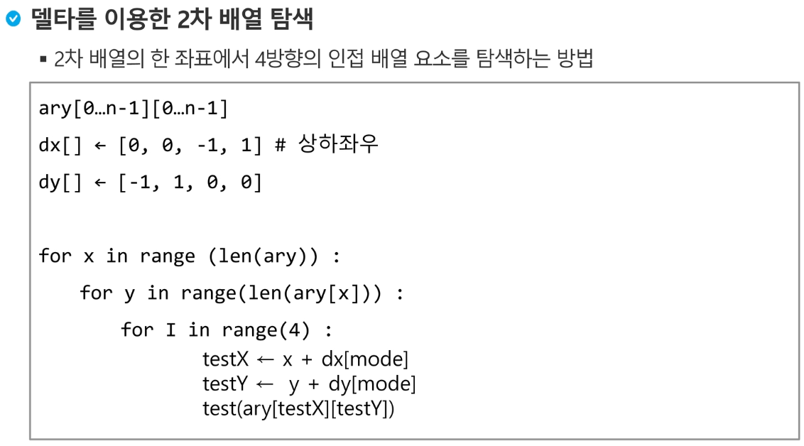
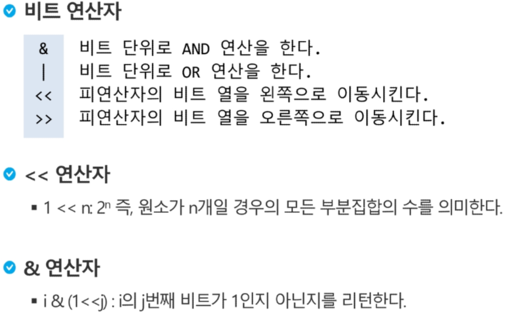

# 배열

- 전기버스 교수님 풀이

```python
for test_case in range(1,int(input())+1)
    K,N,M = map(int,input().split())
    stops = [0]+list(map(int,input().split()))+[N]
    last = cnt = 0
    next = last + k
    for i in range(1, M+2):
        if(stops[i] - stops[k]) > k:
            cnt = 0
            break
        if stops[i] > next:
            last = stops[i-1]
            cnt += 1
        next = last + k
    print('#{} {}'.format(test_case, cnt))
```

- 교수님 풀이 Flatten

  min max의 개수를 수정하고 만약 개수가 0이 되면 그 다음으로 넘어간다.

```python

```


- 내부적으로 제공하는 sort의 시간 복잡도는 O(nlogn), min(), max()의 시간 복잡도는 O(n)





# 부분집합 계산하기

부분집합의 경우 원소가 n개 일 때 나올 수 있는 경우의 수가 2 ** n 이면 너무 커지기 때문에 계산하기 어렵다.

비트연산

| A    | B    | C    |
| ---- | ---- | ---- |
| 0    | 1    | 0    |

이렇게 비트 단위로 생각 할 수 있다.



i & (i<<j) : i의 j번째 비트가 1인지 아닌지를 리턴


AND 연산   1001 & 1011 = 1001 

​                    101 & 100 = 100

OR 연산 1001 | 1011 = 1011

xor연산 1001 ^ 1011 = 0010

왼쪽 이동  1011 << 1 = 10110 (이진수니까 십진수 개념처럼 x2 의 효과가 나옴.)

오른쪽 이동  1001100 >> 2 = 10011


arr = [3, 6, 7, 1]
n = len(arr)

for i in range(1<<n):
    for j in range(n):
        if i & (1<<j):
            print(arr[j], end=', ')
    print()
print()  