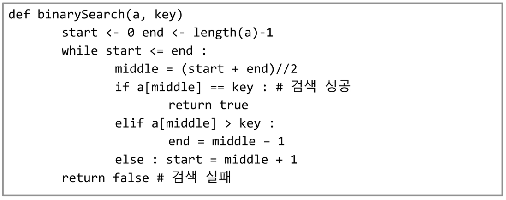
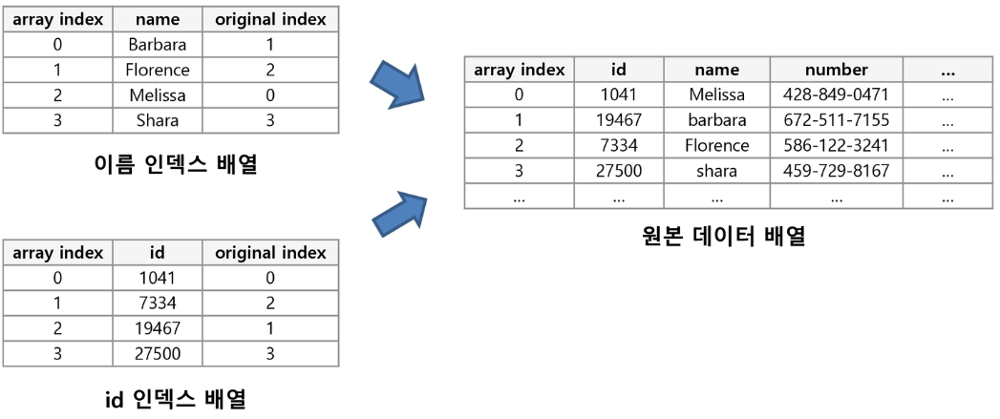
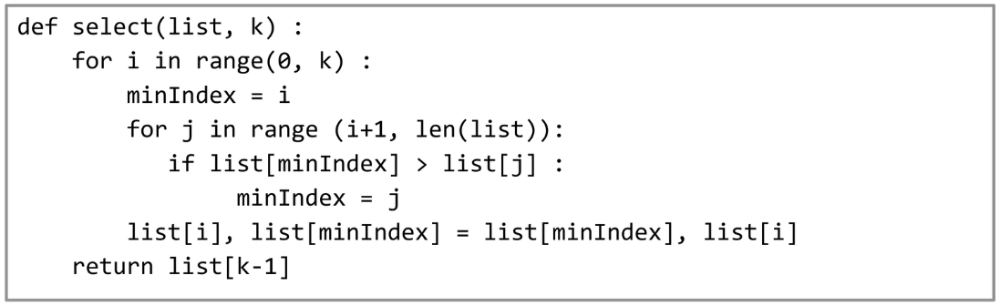
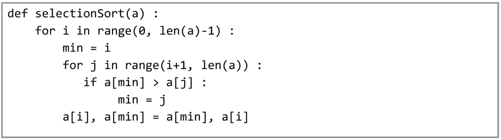

# 검색

### 1. 순차검색

- 모든 원소를 차례대로 검색하는 것, 직관적이나 비효율적인 경우가 있다.
- 정렬되어 있지 않은 경우와 정렬되어 있는 경우의 시간 복잡도는 달라진다.

##### 정렬되어 있지 않은 경우

- 시간 복잡도 O(n) : 모든것을 다 검색해야 함.

##### 정렬되어 있는 경우

- 시간 복잡도 O(n) : 평균 비교 회수가 반으로 줄어든다.

### 2. 이진검색

- 자료의 가운데에 있는 값을 먼저 찾고 큰값과 작은 값을 나눠 검색하는 방법
- 자료가 정렬되어 있어야 함.

##### 

### 3. hash

- 원본데이터의 다양한 기준으로 미리 정렬을 해놓은 index를 추가하여 검색속도를 높인다.

### 

### 4.  셀렉션 알고리즘

- O(kn)의 시간 복잡도를 지니는 k번째의 원소를 찾는 프로그램
- 1번부터 k전까지의 모든 원소를 배열의 앞으로 이동시키고 k번째 원소를 반환함.

### 5. 선택 정렬

- 셀렉션 알고리즘을 전체에 적용한 것
- 시간 복잡도 =  O(n ** 2)

---

##### 셀렉션 알고리즘

- O(kn)의 시간 복잡도를 지니는 k번째의 원소를 찾는 프로그램
- 1번부터 k전까지의 모든 원소를 배열의 앞으로 이동시키고 k번째 원소를 반환함.

---

