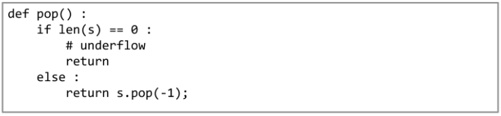
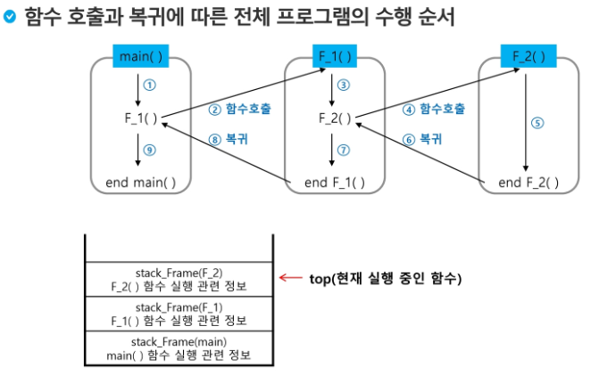
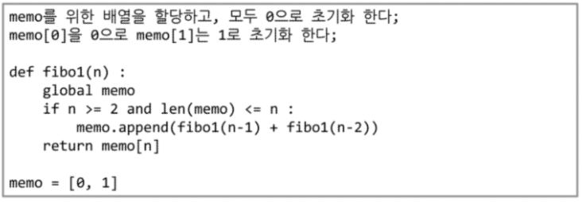

# 스택

- 후입선출의 자료구조.
- 연산
  - 삽입 : 저장소에 자료를 저장
  - 삭제 : 보통 pop이라 부르며 삽입한 자료의 역순으로 꺼낸다.
  - 스택의 자료 유무 판단 : .isEmpty
  - 스택의 top에 있는 원소를 반환 : .peek

- 단점 : 구현이 용이하지만 스택의 크기를 변경하기 힘들다.(C로 구현할경우)
  - python의 경우 자동으로 리스트가 동적 연결리스트 이기 때문에 구현할 필요가 없다.
  - C의 경우 복잡한 구현을 통해 동적연결리스트를 작성하여 메모리를 효율적으로 사용할 수 있다.
  - .append()함수는 스택의 크기를 자유롭게 변경하게 해주지만 연산속도가 느리다.

### function call

- 스택의 주 사용례 중 하나.
- 가장 마지막에 호출 된 함수가 가장 먼저 실행되므로 변수를 스택의 형태로 저장.

### 재귀 호출

- 자기 자신을 호출하여 순환 수행되는 것.

- 엄청난 중복호출이 존재할 경우, memoization으로 해결 가능하다.
- memoization의 예

> ###  알고리즘의 4가지 패러다임
>
> 1. 동적계획법(Dynamic programming) : 
>
> 2. 완전탐색법
>
> 3. 그리디 알고리즘
> 4. 분할 정복

### 그래프

- 그래프의 종류

  - 무향 그래프(Undirected Graph) : 방향이 없음
  - 유향 그래프(Directed Graph) : 방향이 있음
  - 가중치 그래프(Weighted Graph) : 
  - 사이클 없는 방향 그래프(DAG, Directed Acyclic Graph)

  ---

  - 완전 그래프 : 모든 정점들이 간선으로 이어져 있음.
  - 부분그래프 :  일부분의 간선이 삭제되어 있음.

- 용어

  - 인접 : 두 정점이 이어져 있는 경우 인접했다고 한다.
  - 경로 : 

- 그래프 표현 방법

  - 인접 행렬 : M x M 크기의 2 차원 배열을 이용해서 간선정보를 저장.

    | from\ to | A    | B    | C    | D    | E    |
    | -------- | ---- | ---- | ---- | ---- | ---- |
    | A        | 0    | 1    | 1    | 0    | 0    |
    | B        | 1    | 0    | 0    | 1    | 0    |
    | C        | 1    | 0    | 0    | 0    | 1    |
    | D        | 0    | 1    | 0    | 0    | 1    |
    | E        | 0    | 0    | 1    | 1    | 0    |

    - 간선이 얼마 없을 경우 메모리 낭비가 심함.
    - 유향 그래프의 경우 `행의 합 = 진출 차수, 열의 합 = 진입 차수`을 만족함.

  - 인접 리스트 : 각 정점마다 해당 정점으로 나가는 간선의 정보를 저장.

    - [[B, C], [A, D], [A, E], [B, E], [C, D]]

  - 간선의 배열 : 간선을 배열에 연속적으로 저장.

    - 간선이 얼마 없을 경우 저장공간을 적게 차지함.

      (A, B), (A, C), (B, D), (C, E), (D, E)

    - 시작점과 끝점을 간선마다 저장.

    -  계산 시 탐색이 필요하므로 비효율적임.