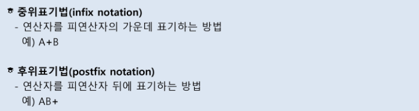
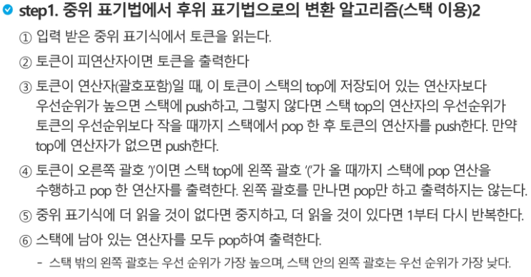

# 스택2

### 계산기 

- 중위표기법 보다는 후위표기법이 컴퓨터에서 연산의 순서를 표현하는데 좋다.

- 연산의 순서를 스택을 활용하여 결정할 수 있다.

  

- '('는 들어가기 전에는 우선순위가 가장 높지만 들어가고 나서는 우선순위가 가장 낮아진다.

- 코드 참조!

### 백트래킹

- 해를 찾는 도중에 '막히면' 되돌아가서 다시 해를 찾아 가는 기법
- DFS와 스택을 이용하여 뒤로 돌아간다는 점은 유사하다.
- 다만, 백트래킹은 그래프에서만 제한되는 방식은 아니다.

- 또한 백트래킹은 `유망한` 노드만을 검색한다는 점에서 DFS와는 다르다.