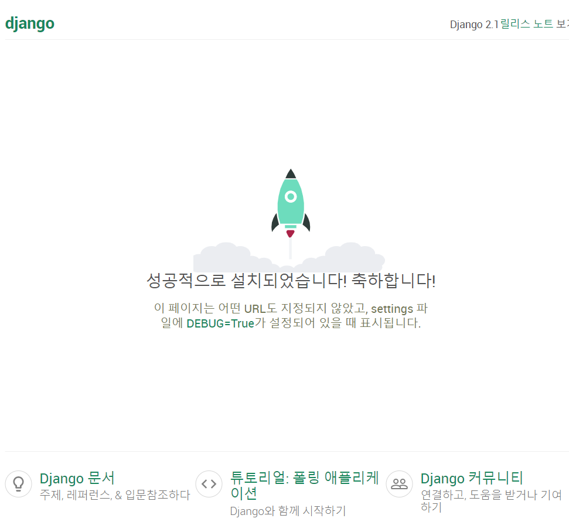

1. `pip list` 

2. `django-admin startproject (프로젝트이름)`

3. `python manage.py runserver 8080`

   

   

4. `python manage.py startapp (앱 이름 복수형)`:

   1. 앱이 없으면 만들고 여기에 MTV 만든다

5.  settings에서 isnstalled_apps에 항상 앱을 등록 해줘야 한다.

6. django language_code 로 공식문서 검색한다.

   1. 버전 주의!