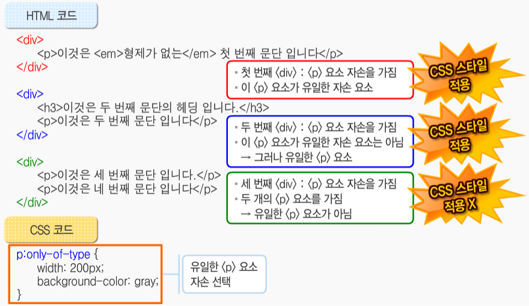

# 2020.03.10 CSS

> HTML 요소 참고서
>
> https://developer.mozilla.org/ko/docs/Web/HTML/Element
>
> HTML 콘텐츠 카테고리
>
> https://developer.mozilla.org/ko/docs/Web/Guide/HTML/Content_categories

## CSS 문서표현(상)

### CSS의 구조

 Selector(혹은 셀렉터) {선언; 선언;}

Ex) `h1{color:blue; font-size: 15px;}`

Global CSS Property Usage를 검색하면 브라우저에서 가장 많이 쓰이는 CSS 속성들의 정보들을 확인할 수 있다. 주로 활용하는 속성위주로 기억하자!

### CSS 정의 방법

1. 인라인 : 해당 태그에 직접 `style` 속성을 활용

2. 내부 참조 : HTML 파일 내에 `<style>` 태그에 지정

3. 외부참조 : 외부 CSS파일을 `<head>` 내 `<link>`를 통해 불러오기(제일 많이 씀.)

### link 요소

- **rel** 
  - 현재 HTML과 연결할 파일간의 관계를 나타냄.
  - CSS파일과의 관계는 `rel="stylesheet"`로 나타냄
- **href**
  - 연결하고자 하는 리소스 파일의 경로 지정
  - 상대경로로 입력함.

# 선택자(Selector)

- HTML 에서 특정한 요소를 선택하여 스타일링 하기 위해서는 반드시 선택자라는 개념이 필요하다
- 기초선택자
- 고급선택자
  - 자손선택자, 직계 자손 선택자
  - 형제, 인접형제 선택자, 전체 선택자

### type selector(기초 선택자)

- HTML selector : `h1`, `p`등의 HTML요소명을 직접 선택하여 스타일 정의
- class selector : HTML의 클래스 속성값이 같은 경우 그룹으로 묶을 수 있어 편리
  -   selector 형식 : `.classname {}`을 통해 스타일 정의
- ID selector : HTML의 유일한 속성인 ID속성을 통해 스타일 정의
  - selectot 형식 : `#IDname {}`을 통해 스타일 정의
- 그룹 지정: 클래스가 이미 지정되어 있는 경우 쉼표를 활용하여 여러 요소에 동일한 스타일 적용 가능
  - selector  형식 : `h1, #idTitle, h2 {}`을 통해 두 개 이상의 셀렉터에 동일한 스타일 적용

### 고급선택자

- 하위선택자 (자손요소): `a b {}` 코드를 통해 a 요소 하위에 있는 b요소를 선택.

  - 직계자손이 아니더라도 같은 요소가 있다면 무조건 선택됨.
  - ex)

- 직계 자손 선택자 : `a > b {}`코드를 통해 a의 직계자손중 b 선택 

  

- 형제 선택자 : `a ~ b {}`코드를 통해 a요소 다음에 있는 모든 b요소를 선택.
  
  - 
  
- 인접 형제 선택자 : `a + b {}`코드를 통해 a 요소 바로 다음의 b요소 만을 선택.
  
- 
  
- 전체 선택자 :`a* {}`을 통해 a요소 아래 모든 요소를 선택

### 의사클래스(psuedo class)

- `(선택자명):(의사클래스명)`의 형식으로 사용되며 클래스의 특징을 지님.

- 개인적으로는 부연설명의 느낌으로 이해.

- 예) `a:link{}` a를 기준으로 한 번도 방문하지 않는 링크들을 묶어서 클래스로 선택.

  #### 링크 의사 클래스

  - `:link`  :  한 번도 방문하지 않은 링크
  - `:visit` :  방문 한 링크

  #### 동적 의사 클래스

  - `:active` : 마우스로 클릭했을 때의 상태
  - `:hover` : 마우스 커서가 올라간 상태
  - `:focus` : 서식 폼과 같은 요소에서 마우스가 위치할 때 입력 또는 선택 상황을 알려줌.(커서 변경)

  #### 구조적 의사 클래스

  - `:root` : 문서의 최상위 요소를 의미.(앞에 기준이 되는 선택자 없이 단독으로 사용)

  - `:empty` : 비어있는 요소를 의미. (내용이 없는 요소)

  - `:only-child` : 형제 요소가 없는 요소를 의미

  - `:only-of-type` : 같은 타입의 형제가 없는 요소

    - 예시

    

  - `:first-child`, `:last-child` : 부모 요소의 첫 번째 요소, 마지막 요소만을 선택.

  - `:nth-of-type(n)`, `:nth-last-of-type(n)` : 특정요소의 n번째 요소(위에서부터, 아래서부터)

  - `:first-of-type`, `:last-of-type` : 부모요소의 같은 타입의 첫번째 요소, 마지막 요소를 선택

  #### 기타 의사 클래스

  - `:lang(언어명)` : 지정한 언어를 속성으로 가지고 있는 요소
  - `:not(제외될 선택자)` : 괄호안의 선택자를 제외한 요소 

### 선택자 with 개발자 도구

`#sect1>ul>li:rth-child(1)` 

#은 아이디 선택자!

선택자는 스타일링을 하기 위해서 가장 중요한 도구이다.

id: 문서에서 한 번만 등장할 수 있다. (일반적으로 한 개만 써야 한다) 두번 쓸 수는 있지만 절대로 그렇게 해서는 안된다.

### CSS상속

* CSS는 상속을 통해 부모 요소의 속성을 자식에게 상속한다.
* 상속되는것
  
  * Text관련 요소(font, color, text0-aligh), opacity, visibility 등
* 상속되지 않는것 (예시)
  
  * Box model 관련 요소(width, heigth, margin, padding, border, box-sizing, display), position 관련 요소(position, top/right/bottom/left, z-index) 등
  
    

### CSS 적용 우선순위(Cascading order)

* 중요도(Importance) - 사용시 주의
  * !important
* 우선순위(Specificity)
  * 인라인/ id 선택자/ class 선택자 ~~속성 선택자, pseudo-class~~/ 요소 선택자 ~~pseudo-element~~
* 소스순서

1. 요소선택자의 우선순위는 class 선택자보다 낮다.
2. class 선택자의 우선순위는 id 선택자보다 낮다.
3. class선택자가 두개가 들어있는 경우 소스코드의 순서를 따져서 소스코드상에 나중에 선언된 class선택자가 우선순위가 먼저 선언된 class선택자보다 더 높다
4. id 선택자의 우선순위는 인라인 선택자보다 낮다.
5. `!important`는 다른 그 어떠한 선택자보다도 우선 순위가 높다.

# 기초 CSS(문서표현 (하))

### 서체

- `{font-family: Helvetica, Arial, sans-serif;}` : 폰트 패밀리를 통해 컴퓨터에 없는 경우의 서체까지 지정해 줘야함.

- `{font-size : 11 pt;}` : 폰트 크기 조절.
- `{font-style : Italic;}` : 글꼴을 기울임.
- `{font-weight : bold;}` : 글꼴을 굵게함.
- `{font-variant : small-caps;}` : 텍스트의 크기로 대소문자를 표기.

### 텍스트 스타일 설정

- `{letter-spacing : -0.02 em;}` : 자간 설정
- `{word-spacing : 0.2 em;}` : 단어간격 설정
- `{line-height : 2 em;}` : 행간 설정
- `{text-align : center;}` : 텍스트 중앙정렬
  - 가능한 속성 값 : left, right, center, justify(양끝정렬), auto(기본형식)
  - 블록레벨 요소에만 적용가능
- `{vertical-align : top;}` : top, bottom, text-top등을 이용하여 세로 정렬
- `{text-indent : 5 em;}` : 들여쓰기 

### 단위

#### 크기 단위(상대)

* `px`
* `%`
* `em`: 배수단위, 요소에 지정된 사이즈에 상대적인 사이즈를 가짐
* `rem`: 최상위 요소(html)의 사이즈를 기준으로 배수 단위를 가짐 **( Root - em)**
* ~~`vw`, `vh`, `vmin`, `vmax` viewpoint기준단위~~

Rem을 설정하면 root, 즉 모든 폰트의 사이즈를 변경. em이 있다면 rem으로 설정된 폰트크기에 em의 값을 한번 더 곱해서 최종적으로 폰트 사이즈를 결정해준다.

#### 색상단위

*  HEX(00~ff)
* RGB(0, 255, 0)
*  RGBA(0,0,0,0.5) :  RGB 속성에 투명도를 추가한 것

### 배경

- `{:background-color: gray;}` : 배경색 설정
- `{:background-image: url(이미지 상대주소)}` : 이미지 파일을 배경으로 사용
- `{:background-repeat: (명령어)}` : 배경이미지의 반복설정
  - `repeat` : 가로 세로 연속하여 반복(기본값)
  - `repeat-x` : 가로 방향으로만 반복됨.
  - `repeat-y` : 세로 방향으로만 반복
  - `no-repeat` : 반복없음.
- `{:background-attachment: (fixed or scroll)}` : fixed시 배경이미지 고정, scroll시 배경에 스크롤 적용
- `{:background-position: (단위), (단위)}` : 좌상단을 기준으로 x좌표 단위만큼, y좌표 단위만큼 이동.
- `{:background-size: %, %}` : 배경이미지의 가로, 세로 크기 조정( 문서 크기의 상대적으로 적용됨.)

### 블릿

- 문서를 꾸미기 위해 문장의 앞에 붙는 숫자 및 특수문자\
- `{list-style-type: (명령어)}` : 다양한 형태의 블릿이 준비되어 있다.
- `{list-style-image: url(상대주소)}` : 이미지 파일을 블릿으로 사용할 수 있다.

## Box model

### CSS Box Model(margin / padding)

- 직접 `margin` 값을 주기

- `margin: 10px` 라고 쓰면 상하좌우 전부 10픽셀

- shorthand padding

1. 네 방향 전부
2. 상하, 좌우 픽셀 설정
3. 상, 좌우, 하 설정
4. 각각 상 우 하 좌 설정(시계방향으로 돈다고 생각하면 된다)

#### box-sizing

* 기본적으로 모든 요소의 `box-sizing`은 `content-box`
  * padding을 제외한 순수 content영역만을 box로 지정
* 다만 우리가 일반적으로 영역을 볼 떄는 border까지의 너비를 100px로 보는걸원함
  * 그 경우 `box-sizing: border-box`을 코드로 작성.
  * 자동으로 `border` 및 `padding`의 픽셀을 제외한 픽셀을 `content-box`의 픽셀로 정의해줌.

#### 마진 상쇄(margin collapsing)

- 마진은 서로 겹쳐지는 성질이 있다.(위, 아래 혹은 좌, 우의 마진이 서로 다르게 주어진 경우 큰값을 따라간다.)

- `mb - 1`의 마진(1px)은 `my - 3`의 마진(3px)에 겹쳐져서 총 사이의 간격은 3px이 된다.

### border 설정

- `{border-width: 1px;}` : border의 굵기 지정
- `{border-style: solid;}` : border의 스타일 지정
- `{border-color: black;}` : border의 색 지정
- 모두 생략하여 `table { 1px solid black; }`으로 축약 가능
- `table`표자체에 적용되면 표의 테두리만이 적용되고 `tr`, `td`에 적용시 각 셀에 적용
- 셀에 `padding`을 줌으로써 여백설정이 가능하다.

### 인라인/ 블록 레벨 요소

* 블록 레벨 요소와 인라인 레벨 요소 구분(HTML 4.1까지)
* 대표적인 블록 레벨 요소
  * div/ ul, ol, li/ p/ hr/ form등
* 대표적인 인라인 레벨 요소
  * Span/ a/ img/ input, label/ b, em, i, storng 등 

### display

* display: block
  * 줄바꿈이 일어나는 요소
  * 화면크기 전체의 가로폭을 차지한다. 
  * 블록 레벨요소안에 인라인 레벨요소가 들어갈 수 있음
* Display: inline
  * 줄 바꿈이 일어나지 않는 행의 일부 요소
  * content 너비만큼 가로폭을 차지한다.
  * width, height, margin-top, margin-bottom을 지정할 수 없다.
  * 상하여백은 line-height로 지정한다.
  

- display: inline-block
  - Block과 inline레벨 요소의 특징을 모두 갖는다.
  - inline처럼 한 줄에 표시가 가능하며, 
  - Block처럼 `width`, `height`, `margin` 속성을 모두 지정할 수 있다.

