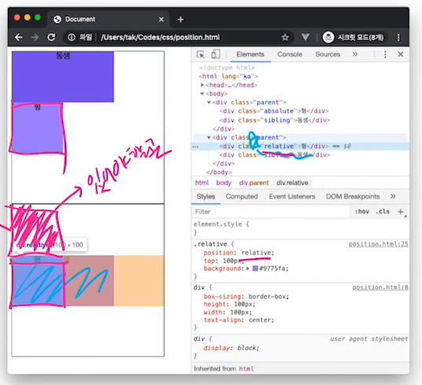
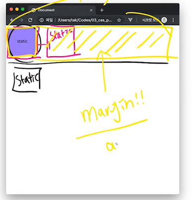
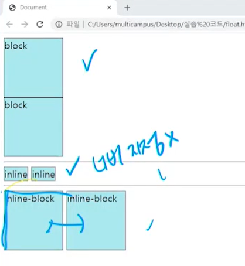
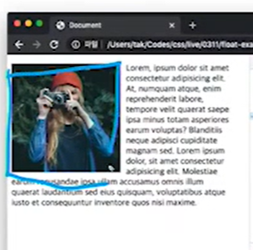
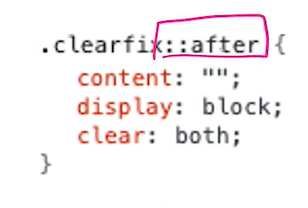

# 복습

- ` box-sizing : border-box` : 로 박스사이징 정리하자.

- `!important` : 이 코드는 왠만하면 쓰지말자. 
- 

# 다단 레이아웃

### CSS position

- `static` : 디폴트 값

  - 기본적인 요소의 배치 순서에 따름(위부터 좌측부터)
  - 부모 요소 내에서 배치 될 때는 부모 요소의 위치를 기준으로 배치

- `top`, `bottom`, `left`, `right` 를 사용하여 위치 조정이 가능

  - `position: relative` : static을 기준으로 이동.

  - `position:absolute` : 조상 요소중에 static이 아닌 것을 기준으로 이동.(사용시 집을 나가기 때문에 조심해야한다.)

    

    윗그림은 형 포지션을 absolute로 주었기 때문에 자신의 위치가 지워지면서 동생이 위로 올라가게 되었다.

    하지만 밑그림은 포지션을 relative로 주었기 때문에 형의 위치만 이동하게 된다.

    겹치게 표현을 하는 경우는 어쩔 수 없이 absolute를 써야한다...

  - `position: fixed` : 브라우저를 기준으로 이동(스크롤시 같은 위치에 존재.)

### display

- `display : inline`

  - 상하여백은 line-height로 지정한다.
  - `width` 와 `height`를 지정할 수 없다.

- `display : block`

  

  블럭 속성은 한줄을 다 차지 하기 때문에 width를 지정해주면 나머지가 margin이 붙는다.

- `display: inline-block` : inline 속성이 블럭처럼 width와 height를 지님.

### float

- 일반적인 네모세상에서 벗어나도록 하는 속성

  

- block속성을 지니게 되며 inline 이더라도 width와 height를 지정 가능함.

- 다른 요소에서 float의 효과를 지우려면 clear 속성을 추가해야 함.

#### float이 발생시키는 문제.

- 자식요소의 float 속성으로 인해 부모 영역의 높이가 사라지는 문제.

  - 부모의 높이는 자식 컨텐츠의 높이가 결정하기 때문에 부모 높이가 사라짐.

  - 다음의 코드로 해결가능!

    

- clear한 요소의 margin이 제대로 표현되지 않는 문제.

  

# 네비게이션

### 텍스트 네비게이션

- 

# animation, Transition

### 요소의 변형

- 

### 요소 클리핑

- ​	