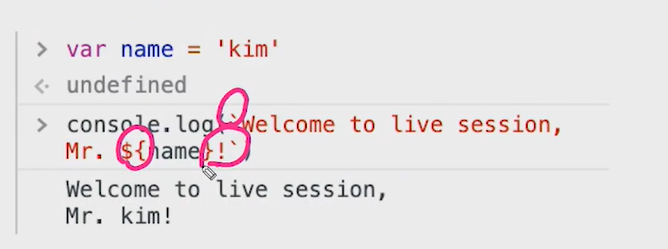
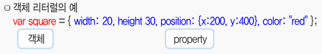
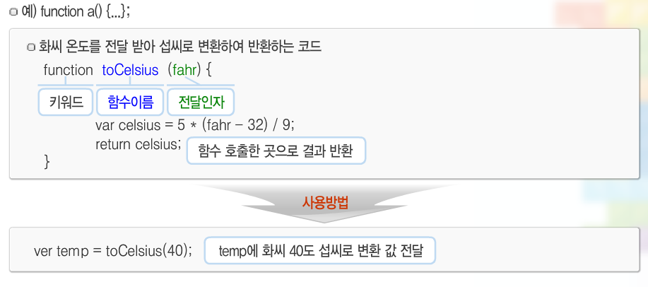
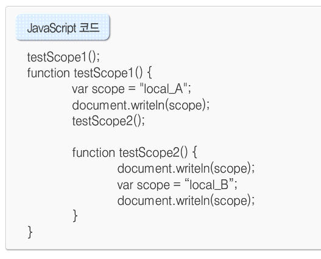
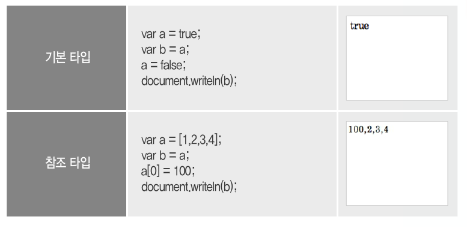
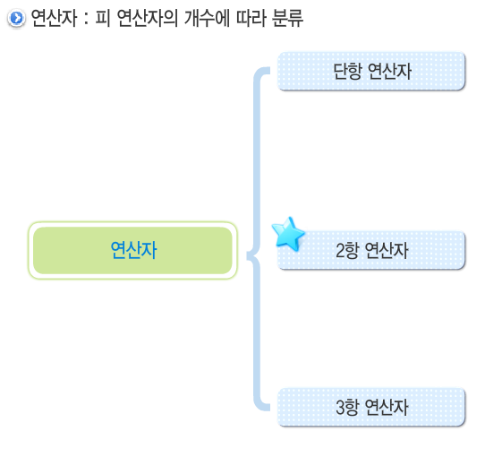
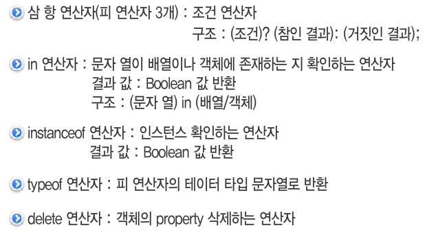

# JavaScript

### Js의 탄생

- 1990년대 네스케이프사의 NN브라우저가 표준
- 동적인 HTML의 필요성 대두
- 1996년 브랜던 아이크를 주도로 'Mocha'를 도입
- LiveScript를 거쳐 자바스크립트가 됨

### 표준화의 시작

- Netscape는 ECMA 인터네셔널에 기술 규격을 제출 이후 표준화 되기 시작
- 많은 라이브러리들이 있지만 ES6(ES2015)이후 다양한 도구의 등장으로 인해 vanilla JS도 활용이 쉬워짐.

### 브라우저에서 할 수 있는 일

- DOM 조작(HTML 파일을 조작)
- BOM 조작(브라우저 환경을 읽거나 조작. 창확대하기, 창켜기 등등)
  - navigator, screen, location, frames, history, XHR
- JavaScript(일반적인 프로그래밍 언어가 하는 일)
  - Object, Array, Function

### Node JS

- 원래 JS는 브라우저만을 조작할 수 있었지만 크롬에서 작동하던 V8엔진을 기반으로 만든 Node JS 덕분에 파이썬 같은 프로그래밍 언어로써의 활동도 가능하게 됨.
- 브라우저 조작(Front End)뿐만이 아니라 컴퓨터 및 서버 조작(Back End) 조작까지 가능한 프로그래밍 언어가 됨.

### 함수형 언어

- 선언적 프로그래밍
- 1급 함수 = 함수 자체를 데이터처럼 사용 가능

### 사용법

- CSS의 `<style>` 처럼 자바도 ``

# JavaScript 구문

### 자바스크립트의 기본 구문

- 해석순서: 위에서 아래로
- 대소문자 구분함 (HTML은 안함!)
- 구문 끝:  `;`으로 구분함
- 공백 의미 있음 대충 의미 없는 내용
- 주석도 의미 없다~

## 데이터 타입 분류(`typeof`)

- 원시 타입(primitive) - 변경 불가능한 값(immutable)
  - boolean - true, false
  - null
  - undefined
  - number
  - string
  - symbol
- 객체 타입(object)
  - 일반 객체, function, array, date, RegExp 등등

### 원시타입

#### 1. Number

- 모든 숫자는 number 타입
- 8진수(0), 16진수(0x)로 표현 가능
- `Infinity`, `-Infinity`, `NaN`(not a number)도 number타입
- 정수라는 타입이 별도로 존재하지는 않으며 -2^53 ~ 2^53 까지의 정수만 안전하게 표현 가능하다.

#### 2. String

- 템플릿 문자열

  - 편하게 문자열내에 변수를 사용(string interpolation) 가능.

  

#### 3. 단순 데이터 타입(null vs undefined)

- null
  - 의도적으로 변수에 값이 없다는 것을 명시
  - typeof 출력시 object로 출력되는 것은 설계 미스
- undefined
  - 선언 이후 할당하지 않은 변수에 지정된 값
  - 자바스크립트 엔진이 할당 이전에 초기화된 값

### 객체타입

#### 1. 일반 객체(object)

- 다양한 속성(property)들의 집합

- `var square = new (명령어)` 로 생성 가능하며 명령어는 JS가 제공
- 만들어진 객체 속성에 접근하려면 `square.width = 30`처럼 .을 찍어 조정하거나 새로 추가 가능.

#### 2. 배열(array)

- 값들의 집합이라는 면에서 object와 유사하나 인덱스를 지닌다는 점에서 차이 존재.

- `var a = new Array();` 로 배열 생성
- 파이썬의 리스트와 같은 역할

### 함수

- function 키워드로 생성

- 함수 리터럴 : 위 코드에서 소문자 temp처럼 함수가 저장된 변수.

### 변수

- `var` 코드를 이용하여 선언.

- 선언과 동시에 초기값을 넣는 것 가능, 값을 바꿔넣는 것 가능(파이썬과 유사)

- `var`없이 `a = '1'`이란 코드를 작성해도 자동으로 변수를 생성하지만 전역변수를 생성하기 때문에 피하는 것이 좋다.

- 변수의 유효범위는 함수를 기준으로 결정됨

  - `var`로 선언된 지역변수는 함수 내부에서만으로 사용이 제한된다.

  - 변수 선언시 내부전체에 초기화가 가해지므로 변수는 제일 먼저 선언해야 한다.

    

    위 코드의 경우 A, undefined, B 가 나온다. 밑의 scope선언이 scope를 초기화 했기 때문이다.

- 전역변수는 함수 내부가 아닌 최상위 root에서 선언하면 전역변수가 된다.

  - 좋은 코드가 아니다..

- 변수의 타입 : 파이썬과 마찬가지로 리스트 및 함수는 참조하고 문자 및 boolean은 기본으로 저장된다.

  

# JavaScripts 문법

## 연산자

### 산술 연산자

- 덧셈 연산자(`+`) : 숫자면 더하고 **하나라도 문자라면**  숫자도 모두 문자로 바꿔서 연결된 문자열 출력. 
  - 3 + '3' = '33'
- 뺄셈 , 곱셈 연산자(`-`,  `*`) : 숫자 형태의 문자열('3')같은 경우 숫자로 **자동 형변환**. 불가능한 경우 `NaN`출력
  - '5' - 2 = 3
  - 'envy' * 3 = NaN

- 나눗셈 연산자 (`/`) : 마찬가지로 **자동 형변환**. 특이케이스 0으로 나눌 때와 문자열로 나눌 때.
  - '3' / 0 = `Infinity`
  - 45 / 'string' = NaN

- 나머지 연산자 (`%`) : 파이썬과 비슷. 문자열의 경우 `NaN` 출력은 너무 반복된다.

### 단항 산술연산자

- 양수 변경, 음수 변경 (`+`, `-`) : 그냥 앞에 붙여서 음수, 양수 만듬.
- 증가, 감소 연산자 (`++`, `--`) : 파이썬의 `+= 1` 과 비슷한 역할을 함. 단, 사용 위치에 따라 차이 있음
  - `k = 1;	j = ++k;` : 먼저 k = 2가 되고 j에 2가 저장.
  - `k = 1;	j = k++;` : 먼저 j 에 k값인 1을 저장하고 k = 2가 됨.     

### 할당 연산자

- 뭐 파이썬과 비슷하게 `=` 여러 의미로 쓰임. 
  - `var a = 123;` : a에 123 이라는 숫자 할당(기본 타입)
  - `var b = new Date;` : b에 JS에서 제공하는 Date 오브젝트 할당 (참조 타입)
  - `var c = function() {return a + b; };` : c 에 함수 할당
- 그 밖에 `+=`, `-=`, `*=`, `/=`, `%=` 파이썬이랑 똑같은 방식으로 존재.

### 동등 연산자

- 동등 연산자(`==`) : 값이 같은지 판단.(파이썬과 많이 다름) (복잡한 식이 있음. 외우지 말것.)
  - boolean(3 == '3') 은 True임...
- 일치 연산자(`===`) : 파이썬의 `==`과 유사 조금 더 엄격하게 판단.
  - 타입도 구분함.
  - 같은 것을 참조할 때 True 반환
- 부등 연산자(`!=`) :  `not(==)`
- 불일치 연산자(`!==`) : `not(===)`

### 비교 연산자

- `<`, `<=`, `>`, `>=` 등으로 이루어 져 있으며 true false를 반환
- 문자는 아스키 코드 순서(a < z) 로 비교하며
- 객체는 **자동 형변환** 시도 안되면 무조건 false

### 논리 연산자

- `&&` : and 연산

- `||` : or 연산

- 그 밖의 연산자.

  

## 조건문과 반복문

### 조건문

- `if( 불리언 ) { 코드 }` : ( )안이 참이라면 {코드} 실행

- `if(불리언) {코드1} else {코드2}` : ()이 참이라면 {코드1}실행 거짓이면 {코드2}실행
- `if(불리언) {코드1} else if {코드2} else if {코드3}` : else if 는 반복가능

### 반복문

- `for(var i=0; i <= 10; i++){코드}` : 포문에 초기화 , 제어조건, 변수 증가를 넣어 표기한다.(while문과 흡사..)
- `for(var n in 객체)` : 객체의 프로퍼티를 하나씩 뽑아옴. (파이썬과 유사)
- `while(i <= 10) {코드}` : 제어조건 만을 넣고 초기화(구문 밖에) 변수증가(구문 안에)는 따로 코드로 구현.