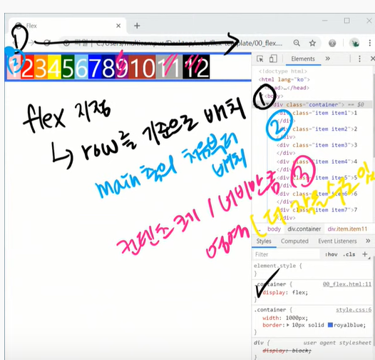
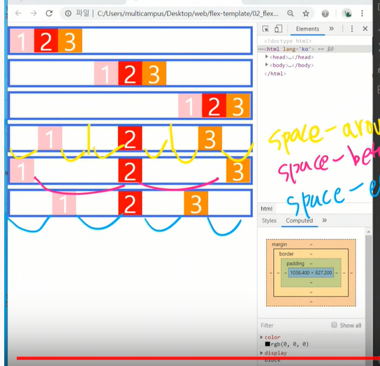

# Flex

- `flex` 이전에는 배치를 위해 `float`, `position` 지정을 해야했다.

# flex 주요 개념

- `container`, `item`

  ```html
  <style>
      .container {
          display: flex;
          /*기본값*/
          flex-direction: row;
      }
  </style>
  
  <div class="container">
      <div class="item"></div>
      <div class="item"></div>
  </div>
  ```

- `main axis`, `cross axis`

- flex 지정시
   - `main axis`를 기준으로 배치됨.(`flex-direction: row`를 기본값으로 지님.)
   - main 축의 처음부터 배치
   - 각 영역은 컨텐츠의 높이 및 너비를 따라감.(`flex-wrap: nowrap`이 기본값이기 때문)
   - 모든 영역은 cross axis를 채움.



- `flex-direction: (row, cloumn, row-reverse)`

  - `flex-direction: row` : 기본값으로 위 그림과 같이 정렬됨
  - `flex-direction: column` : main 축이 세로방향으로 결정되고 위에서부터 정렬됨.

- `flex-wrap: (wrap, nowrap) `

  - `flex-wrap: nowrap`:한줄안에 무조건 담는다. 자식요소의 크기를 제한하고 크기를 바꿀수도 있다.
  - `flex-wrap: wrap` : 자식요소의  크기가 넘친다면 줄바꿈을 시행한다.

- `flex-grow: (숫자)`:

  - 기본값은 0 이며 남은 마진을 각각의 비율로 나눠서 가져갑니다. 

- `justify-content: (flex-start, center, flex-end, ...)`

  - main축을 기준으로 정렬함.

  - `space-around`(균등 좌우 정렬) : 아이템을 기준으로 양옆의 여백이 같음.

  - `space-between`(좌우 정렬): 아이템 사이의 여백이 같음

  - `space-evenly`(균등 정렬) : 시작을 여백으로 함.

    

- `align-items:`
  - `cross`축을 기준으로 정렬해줌.
  - `stretch`가 기본값이며 아이템을 정렬해줌..
  - `baseline`: 안의 글자가 폰트가 다르더라도 한줄로 나오게 해줌.
- `order: (숫자)`
  
- 기본값은 0이며 아이템의 순서를 정의할 수 있다.
  
- `align-self:`
  
  - 아이템(자식요소)에서 자신이 배치되는 위치를 정할 수도 있음.


# bootstrap

- 세계에서 제일 유명한 반응형 모발일 대응 웹페이지를 개발하기 위한 라이브러리