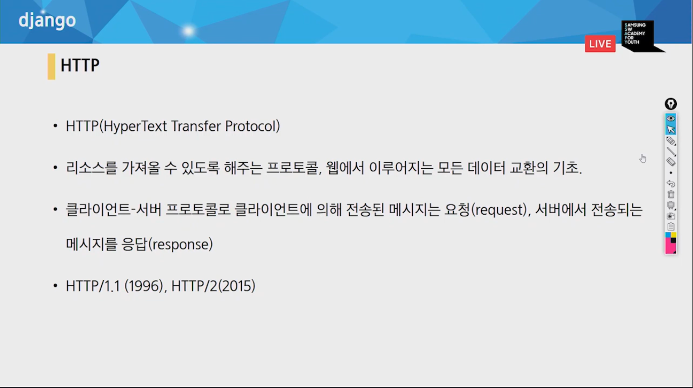
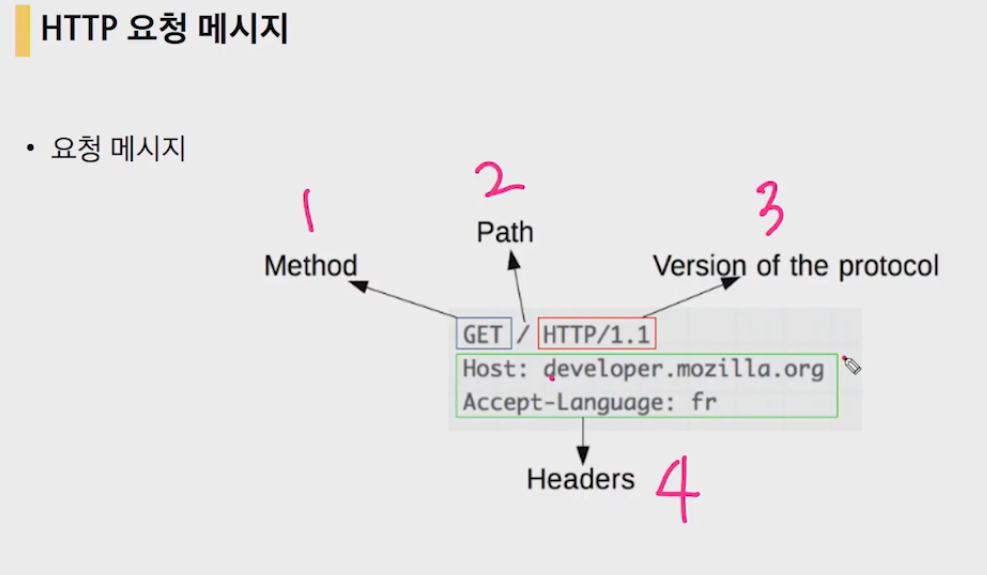
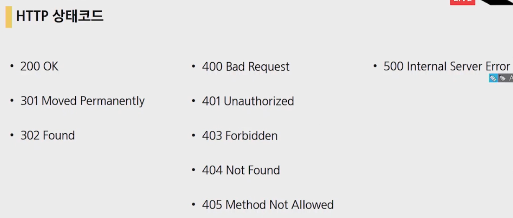
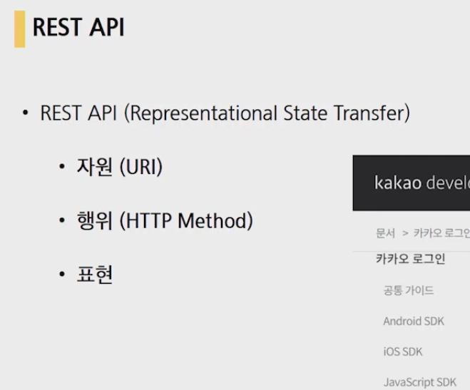
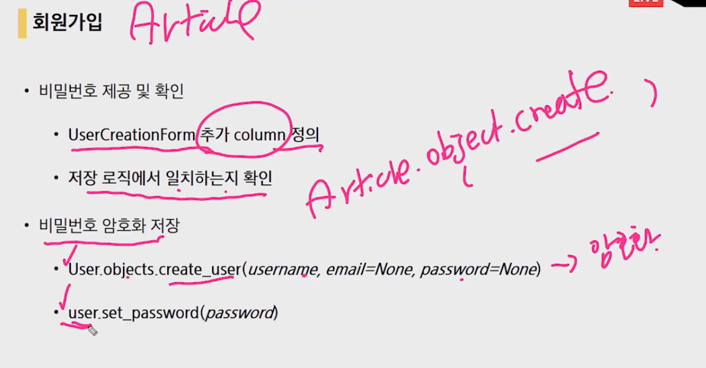
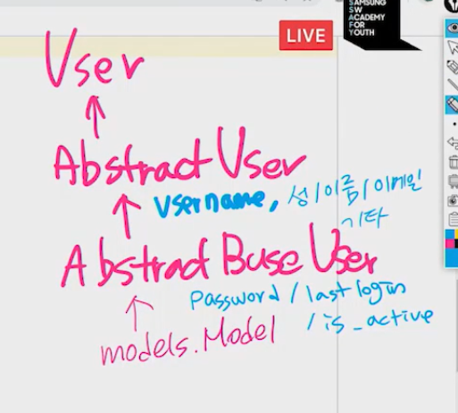

### static

- `STATICFILES_DIRS = [os.path.join()]`
- ``

### HTTP



### URL 구조

URL 은 다른 파트들과, 몇몇의 의무와 선택사항들로 구성됩니다. 다음 URL을 사용하여 가장 중요한 부분을 봅시다:

```html
http://www.example.com:80/path/to/myfile.html?key1=value1&key2=value2#SomewhereInTheDocument
```

- 

  `http` 는 프로토콜(규약)입니다. URL의 첫 파트는 브라우저가 어떤 규약을 사용해야 하는 지를 나타냅니다. 프로토콜은 컴퓨터 네트워크에서 데이터를 교환하거나 전송하기 위한 방법들의 세트입니다. 보통 웹사이트들을 위해, 이것은 HTTP 프로토콜이나 HTTP 프로토콜의 보안 버전입니다. 웹은 이 두 가지 중 하나를 요구합니다, 그러나 브라우저는 `mailto:` (메일 클라이언트를 열기 위한) 또는 파일을 전송하기 위해 `ftp:` 와 같은 다른 프로토콜들을 다루는 법 또한 알고 있습니다, 그러므로 만약 이런 프로토콜들을 보더라도 놀라지 마십시오.

- 

  `www.example.com` 은 도메인 이름입니다. 이것은 어떤 웹 서버가 요구되는 것인 지를 가리킵니다. 대안으로, 직접 [IP address](https://developer.mozilla.org/en-US/docs/Glossary/IP_address)를 사용하는 것도 가능합니다, 그러나 덜 편리하기 때문에, 그것은 웹에서 주로 사용되지는 않습니다.

- 

  `:80` 은 포트입니다. 이것은 기술적으로 웹서버에서 자원을 접근하기 위해 사용하는 "관문(gate)"을 가리킵니다. 만약 웹서버가 자원의 접근 하기 위해 표준 HTTP 포트 (HTTP를 위한 80, HTTPS를 위한 443)를 사용한다면, 포트 번호는 보통 생략합니다. 그렇지 않으면 포트 번호는 필수입니다.

- 

  `/path/to/myfile.html` 은 웹서버에서 자원에 대한 경로입니다. 초기의 웹에서는, 웹서버상에서 물리적 파일 위치를 나타냈습니다. 요즘에는, 실제 물리적 경로를 나타내지 않고, 웹 서버에서 추상화하여 보여줍니다.

- 

  `?key1=value1&key2=value2` 는 웹서버에 제공하는 추가 파라미터입니다. 이 파라미터들은 `&` 기호로 구분된 키/값으로 짝을 이룬 리스트입니다. 웹 서버는 자원을 반환하기 전에 추가적인 작업을 위해 이런 파라미터들을 사용할 수 있습니다. 각각의 웹서버는 파라미터들을 언급하는 자신의 규칙을 갖고 있습니다. 그리고, 특정한 웹서버가 파라미터를 다루는 지 알기 위한 유일한 방법은 웹서버 소유자에게 묻는 것입니다.

- 

  `#SomewhereInTheDocument` 는 자원 자체의 다른 부분에 대한 anchor(닻) 입니다. An anchor 는 일종의 자원 안에서 "bookmark" 입니다. 즉, "bookmarked" 지점에 위치된 내용을 보여주기 위해 브라우저에게 방향을 알려줍니다. 예를 들어, HTML 문서에서 브라우저는 anchor가 정의한 곳의 점을 스크롤할 것입니다; 비디오나 오디오 문서에서, 브라우저는 앵커가 나타내는 시간을 찾으려 할 것입니다. **#**뒤에 오는 부분은 가치가 없습니다. 또한, ***fragment identifier(부분 식별자)** 라고 알려져, 요청이 서버에 절대 보내지지 않습니다.*




### HTTP 요청의 종류

- GET
- POST

### HTTP 응답



- 301 : 주소가 영구적으로 옮겨져서 리다이렉트 됨.
- 302 : 주소가 일시적으로 옮겨짐
- 401 : 로그인이 안되어 있음
- 403 : 권한 부족으로 금지됨
- 404 : 클라이언트의 잘못된 요청(없는 주소를 찾는다거나)
- 405 : 요청방식이 잘못됨.(GET 방식인데 POST호출 등.)
- 500 : 서버에러


### 메타 클래스

- 데이터를 위한 데이터들을 저장해 놓는 클래스(사진의 찍은 위치, 시간등이 자동 저장되는 것.)


### REST API



### ArticleForm

- forms.py 생성후

```python
from django import forms
from .models import Article

class ArticleForm(forms.ModelForm):
    class Meta:
        model = Article
        fields = '__all__'     
```

- 수정시에는 article 인스턴스를 form에 넘겨줘야 한다.


### Decorator

```python
from django.views.decorators.http import required_POST
```

를 통해 데코레이터를 달 수 있다.

bootstrap4, static등은 html에서 사용하려면 매 페이지 마다 로드해줘야함.

# 4/14





- 이렇게 존재하는 이유는 커스텀을 위해서이다.

  