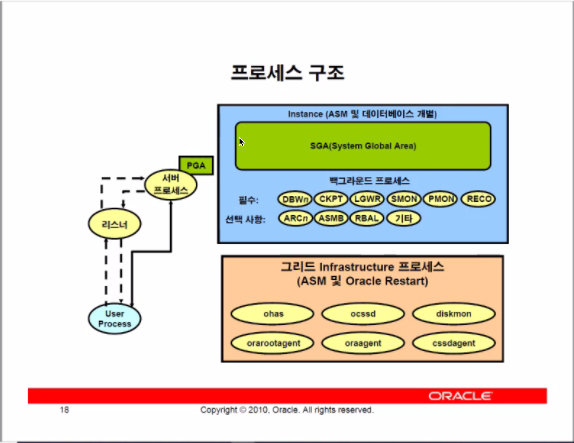
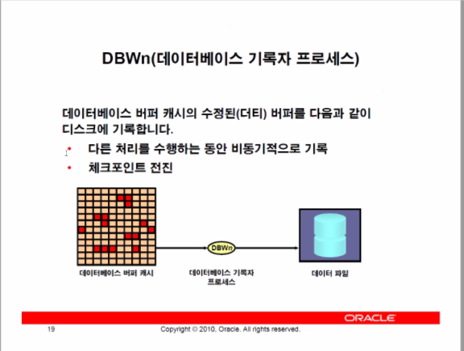
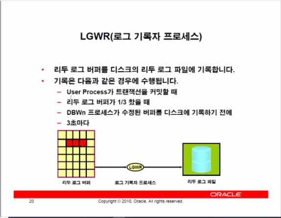
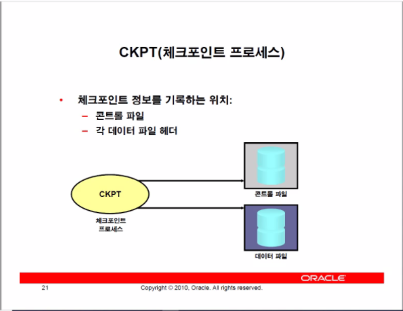
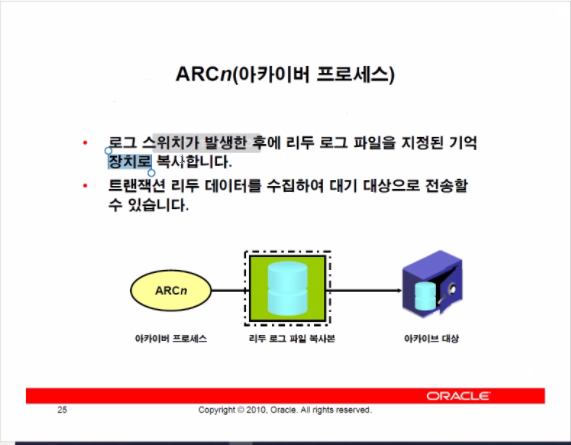
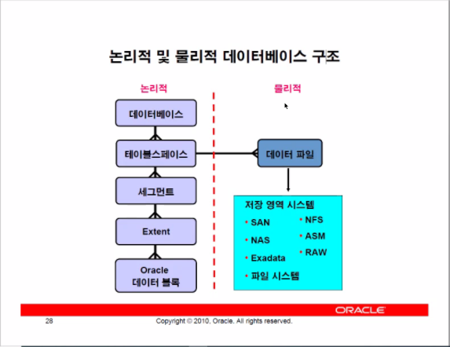
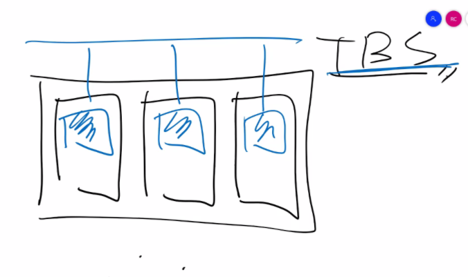
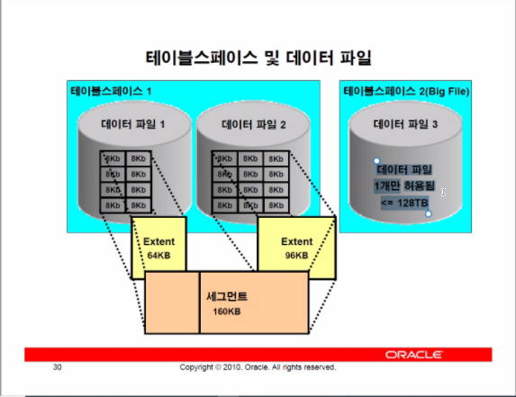
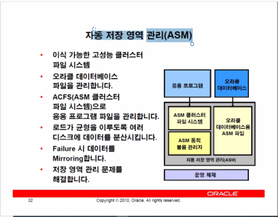

### DBWn

### LGWR

### ckpt

### ARCn

- 로그 스위치

  리두 로그파일이 다 찼다면 다른 로그파일로 넘어간다.

  그런데 만약 모든 리두로그파일이 다 찼다면 다시 전에 저장한 리두로그파일로 넘어가 덮어쓰기 시작한다.

- 리두 데이터를 수집하여 스탠바이 프로세스로 전송할 수도 있다.

- 세그먼트

  - 하나 이상의 익스텐트를 지녀야 함.
  - 섹터

- 테이블 스페이스

  디스크가 하나라면 수많은 사람들이 접속을 할 것이고 이에 따른 경합이 생길 수 밖에 없음

  따라서 생긴것이 테이블 스페이스임

  

  테이블 스페이스는 저장공간을 효율적으로 사용하기 위한 옵션이다.(파란색은 data 처리 인스턴스)

  ASM을 사용한다면 어차피 데이터를 나눠서 저장하기 때문에 테이블스페이스를 만드는 의미가 있을까??

  -> 

위처럼 Big File 테이블 스페이스가 존재하며 128TB까지 한 번의 테이블만이 가능하다.

> DBA의 루틴 업무 : 데이터파일을 하나하나 탐색하며 디스크가 모자른 데이터가 있다면 데이터 파일을 늘려주는 업무가 있다.
>
> 하지만 BigFile 테이블 스페이스를 활용한다면 이러한 업무가 필요가 없다.

### 자동 저장 영역 관리(ASM)

- 여러개의 디스크를 묶어서 하나의 디스크 처럼 사용하는 기술(Raid 생성)

# 데이터베이스 Instance 관리

> 인스턴스가 시작되어 있지 않다면 데이터베이스에 접속할 수 없다.
>
> startup으로 인스턴스를 시작한다.
>
> control file에서 데이터파일과 리두로그파일의 위치를 가져올 수 있다.
>
> 하지만 컨트롤 파일의 주소는 어디서 가져올까?
>
> 설정 및 사용자 옵션들은 데이터파일에 저장되지 않는다.
>
> 이러한 설정 및 사용자 옵션은 어디서 가져올까?

DB를 관리하는 관리자라면 파라미터를 이해할 필요가 있다

### nomount

파라미터는 데이터베이스의 옵션 및 설정을 저장하는 수치들이고 파라미터 파일에 저장되어 있다.

파라미터 파일은 위치가 항상 정의 되어 있기 때문에 주소를 찾을 필요가 없다.

이러한 파라미터가 있다면 인스턴스들이 실행될 수 있다.

이러한 인스턴스를 실행시키는 과정을 노마운트라고 한다.

### mount

데이터베이스의 컨트롤 파일을 열어 각각의 데이터 베이스 주소를 받아오는 작업을 마운트라고 한다.

### open

컨트롤 파일의 데이터를 활용해 다른 데이터 파일들을 여는 작업을 open이라고 한다.

### parameter file

`init{SID}.ora` 등의 이름으로 지어진다.

메모장이나 vi등의 편집기로 직접 조작이 가능하다.

alter system등의 명령으로 파라미터 파일이 변경되지 않으므로 데이터베이스 재부팅시 변경사항이 유지되려면 직접 편집해야 한다.

만약 위의 행동이 귀찮다면 `spfile`을 사용해야 한다.

`pfile` = `init{SID}.ora` 로 이루어진 텍스트파일

`spfile` = binary 파일이며 Alter조작으로 인해 자동으로 변화가 저장된다.

따라서 권장되는 것은 `spfile`을 사용하는 것

