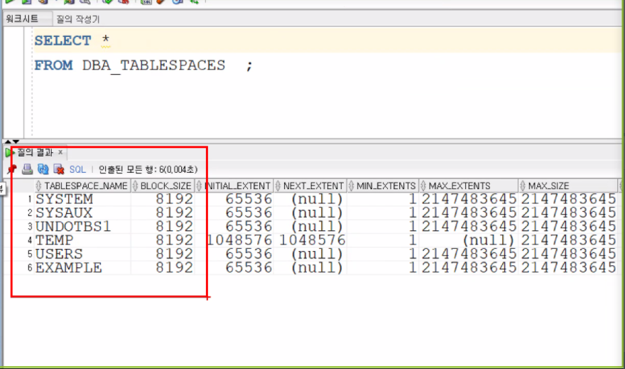
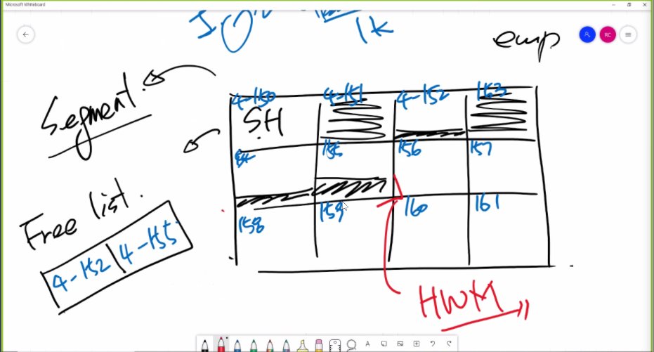

# 7. 데이터베이스 저장 영역 구조 관리

create 테이블 명령을 내릴 시 데이터가 저장될 수 있는 공간을 잡는다.

하지만 하나의 데이터 테이블을 잡는다면 저장공간이 모자를 수도 있고 또한 충분한 데이터를 저장하더라도 `disk i/o` 작업 시 구분이 없다면 찾는데 오래 걸릴 것이다.

하나의 구분되지 않은 작업단위로 진행된다면 백업 및 조회에 큰 어려움을 지니게 된다.


따라서 **TBS(table space)**를 사용해 데이터파일을 묶어서 논리적 그룹을 형성한다.

DB blocksize로 TBS는 또한 나눠져 있는데 공간을 할당할때는 이 DB블록사이즈의 데이터 공간할당을 묶어서 할당한다. 이를 **Extent**라 한다.

이러한 Extent의 모음을 **Segment**라 한다.


`db_block_size`라는 파라미터가 데이터 관리의 최소 단위이다. 8192 byte가 하나의 단위로 저장 읽기가 실행된다.

데이터 블록 헤더파일에는 DBA(Database address)가 저장되어있다. 따라서 자신의 block의 주소를 정의하고 있다.

또한 RowDirectory가 저장되어 있어, 어디서 행이 시작된지 알 수 있다(주소로 저장됨).

```mysql
SELECT DBMS_ROWID.ROWID_RELATIVE_FNO(ROWID) AS FNO, 
       DBMS_ROWID.ROWID_BLOCK_NUMBER(ROWID) AS BNO, 
       DBMS_ROWID.ROWID_ROW_NUMBER(ROWID)   AS RNO,
       ROWID, E.* 
FROM SCOTT.EMP E; 
```

FNO는 파일넘버

BNO는 블록넘버(8k bytes)

RNO는 로우넘버를 의미판다.

또한, 사용가능한 여유공간까지 저장하고 있다.

하지만 데이터 블록내부까지 저장하는 부분을 DBA가 건들지는 않는다. 이는 oracle의 영역

큰 테이블스페이스의 영역을 설정하는것이 DBA가 할 일이다.


### DBA_TABLESPACES

```mysql
SELECT *
FROM DBA_TABLESPACES  ;
```



- system, sysaux : dictionary data를 저장하고 있다.(접근권한, 테이블의 주소 등등 )
- UNDOTBS1 : 언두데이터가 저장되는 테이블 스페이스
- TEMP: 임시 데이터를 저장하는 테이블 스페이스(작업을 진행하기 위해 사용하는 스페이스)
- USERS, EXAMPLE : USER 데이타를 저장하기 위한 스페이스(EXAMPLE은 SAMPLE 데이타)


### CREATE TABLESPACE HRDATA

```mysql
CREATE TABLESPACE {테이블스페이스명}
CREATE TEMPORARY TABLESPACE {테이블스페이스명}
CREATE UNDO TABLESPACE {테이블스페이스명}
```

`CREATE TABLESPACE {테이블스페이스명}` : 명령어를 통해 지우지 않는한 테이블이 남아있음.

`CREATE TEMPORARY TABLESPACE {테이블스페이스명}` : 일시적으로 사용할 테이블 스페이스

`CREATE UNDO TABLESPACE {테이블스페이스명}` : 트랜잭션이 끝날 때까지는 살아있는 테이블 스페이스(`ROLLBACK`으로 사라짐)


한 데이터 파일에 데이터 블럭의 갯수는 400만개를 지닐 수 있다.

한 테이블 스페이스에 데이터 파일은 1022개를 지닐 수 있다.

```mysql
CREATE TABLESPACE {테이블스페이스명}
DATAFILE '/home/oracle/hrdata1.dbf' SIZE 10M AUTOEXTEND ON NEXT 10M MAXSIZE 100M
EXTENT MANAGEMENT LOCAL
UNIFORM SIZE 64K
SEGMENT SPACE MANAGEMENT AUTO
-- DATAFILE 'C:\DATA\HRDATA1.DBF' (윈도우일시)
```

직접 저장되는 경로와 용량을 설정하고 테이블스페이스를 만들 수 있다.

- 경로는 `'+DATA'`처럼 저장되어 있는 로컬변수로 지정할 수 도 있다.
  - OMF(Oracle Manage Files)오라클이 자동으로 데이터파일을 관리해준다.

- `AUTOEXTEND ON` 자동으로 크기가 확장될 것인지 여부를 결정하는 옵션(기본값 `OFF`)
- `NEXT 10M` 얼만큼 확장할껀지를 물어보는 옵션
- `MAXSIZE 100M` 어디까지 확장할 것인지를 물어보는 옵션 (`UNLIMITED`가능)- 

- `EXTENT MANAGEMENT`는 현재는 LOCAL형식으로만 진행된다(엄청 옛날의 경우 `DICTIONARY`형태로 관리..)

  SYSTEM TABLE SPACE가 DICTIONARY인 경우에만 생성되고 거의 아예 몰라도 된다.(기본값 `LOCAL`)

  > EXTENT를 딕셔너리 테이블을 만들어 모든 주소를 관리했기 때문에 DICTIONARY TABLE의 경합이 심했었다.

- `UNIFORM SIZE 64K` 데이터의 규격화가 진행된다면 지우고 다시 넣을 때, 공간이 모자르거나 조각모음을 해야하는 일이 발생한다.(EXTENTS의 용량을 결정)
- `SEGMENT SPACE MANAGEMENT MANUAL(AUTO)`



SEGMENT HEADER에는 FREE LIST라는 헤더가 있고 여기에서 FREE BLOCK의 리스트를 저장한다.

FREELIST는 FREEBLOCK의 처음과 끝만 저장되어 있다.(데이터의 압축을 위해)

데이터블록은 데이터가 차있냐 아니냐에 따라 풀블럭과 프리블럭 으로 나뉜다.


- MANUAL

INSERT 문 실행시 SEGMENT HEADER에서 FREELIST를 참조하여 사용가능한 FREEBLOCK의 헤더를 읽는다.

헤더에는 사용가능한 크기가 적혀있기 때문에 용량이 크다면 헤더에 적혀있는 다음 FREEBLOCK을 읽는다.

만약 모든 블럭을 방문시 크기가 작다면 한번도 사용하지 않은 블럭을 FREELIST에 넣고 여기에 INSERT를 실행한다.

- AUTO(권장된다.)

각 세그먼트의 첫번째 블럭을 비트맵 블럭(bmb)으로 만든다.

비트값을 이용해서 4단계의 용량으로 나누어 각 데이터블럭의 용량을 관리한다. 


```mysql
DROP TABLESPACE HRIDX1;
DROP TABLESPACE HRIDX1 INCLUDING CONTENTS;
```

