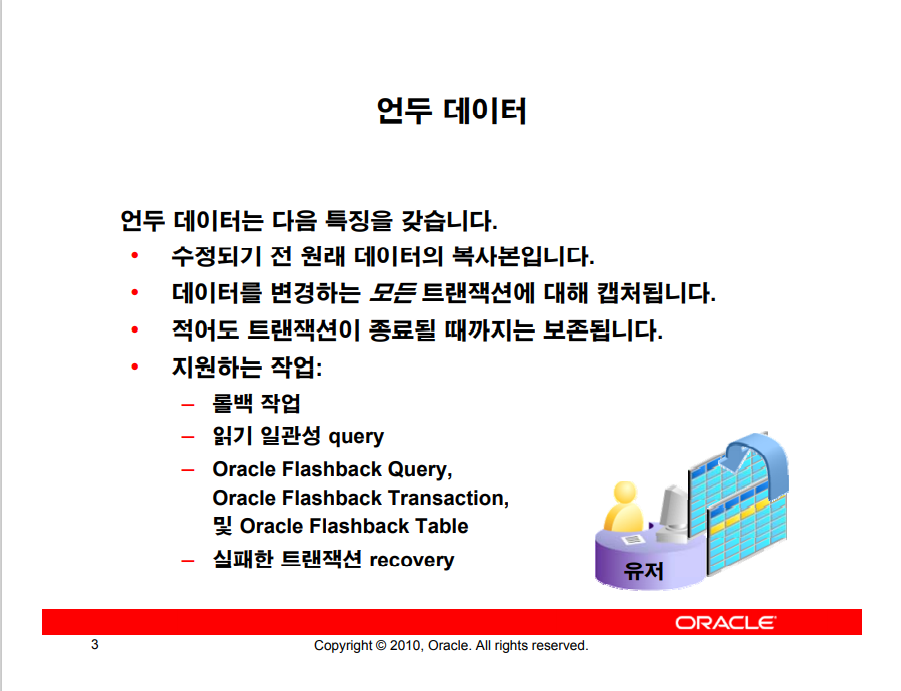
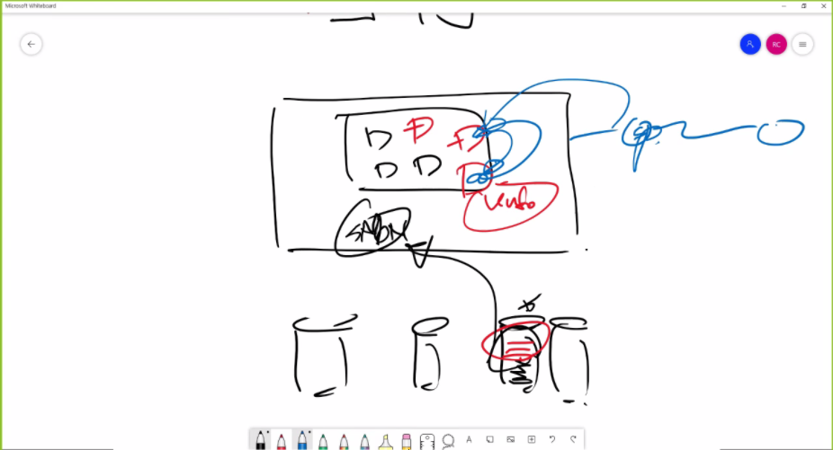
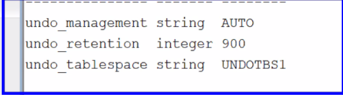
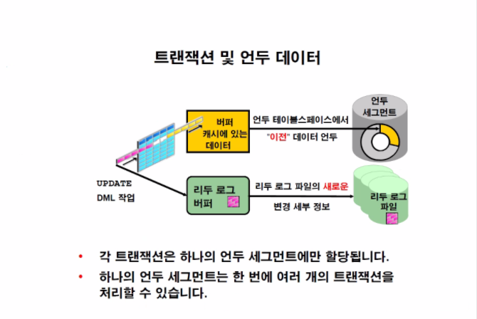
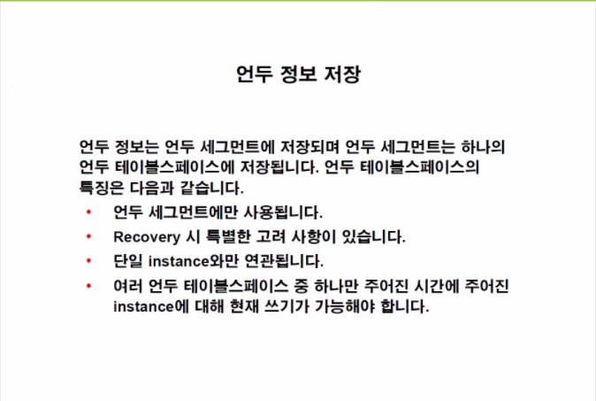
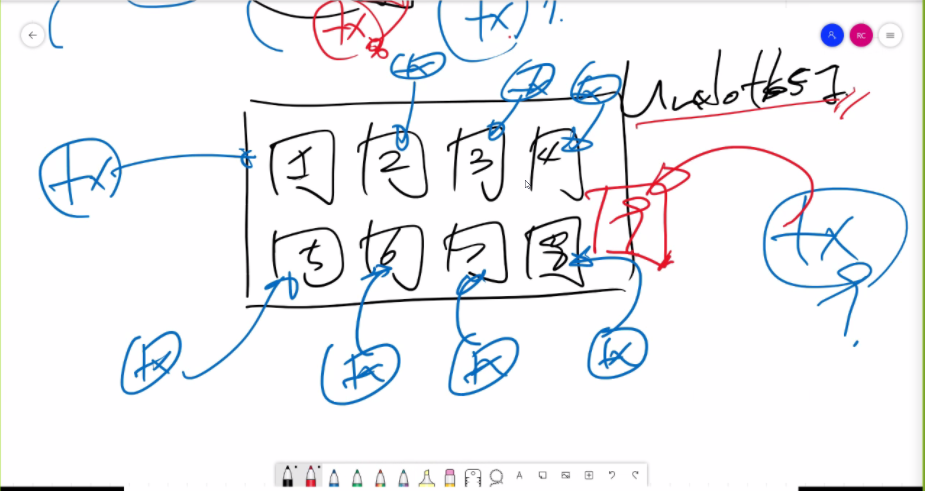
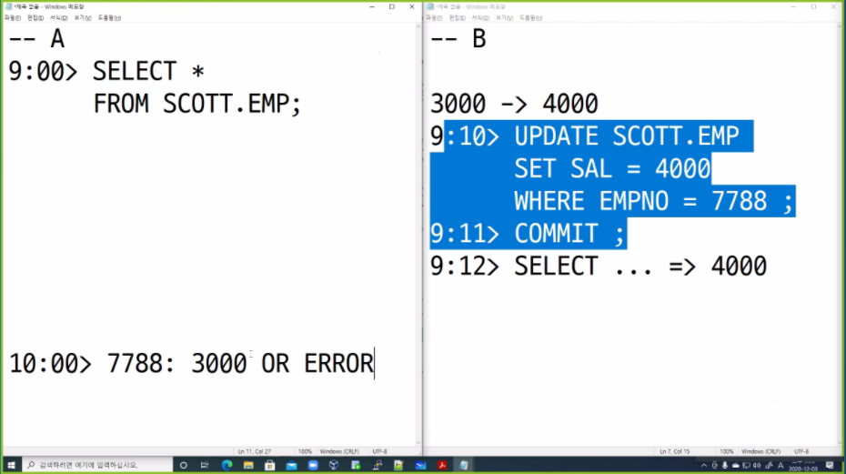
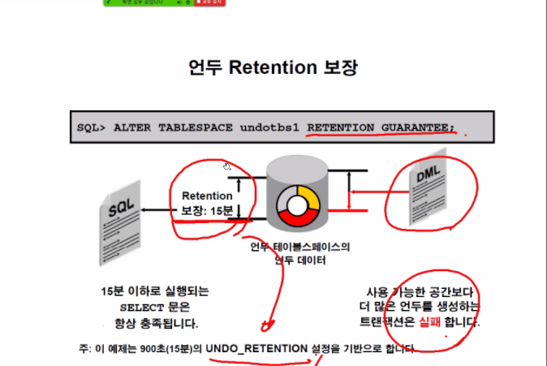
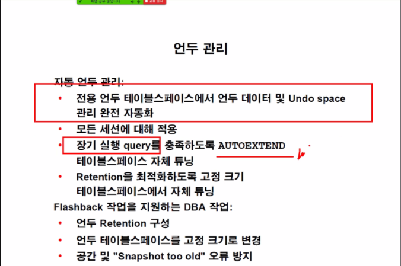
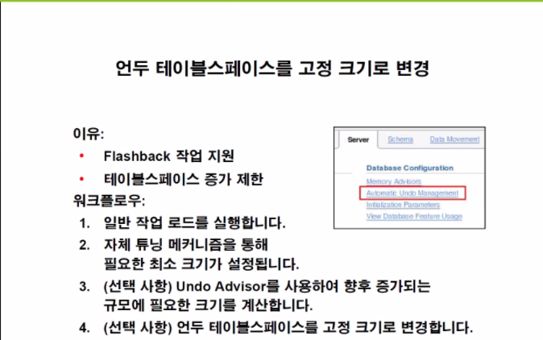

# 10.UNDO DATA 관리

메모리는 한정적 자원이기 때문에 UNDO 데이터 파일과 undo TBS가 존재하고 관리한다.



UPDATE의 언두 데이터는 예전의 값을 저장된다.

INSERT의 언두 데이터는 ROW_ID만이 저장되어있다.

SELECT를 제외한 DDL, DML, REVOKE, GRANT 등 모든 작업은 UNDO데이터를 생성하면서 실행된다.

- 실패한 트랜잭션 RECOVERY



트랜잭션이 날아가고 커밋되지 않은 리두로그 데이터는 다시 SMON에 의해 재실행되며 UNDO데이터를 재생산 하는데 이를 이용하여 다른 유저가 접근시 UNDO데이터로 롤백한 이미지들을 보여준다.



UNDO 데이터는 15분은 저장되기 때문에 딜리트 후 커밋되어 사라진 데이터도 복구가 가능은하다.



- 언두데이터는 세그먼트 단위로 관리한다.
  - 한 트랜잭션은 하나의 언두 세그먼트를 가진다.
  - 하지만 하나의 언두 세그먼트는 트랜잭션이 여러개 일 수 있다.


이는 다른 테이블 스페이스와 공유되지 않는 언두 테이블 스페이스에 저장된다.



언두 테이블 스페이스는 여러개를 지니고 있더라도 하나만이 사용된다.


### 참조



9i버젼부터 자동으로 세그먼트를 Oracle이 생성을 해준다(이전에는 DBA가 직접 생성했음.)


### 언두관리

- 퀴즈

### 

셀렉트 쿼리를 날린 시점에서의 결과 혹은 에러가 나오게 된다.

이러한 에러를 피하기 위해 UNDO DATA의 관리를 (UNDO RETENTION 확장)해줘야 한다.

> 에러가 나오는 이유 참조해야할 언두데이터가 B사용자가 커밋을 하여 ORACLE이 삭제해버린경우
>
> 참조할 주소가 없어 `Snapshot too old ERROR`가 뜬다.


이러한 사항을 막기위해 언두 관리가 필요하다.





- 장기 실행 query를 충족하도록 Autoextend를 실행하면 공간낭비가 너무심하다. 
- Oracle의 자체 튜닝 기능이 있다.




### 실습

```mysql
-- 언두데이터 파라미터 확인
SYS@orcl> show parameter undo

NAME TYPE VALUE
------------------------------------ ----------- ------------------------------
undo_management string AUTO                                   -- 오토매니지먼트 on
undo_retention integer 900                                    -- 언두데이터 유지시간 900초
undo_tablespace string UNDOTBS1                               -- 언두테이블스페이스 이름


-- 테이블 스페이스 중 언두 테이블 스페이스 조회
SYS@orcl> SELECT tablespace_name, contents, retention
FROM dba_tablespaces
WHERE contents = 'UNDO' ;

TABLESPACE_NAME CONTENTS RETENTION
------------------------------ --------- -----------
UNDOTBS1 UNDO NOGUARANTEE


-- 데이터 파일중 언두테이블 스페이스에 속하는 데이터 파일 조회
SYS@orcl> SELECT file_name, bytes/1024/1024 AS MB, autoextensible
FROM dba_data_files
WHERE tablespace_name = 'UNDOTBS1' ;

FILE_NAME MB AUT
-------------------------------------------------- ---------- ---
+DATA/orcl/datafile/undotbs1.258.815439971 110 YES


-- 언두세그먼츠이름 조회
-- rollname인 이유는 예전의 이름이 rollbacksegments였기 때문
SYS@orcl> SELECT *
FROM v$rollname ;

USN NAME
---------- ------------------------------
 0 SYSTEM
 1 _SYSSMU1_592353410$
 2 _SYSSMU2_967517682$
 3 _SYSSMU3_1204390606$
 4 _SYSSMU4_1003442803$
 5 _SYSSMU5_538557934$
 6 _SYSSMU6_2897970769$
 7 _SYSSMU7_3517345427$
 8 _SYSSMU8_3901294357$
 9 _SYSSMU9_1735643689$
 10 _SYSSMU10_4131489474$
11 rows selected.


-- 언두세그먼츠 조회
SYS@orcl> SELECT segment_name, owner, tablespace_name, segment_id, status
FROM dba_rollback_segs ;

SEGMENT_NAME OWNER TABLESPACE_NAME SEGMENT_ID STATUS
------------------------------ ------ ------------------------------ ---------- ----------------
SYSTEM SYS SYSTEM 0 ONLINE
_SYSSMU1_592353410$ PUBLIC UNDOTBS1 1 ONLINE
_SYSSMU2_967517682$ PUBLIC UNDOTBS1 2 ONLINE
_SYSSMU3_1204390606$ PUBLIC UNDOTBS1 3 ONLINE
_SYSSMU4_1003442803$ PUBLIC UNDOTBS1 4 ONLINE
_SYSSMU5_538557934$ PUBLIC UNDOTBS1 5 ONLINE
_SYSSMU6_2897970769$ PUBLIC UNDOTBS1 6 ONLINE
_SYSSMU7_3517345427$ PUBLIC UNDOTBS1 7 ONLINE
_SYSSMU8_3901294357$ PUBLIC UNDOTBS1 8 ONLINE
_SYSSMU9_1735643689$ PUBLIC UNDOTBS1 9 ONLINE
_SYSSMU10_4131489474$ PUBLIC UNDOTBS1 10 ONLINE
11 rows selected. 


-- Undo Segment 할당 확인
-- 모든 테이블 생성시간 테이블 생성
SYSTEM@orcl> CREATE TABLE t1
 AS SELECT rownum AS ID, object_name, created
FROM dba_objects ;

Table created.


-- 날짜 변경(커밋 안 날림)
SYSTEM@orcl> UPDATE t1
 SET created = created + 1
WHERE id = 1 ;

1 row updated.


-- 트랜잭션 조회
SYSTEM@orcl> SELECT xid, xidusn,xidslot, xidsqn, ubafil, ubablk
FROM v$transaction ;

XID XIDUSN XIDSLOT XIDSQN UBAFIL UBABLK
---------------- ---------- ---------- ---------- ---------- ----------
0400070031020000 4 7 561 3 11361


-- 이제부터 1 은 트랜잭션 조회
SYSTEM@orcl> save 1 replace

Wrote file 1.sql


-- 쓰여지고 있는 언두익스텐트 조회
SYSTEM@orcl> SELECT segment_name, extent_id, file_id, block_id, bytes, blocks, status
FROM dba_undo_extents
WHERE status = 'ACTIVE' ;

SEGMENT_NAME EXTENT_ID FILE_ID BLOCK_ID BYTES BLOCKS STATUS
------------------------------ ---------- ---------- ---------- ---------- ---------- ---------
_SYSSMU4_1003442803$ 2 3 11264 1048576 128 ACTIVE


-- 언두익스텐트는 이제부터 2
SYSTEM@orcl> save 2 replace

Wrote file 2.sql


-- 다른 sqlplus 실행
SYSTEM@orcl> ! sqlplus system/oracle_4U


-- 다른 트랜잭션 생성
SYSTEM@orcl> UPDATE t1
 SET created = created + 1
WHERE id = 2 ;

1 row updated.


-- 트랜잭션 조회
SYSTEM@orcl> @1
XID XIDUSN XIDSLOT XIDSQN UBAFIL UBABLK
---------------- ---------- ---------- ---------- ---------- ----------
0400070031020000 4 7 561 3 11361
0100060009020000 1 6 521 3 11089


SYSTEM@orcl> @2
SEGMENT_NAME EXTENT_ID FILE_ID BLOCK_ID BYTES BLOCKS STATUS
------------------------------ ---------- ---------- ---------- ---------- ---------- ---------
_SYSSMU4_1003442803$ 2 3 11264 1048576 128 ACTIVE
_SYSSMU1_592353410$ 4 3 11008 1048576 128 ACTIVE


# 동일한 방법을 이용하여 기존의 세션을 종료하지 않은 상태로 SYSTEM 유저로 로그인하여 T1 테이블의 서로 다른 행을 수정하여 각각의 Undo Segment 할당 방식을 확인 한다.
...


SYSTEM@orcl> ! sqlplus system/oracle_4U
SYSTEM@orcl> UPDATE t1
 SET created = created + 1
WHERE id = 10 ;
1 row updated.

-- 트랜잭션 조회
SYSTEM@orcl> @1
XID XIDUSN XIDSLOT XIDSQN UBAFIL UBABLK
---------------- ---------- ---------- ---------- ---------- ----------
03001600F8020000 3 22 760 3 10360
0700030043020000 7 3 579 3 10987
0400070031020000 4 7 561 3 11361
08001800BC030000 8 24 956 3 11833
0100060009020000 1 6 521 3 11089
05001E002C030000 5 30 812 3 13800
09000700DC020000 9 7 732 3 406
06000C00E6020000 6 12 742 3 11695
02001000D2020000 2 16 722 3 1703
0A000B0033020000 10 11 563 3 1490
10 rows selected.


-- 언두익스텐트 조회
SYSTEM@orcl> @2
SEGMENT_NAME EXTENT_ID FILE_ID BLOCK_ID BYTES BLOCKS STATUS
------------------------------ ---------- ---------- ---------- ---------- ---------- ---------
_SYSSMU10_4131489474$ 2 3 1408 1048576 128 ACTIVE
_SYSSMU9_1735643689$ 15 3 400 65536 8 ACTIVE
_SYSSMU8_3901294357$ 3 3 11776 1048576 128 ACTIVE
_SYSSMU7_3517345427$ 3 3 10880 1048576 128 ACTIVE
_SYSSMU6_2897970769$ 5 3 11648 1048576 128 ACTIVE
_SYSSMU5_538557934$ 97 3 12800 8388608 1024 ACTIVE
_SYSSMU4_1003442803$ 2 3 11264 1048576 128 ACTIVE
_SYSSMU3_1204390606$ 3 3 10240 1048576 128 ACTIVE
_SYSSMU2_967517682$ 4 3 1664 1048576 128 ACTIVE
_SYSSMU1_592353410$ 4 3 11008 1048576 128 ACTIVE
10 rows selected.


# 10 개의 세션이 각각 서로 다른 Undo Segment 를 할당 받아 DML 을 진행하고 있는 모습을 확인할 수 있다.만약 새로운 세션에서 Transaction 이 진행 된다면 Undo Segment 는 어떻게 사용되는지 확인한다.

SYSTEM@orcl> ! sqlplus system/oracle_4U


SYSTEM@orcl> UPDATE t1
 SET created = created + 1
WHERE id = 11 ;

1 row updated.


SYSTEM@orcl> @1
XID XIDUSN XIDSLOT XIDSQN UBAFIL UBABLK
---------------- ---------- ---------- ---------- ---------- ----------
03001600F8020000 3 22 760 3 10360
0C00050004000000 12 5 4 3 518
0700030043020000 7 3 579 3 10987
0400070031020000 4 7 561 3 11361
08001800BC030000 8 24 956 3 11833
0100060009020000 1 6 521 3 11089
05001E002C030000 5 30 812 3 13800
09000700DC020000 9 7 732 3 406
06000C00E6020000 6 12 742 3 11695
02001000D2020000 2 16 722 3 1703
0A000B0033020000 10 11 563 3 1490
11 rows selected.


SYSTEM@orcl> @2
SEGMENT_NAME EXTENT_ID FILE_ID BLOCK_ID BYTES BLOCKS STATUS
------------------------------ ---------- ---------- ---------- ---------- ---------- ---------
_SYSSMU12_3926715923$ 0 3 512 65536 8 ACTIVE
_SYSSMU10_4131489474$ 2 3 1408 1048576 128 ACTIVE
_SYSSMU9_1735643689$ 15 3 400 65536 8 ACTIVE
_SYSSMU8_3901294357$ 3 3 11776 1048576 128 ACTIVE
_SYSSMU7_3517345427$ 3 3 10880 1048576 128 ACTIVE
_SYSSMU6_2897970769$ 5 3 11648 1048576 128 ACTIVE
_SYSSMU5_538557934$ 97 3 12800 8388608 1024 ACTIVE
_SYSSMU4_1003442803$ 2 3 11264 1048576 128 ACTIVE
_SYSSMU3_1204390606$ 3 3 10240 1048576 128 ACTIVE
_SYSSMU2_967517682$ 4 3 1664 1048576 128 ACTIVE
_SYSSMU1_592353410$ 4 3 11008 1048576 128 ACTIVE
11 rows selected.


-- 언두세그먼트의 개수도 트랜잭션의 갯수와 동일하게 생긴다??
SYSTEM@orcl> SELECT *
FROM v$rollname ;
USN NAME
---------- ------------------------------
 0 SYSTEM
 1 _SYSSMU1_592353410$
 2 _SYSSMU2_967517682$
 3 _SYSSMU3_1204390606$
 4 _SYSSMU4_1003442803$
 5 _SYSSMU5_538557934$
 6 _SYSSMU6_2897970769$
 7 _SYSSMU7_3517345427$
 8 _SYSSMU8_3901294357$
 9 _SYSSMU9_1735643689$
 10 _SYSSMU10_4131489474$
 11 _SYSSMU11_312975126$
 12 _SYSSMU12_3926715923$
 13 _SYSSMU13_2911742133$
14 rows selected.
-- Automatic Undo Management 는 Transaction 당 하나의 Undo Segment 할당을 최대한 보장해 줌으로써경합을 최소화 할 수 있으며 UNDO_RETENTION 의 값을 최대한 보장할 수 있는 환경을 구성할 수 있다. 단, Undo Segment 가 생성될 수 있는 저장 공간이 존재할 때 가능하며 저장 공간이 부족할 때는 하나의 UndoSegment 에 여러 개의 Transaction 정보가 함께 공유될 수도 있다.


※ 현재 열려진 터미널은 강제 종료 후 새로운 터미널을 열고 실습 진행
• 읽기 일관성 및 Undo Retention 확인
[orcl:~]$ sqlplus / as sysdba
SYS@orcl> show parameter undo
NAME TYPE VALUE
------------------------------------ ----------- ------------------------------
undo_management string AUTO
undo_retention integer 900
undo_tablespace string UNDOTBS1
SYS@orcl> SELECT ksppinm AS NAME,
 ksppstvl AS VALUE,
 decode(bitand(ksppiflg/256,1),1,'true','false') AS SES_MODIF,
 decode(bitand(ksppiflg/65536,3),1,'immediate',2,'deferred',3,'immediate','false') AS SYS_MODIF,
 ksppdesc AS DESCRIPTION
FROM sys.x$ksppi i, sys.x$ksppcv v
WHERE i.indx = v.indx
AND i.ksppinm = '_undo_autotune' ;
NAME VALUE SES_MODIF SYS_MODIF DESCRIPTION
-------------------- --------------- --------------- --------------- ----------------------------------------
_undo_autotune TRUE false immediate enable auto tuning of undo_retention
SYS@orcl> SELECT *
FROM ( SELECT TO_CHAR(begin_time,'MM/DD HH24:MI:SS') AS BEGIN_TIME ,
 TO_CHAR(end_time,'MM/DD HH24:MI:SS') AS END_TIME,
 maxquerylen,
 maxqueryid,
 tuned_undoretention,
 b.sql_text
 FROM v$undostat a, v$sql b
 WHERE a.maxqueryid = b.sql_id(+)
 ORDER BY begin_time DESC )
WHERE rownum <= 3 ;
BEGIN_TIME END_TIME MAXQUERYLEN MAXQUERYID TUNED_UNDORETENTION SQL_TEXT
--------------- --------------- ----------- ------------- ------------------- ----------
05/21 13:35:01 05/21 13:39:38 588 0rc4km05kgzb9 796 select 1 f
05/21 13:25:01 05/21 13:35:01 279 0rc4km05kgzb9 569 select 1 f
05/21 13:15:01 05/21 13:25:01 864 0rc4km05kgzb9 1785 select 1 f
SYS@orcl> SELECT tablespace_name, contents, retention
FROM dba_tablespaces
WHERE contents = 'UNDO' ;
TABLESPACE_NAME CONTENTS RETENTION
------------------------------ --------- -----------
UNDOTBS1 UNDO NOGUARANTEE 
Chong Ha, Ryu chongharyu@naver.com
http://oukr.tistory.com
SYS@orcl> CREATE UNDO TABLESPACE undotbs2
 DATAFILE '+DATA' SIZE 1M AUTOEXTEND OFF ;
Tablespace created.
SYS@orcl> ALTER SYSTEM SET undo_tablespace = undotbs2 ;
System altered.
SYS@orcl> ALTER SYSTEM SET undo_retention = 60 ;
System altered.
SYS@orcl> ALTER SYSTEM SET "_undo_autotune" = false ;
System altered.
SYS@orcl> shutdown immediate
SYS@orcl> startup
...
SYS@orcl> SELECT *
FROM ( SELECT TO_CHAR(begin_time,'MM/DD HH24:MI:SS') AS BEGIN_TIME ,
 TO_CHAR(end_time,'MM/DD HH24:MI:SS') AS END_TIME,
 maxquerylen,
 maxqueryid,
 tuned_undoretention,
 b.sql_text
 FROM v$undostat a, v$sql b
 WHERE a.maxqueryid = b.sql_id(+)
 ORDER BY begin_time DESC )
WHERE rownum <= 3 ;
BEGIN_TIME END_TIME MAXQUERYLEN MAXQUERYID TUNED_UNDORETENTION SQL_TEXT
--------------- --------------- ----------- ------------- ------------------- ----------
05/21 15:41:04 05/21 15:44:28 0 0
SYS@orcl> show parameter undo
NAME TYPE VALUE
------------------------------------ ----------- ------------------------------
_undo_autotune boolean FALSE
undo_management string AUTO
undo_retention integer 60
undo_tablespace string UNDOTBS2
SYS@orcl> SELECT *
 FROM v$rollname ;
 USN NAME
---------- ------------------------------
 0 SYSTEM
 14 _SYSSMU14_1542060853$
 15 _SYSSMU15_1584200815$
 16 _SYSSMU16_2708161455$
 17 _SYSSMU17_2314065922$
 18 _SYSSMU18_3842416161$
 19 _SYSSMU19_810267679$
 20 _SYSSMU20_296494783$
8 rows selected. 
```


1장 8문제

4장 5문제

7장 4문제

10장 3문제


명령어는 정리하는 차원에서만 보자