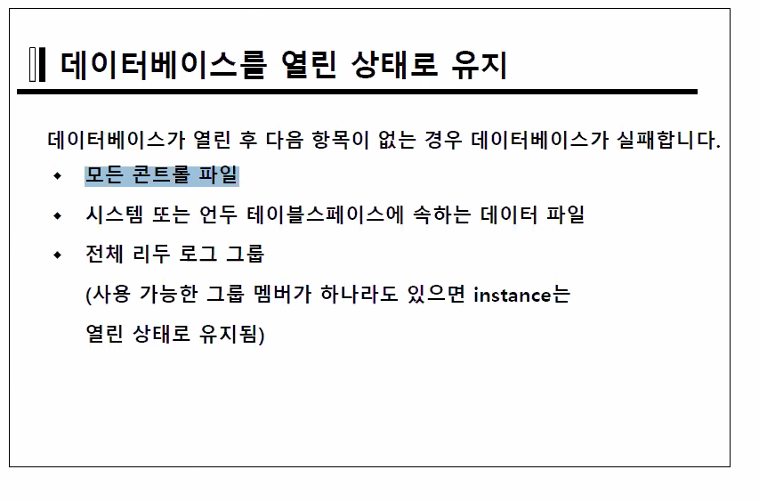

current log group 전체가 한군데도 멀쩡한 곳이 없다면 로그라이터가 몇번 시행하다가 죽는다. 따라서 비정상 종료된다.

- 콘트롤 파일이 문제가 있다면 콘트롤파일의 백업파일이 필요하다.
- 데이터 파일이 문제가 있다면 테이터파일의 백업파일이 필요하다.
- 다만 로그파일은 백업이 존재하지 않으므로 다른 방식의 백업이 필요하다.
  - 이는 데이터파일을 복구함으로 해결한다.(불완전 복구라는 어려운 작업이 필요)


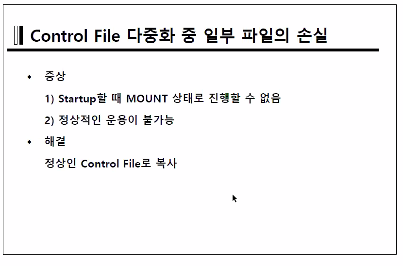

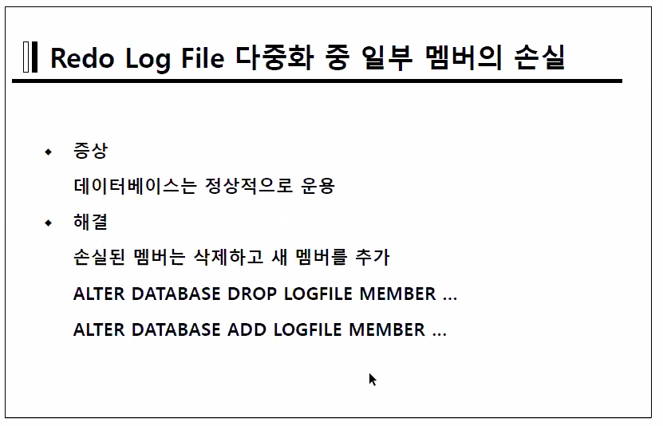

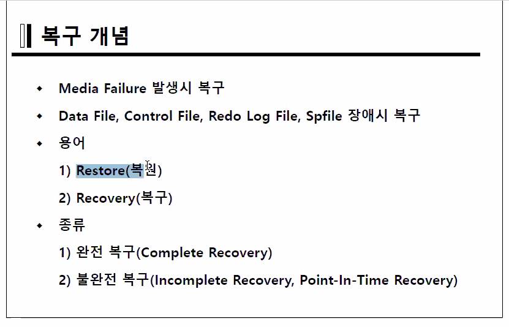

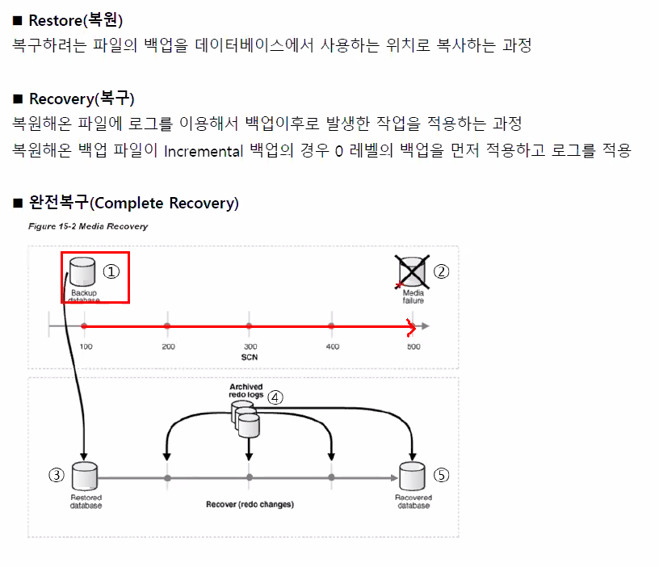

#### 불완전 복구는 장애가 일어나기 시점의 전까지 돌리는것!

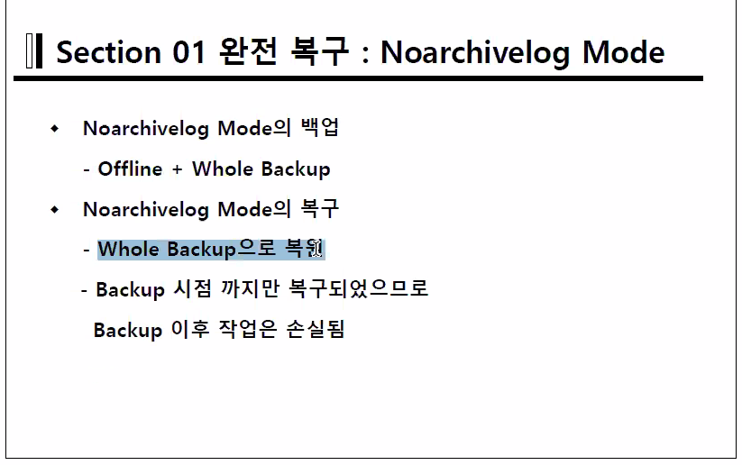

datafile의 복구는 mount up 후 RMAN에서 recover후 restore로 처리한다.


### Datafile Failure: 완전복구

두가지로 나뉜다.

1. Noncritical Datafile
2. Critical Datafile : Temp, System, Undo File에 해당하는 파일


##### Noncritical Datafile의 복구

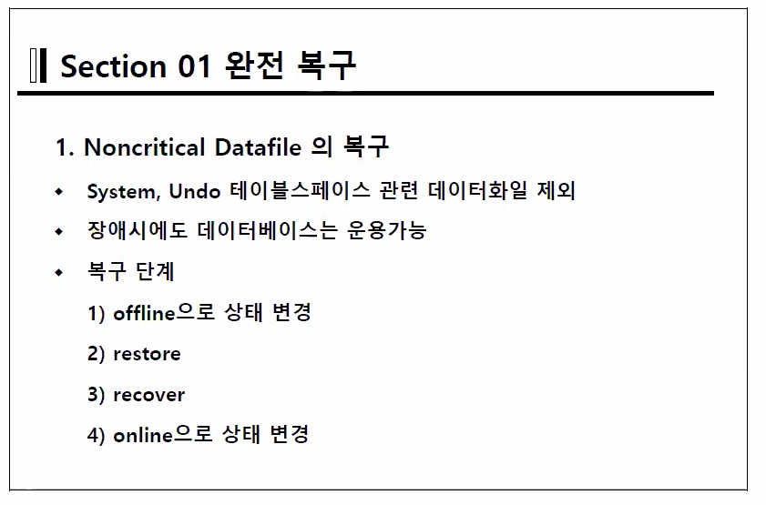

- DataBase가 죽지는 않으나 remove가 된 Datafile을 access할 때, 계속 에러메세지가 난다.
- open 상태에서 복구단계를 진행한다.
  1. off line으로 상태변경
     - `alter tablespace users offline;` 이렇게 칠 경우 체크포인트 생성을 하려고 하므로 `alter tablespace users offline immediate;`를 붙여 체크포인트 생성을 하지 않도록 해야한다.
     - 또는 `ALTER DATABASE DATAFILE 6 OFFLINE;` 처럼 데이터파일 레벨에서 직접 지정하면 체크포인트가 생성 되지 않는다.
  2. restore (RMAN에게 명령어를 치면 자동으로 최신의 datafile을 가지고 옴.ㅎㅎ)
     - `RESTORE TABLESPACE users;`
     - `RESTORE DATAFILE 6;`
  3. recover
     - `RECOVER TABLESPACE users;`
     - `RECOVER DATAFILE 6;`
     - 만약 이 단계에서 에러가 난다면 이전단계는 해결이 된거임 이부분의 잘못을 잘 찾아야 함다.
  4. online으로 상태 변경
     - `alter tablespace users ONLINE;`
     - `ALTER DATABASE DATAFILE 6 ONLINE;`


archivelog mode에서 LGWR이 log switch하기 위해 체크하는 2가지

1. checkpoint 생성이 되었는지
2. archiving이 완료 되었는지

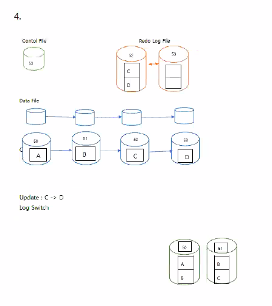

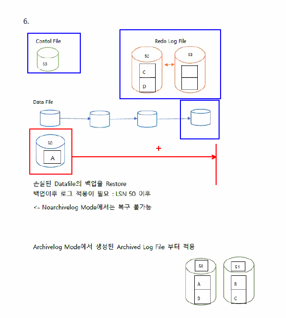

1. Backup된 파일에서 Rolling forward를 진행
2. Rollback 진행

(만약 Nonarchivelog Mode 였다면 완전복구 불가능)


FRA영역은 컨트롤 파일에서 `db_recovery_file_dest`로서 저장된다.

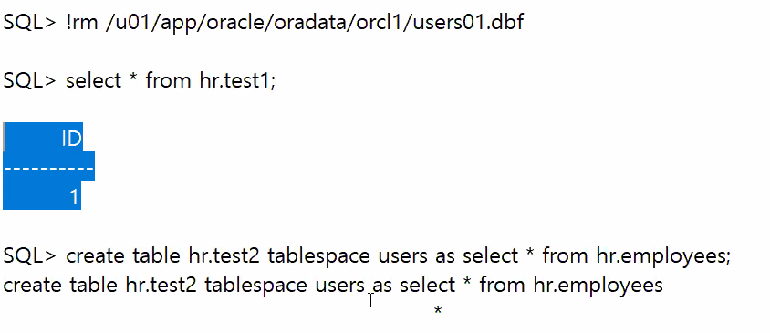

비록 데이터 파일을 지우더라도 셀렉트 명령문을 친다면 바로바로 에러가 일어나지는 않는다.

(databuffer cash에서 가져오므로.ㅎㅎ)

다만 create table시 데이터파일의 공간을 할당하려는 명령어를 치면 에러가 일어난다.


5-3 COLD BACKUP

```sqlite
SQL> select name from v$controlfile;

NAME
--------------------------------------------------------------------------------
/u01/app/oracle/oradata/orcl1/control01.ctl
/u01/app/oracle/oradata/orcl1/control02.ctl
/u01/app/oracle/oradata/orcl1/control03.ctl

SQL> select name from v$datafile;

NAME
--------------------------------------------------------------------------------
/u01/app/oracle/oradata/orcl1/system01.dbf
/u01/app/oracle/oradata/orcl1/sysaux01.dbf
/u01/app/oracle/oradata/orcl1/undotbs01.dbf
/u01/app/oracle/oradata/orcl1/users01.dbf
/u01/app/oracle/oradata/orcl1/example01.dbf

SQL> select member from v$logfile;

MEMBER
--------------------------------------------------------------------------------
/u01/app/oracle/oradata/orcl1/redo03.log
/u01/app/oracle/oradata/orcl1/redo02.log
/u01/app/oracle/oradata/orcl1/redo01.log
/u01/app/oracle/oradata/orcl1/redo01b.log
/u01/app/oracle/oradata/orcl1/redo02b.log
/u01/app/oracle/oradata/orcl1/redo03b.log

6 rows selected.

SQL> !
[orcl1:~]$ cd
[orcl1:~]$ pwd
/home/oracle
[orcl1:~]$ ls
Adobe  afiedt.buf  arch1  arch2  backup  cmdfile1  control.bak  datamodeler.log  Desktop  labs  log.sql  oradiag_oracle
[orcl1:~]$ mkdir COLD_BACKUP
[orcl1:~]$ cp /u01/app/oracle/oradata/orcl1/* /home/oracle/COLD_BACKUP
cp: omitting directory `/u01/app/oracle/oradata/orcl1/cold_backup'
[orcl1:~]$ cd /home/oracle/COLD_BACKUP
[orcl1:COLD_BACKUP]$ ls
control01.ctl  control03.ctl  redo01b.log  redo02b.log  redo03b.log  sysaux01.dbf  temp01.dbf     users01.dbf
control02.ctl  example01.dbf  redo01.log   redo02.log   redo03.log   system01.dbf  undotbs01.dbf
[orcl1:COLD_BACKUP]$ 
[orcl1:COLD_BACKUP]$ exit
exit

SQL> startup
ORACLE instance started.

Total System Global Area  849530880 bytes
Fixed Size                  1339824 bytes
Variable Size             536874576 bytes
Database Buffers          306184192 bytes
Redo Buffers                5132288 bytes
Database mounted.
Database opened.
SQL> exit
Disconnected from Oracle Database 11g Enterprise Edition Release 11.2.0.1.0 - Production
With the Partitioning, OLAP, Data Mining and Real Application Testing options

/*  
실습환경의 공간 절약을 위해 그동안 만들었던 백업을 모두 삭제
*/


[orcl1:~]$ rman target /

Recovery Manager: Release 11.2.0.1.0 - Production on Sun Dec 27 22:01:58 2020

Copyright (c) 1982, 2009, Oracle and/or its affiliates.  All rights reserved.

connected to target database: ORCL1 (DBID=1444574299)

RMAN> delete backup;

using target database control file instead of recovery catalog
allocated channel: ORA_DISK_1
channel ORA_DISK_1: SID=17 device type=DISK

List of Backup Pieces
BP Key  BS Key  Pc# Cp# Status      Device Type Piece Name
------- ------- --- --- ----------- ----------- ----------
15      15      1   1   AVAILABLE   DISK        /u01/app/oracle/flash_recovery_area/ORCL1/backupset/2020_12_26/o1_mf_nnndf_TAG20201226T160254_hyfr0yrw_.bkp
16      16      1   1   AVAILABLE   DISK        /u01/app/oracle/flash_recovery_area/ORCL1/autobackup/2020_12_26/o1_mf_s_1060185775_hyfr0zxx_.bkp
17      17      1   1   AVAILABLE   DISK        /u01/app/oracle/flash_recovery_area/ORCL1/autobackup/2020_12_26/o1_mf_s_1060185888_hyfr4jb7_.bkp
18      18      1   1   AVAILABLE   DISK        /u01/app/oracle/flash_recovery_area/ORCL1/backupset/2020_12_26/o1_mf_nnndf_TAG20201226T160656_hyfr8jyl_.bkp
19      19      1   1   AVAILABLE   DISK        /u01/app/oracle/flash_recovery_area/ORCL1/autobackup/2020_12_26/o1_mf_s_1060186032_hyfr91dg_.bkp
20      20      1   1   AVAILABLE   DISK        /u01/app/oracle/flash_recovery_area/ORCL1/backupset/2020_12_26/o1_mf_nnndf_TAG20201226T160906_hyfrdlo6_.bkp
21      21      1   1   AVAILABLE   DISK        /u01/app/oracle/flash_recovery_area/ORCL1/autobackup/2020_12_26/o1_mf_s_1060186147_hyfrdms9_.bkp
22      22      1   1   AVAILABLE   DISK        /u01/app/oracle/flash_recovery_area/ORCL1/backupset/2020_12_26/o1_mf_nnndf_TAG20201226T160938_hyfrflr1_.bkp
23      23      1   1   AVAILABLE   DISK        /u01/app/oracle/flash_recovery_area/ORCL1/autobackup/2020_12_26/o1_mf_s_1060186179_hyfrfmwk_.bkp
24      24      1   1   AVAILABLE   DISK        /u01/app/oracle/flash_recovery_area/ORCL1/backupset/2020_12_26/o1_mf_annnn_TAG20201226T161001_hyfrg9sc_.bkp
25      25      1   1   AVAILABLE   DISK        /u01/app/oracle/flash_recovery_area/ORCL1/autobackup/2020_12_26/o1_mf_s_1060186202_hyfrgbyt_.bkp
26      26      1   1   AVAILABLE   DISK        /u01/app/oracle/flash_recovery_area/ORCL1/backupset/2020_12_26/o1_mf_nnndf_TAG20201226T161729_hyfrw9cn_.bkp
27      27      1   1   AVAILABLE   DISK        /u01/app/oracle/flash_recovery_area/ORCL1/autobackup/2020_12_26/o1_mf_s_1060186650_hyfrwbk0_.bkp
28      28      1   1   AVAILABLE   DISK        /u01/app/oracle/flash_recovery_area/ORCL1/autobackup/2020_12_26/o1_mf_s_1060187366_hyfslpkj_.bkp
29      29      1   1   AVAILABLE   DISK        /u01/app/oracle/flash_recovery_area/ORCL1/autobackup/2020_12_27/o1_mf_s_1060271726_hyjcyz01_.bkp
30      30      1   1   AVAILABLE   DISK        /u01/datafile_17vj4urv_1_1
31      30      2   1   AVAILABLE   DISK        /u01/datafile_17vj4urv_2_1
32      30      3   1   AVAILABLE   DISK        /u01/datafile_17vj4urv_3_1
33      30      4   1   AVAILABLE   DISK        /u01/datafile_17vj4urv_4_1
34      30      5   1   AVAILABLE   DISK        /u01/datafile_17vj4urv_5_1
35      30      6   1   AVAILABLE   DISK        /u01/datafile_17vj4urv_6_1
36      31      1   1   AVAILABLE   DISK        /u01/app/oracle/flash_recovery_area/ORCL1/autobackup/2020_12_27/o1_mf_s_1060273079_hyjf97f5_.bkp
37      32      1   1   AVAILABLE   DISK        /u01/datafile_m_19vj4voq_1_1
38      32      2   1   AVAILABLE   DISK        /u01/datafile_m_19vj4voq_2_1
39      32      3   1   AVAILABLE   DISK        /u01/datafile_m_19vj4voq_3_1
40      32      4   1   AVAILABLE   DISK        /u01/datafile_m_19vj4voq_4_1
41      32      5   1   AVAILABLE   DISK        /u01/datafile_m_19vj4voq_5_1
42      32      6   1   AVAILABLE   DISK        /u01/datafile_m_19vj4voq_6_1
43      32      7   1   AVAILABLE   DISK        /u01/datafile_m_19vj4voq_7_1
44      33      1   1   AVAILABLE   DISK        /u01/app/oracle/flash_recovery_area/ORCL1/autobackup/2020_12_27/o1_mf_s_1060273962_hyjg4v6b_.bkp
45      34      1   1   AVAILABLE   DISK        /u01/app/oracle/flash_recovery_area/ORCL1/backupset/2020_12_27/o1_mf_nnnd0_TAG20201227T164506_hyjgw2pv_.bkp
46      35      1   1   AVAILABLE   DISK        /u01/app/oracle/flash_recovery_area/ORCL1/autobackup/2020_12_27/o1_mf_s_1060274721_hyjgwkyw_.bkp
47      36      1   1   AVAILABLE   DISK        /u01/app/oracle/flash_recovery_area/ORCL1/backupset/2020_12_27/o1_mf_nnnd1_TAG20201227T164907_hyjh3msn_.bkp
48      37      1   1   AVAILABLE   DISK        /u01/app/oracle/flash_recovery_area/ORCL1/autobackup/2020_12_27/o1_mf_s_1060274962_hyjh4338_.bkp
49      38      1   1   AVAILABLE   DISK        /u01/app/oracle/flash_recovery_area/ORCL1/backupset/2020_12_27/o1_mf_nnnd1_TAG20201227T165252_hyjhbnxy_.bkp
50      39      1   1   AVAILABLE   DISK        /u01/app/oracle/flash_recovery_area/ORCL1/autobackup/2020_12_27/o1_mf_s_1060275188_hyjhc4cr_.bkp
51      40      1   1   AVAILABLE   DISK        /u01/app/oracle/flash_recovery_area/ORCL1/autobackup/2020_12_27/o1_mf_s_1060290279_hyjy2qcz_.bkp
52      41      1   1   AVAILABLE   DISK        /u01/app/oracle/flash_recovery_area/ORCL1/autobackup/2020_12_27/o1_mf_s_1060291048_hyjytr5c_.bkp
53      42      1   1   AVAILABLE   DISK        /u01/app/oracle/flash_recovery_area/ORCL1/autobackup/2020_12_27/o1_mf_s_1060291135_hyk04or6_.bkp

Do you really want to delete the above objects (enter YES or NO)? yes
deleted backup piece
backup piece handle=/u01/app/oracle/flash_recovery_area/ORCL1/backupset/2020_12_26/o1_mf_nnndf_TAG20201226T160254_hyfr0yrw_.bkp RECID=15 STAMP=1060185774
deleted backup piece
backup piece handle=/u01/app/oracle/flash_recovery_area/ORCL1/autobackup/2020_12_26/o1_mf_s_1060185775_hyfr0zxx_.bkp RECID=16 STAMP=1060185775
deleted backup piece
backup piece handle=/u01/app/oracle/flash_recovery_area/ORCL1/autobackup/2020_12_26/o1_mf_s_1060185888_hyfr4jb7_.bkp RECID=17 STAMP=1060185888
deleted backup piece
backup piece handle=/u01/app/oracle/flash_recovery_area/ORCL1/backupset/2020_12_26/o1_mf_nnndf_TAG20201226T160656_hyfr8jyl_.bkp RECID=18 STAMP=1060186016
deleted backup piece
backup piece handle=/u01/app/oracle/flash_recovery_area/ORCL1/autobackup/2020_12_26/o1_mf_s_1060186032_hyfr91dg_.bkp RECID=19 STAMP=1060186033
deleted backup piece
backup piece handle=/u01/app/oracle/flash_recovery_area/ORCL1/backupset/2020_12_26/o1_mf_nnndf_TAG20201226T160906_hyfrdlo6_.bkp RECID=20 STAMP=1060186146
deleted backup piece
backup piece handle=/u01/app/oracle/flash_recovery_area/ORCL1/autobackup/2020_12_26/o1_mf_s_1060186147_hyfrdms9_.bkp RECID=21 STAMP=1060186147
deleted backup piece
backup piece handle=/u01/app/oracle/flash_recovery_area/ORCL1/backupset/2020_12_26/o1_mf_nnndf_TAG20201226T160938_hyfrflr1_.bkp RECID=22 STAMP=1060186178
deleted backup piece
backup piece handle=/u01/app/oracle/flash_recovery_area/ORCL1/autobackup/2020_12_26/o1_mf_s_1060186179_hyfrfmwk_.bkp RECID=23 STAMP=1060186179
deleted backup piece
backup piece handle=/u01/app/oracle/flash_recovery_area/ORCL1/backupset/2020_12_26/o1_mf_annnn_TAG20201226T161001_hyfrg9sc_.bkp RECID=24 STAMP=1060186201
deleted backup piece
backup piece handle=/u01/app/oracle/flash_recovery_area/ORCL1/autobackup/2020_12_26/o1_mf_s_1060186202_hyfrgbyt_.bkp RECID=25 STAMP=1060186202
deleted backup piece
backup piece handle=/u01/app/oracle/flash_recovery_area/ORCL1/backupset/2020_12_26/o1_mf_nnndf_TAG20201226T161729_hyfrw9cn_.bkp RECID=26 STAMP=1060186649
deleted backup piece
backup piece handle=/u01/app/oracle/flash_recovery_area/ORCL1/autobackup/2020_12_26/o1_mf_s_1060186650_hyfrwbk0_.bkp RECID=27 STAMP=1060186650
deleted backup piece
backup piece handle=/u01/app/oracle/flash_recovery_area/ORCL1/autobackup/2020_12_26/o1_mf_s_1060187366_hyfslpkj_.bkp RECID=28 STAMP=1060187366
deleted backup piece
backup piece handle=/u01/app/oracle/flash_recovery_area/ORCL1/autobackup/2020_12_27/o1_mf_s_1060271726_hyjcyz01_.bkp RECID=29 STAMP=1060271726
deleted backup piece
backup piece handle=/u01/datafile_17vj4urv_1_1 RECID=30 STAMP=1060273023
deleted backup piece
backup piece handle=/u01/datafile_17vj4urv_2_1 RECID=31 STAMP=1060273030
deleted backup piece
backup piece handle=/u01/datafile_17vj4urv_3_1 RECID=32 STAMP=1060273033
deleted backup piece
backup piece handle=/u01/datafile_17vj4urv_4_1 RECID=33 STAMP=1060273048
deleted backup piece
backup piece handle=/u01/datafile_17vj4urv_5_1 RECID=34 STAMP=1060273073
deleted backup piece
backup piece handle=/u01/datafile_17vj4urv_6_1 RECID=35 STAMP=1060273076
deleted backup piece
backup piece handle=/u01/app/oracle/flash_recovery_area/ORCL1/autobackup/2020_12_27/o1_mf_s_1060273079_hyjf97f5_.bkp RECID=36 STAMP=1060273079
deleted backup piece
backup piece handle=/u01/datafile_m_19vj4voq_1_1 RECID=37 STAMP=1060273946
deleted backup piece
backup piece handle=/u01/datafile_m_19vj4voq_2_1 RECID=38 STAMP=1060273947
deleted backup piece
backup piece handle=/u01/datafile_m_19vj4voq_3_1 RECID=39 STAMP=1060273950
deleted backup piece
backup piece handle=/u01/datafile_m_19vj4voq_4_1 RECID=40 STAMP=1060273952
deleted backup piece
backup piece handle=/u01/datafile_m_19vj4voq_5_1 RECID=41 STAMP=1060273954
deleted backup piece
backup piece handle=/u01/datafile_m_19vj4voq_6_1 RECID=42 STAMP=1060273956
deleted backup piece
backup piece handle=/u01/datafile_m_19vj4voq_7_1 RECID=43 STAMP=1060273959
deleted backup piece
backup piece handle=/u01/app/oracle/flash_recovery_area/ORCL1/autobackup/2020_12_27/o1_mf_s_1060273962_hyjg4v6b_.bkp RECID=44 STAMP=1060273963
deleted backup piece
backup piece handle=/u01/app/oracle/flash_recovery_area/ORCL1/backupset/2020_12_27/o1_mf_nnnd0_TAG20201227T164506_hyjgw2pv_.bkp RECID=45 STAMP=1060274706
deleted backup piece
backup piece handle=/u01/app/oracle/flash_recovery_area/ORCL1/autobackup/2020_12_27/o1_mf_s_1060274721_hyjgwkyw_.bkp RECID=46 STAMP=1060274721
deleted backup piece
backup piece handle=/u01/app/oracle/flash_recovery_area/ORCL1/backupset/2020_12_27/o1_mf_nnnd1_TAG20201227T164907_hyjh3msn_.bkp RECID=47 STAMP=1060274947
deleted backup piece
backup piece handle=/u01/app/oracle/flash_recovery_area/ORCL1/autobackup/2020_12_27/o1_mf_s_1060274962_hyjh4338_.bkp RECID=48 STAMP=1060274963
deleted backup piece
backup piece handle=/u01/app/oracle/flash_recovery_area/ORCL1/backupset/2020_12_27/o1_mf_nnnd1_TAG20201227T165252_hyjhbnxy_.bkp RECID=49 STAMP=1060275172
deleted backup piece
backup piece handle=/u01/app/oracle/flash_recovery_area/ORCL1/autobackup/2020_12_27/o1_mf_s_1060275188_hyjhc4cr_.bkp RECID=50 STAMP=1060275188
deleted backup piece
backup piece handle=/u01/app/oracle/flash_recovery_area/ORCL1/autobackup/2020_12_27/o1_mf_s_1060290279_hyjy2qcz_.bkp RECID=51 STAMP=1060290279
deleted backup piece
backup piece handle=/u01/app/oracle/flash_recovery_area/ORCL1/autobackup/2020_12_27/o1_mf_s_1060291048_hyjytr5c_.bkp RECID=52 STAMP=1060291048
deleted backup piece
backup piece handle=/u01/app/oracle/flash_recovery_area/ORCL1/autobackup/2020_12_27/o1_mf_s_1060291135_hyk04or6_.bkp RECID=53 STAMP=1060292389
Deleted 39 objects


RMAN> list backup;

specification does not match any backup in the repository

RMAN> delete copy;

....

RMAN> list copy;

...


```


5-5 시나리오 하기

Noncritical datafile의 장애 발생경우 db를 open시키는걸 우선적으로 진행한다.

문제된 데이타파일만 오프라인으로 바꿔줘도 open은 문제없이 실행된다.


```sqlite
==============================================================================
Archivelog Mode에서 Noncritical Datafile의 완전 복구
데이터베이스는 Shutdown 상태
==============================================================================
[orcl1:~]$ rman target /

/* 
   복구를 위한 준비가 되어 있는지를 확인합니다.
   Backup + Backup이후 생성된 모든 로그
*/

RMAN> list backup of datafile 4;


List of Backup Sets
===================


BS Key  Type LV Size       Device Type Elapsed Time Completion Time    
------- ---- -- ---------- ----------- ------------ -------------------
49      Full    1.00G      DISK        00:00:11     2020-12-27:23:15:14
        BP Key: 60   Status: AVAILABLE  Compressed: NO  Tag: TAG20201227T231503
        Piece Name: /u01/app/oracle/flash_recovery_area/ORCL1/backupset/2020_12_27/o1_mf_nnndf_TAG20201227T231503_hyk5q7s9_.bkp
  List of Datafiles in backup set 49
  File LV Type Ckp SCN    Ckp Time            Name
  ---- -- ---- ---------- ------------------- ----
  4       Full 929231     2020-12-27:23:15:03 /u01/app/oracle/oradata/orcl1/users01.dbf


[orcl1:orcl1]$ sqlplus / as sysdba

SQL> set linesize 300
SQL> col name format a50
SQL> select sequence#, name, first_change#, next_change# from v$archived_log;
.
.
.

 SEQUENCE# NAME                                               FIRST_CHANGE# NEXT_CHANGE#
---------- -------------------------------------------------- ------------- ------------
        30                                                           924416       924419
        30                                                           924416       924419
        31                                                           924419       925191
        31                                                           924419       925191
        32                                                           925191       925201
        32                                                           925191       925201
        33                                                           925201       925206
        33                                                           925201       925206
        34 /home/oracle/arch1/arch_1_34_1060124829.arc               925206       929225
        34 /home/oracle/arch2/arch_1_34_1060124829.arc               925206       929225
        35 /home/oracle/arch1/arch_1_35_1060124829.arc               929225       929243
        35 /home/oracle/arch2/arch_1_35_1060124829.arc               929225       929243

56 rows selected.

SQL> select group#, sequence#, archived, first_change#, next_change#
  2  from v$log;

    GROUP#  SEQUENCE# ARC FIRST_CHANGE# NEXT_CHANGE#
---------- ---------- --- ------------- ------------
         1         34 YES        925206       929225
         2         35 YES        929225       929243
         3         36 NO         929243   2.8147E+14


/*
데이터베이스 종료 , 장애 발생, 데이터베이스 시작 
*/

SQL> shutdown immediate
Database closed.
Database dismounted.
ORACLE instance shut down.
SQL> !rm /u01/app/oracle/oradata/orcl1/users01.dbf

/*
데이터베이스가 오픈되기 위한 조건 중
모든 online 상태의 데이터파일이 정상적으로 동기화된 상태로 있어야 하는 
조건을 충족하지 못하여 mount 단계까지만 진행되고 에러
*/

SQL> startup
ORACLE instance started.

Total System Global Area  849530880 bytes
Fixed Size                  1339824 bytes
Variable Size             536874576 bytes
Database Buffers          306184192 bytes
Redo Buffers                5132288 bytes
Database mounted.
ORA-01157: cannot identify/lock data file 4 - see DBWR trace file
ORA-01110: data file 4: '/u01/app/oracle/oradata/orcl1/users01.dbf'


SQL> select * from v$recover_file;

     FILE# ONLINE  ONLINE_ ERROR                                                                CHANGE# TIME
---------- ------- ------- ----------------------------------------------------------------- ---------- -------------------
         4 ONLINE  ONLINE  FILE NOT FOUND                                                             0

/*
데이터베이스를 우선 open하기 위해 손실된 데이터파일의 상태를 offline으로 변경
*/

SQL> alter database datafile '/u01/app/oracle/oradata/orcl1/users01.dbf' offline;

Database altered.

SQL> alter database open;

Database altered.

SQL> select a.name
  2  from v$tablespace a, v$datafile b
  3  where a.ts#=b.ts#
  4  and b.name='/u01/app/oracle/oradata/orcl1/users01.dbf';

NAME
--------------------------------------------------
USERS


SQL> exit
Disconnected from Oracle Database 11g Enterprise Edition Release 11.2.0.1.0 - Production
With the Partitioning, OLAP, Data Mining and Real Application Testing options
[orcl1:orcl1]$ rman target /

Recovery Manager: Release 11.2.0.1.0 - Production on Mon Dec 28 00:17:44 2020

Copyright (c) 1982, 2009, Oracle and/or its affiliates.  All rights reserved.

connected to target database: ORCL1 (DBID=1444574299)

RMAN> restore tablespace users;

Starting restore at 2020-12-28:00:17:53
using target database control file instead of recovery catalog
allocated channel: ORA_DISK_1
channel ORA_DISK_1: SID=15 device type=DISK

channel ORA_DISK_1: starting datafile backup set restore
channel ORA_DISK_1: specifying datafile(s) to restore from backup set
channel ORA_DISK_1: restoring datafile 00004 to /u01/app/oracle/oradata/orcl1/users01.dbf
channel ORA_DISK_1: reading from backup piece /u01/app/oracle/flash_recovery_area/ORCL1/backupset/2020_12_27/o1_mf_nnndf_TAG20201227T231503_hyk5q7s9_.bkp
channel ORA_DISK_1: piece handle=/u01/app/oracle/flash_recovery_area/ORCL1/backupset/2020_12_27/o1_mf_nnndf_TAG20201227T231503_hyk5q7s9_.bkp tag=TAG20201227T231503
channel ORA_DISK_1: restored backup piece 1
channel ORA_DISK_1: restore complete, elapsed time: 00:00:01
Finished restore at 2020-12-28:00:17:55

RMAN> recover tablespace users;

Starting recover at 2020-12-28:00:18:33
using channel ORA_DISK_1

starting media recovery
media recovery complete, elapsed time: 00:00:00

Finished recover at 2020-12-28:00:18:33

RMAN> sql 'alter tablespace users online';

sql statement: alter tablespace users online

RMAN> exit


Recovery Manager complete.


[orcl1:orcl1]$ sqlplus / as sysdba


SQL> select count(*) from hr.test2;

  COUNT(*)
----------
       107

SQL> exit


```

로그 시퀀스 (조금 더 큰 단위의 로그가 바뀔때의 번호) > SCN (시간단위의 더 작은 범위의 변경시 매기는 번호)

#### v$archived_log(data_file)

1. first_change# : 처음 로그가 적용된 SCN
2. NEXT_CHANGE# : 다음 로그파일의  SCN(다음 로그파일을 찾기 위해서)


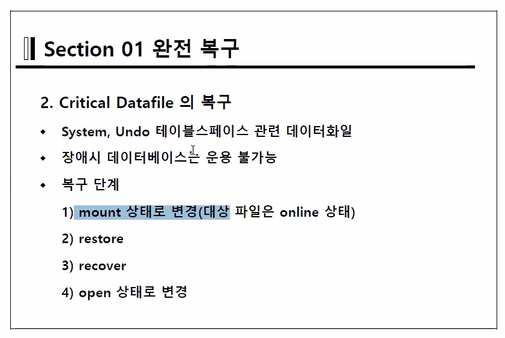

Noncritical과 Critical Datafile의 복구 차이

| Noncritical Datafile 복구                  | Critical Datafile 복구          |
| ------------------------------------------ | ------------------------------- |
| DB Open하고 offline 상태로 변경하여 복구함 | DB 내리고 Mount 단계에서 복수함 |


1. mount
   1. shutdown abort
   2. startup mount
2. restore
   1. restore DATABASE;
      1. 모든 백업파일을 가져오는 것이 아닌 RMAN이 알아서 문제난 파일의 백업만을 가져온다.
   2. RESTORE  TABLESPACE system;
   3. RESTORE DATAFILE 1;
3. recover
   1. RECOVER DATABASE;
   2. RECOVER TABLESPACE system;
   3. RECOVER DATAFILE 1;
4. open
   1. ALTER DATABASE OPEN

> dba_tables dba_users/user_tables/all_tables : DD
>
> 위와 같은 Data Directory는 db가 오픈되어있어야 확인이 가능하다.

> v$datafile, v$tablespace : dynamic performance view
>
> 위와 같은 다이나믹 퍼포먼스 뷰는 컨트롤 파일에 저장되기 때문에 마운트 상태 혹은 노마운트 상태에서도 확인 가능하다. 


5-6 시나리오

```sqlite
===================================================================
Archivedlog Mode 에서 Critical Data File의 완전 복구
===================================================================

[orcl1:~]$ rman target /

/* 
   복구를 위한 준비가 되어 있는지를 확인합니다.
   Backup + Backup이후 생성된 모든 로그
*/

RMAN> list backup of datafile 1;

using target database control file instead of recovery catalog

List of Backup Sets
===================


BS Key  Type LV Size       Device Type Elapsed Time Completion Time    
------- ---- -- ---------- ----------- ------------ -------------------
49      Full    1.00G      DISK        00:00:11     2020-12-27:23:15:14
        BP Key: 60   Status: AVAILABLE  Compressed: NO  Tag: TAG20201227T231503
        Piece Name: /u01/app/oracle/flash_recovery_area/ORCL1/backupset/2020_12_27/o1_mf_nnndf_TAG20201227T231503_hyk5q7s9_.bkp
  List of Datafiles in backup set 49
  File LV Type Ckp SCN    Ckp Time            Name
  ---- -- ---- ---------- ------------------- ----
  1       Full 929231     2020-12-27:23:15:03 /u01/app/oracle/oradata/orcl1/system01.dbf

RMAN> exit


[orcl1:orcl1]$ sqlplus / as sysdba

SQL> set linesize 300
SQL> col name format a50
SQL> select sequence#, name, first_change#, next_change# from v$archived_log;
.
.
.

 SEQUENCE# NAME                                               FIRST_CHANGE# NEXT_CHANGE#
---------- -------------------------------------------------- ------------- ------------
        30                                                           924416       924419
        30                                                           924416       924419
        31                                                           924419       925191
        31                                                           924419       925191
        32                                                           925191       925201
        32                                                           925191       925201
        33                                                           925201       925206
        33                                                           925201       925206
        34 /home/oracle/arch1/arch_1_34_1060124829.arc               925206       929225
        34 /home/oracle/arch2/arch_1_34_1060124829.arc               925206       929225
        35 /home/oracle/arch1/arch_1_35_1060124829.arc               929225       929243
        35 /home/oracle/arch2/arch_1_35_1060124829.arc               929225       929243

56 rows selected.


SQL> select group#, sequence#, archived, first_change#, next_change#
  2  from v$log;

    GROUP#  SEQUENCE# ARC FIRST_CHANGE# NEXT_CHANGE#
---------- ---------- --- ------------- ------------
         1         34 YES        925206       929225
         2         35 YES        929225       929243
         3         36 NO         929243   2.8147E+14


SQL> create table hr.loc_new tablespace users as select * from hr.locations;

Table created.

SQL> select count(*) from hr.loc_new;

  COUNT(*)
----------
        23

SQL> select sequence#, archived, status, first_change#, next_change#
  2  from v$log;

 SEQUENCE# ARC STATUS           FIRST_CHANGE# NEXT_CHANGE#
---------- --- ---------------- ------------- ------------
        34 YES INACTIVE                925206       929225
        35 YES INACTIVE                929225       929243
        36 NO  CURRENT                 929243   2.8147E+14


SQL> alter system switch logfile;

System altered.

SQL> / 

System altered.

SQL> /

System altered.

/*
장애 발생!!!!!!!!!!!
*/

SQL> !rm /u01/app/oracle/oradata/orcl1/system01.dbf

SQL> !ls /u01/app/oracle/oradata/orcl1/system01.dbf
ls: /u01/app/oracle/oradata/orcl1/system01.dbf: No such file or directory

SQL> alter system switch logfile;

System altered.

SQL> /

System altered.

SQL> select name from v$database;

NAME
---------
ORCL1

/*
로그인의 인증정보를 위해 system 테이블스페이스를 검색하려다가 에러 발생
*/

SQL> conn hr/hr
ERROR:
ORA-00604: error occurred at recursive SQL level 1
ORA-01116: error in opening database file 1
ORA-01110: data file 1: '/u01/app/oracle/oradata/orcl1/system01.dbf'
ORA-27041: unable to open file
Linux Error: 2: No such file or directory
Additional information: 3


Warning: You are no longer connected to ORACLE.


SQL> conn / as sysdba
Connected.

SQL> shutdown abort
ORACLE instance shut down.

SQL> exit


[orcl1:~]$ rman target /


connected to target database (not started)

RMAN> startup mount

Oracle instance started
database mounted

Total System Global Area     849530880 bytes

Fixed Size                     1339824 bytes
Variable Size                553651792 bytes
Database Buffers             289406976 bytes
Redo Buffers                   5132288 bytes

RMAN> restore tablespace system;

Starting restore at 2020-12-28:00:45:10
using target database control file instead of recovery catalog
allocated channel: ORA_DISK_1
channel ORA_DISK_1: SID=133 device type=DISK

channel ORA_DISK_1: starting datafile backup set restore
channel ORA_DISK_1: specifying datafile(s) to restore from backup set
channel ORA_DISK_1: restoring datafile 00001 to /u01/app/oracle/oradata/orcl1/system01.dbf
channel ORA_DISK_1: reading from backup piece /u01/app/oracle/flash_recovery_area/ORCL1/backupset/2020_12_27/o1_mf_nnndf_TAG20201227T231503_hyk5q7s9_.bkp
channel ORA_DISK_1: piece handle=/u01/app/oracle/flash_recovery_area/ORCL1/backupset/2020_12_27/o1_mf_nnndf_TAG20201227T231503_hyk5q7s9_.bkp tag=TAG20201227T231503
channel ORA_DISK_1: restored backup piece 1
channel ORA_DISK_1: restore complete, elapsed time: 00:00:07
Finished restore at 2020-12-28:00:45:18

RMAN> recover tablespace system;

Starting recover at 2020-12-28:00:45:57
using channel ORA_DISK_1

starting media recovery

archived log for thread 1 with sequence 35 is already on disk as file /home/oracle/arch1/arch_1_35_1060124829.arc
archived log for thread 1 with sequence 36 is already on disk as file /home/oracle/arch1/arch_1_36_1060124829.arc
archived log for thread 1 with sequence 37 is already on disk as file /home/oracle/arch1/arch_1_37_1060124829.arc
archived log for thread 1 with sequence 38 is already on disk as file /home/oracle/arch1/arch_1_38_1060124829.arc
archived log for thread 1 with sequence 39 is already on disk as file /home/oracle/arch1/arch_1_39_1060124829.arc
archived log for thread 1 with sequence 40 is already on disk as file /home/oracle/arch1/arch_1_40_1060124829.arc
archived log file name=/home/oracle/arch1/arch_1_35_1060124829.arc thread=1 sequence=35
archived log file name=/home/oracle/arch1/arch_1_36_1060124829.arc thread=1 sequence=36
archived log file name=/home/oracle/arch1/arch_1_37_1060124829.arc thread=1 sequence=37
archived log file name=/home/oracle/arch1/arch_1_38_1060124829.arc thread=1 sequence=38
media recovery complete, elapsed time: 00:00:01
Finished recover at 2020-12-28:00:45:58

RMAN> alter database open;

database opened

RMAN> exit


Recovery Manager complete.


[orcl:~]$ sqlplus / as sysdba


SQL> select count(*) from hr.loc_new;

  COUNT(*)
----------
        23

SQL> conn hr/hr
Connected.
SQL> select count(*) from hr.loc_new;

  COUNT(*)
----------
        23

SQL> exit
```

shutdown immediate 수행시 체크포인트를 만들려고 하기 때문에 강제 종료를 해야함

shutdown abort를 수행!


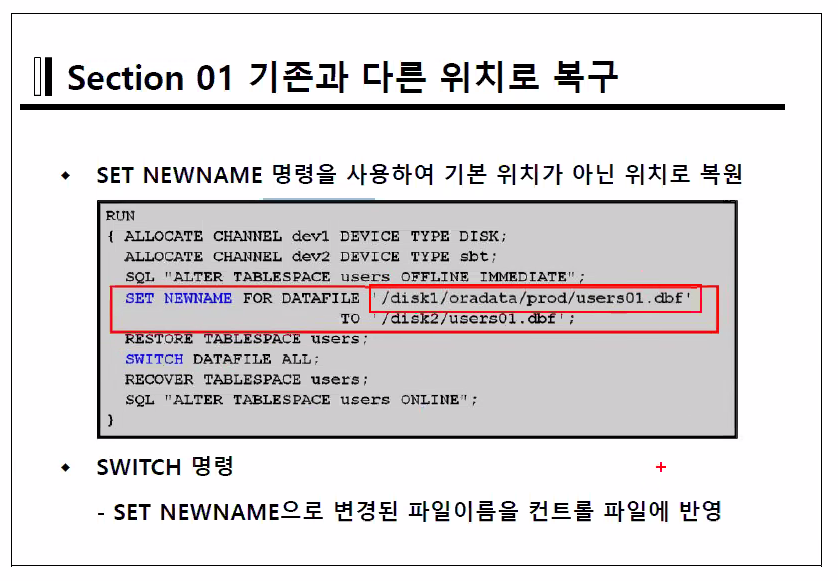

`SET NEWNAME`으로 기본 위치가 아닌 사용자 지정 위치로 복원이 가능하다.

`SWITCH DATAFILE ALL`의 명령어를 통해 컨트롤 파일로 변경된 파일 이름을 반영가능  

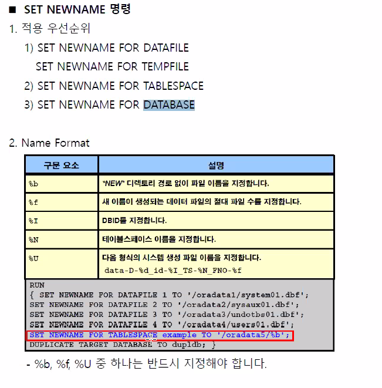

log_archive_processes=4 기본값은 4이지만 아카이브가 느리다면 늘려줄 수 있다.

아카이브와 체크포인트는 동시에 진행된다.