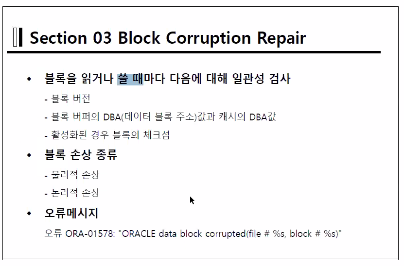
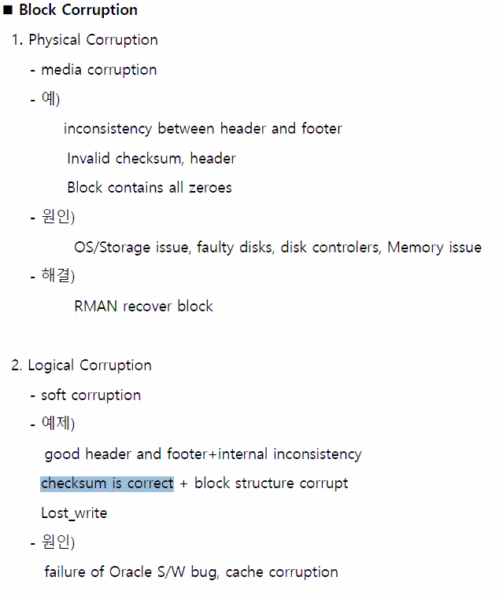
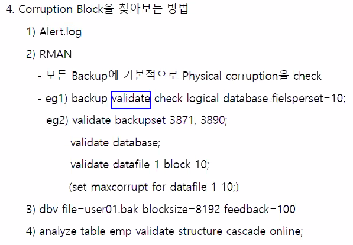
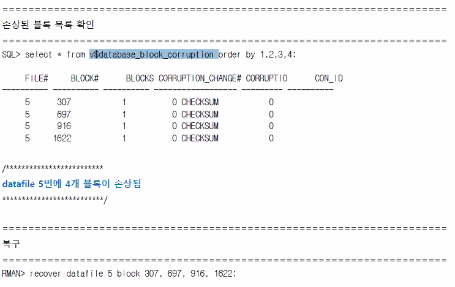
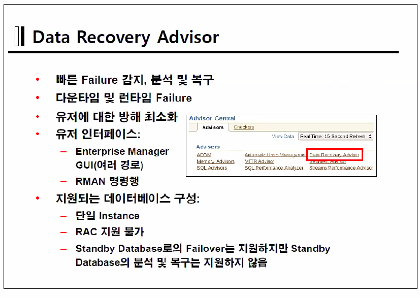
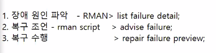

5-8 시나리오 체크

%t : thread number - instance number

%s : LSN

%r : resetlogs id

### Block Media Recovery

- DBWR이 블록의 버전(컨트롤파일과 비교) 블록버퍼의 DataBlock Adrees(캐시와 비교), 체크섬(Oracle이 내부적으로 계산하는 값)을 비교한다.

- DB_BLOCK_CHECKSUM

  - off(false) : 꺼놓는 기능이다. 하지만system TS는 항상 계산한다.
  - typical(true) : storage상에서 외부적인 영향으로 인해 데이터 블럭이 변화가 있었는지를 계산한다. checksum계산한다.
  - full : 메모리에 올려 놓으며 메모리상에서도 변화가 있었는지 검사한다.

  체크섬은 블럭자체가 훼손됬는지 판별할 때 쓰이며 1~2%의 성능저하가 일어나나 사용이 권장된다.

  헤더와 푸터의 차이를 읽는다.

- DB_BLOCK_CHECKING
  - false(off) : system TS만을 체크한다.
  - low : off + userdata(block header)
  - medium : low + userdata(block body)
  - full :  medium + index

2. logical Corruption
   - 원인 : 오라클의 오류 혹은 갑자기 종료된 문제
   - 체크섬 및 물리적으로 체크할 수 있는 수단은 모두 맞으나 내부적 데이터가 무결성을 만족하지 않을때
   - 해결하기가 매우 어려움

`set maxcorrupt 10`

corrupt를 

- RMAN

`backup validate check logical database filesperset=10`

위 명령어에서 validate 를 써주면 backup을 실행하는것이 아닌 corruption난 블록을 찾는 명령을 수행핟나.

`v$database_block_corruption`에 corrupted된 block 정보를 저장한다!

- OS

`dbv file=user01.bak blocksize=8192 feedback=100`

100개 까지 찾아라!

장점은 데이타베이스에 커넥션을 생성하지 않고 찾을수 있다는 점.

- SQL

`analyze table emp validate structure cascade online;`

blockrecover 는 online상태에서 진행된다

블럭복구 명령어

블럭의 리커버리

- rman으로만 실행됨

- online상태로도 가능
- complete 백업만이 가능
- backup file(full형태 ) + log가 필요.

