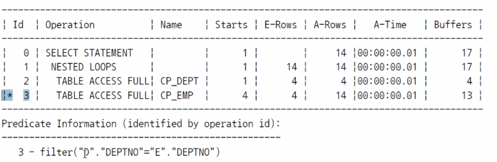
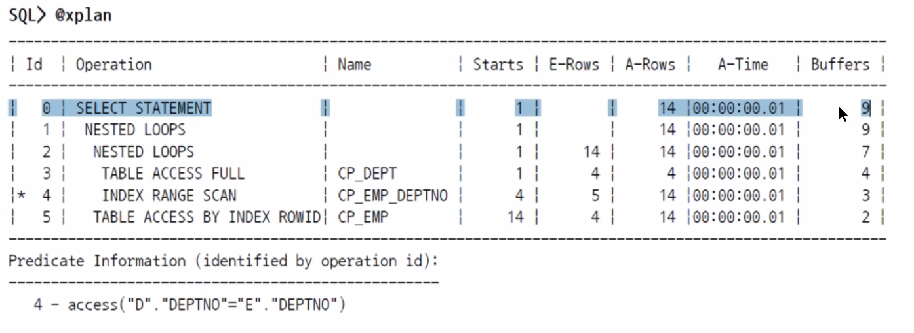
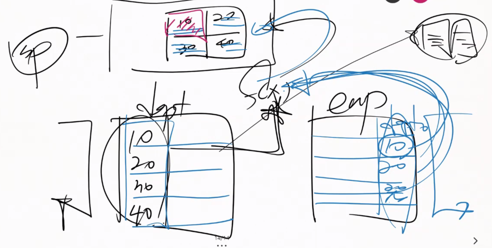
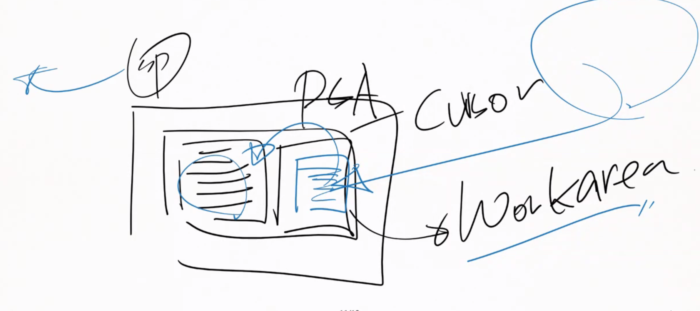
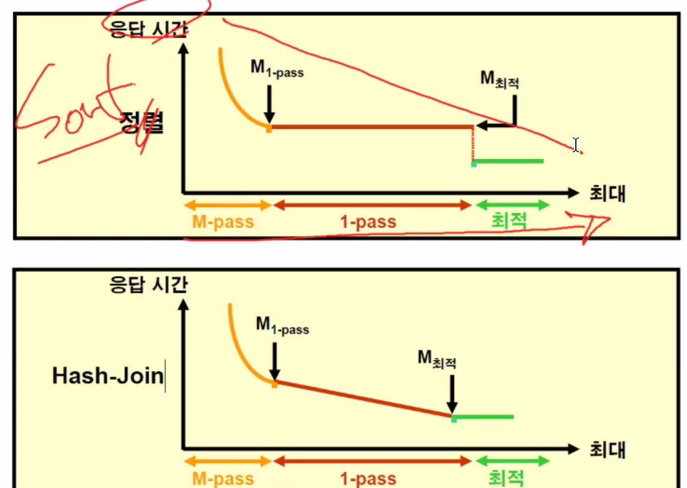
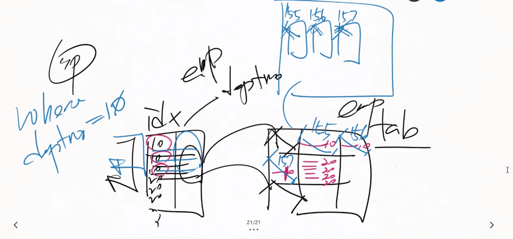

# Join 튜닝

## Nasted Loops join

join을 한다면 먼저 액세스를 하는 테이블이 분명 존재한다.

join 조건식은 누굴 먼저 액세스를 하냐에 따라서 하나는 값을 공급하는 대상이 되고 다른 테이블은 Searching하는 대상이 된다.

공급하는 대상(먼저 드라이빙되는 테이블)의 칼럼수만큼 Searching 대상으로의 접근을 진행하므로  칼럼수가 적을 수록 유리하다.



실행계획을 꺼내보면 조건식이 걸려있는 테이블은 EMP이다.

index를 둘다 만들더라도 먼저 드라이빙되는 테이블은 무조건 Table Access Full로 접근하게 된다.



따라서 Target Table의 join 칼럼 index를 마련해주어야 Nasted Loop Join은 유리하다.

## Hash join

위와 같은 상황에서는 사실 Searching 대상의 테이블로 접근이 오지게 많이 일어난다.

따라서 Hash Join을 사용하며 이는 큰 데이터의 조인 작업에 유리하다.



hash join은 드라이빙 순서에 따라 접근하는 횟수가 달라지지 않는다.

1. 먼저드라이빙되는 테이블을 읽는다.
2. join칼럼을 hash함수에 넣고 이를 통해 PGA에 메모리공간(hash table)을 마련한다.
3. emp테이블의 모든 칼럼들을 hash함수에 넣고 이를 통해 hash table에 넣는다.


여기서도 먼저 드라이빙되는 테이블은 size가 적은 테이블을 사용하는 것이 유리하다.

-> 먼저 드라이빙되는 테이블의 크기가 hash table의 크기를 결정하고 이는 메모리의 낭비를 의미하기 때문이다.


Equi join만이 가능하다. join의 컬럼의 값이 서로 같은 것만을 의미

NonEqui조인은 해쉬조인이 불가능하다.

```mysql
SELECT /*+ leading(e) use_hash(s)  */ * FROM EMP E, SALGRADE S WHERE
E.SAL BETWEEN S.LOSAL AND S.HISAL

Plan hash value: 3804685228
-----------------------------------------------------------------------------------------
| Id  | Operation          | Name     | Starts | E-Rows | A-Rows |   A-Time   | Buffers |
-----------------------------------------------------------------------------------------
|   0 | SELECT STATEMENT   |          |      1 |        |     14 |00:00:00.01 |      47 |
|   1 |  NESTED LOOPS      |          |      1 |     42 |     14 |00:00:00.01 |      47 |
|   2 |   TABLE ACCESS FULL| EMP      |      1 |     14 |   140K |00:00:00.01 |       4 |
|*  3 |   TABLE ACCESS FULL| SALGRADE |   140K |      3 |     14 |00:00:00.01 |      43 |
-----------------------------------------------------------------------------------------
Predicate Information (identified by operation id):
---------------------------------------------------
   3 - filter(("E"."SAL">="S"."LOSAL" AND "E"."SAL"<="S"."HISAL"))

```


## Sort Merge Join




1. sorting작업은 pga공간에서 Workarea에서 진행된다.(sort Area 마련)

2. Sort Area에 join칼럼의 순서대로 Sorting한다.
3. 두번째 테이블 또한 Sort Area에 똑같이 Sorting한다.
4. 이 두 테이블을 머지한다.


소팅을 위한 메모리공간과 머징을 위한 메모리공간이 필요한 Join이다.(hash조인과 비슷)

##### Hash Join과의 비교

Sorting작업은 메모리할당량 대비 효율이 계단식으로 증가한다.(메모리를 많이 할당한다고 해서 빨라진다는 보장이 없다.)

Hash join은 메모리할당량 대비 효율이 점진적으로 증가한다.(메모리를 많이 줄수 있으면 더 빨라진다.)(선호)



따라서, Sort Merge Join은 NonEQ조인때만 거의 사용되게 된다.


데이터 통계 칼럼에서 Disk I/O작업이 생긴다면 Reads 항목이 생기고 여기에 Disk I/o 횟수를 기록한다.


sp가 메모리버퍼캐쉬에서 버퍼를 조회 때 이 버퍼가 사라지거나 변하지 않도록 Pin이라는 개념이 존재한다.

통계 테이블의 Buffers항목은 메모리에 접근한 횟수이다.




만약 데이터 블럭에 deptno=10인 데이터들이 여러개의 데이터블록에 나눠서 저장되어 있고

deptno = 20인 데이터는 한 블럭에 저장되어 있다고 하자.

이때, deptno=10을 조회하면 pin작업을 3번 해야한다. deptno=20을 조회하면 pinning을 1번만 하고 유지하는게 이득이다.

이를 데이터 버퍼 피닝이라고 한다.


### Nasted loop join 최적화

```mysql
문제. 다음 문장을 최적화할 수 있는 조인 순서 및 조인 방법은?
SQL> SELECT e.employee_id, e.last_name, e.job_id, d.department_id, d.department_name
 FROM employees e, departments d
 WHERE e.department_id = d.department_id
 AND d.location_id = 1700
 AND e.job_id IN ('FI_ACCOUNT','PU_CLERK');
EMPLOYEE_ID LAST_NAME JOB_ID DEPARTMENT_ID DEPARTMENT_NAME
----------- ------------------------- ---------- ------------- ------------------------------
 115 Khoo PU_CLERK 30 Purchasing
 116 Baida PU_CLERK 30 Purchasing
 117 Tobias PU_CLERK 30 Purchasing
 118 Himuro PU_CLERK 30 Purchasing
 119 Colmenares PU_CLERK 30 Purchasing
 109 Faviet FI_ACCOUNT 100 Finance
 110 Chen FI_ACCOUNT 100 Finance
 111 Sciarra FI_ACCOUNT 100 Finance
 112 Urman FI_ACCOUNT 100 Finance
 113 Popp FI_ACCOUNT 100 Finance
10 rows selected.
SQL> SELECT COUNT(*)
 FROM employees
 WHERE job_id IN ('FI_ACCOUNT','PU_CLERK') ;
 COUNT(*)
----------
 10
SQL> SELECT COUNT(*)
 FROM departments
 WHERE location_id = 1700 ;
 COUNT(*)
----------
 21
```

employees의 컬럼 갯수가 더 적다.

하지만 위같은 경우 departments를 먼저 시작하는게 유리하다.

데이터 버퍼 피닝을 이용하여 중복값을 여러개 뽑아낼 수 있기 때문이다.

department의 deptno가 유니크하기 때문에 타겟 테이블을 사용하기 때문에 데이터 버퍼 피닝을 사용할 수 없다.

따라서 칼럼의 갯수를 너무 맹신하기보다 1:N 구조라면 1을 먼저 드라이빙 시키는게 유리한 경우가 더 많다.(신버전일수록 더 그렇다.)


Join의 순서를 먼저 고려하고 뒤에 먼저 드라이빙되는 조건을 인덱스를 태울지 안 태울지 고려한다.

후에 드라이빙되는 테이블의 조건 칼럼과 join 칼럼을 결합인덱스로 생성한다.


### Hash Join 최적화

```mysql
SQL> SELECT c.cust_id, c.cust_last_name, s.prod_id, s.amount_sold
 FROM sales s, customers c
 WHERE s.cust_id = c.cust_id
 AND c.country_id = 52790
 AND s.time_id BETWEEN TO_DATE('1999/01/01','YYYY/MM/DD')
 AND TO_DATE('1999/12/31','YYYY/MM/DD') ;
SQL> @xplan
------------------------------------------------------------------------------------------------------------------------------
| Id | Operation | Name | Starts | E-Rows | A-Rows | A-Time | Buffers | Reads | OMem | 1Mem | Used-Mem |
------------------------------------------------------------------------------------------------------------------------------
| 0 | SELECT STATEMENT | | 1 | | 141K|00:00:03.78 | 7307 | 4431 | | | |
|* 1 | HASH JOIN | | 1 | 95316 | 141K|00:00:03.78 | 7307 | 4431 | 1197K| 1197K| 1592K (0)|
|* 2 | TABLE ACCESS FULL| CUSTOMERS | 1 | 2921 | 18520 |00:00:00.06 | 1457 | 0 | | | |
|* 3 | TABLE ACCESS FULL| SALES | 1 | 230K| 247K|00:00:00.80 | 5850 | 4431 | | | |
------------------------------------------------------------------------------------------------------------------------------
Predicate Information (identified by operation id):
---------------------------------------------------
 1 - access("S"."CUST_ID"="C"."CUST_ID")
 2 - filter("C"."COUNTRY_ID"=52790)
 3 - filter(("S"."TIME_ID"<=TO_DATE(' 1999-12-31 00:00:00', 'syyyy-mm-dd hh24:mi:ss') AND "S"."TIME_ID">=TO_DATE('
 1999-01-01 00:00:00', 'syyyy-mm-dd hh24:mi:ss')))
```


대량의 데이터를 검색하는 경우 Table Full Scan을 이용한 Hash Join은 올바른 실행 계획일 수 있다. 다만, 이러한 작업 역시 데이터가 많아질수록 부담이 될 수 있으므로 인덱스만 읽고 처리가 가능하도록 결합 인덱스를 활용해본다. 

```mysql 
SQL> CREATE INDEX cust_ix01 ON customers(country_id, cust_id,cust_last_name) ; 
SQL> CREATE INDEX sales_ix01 ON sales(time_id, cust_id,prod_id, amount_sold) ; 
```

결합 인덱스 생성 시 일반 조건식에 사용되는 칼럼을 선행으로 두고, 필요한 모든 칼럼을 포함시킨다. 만약 일부 칼럼이 제외되면 인덱스 엑세스 후 테이블에 대한 엑세스가 오히려 성능을 저하 시킬 수도 있다. 이러한 결합 인덱스로도 성능 개선이 불가능하면 테이블의 저장 구조를 변경하는 하거나 Materialized View를 이용하는 것도 고려할 수 있다.


```mysql
SQL> SELECT /*+ use_hash(c s) index(c cust_ix01) index(s sales_ix01) */
 c.cust_id, c.cust_last_name, s.prod_id, s.amount_sold
 FROM sales s, customers c
 WHERE s.cust_id = c.cust_id
 AND c.country_id = 52790
 AND s.time_id BETWEEN TO_DATE('1999/01/01','YYYY/MM/DD')
 AND TO_DATE('1999/12/31','YYYY/MM/DD') ;
SQL> @xplan
---------------------------------------------------------------------------------------------------------------------
| Id | Operation | Name | Starts | E-Rows | A-Rows | A-Time | Buffers | OMem | 1Mem | Used-Mem |
---------------------------------------------------------------------------------------------------------------------
| 0 | SELECT STATEMENT | | 1 | | 141K|00:00:03.96 | 2554 | | | |
|* 1 | HASH JOIN | | 1 | 95316 | 141K|00:00:03.96 | 2554 | 1197K| 1197K| 1577K (0)|
|* 2 | INDEX RANGE SCAN| CUST_IX01 | 1 | 2921 | 18520 |00:00:00.05 | 74 | | | |
|* 3 | INDEX RANGE SCAN| SALES_IX01 | 1 | 230K| 247K|00:00:00.82 | 2480 | | | |
---------------------------------------------------------------------------------------------------------------------
Predicate Information (identified by operation id):
---------------------------------------------------
 1 - access("S"."CUST_ID"="C"."CUST_ID")
 2 - access("C"."COUNTRY_ID"=52790)
 3 - access("S"."TIME_ID">=TO_DATE(' 1999-01-01 00:00:00', 'syyyy-mm-dd hh24:mi:ss') AND
 "S"."TIME_ID"<=TO_DATE(' 1999-12-31 00:00:00', 'syyyy-mm-dd hh24:mi:ss'))
```


# 결론 

조인 순서 결정시 Driving Table은 후보행이 더 적은 집합을 선택한다. 

단, 실행 통계를 확인하여 예외 상황도 대비한다. 

조인 칼럼에 인덱스가 없으면 Hash Join / Sort Merge Join 가 사용되므로 상황에 맞는 실행 계획을 위해 조인 칼럼에 인덱스를 생성한다. 

##### Nested Loops Join 사용 

- 소량의 데이터 조인 (First Rows 환경에서 유리) 
- Inner Table의 조인 칼럼을 선행으로 하는 인덱스 필요 (경우에 따라 결합 인덱스) 
- Equi Join 사용 & 소량의 데이터 조인

Hash Join 사용 

- 대량의 데이터 조인 (All Rows 환경에서 유리) 
- 각 집합의 일반 조건 칼럼을 선행으로 하는 결합 인덱스 사용 고려 
- 주로 Multi Block I/O 가 사용 됨 

##### Sort Merge Join 사용 

- All Rows 환경에서 유리 
- 조인 칼럼을 기준으로 정렬된 결과 필요 시 사용 
- Non-Equi Join 사용 & 대량의 데이터 조인 


## Outer Join

outer Join의 순서는 데이터를 많이 가진쪽부터 접근하는게 우선이다.

하지만 swap_join 힌트를 사용한다면 순서를 바꿀수도 있다.


문제 

7, 8, 9풀기