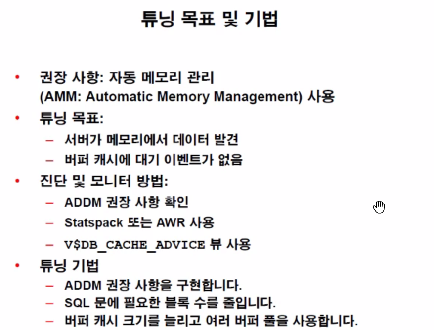
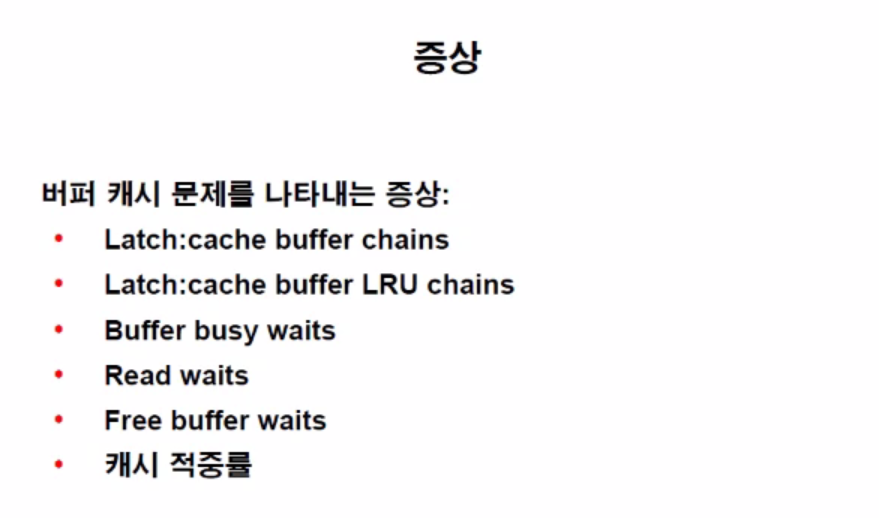
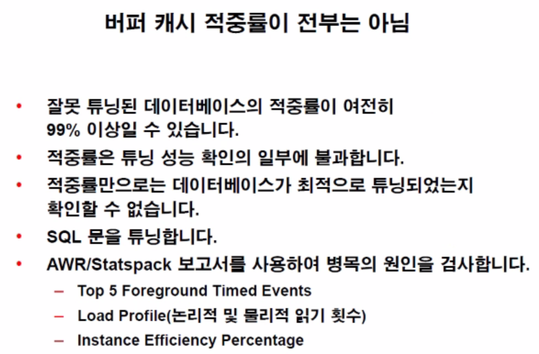
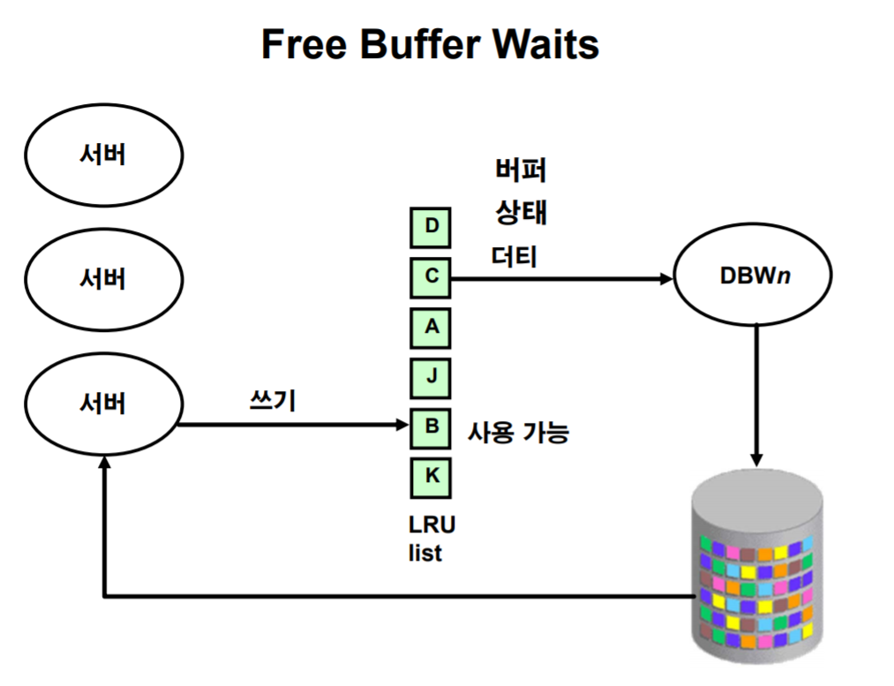
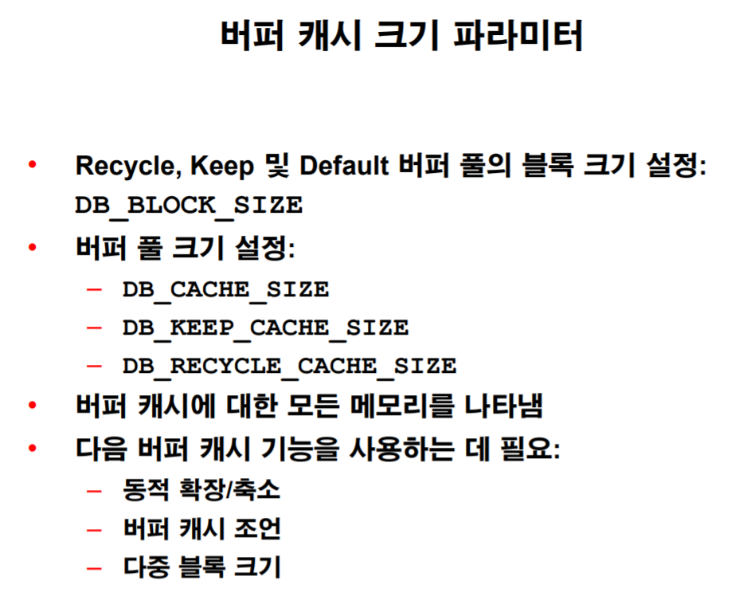
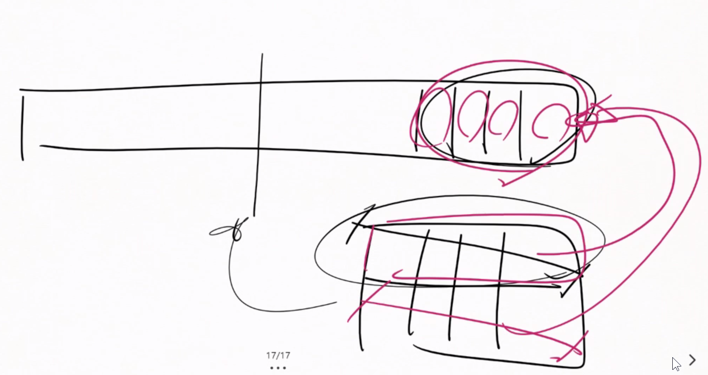
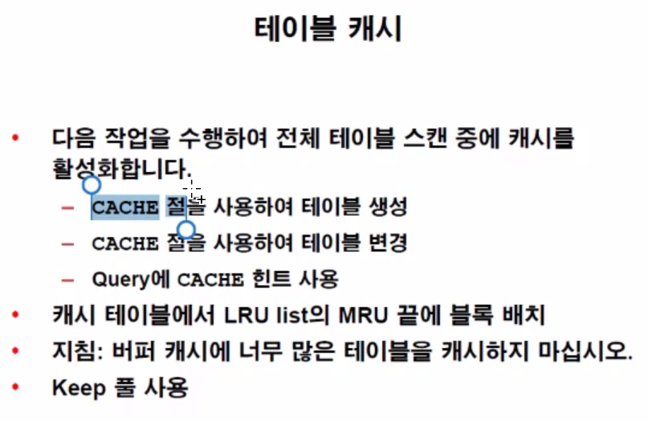
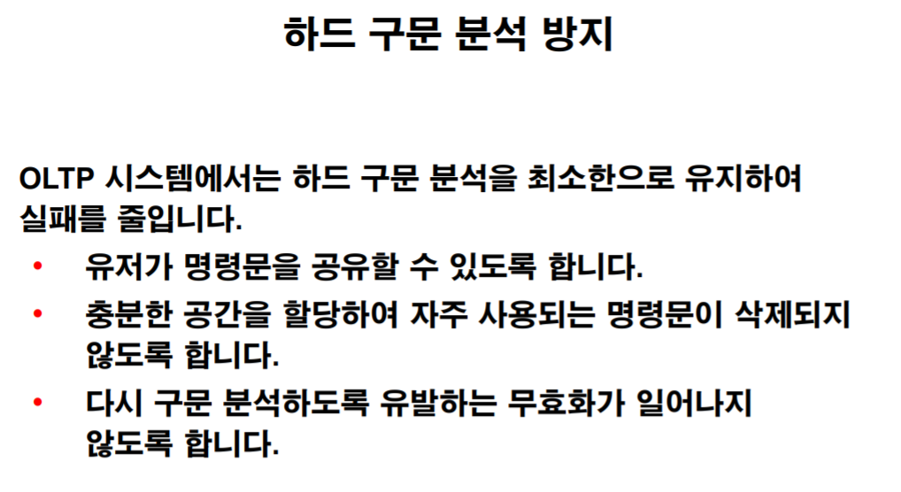

# 시나리오 해보기

Latch 이벤트

원래 조회를 할 때는 공유가 가능한 pin을 생성한다.

하지만 Update를 진행한다면 다른 Row라고하더라도 같은 블럭의 데이터를 건드린다면 구조및 복잡한 부분들이 바뀌게 된다.

아주 짧은 찰나적이라고 하더라고 그 수정이 들어가는 순간에는 온전한 읽기 쓰기 권리를 가진 pin을 획득해야 한다.

이를 대기하는것을 Buffer busy waits라 한다.

# 버퍼캐시 튜닝

일단 문장 튜닝이 우선 되어야 한다.(hit ratio의 함정)

AMM : 메모리가 많이 필요한 때와 장소를 알아서 할당해준다.

LRU LATCH를 많이 탐색한다는건 데이터를 계속 올려야함을 의미한다. 빨리 공간을 많아 줘야한다.

Read Waits :  그냥 disk i/o를 위해 대기하는 시간

Free buffer waits : buffer 디스크 i/o시 프리버퍼에 덮어쓰는 과정?? 메모리의 크기를 늘려서 해결

캐시 버퍼 체인 래치는 PCT FREE Wait을 늘려 해결도 가능하다.

용어들 한번씩 생각해볼것 Redo NoWait, In-memory Sort 가 어떠한 메모리를 크게 설정해야 해결이 될지 고민해보자.

Parse Cpu to Parse는 문장을 파싱할때도 웨잇이벤트가 발생한다는 걸 의미한다.

### READ Waits

SP는 HW에 접근을 하려면 OS에게 요청을 보내고 데이터를 받는 시간이 필요하다.(직접 HW를 읽을 수는 없다.)

- db file sequential read 
  - 시퀀스 블록 읽기

- db file parallel read 
  - 일반적인 읽기
  - 병렬작업시 대기를 위해 걸리는 시간.

- db file scattered read
  - 멀티 블록 읽기(EXTENT 한번에 읽기)
  - 한번에 여러개를 읽더라도 FREE 버퍼들이 흝어져 있다면 이를 나눠서 분배하는 시간이 필요한데 이 때 걸리는 시간을 의미한다.

LRU List를 읽어야 하는데 가장 오래된 (LRU END)쪽이 더티버퍼들이 몰려있다면 FREE BUFFER를 오랫동안 참조해야하는 시간이 걸린다.(FREE BUFER WAITS)

만약 LRU리스트의 40퍼부분을 찾았는데도 FREE BUFFER를 못 찾는다면 DBWR한테 더티버퍼를 클린 버퍼로 바꾸라는 명령을 내린다.

해결방법: 

- 버퍼캐시 크기 조절
- 캐시 객체
- keep Recycle 풀 사용
- DBWn의 쓰기 속도 높임

버퍼캐시 조언은 크기가 늘어났을 때의 예상 시간등을 알려준다.

### LRU Algorithm

만약 LRU알고리즘을 사용하면서 Full Table Scan을 작업하면 여러블럭이 다 Mid Point에 넣어야 할까??

# SHARED POOL 튜닝

shared pool에 저장되는 크기는 각각 제각각이고 DISK I/O의 효율을 생각할 필요가 없으므로 블록형태를 고수할 필요가 없다.

저장되는 크기에 따라 따로 관리를 한다.

라이브러리 캐시, 딕셔너리 캐시들은 논리적인 개념이며 물리적으로는 Shared Pool에 서로 뒤섞여서 저장이 된다.

- get requests : 요청 횟수

- pin requests : pin 시도 횟수
- Miss 이전 항목의 실패율

ex) 인덱스를 만들면 구문분석을 모두 다시 해야한다.

Adaptive 커서는 간단히 뛰어난 기능이 있다.

메모리크기는 자동관리를 사용하쟈

딕셔너리 캐시 실패가 1퍼센트가 넘는다면 메모리 크기를 늘려야 한다.

cursor_sharing = force속성을 주면 알아서 웨어절의 조건을 바인드 변수로 바꿔버린다. 따라서 같은 문장의 파싱을 여러번 할 필요가 없어진다.

##### shared pool정리

크기 자동으로 주고 실행계획 재사용 할 수 있게 바꿔주면 튜닝할 부분이 별로 없다..