sga_target() : 자동설정으로 SGA의 크기를 결정

pga_aggregate_target : 자동 관리로 모든 PGA의 합을 결정

high water mark로 사용되고 있는 데이터블록이 얼마나 차있는지 관리한다.

이를 통해 데이터를 필요한 부분만 멀티블록 I/O가 가능하다.

##### optimal한 작업. 최적화  된 작업.

소팅작업에 100mb정도 모든 데이터를 SP의 메모리에 넣고 돌리면 당연히 제일 빠르다.

##### OnePass(한번의 depth)

생각보다 소팅작업에 10mb정도의 메모리를 할당해서 디스크 작업으로 소팅을 진행해도 엄청 오래걸리지는 않는다.

sortrun이라는 부분 소팅 파일을 10개 정도 만들고 10번의 소팅을 한다.

이때 10개를 비교해서 한번의 소팅을 하고 그다음으로 큰 파일을 찾아 소팅해가며 작업을 진행한다.

총 20번

적은 메모리를 작업하고 속도도 많이 느려지지 않으므로 이를 목표로 하는 튜닝이 시행될 수 있다.

##### multi Pass(여러번의 depth)

엄청 적은 메모리(32kb)를 할당해서 진행하면 급격하게 소팅이 느려진다.

소트런이 엄청 많이 생성되고 소트런 비교를 위한 소팅할 공간 조차 모자르다면 이는 시간이 엄청 

onepass작업으로 진행되려면 데이터량을 계산을 해야하는데 이를 직접 계산하기 보다는 자동관리를 이용한다면 내부적으로 알아서 관리가 될 때가 많다.

아무리 자동으로 관리 되더라도 작업이 너무 느리다면 하드웨어적인 메모리의 증설을 고려해야 한다.

# PGA 튜닝

PGA_AGGREGATE_TARGET으로 메모리 대상을 설정 가능하다.

0mem: Optimal한 작업을 진행할 때의 예상 크기

1Mem : 1pass로 작업을 진행하는 크기의 예상 최소 크기

Used-Mem : 실제사용한 메모리(pass횟수)

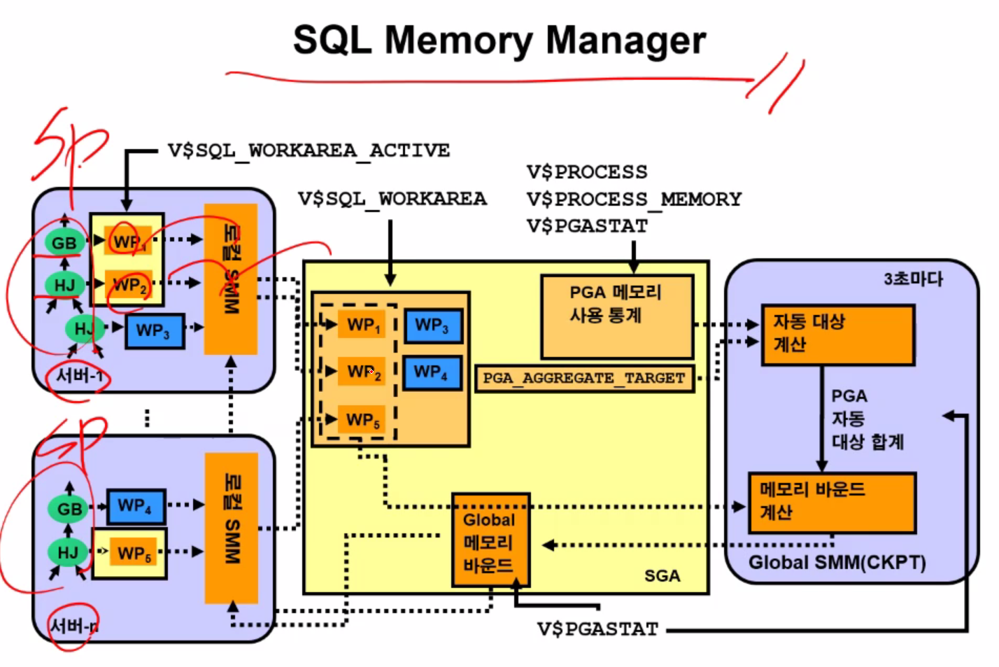

V$SQL_WORKAREA에서 각각의 sp에서 사용하는 메모리를 병합한다.

# 튜닝 요약

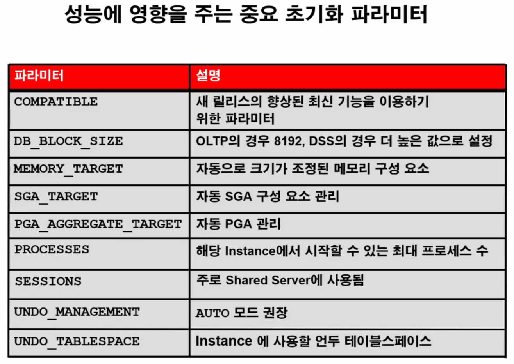

OLTP(온라인 ), DSS(의사결정)는 DB의 목적을 의미함

밤에 도는 배치성 업무는 PGA가 더 많이 돈다(왜냐하면 SGA의 영역이 줄기 때문에)

따라서 AMM에 10G를 부여해 주면 알아서 Workload가 바뀔 때 마다 사이즈를 알아서 바꾼다.

SGA라는 영역 안에는 다양한 영역들이 존재하는데 이는 SP, LP, String pool, Javapool, DB만이 AMM이 관리를 할 수 있다.

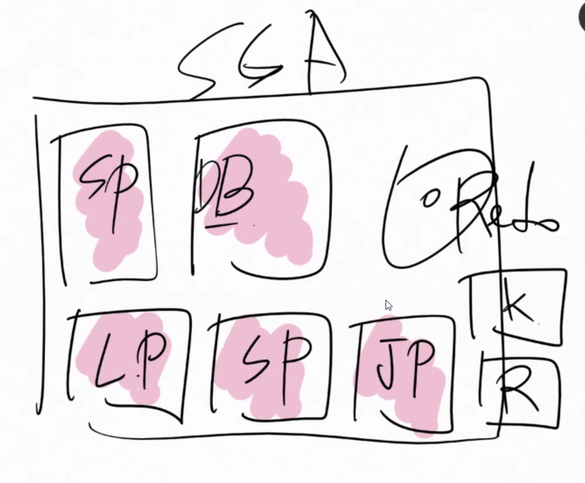

따라서 Keep, Recycle, Redo로그 버퍼 등은 변경시마다 디비를 껐다 켜야 한다.

Seesions: 연결된 세션의 개수

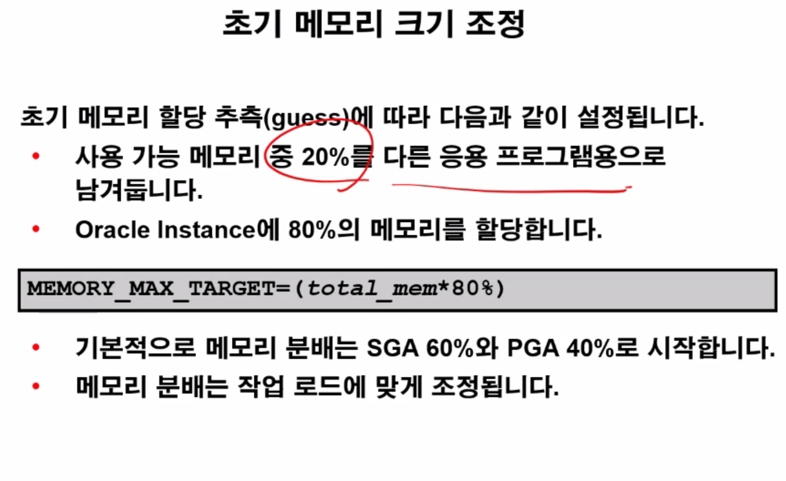

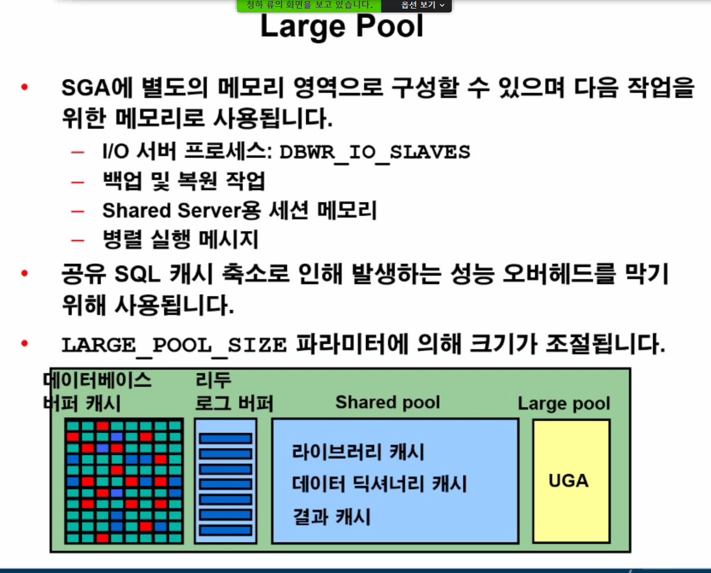

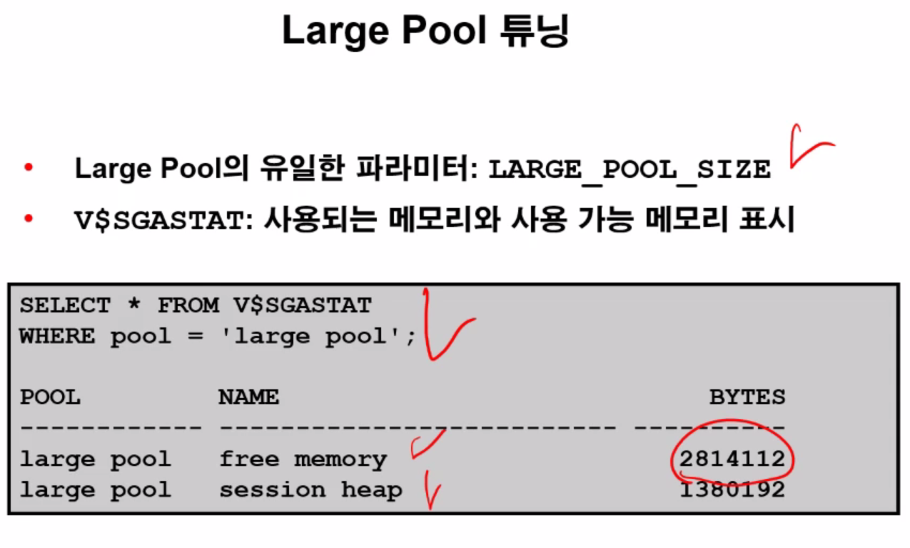

라지풀의 free memory가 어느정도 여유가 있게 크기를 설정하는 것이 중요하다.

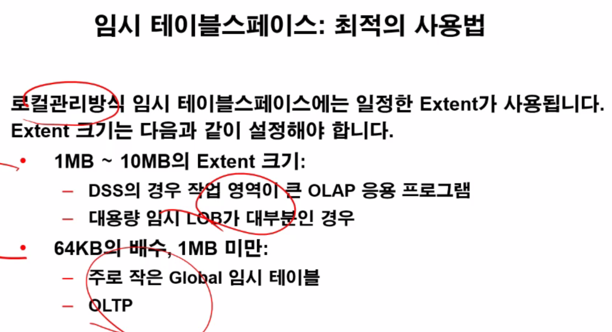

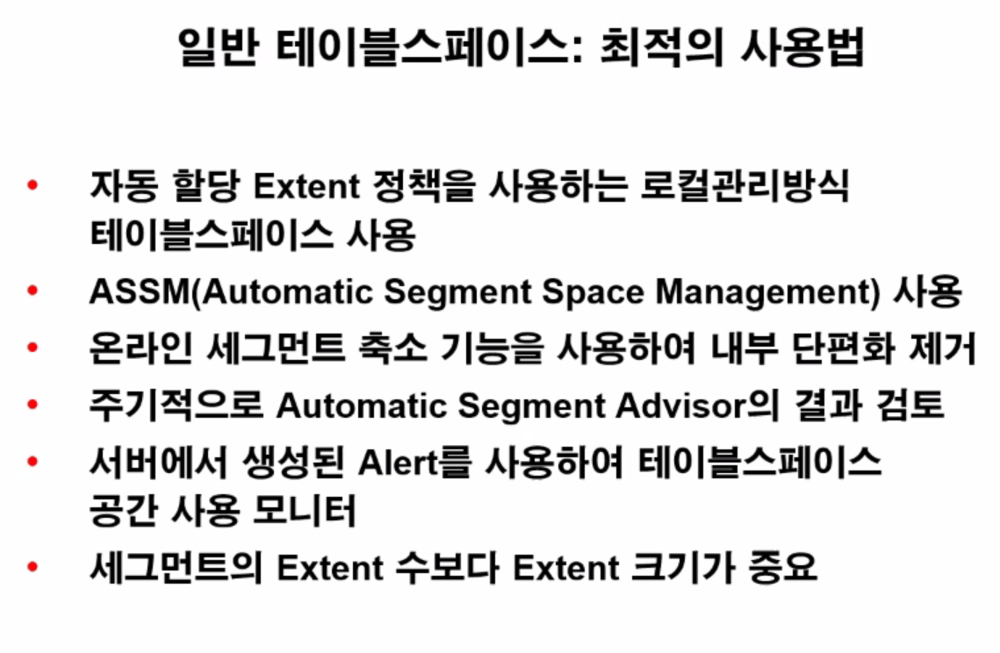

ASSM : 각각의 EXTENT와 세그먼트 헤더에서 데이터의 저장량 등을 저장하는 시스템

온라인 세그먼트 축소기능 : 조각모음같은 기능(shrink)

Automatic Segment Advisor : 언제 shrink등의 기능을 사용할 지 충고해줌

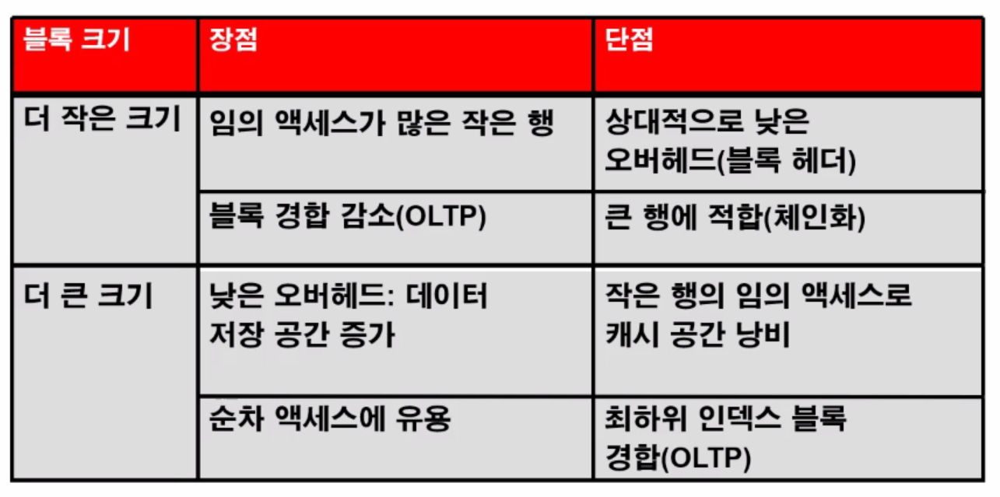

순차엑세스는 풀스캔을 의미

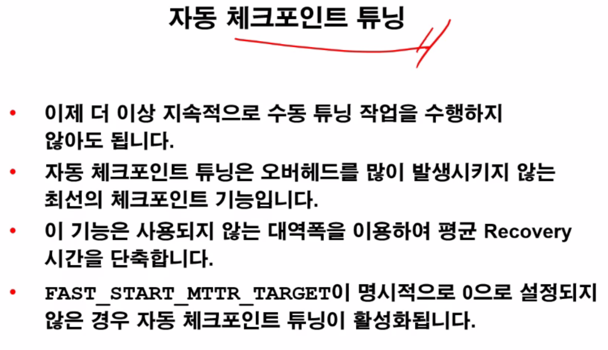

체크포인트의 종류

- Full : 전체 다 클린 만들기
- partial : 어떠한 부분만 클린 만들기
- Incremental : 특정시간마다 큐에 들어있는 순서대로 만들어주고 있기
  - 로그라이터의 70퍼 이상 채워졌을때

하지만 자동체크포인트 튜닝을 이용하자.

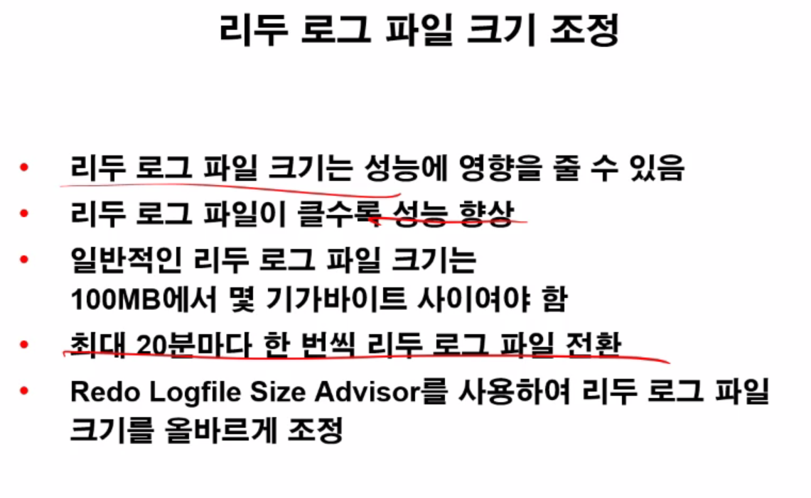

백업파일을 이중화 삼중화를 하더라도 데이터센터를 하나만 저장한다면 문제가 생긴다.

데이터가드는 지역적으로 데이터센터를 물리적으로 다르게 구축하고 그 슬레이브 DB에 로그만을 보내는 구축방법

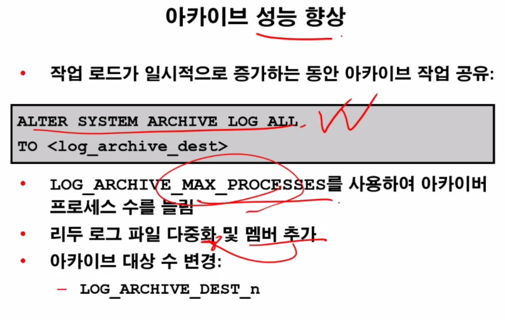

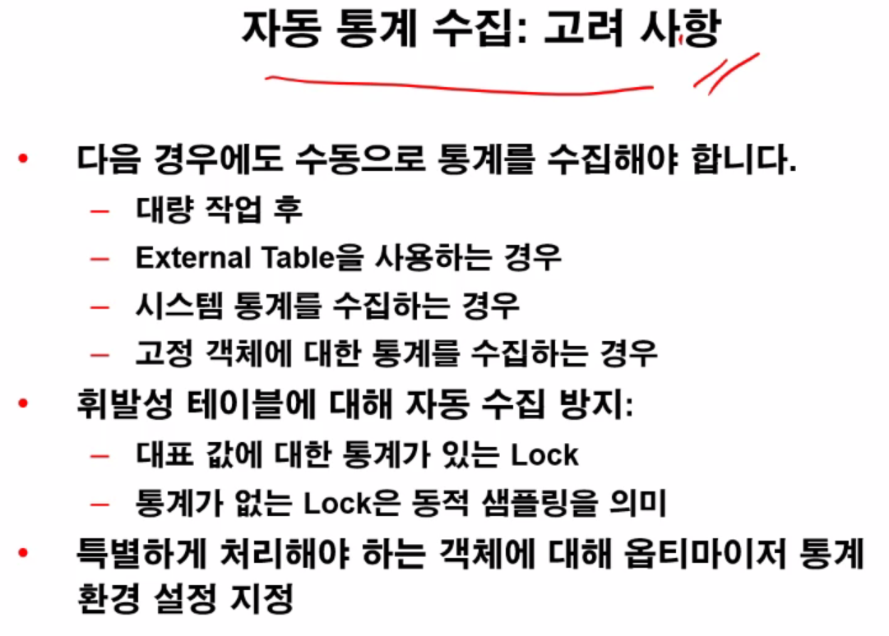

자동통계는 실제 업무에선 꺼놓는 경우도 많다.

고정객체는 딕셔너리 데이터 같은 느낌.

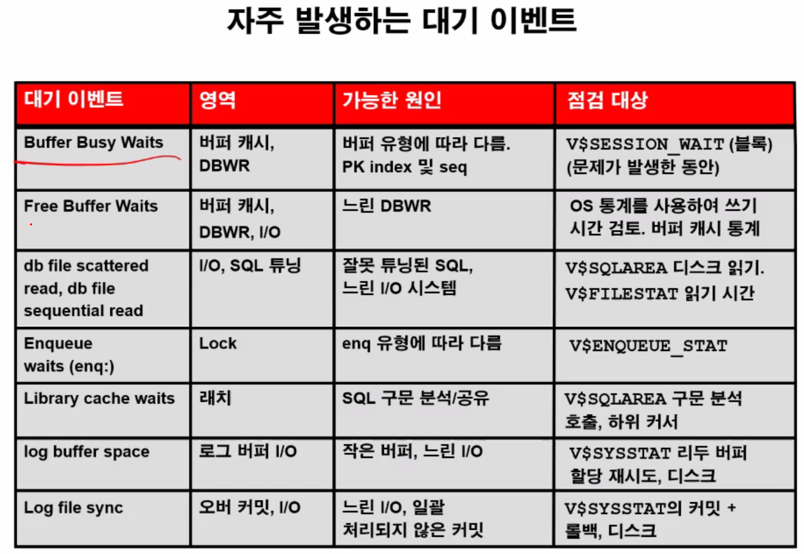

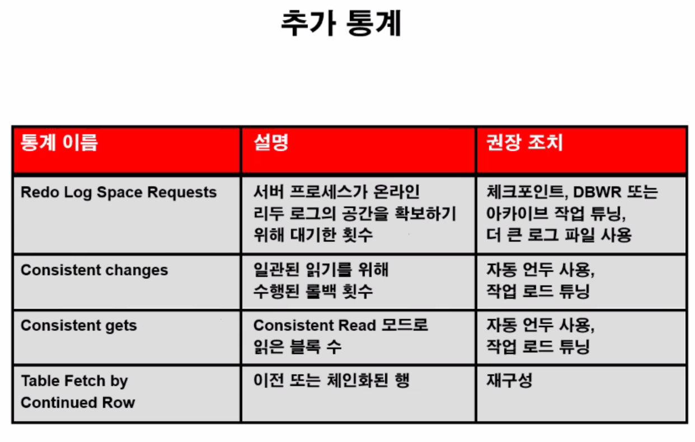