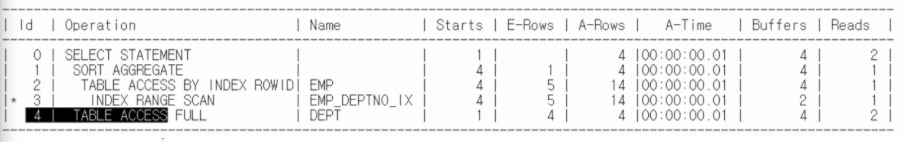

select 문장안에 있는 서브쿼리는 항상 메인 쿼리 뒤에 나와야한다.

```mysql
select d.*, (select sum(sal) 
              from emp 
              where deptno = d.deptno) 
from dept d ; 
```



3-2-1-4-0(X)

4-(3-2-1)-0 (O)

3번 2번 1번은 select 문에 들어간 서브쿼리이므로 메인쿼리가 모두 수행된 후에 실행된다.


```mysql
SELECT cust_id, cust_last_name, cust_year_of_birth, cust_city,
       (SELECT COUNT(cust_id) 
          FROM sales s
         WHERE s.cust_id = c.cust_id
           AND TO_CHAR(time_id,'YYYYMM') = '199810' ) AS CNT
 FROM customers c
 WHERE ( country_id = 52778
         AND cust_id NOT IN ( SELECT cust_id FROM sales ) )
    OR ( country_id = 52778
         AND cust_id IN ( SELECT cust_id FROM sales
                           WHERE TO_CHAR(time_id,'YYYYMM') = '199810'
                          GROUP BY cust_id
                          HAVING COUNT(cust_id) >= 10))
 ORDER BY cnt DESC, cust_id ;

----------------------------------------------------------------------------------------------
| Id  | Operation                    | Name          | Rows  | Bytes | Cost (%CPU)| Time     |
----------------------------------------------------------------------------------------------
|   0 | SELECT STATEMENT             |               |   285 |  9120 |   406   (1)| 00:00:05 |
|   1 |  SORT AGGREGATE              |               |     1 |    13 |            |          |
|*  2 |   TABLE ACCESS BY INDEX ROWID| SALES         |     1 |    13 |   108   (0)| 00:00:02 |
|*  3 |    INDEX RANGE SCAN          | SALES_CUST_IX |   130 |       |     3   (0)| 00:00:01 |
|   4 |  SORT ORDER BY               |               |   285 |  9120 |   406   (1)| 00:00:05 |
|*  5 |   FILTER                     |               |       |       |            |          |
|*  6 |    TABLE ACCESS FULL         | CUSTOMERS     |  2921 | 93472 |   405   (1)| 00:00:05 |
|*  7 |    TABLE ACCESS FULL         | SALES         |     2 |    10 |    21   (0)| 00:00:01 |
|*  8 |    FILTER                    |               |       |       |            |          |
|   9 |     HASH GROUP BY            |               |     1 |    13 |  1246   (2)| 00:00:15 |
|* 10 |      TABLE ACCESS FULL       | SALES         |  9188 |   116K|  1245   (2)| 00:00:15 |
----------------------------------------------------------------------------------------------
Predicate Information (identified by operation id):
---------------------------------------------------
   2 - filter(TO_CHAR(INTERNAL_FUNCTION("TIME_ID"),'YYYYMM')='199810')
   3 - access("S"."CUST_ID"=:B1)
   5 - filter( NOT EXISTS (SELECT 0 FROM "SALES" "SALES" WHERE LNNVL("CUST_ID"<>:B1))
              OR  EXISTS (SELECT 0 FROM "SALES" "SALES" WHERE
              TO_CHAR(INTERNAL_FUNCTION("TIME_ID"),'YYYYMM')='199810' GROUP BY "CUST_ID" HAVING
              "CUST_ID"=:B2 AND COUNT("CUST_ID")>=10))
   6 - filter("COUNTRY_ID"=52778)
   7 - filter(LNNVL("CUST_ID"<>:B1))
   8 - filter("CUST_ID"=:B1 AND COUNT("CUST_ID")>=10)
  10 - filter(TO_CHAR(INTERNAL_FUNCTION("TIME_ID"),'YYYYMM')='199810')


```

6-7-10-9-8-5-3-2-1-4-0 

`lnnvl()`함수는 nvl함수의반대같은 느낌 false일때 true로 나온다.

인덱스가 없어서, 앞에 함수가 씌워져 있어서, is null이라서 인덱스를 못 쓴다.

`/*+ gather_plan_statistics */`힌트를 이용해 메모리에 실행통계를 저장 할 수 있다.

/*


```
SELECT /*+ gather_plan_statistics qb_name(main) */ 
       cust_id, cust_last_name, cust_year_of_birth, cust_city,
       (SELECT /*+ qb_name(sub1) */ COUNT(cust_id) 
          FROM sales s
         WHERE s.cust_id = c.cust_id
           AND TO_CHAR(time_id,'YYYYMM') = '199810' ) AS CNT
 FROM customers c
 WHERE ( country_id = 52778
         AND cust_id NOT IN ( SELECT /*+ qb_name(sub2) */ cust_id FROM sales ) )
    OR ( country_id = 52778
         AND cust_id IN ( SELECT /*+ qb_name(sub3) */ cust_id FROM sales
                           WHERE TO_CHAR(time_id,'YYYYMM') = '199810'
                          GROUP BY cust_id
                          HAVING COUNT(cust_id) >= 10))
 ORDER BY cnt DESC, cust_id ;

```


tracefile 생성법

```mysql
conn user01/oracle
alter session set events '10046 trace name context forever, level 12';

SELECT /*+ gather_plan_statistics qb_name(main) */ 
       cust_id, cust_last_name, cust_year_of_birth, cust_city,
       (SELECT /*+ qb_name(sub1) */ COUNT(cust_id) 
          FROM sales s
         WHERE s.cust_id = c.cust_id
           AND TO_CHAR(time_id,'YYYYMM') = '199810' ) AS CNT
 FROM customers c
 WHERE ( country_id = 52778
         AND cust_id NOT IN ( SELECT /*+ qb_name(sub2) */ cust_id FROM sales ) )
    OR ( country_id = 52778
         AND cust_id IN ( SELECT /*+ qb_name(sub3) */ cust_id FROM sales
                           WHERE TO_CHAR(time_id,'YYYYMM') = '199810'
                          GROUP BY cust_id
                          HAVING COUNT(cust_id) >= 10))
 ORDER BY cnt DESC, cust_id ;
 
alter session set events '10046 trace name context off';

define _editor=vi
undefine trace
column trace_file new_value trace
SELECT value AS trace_file
FROM v$diag_info
WHERE name = 'Default Trace File' ;
host tkprof &trace /home/oracle/labs/output.trc sys=no
ed /home/oracle/labs/output.trc


call     count       cpu    elapsed       disk      query    current        rows
------- ------  -------- ---------- ---------- ---------- ----------  ----------
Parse        1      0.00       0.00          0          0          0           0
Execute      1      0.00       0.00          0          0          0           0
Fetch       21    213.57     214.95    9091180    9102377          0        1950
------- ------  -------- ---------- ---------- ---------- ----------  ----------
total       23    213.57     214.95    9091180    9102377          0        1950

Misses in library cache during parse: 0
Optimizer mode: ALL_ROWS
Parsing user id: 94

Rows     Row Source Operation
-------  ---------------------------------------------------
   1950  SORT AGGREGATE (cr=6439 pr=0 pw=0 time=0 us)
    316   TABLE ACCESS BY INDEX ROWID SALES (cr=6439 pr=0 pw=0 time=3998 us cost=108 size=13 card=1)
   3008    INDEX RANGE SCAN SALES_CUST_IX (cr=3906 pr=0 pw=0 time=5534 us cost=3 size=0 card=130)(object id 74939)
   1950  SORT ORDER BY (cr=9102377 pr=9091180 pw=0 time=3507 us cost=406 size=9120 card=285)
   1950   FILTER  (cr=9095938 pr=9091180 pw=0 time=214609216 us)
   2039    TABLE ACCESS FULL CUSTOMERS (cr=1456 pr=1452 pw=0 time=16810 us cost=405 size=93472 card=2921)
    106    TABLE ACCESS FULL SALES (cr=8624372 pr=8620042 pw=0 time=0 us cost=21 size=10 card=2)
     17    FILTER  (cr=470110 pr=469686 pw=0 time=0 us)
 199098     HASH GROUP BY (cr=470110 pr=469686 pw=0 time=349616 us cost=1246 size=13 card=1)
2107068      TABLE ACCESS FULL SALES (cr=470110 pr=469686 pw=0 time=5215037 us cost=1245 size=119444 card=9188)

Elapsed times include waiting on following events:
  Event waited on                             Times   Max. Wait  Total Waited
  ----------------------------------------   Waited  ----------  ------------
  SQL*Net message to client                      21        0.00          0.00
  Disk file operations I/O                        1        0.00          0.00
  direct path read                           299928        0.00         32.96
  asynch descriptor resize                      146        0.00          0.00
  SQL*Net message from client                    21        0.00          0.05

```

트레이스파일을 만들고 이를 레포트 파일로 바꾼다면 더 많은 정보 왜 성능이 떨어지는지 등을 잘 알수 있다.


1. 예상 실행계획을보고 검토한다.
2. 권한이 있다면 실행통계를 꺼내서 dbms @xplan을 이용하거나
3. trace file을 만들어 왜 느려졌는지 확인해라.


예상 답안

```mysql
CREATE INDEX custs_x01 ON customers(country_id);
CREATE INDEX sales_x01 ON sales(TO_CHAR(time_id,'YYYYMM')) ;

EXPLAIN PLAN FOR
SELECT /*+ gather_plan_statistics qb_name(main) */ 
       cust_id, cust_last_name, cust_year_of_birth, cust_city,
       (SELECT /*+ qb_name(sub1) */ COUNT(cust_id) 
          FROM sales s
         WHERE s.cust_id = c.cust_id
           AND TO_CHAR(time_id,'YYYYMM') = '199810' ) AS CNT
 FROM customers c
 WHERE ( country_id = 52778
         AND cust_id NOT IN ( SELECT /*+ qb_name(sub2) */ cust_id FROM sales 
                              WHERE cust_id IS NOT NULL) )
    OR ( country_id = 52778
         AND cust_id IN ( SELECT /*+ qb_name(sub3) */ cust_id FROM sales
                           WHERE TO_CHAR(time_id,'YYYYMM') = '199810'
                          GROUP BY cust_id
                          HAVING COUNT(cust_id) >= 10))
 ORDER BY cnt DESC, cust_id ;

--------------------------------------------------------------------------------------------------
| Id  | Operation                        | Name          | Rows  | Bytes | Cost (%CPU)| Time     |
--------------------------------------------------------------------------------------------------
|   0 | SELECT STATEMENT                 |               |   285 |  9120 |   406   (1)| 00:00:05 |
|   1 |  SORT AGGREGATE                  |               |     1 |    10 |            |          |
|   2 |   BITMAP CONVERSION TO ROWIDS    |               |     1 |    10 |    53   (0)| 00:00:01 |
|   3 |    BITMAP AND                    |               |       |       |            |          |
|   4 |     BITMAP CONVERSION FROM ROWIDS|               |       |       |            |          |
|*  5 |      INDEX RANGE SCAN            | SALES_CUST_IX |   130 |       |     3   (0)| 00:00:01 |
|   6 |     BITMAP CONVERSION FROM ROWIDS|               |       |       |            |          |
|*  7 |      INDEX RANGE SCAN            | SALES_X01     |   130 |       |    50   (0)| 00:00:01 |
|   8 |  SORT ORDER BY                   |               |   285 |  9120 |   406   (1)| 00:00:05 |
|*  9 |   FILTER                         |               |       |       |            |          |
|* 10 |    TABLE ACCESS FULL             | CUSTOMERS     |  2921 | 93472 |   405   (1)| 00:00:05 |
|* 11 |    INDEX FAST FULL SCAN          | SALES_CUST_IX |     2 |    10 |    10   (0)| 00:00:01 |
|* 12 |    FILTER                        |               |       |       |            |          |
|  13 |     HASH GROUP BY                |               |     1 |    10 |    89   (2)| 00:00:02 |
|  14 |      TABLE ACCESS BY INDEX ROWID | SALES         |  9188 | 91880 |    88   (0)| 00:00:02 |
|* 15 |       INDEX RANGE SCAN           | SALES_X01     |  3675 |       |    50   (0)| 00:00:01 |
--------------------------------------------------------------------------------------------------
Query Block Name / Object Alias (identified by operation id):
-------------------------------------------------------------
   1 - SUB1
   2 - SUB1 / S@SUB1
   8 - MAIN
  10 - MAIN / C@MAIN
  11 - SUB2 / SALES@SUB2
  12 - SUB3
  14 - SUB3 / SALES@SUB3
  15 - SUB3 / SALES@SUB3

Predicate Information (identified by operation id):
---------------------------------------------------
   5 - access("S"."CUST_ID"=:B1)
   7 - access(TO_CHAR(INTERNAL_FUNCTION("TIME_ID"),'YYYYMM')='199810')
   9 - filter( NOT EXISTS (SELECT /*+ QB_NAME ("SUB2") */ 0 FROM "SALES" "SALES" WHERE
              "CUST_ID" IS NOT NULL AND LNNVL("CUST_ID"<>:B1)) OR  EXISTS (SELECT /*+ QB_NAME ("SUB3")
              */ 0 FROM "SALES" "SALES" WHERE TO_CHAR(INTERNAL_FUNCTION("TIME_ID"),'YYYYMM')='199810'
              GROUP BY "CUST_ID" HAVING "CUST_ID"=:B2 AND COUNT("CUST_ID")>=10))
  10 - filter("COUNTRY_ID"=52778)
  11 - filter("CUST_ID" IS NOT NULL AND LNNVL("CUST_ID"<>:B1))
  12 - filter("CUST_ID"=:B1 AND COUNT("CUST_ID")>=10)
  15 - access(TO_CHAR(INTERNAL_FUNCTION("TIME_ID"),'YYYYMM')='199810')

```

1번 인덱스가 없는 애들과 함수를 사용하는 애들은 인덱스를 새로 만들어줌

2번 IS NOT NULL 처리를 해줌

예상계획은 인덱스를 사용했으므로 빠를것으로 예상된다.

실행통계를 사용해서 출력을 해본다면 생각보다 빠른 결과가 나오지 않는다.

쓸데없는 조회를 하는 sales 테이블이 많기 때문이다.

그렇다면 outer 조인을 해보자.

```mysql
SELECT /*+ gather_plan_statistics */ 
       c.cust_id, c.cust_last_name, c.cust_year_of_birth,
       c.cust_city, COUNT(s.cust_id) AS CNT
  FROM sales s,
       customers c 
WHERE c.cust_id = s.cust_id (+)
  AND c.country_id = 52778
  AND DECODE(s.cust_id,NULL,'199810',TO_CHAR(time_id,'YYYYMM')) = '199810'
GROUP BY c.cust_id,c.cust_last_name,c.cust_year_of_birth,c.cust_city
HAVING COUNT(s.cust_id) >= 10
    OR COUNT(s.cust_id)  = 0
ORDER BY cnt DESC, cust_id ;

----------------------------------------------------------------------------------------------------------------------------------
| Id  | Operation              | Name      | Starts | E-Rows | A-Rows |   A-Time   | Buffers | Reads  |  OMem |  1Mem | Used-Mem |
----------------------------------------------------------------------------------------------------------------------------------
|   0 | SELECT STATEMENT       |           |      1 |        |   1950 |00:00:05.80 |    5890 |   5883 |       |       |          |
|   1 |  SORT ORDER BY         |           |      1 |  22624 |   1950 |00:00:05.80 |    5890 |   5883 |   142K|   142K|  126K (0)|
|*  2 |   FILTER               |           |      1 |        |   1950 |00:00:05.79 |    5890 |   5883 |       |       |          |
|   3 |    HASH GROUP BY       |           |      1 |  22624 |   1967 |00:00:05.78 |    5890 |   5883 |   747K|   747K| 6734K (0)|
|*  4 |     FILTER             |           |      1 |        |   2310 |00:00:05.77 |    5890 |   5883 |       |       |          |
|*  5 |      HASH JOIN OUTER   |           |      1 |    380K|  19069 |00:00:05.72 |    5890 |   5883 |   801K|   801K| 1258K (0)|
|*  6 |       TABLE ACCESS FULL| CUSTOMERS |      1 |   2921 |   2039 |00:00:00.01 |    1455 |   1452 |       |       |          |
|   7 |       TABLE ACCESS FULL| SALES     |      1 |    918K|    918K|00:00:01.44 |    4435 |   4431 |       |       |          |
----------------------------------------------------------------------------------------------------------------------------------
Query Block Name / Object Alias (identified by operation id):
-------------------------------------------------------------
   1 - SEL$1
   6 - SEL$1 / C@SEL$1
   7 - SEL$1 / S@SEL$1
Predicate Information (identified by operation id):
---------------------------------------------------
   2 - filter((COUNT("S"."CUST_ID")>=10 OR COUNT("S"."CUST_ID")=0))
   4 - filter(DECODE(TO_CHAR("S"."CUST_ID"),NULL,'199810',TO_CHAR(INTERNAL_FUNCTION("TIME_ID"),'YYYYMM'))='199810')
   5 - access("C"."CUST_ID"="S"."CUST_ID")
   6 - filter("C"."COUNTRY_ID"=52778)

```

순서보기

예상 실행계획 만들기

실제 사용계획 꺼내기

패키지가 어떻게 어디에 저장되는지

서브쿼리 관련 힌트

SEMI JOIN, ANTI JOIN

실행계획 조정 힌트

인덱스 사용 못하는 경우

성능이 떨어지는 이유

쉐어드 풀 설명 체크

버퍼캐시 대기이벤트

튜닝 방법론

튜닝 주관식

