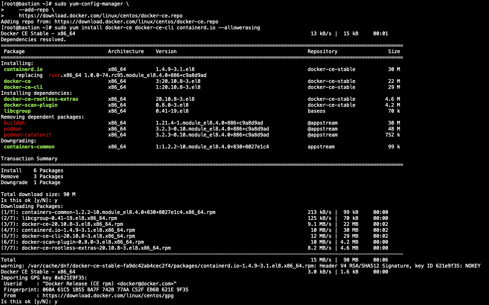
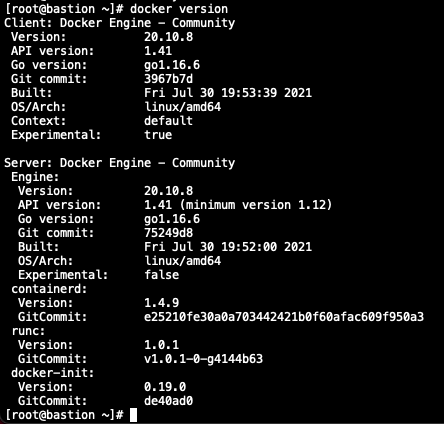

# **Docker 설치하기**

Docker는 Window, Mac, Linux에 설치할 수 있습니다.\
본 실습에서는 Linux(CentOS)에 설치하는 방법만 설명하겠습니다.\
OS 별 설치하는 방법은 아래를 참조하십시오.

- [CentOS](https://docs.docker.com/engine/install/centos/)  
- [Ubuntu](https://docs.docker.com/install/linux/docker-ce/ubuntu/)  
- [Windows](https://docs.docker.com/docker-for-windows/install/)  
- [MacOS](https://docs.docker.com/docker-for-mac/install/)

## **사전 준비**

+ CentOS 설치된 VM(Virtual Machine)  
Public Cloud 또는 로컬 PC에 VM준비  

## **Docker 설치**
Docker 설치시 root권한 필요함.(root계정이 아닌 경우 명령어 앞에 `sudo` 입력)

1. Set up the repository
```
$ sudo yum install -y yum-utils

$ sudo yum-config-manager \
    --add-repo \
    https://download.docker.com/linux/centos/docker-ce.repo

```  
2. Install Docker Engine
```
# 가이드에는 아래 명령어로 되어있음 
-> 실행하면 dependency 오류로 설치 안됨 

$ sudo yum install docker-ce docker-ce-cli containerd.io

# 아래처럼 --allowerasing 옵션 주면 podman 등 package remove 하면서 설치됨.

$ sudo yum install docker-ce docker-ce-cli containerd.io --allowerasing

```


3. Start Docker.
```
$ sudo systemctl start docker
```


4. 설치확인
```console
$ docker version
```


## **Docker 삭제**

```console
# Uninstall Docker Engine
1. Uninstall the Docker Engine, CLI, and Containerd packages:

$ sudo yum remove docker-ce docker-ce-cli containerd.io

2. Images, containers, volumes, or customized configuration files on your host are not automatically removed. To delete all images, containers, and volumes:

$ sudo rm -rf /var/lib/docker
$ sudo rm -rf /var/lib/containerd

```