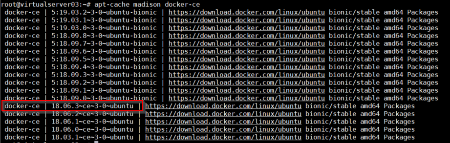
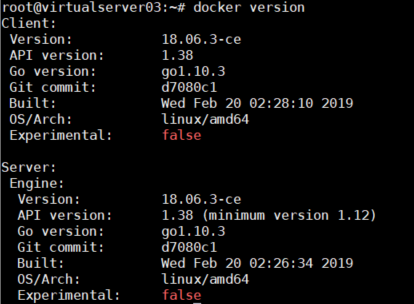

# **Docker 설치하기**

Docker는 Window, Mac, Linux에 설치할 수 있습니다.\
본 실습에서는 Linux(Ubuntu)에 설치하는 방법만 설명하겠습니다.\
OS 별 설치하는 방법은 아래를 참조하십시오.

- [CentOS](https://docs.docker.com/engine/install/centos/)  
- [Ubuntu](https://docs.docker.com/install/linux/docker-ce/ubuntu/)  
- [Windows](https://docs.docker.com/docker-for-windows/install/)  
- [MacOS](https://docs.docker.com/docker-for-mac/install/)

오프라인으로 설치하는 방법은 아래 글 참조   
[Offline설치](https://happycloud-lee.tistory.com/14?category=830565)

## **사전 준비**

+ Ubuntu 설치된 VM(Virtual Machine)  
Public Cloud 또는 로컬 PC에 VM준비  

## **Docker 설치**
Docker 설치시 root권한 필요함.(root계정이 아닌 경우 명령어 앞에 `sudo` 입력)

1. Ubuntu 업데이트  
```console
$ apt-get update
$ apt-get upgrade
```  
2. 필요한 라이브러리 설치
```console
$ apt-get install \
  apt-transport-https \
  ca-certificates \
  gnupg-agent \
  curl \
  software-properties-common

# 위와 같이 역슬래쉬를 이용하여 여러 라이브러리를 한꺼번에 설치할수도 있고 각각 설치할 수도 있음
```

3. Docker GPG Key를 추가	
```console
$ curl -fsSL https://download.docker.com/linux/ubuntu/gpg | sudo apt-key add

# Docker Repository를 접근하기 위한 인증key를 추가하는 작업
```

4. Stable repository를 추가	
```console
$ add-apt-repository "deb [arch=amd64] https://download.docker.com/linux/ubuntu $(lsb_release -cs) stable"

# Docker Repository의 정보를 갖고 오는 작업
```

5. Ubuntu 업데이트	
```console
$ apt-get update
# 라이브러리 추가후 업데이트
```

6. Docker-ce 설치	
```console
# 설치가능한 docker-ce버전 확인	
$ apt-cache madison docker-ce
# docker-ce: docker Community Edition

# version 지정해서 설치
$ apt-get install docker-ce={18.06.3~ce~3-0~ubuntu}

# latest version 설치 방법
# apt-get install docker-ce docker-ce-cli containerd.io
```
  

7. 설치확인
```console
$ docker version
```


## **Docker 삭제**

```console
# Docker-ce 엔진 삭제  
$ apt-get purge docker-ce docker-ce-cli containerd.io

# 이미지, 컨테이너, 볼륨, config 파일 등 삭제
$ rm -rf /var/lib/docker
$ rm -rf /var/lib/containerd
```