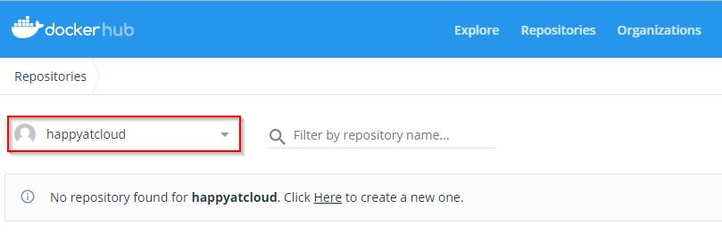
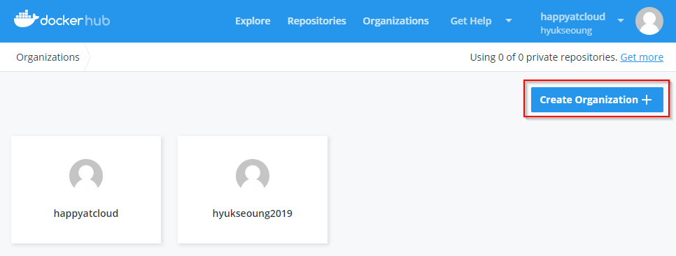

# **Registry 준비**

Docker의 기본저장소인 docker hub(https://hub.docker.com), github등의 public registry를 이용할 수도 있고, 자체적으로 registry를 구축할 수도 있습니다.

## **Private registry**
private registry를 구축하는 방법은 아래와 같이 registry 이미지를 docker hub 저장소에서 가져와서 실행만 하면 됩니다. 
private registry를 이용하는 방법은 뒤에서 실습 하겠습니다.

* docker hub registry로부터 image 가져오기
```console
$ docker pull registry
```
* registry 실행하기	
```console
$ docker run -dit --name myreg -p 5000:5000 registry
```

실제 운영환경에서는 여러명이 공통의 registry를 사용하므로 조금 더 복잡한 과정이 필요합니다.\
아래 링크를 참조하세요.
- https://novemberde.github.io/2017/04/09/Docker_Registry_0.html

## **Public registry**
 
docker 기본 registry인 docker hub를 이용하도록 하겠습니다.\
이번 장에서는 registry준비만 하고, 다음 장에서 사용하는 방법을 실습하겠습니다.

* docker hub 접근\
  웹브라우저를 띄우고 https://hub.docker.com 접근

* 회원가입\
  [Sing up for Docker Hub]버튼을 클릭하여 가입

* 로그인\
  로그인 후 상단의 “Repositories”를 클릭\
  가입시의 사용자id로 기본 organization이 생성된 것을 확인하십시오.
  
  
* 새 Organization 추가\
  상단의 [Organizations]를 클릭한 후 [Create Organization]버튼을 눌러 추가하십시오.\
  docker hub에 이미 동일 이름이 존재하면 에러 메시지가 표시됩니다.\
  생성 후에 다시 상단에서 [Repositories]를 눌러보시면, 콤보박스에 추가가 되어 있을겁니다.
  
  

