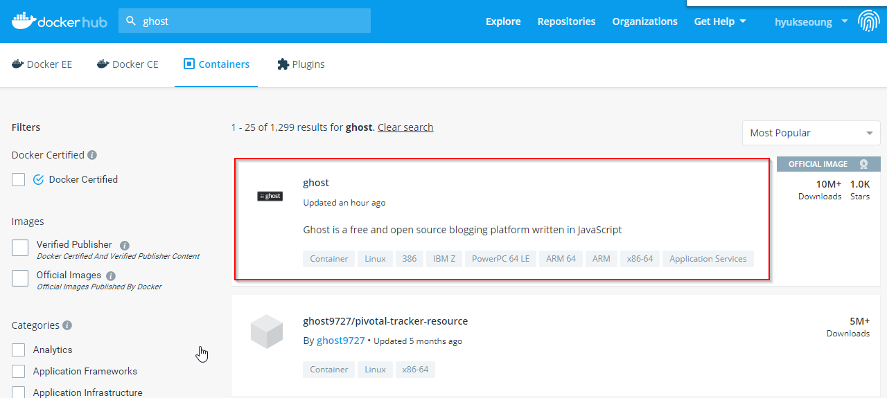
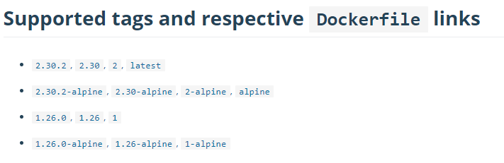
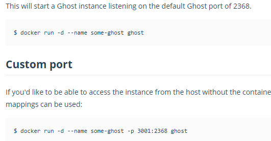
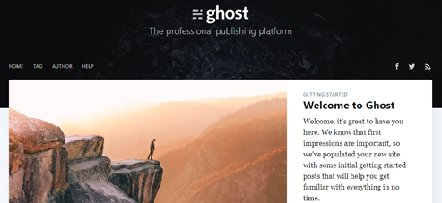
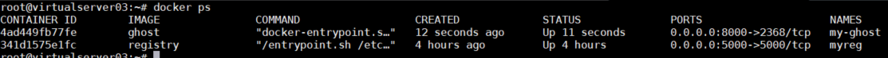
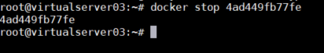
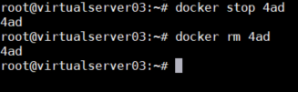

# **Image 실행**

## **기존 image가져와서 실행해 보기**

다른 사람이 image를 잘 만들어서 registry에 등록해 놓은 것을 가져다가 실행해 봅시다.

먼저 hub.docker.com에서 예제로 사용할 ghost라는 이미지를 검색해서 상세내용을 검색해 봅시다.
ghost는 블로그 플랫폼의 하나입니다.


ghost를 클릭해서 이동하면 제공하는 버전들을 볼 수 있네요. 버전은 태그값으로 지정되어 있습니다.




더 아래로 내려가면 실행하는 방법이 나와 있네요.



그럼 한번 이미지를 끌고와서 실행해 봅시다. 
위 설명에서는 이미지를 바로 실행했는데 로컬 docker host에 이미지가 없으면 자동으로 끌고 와서 실행해 주기 때문에 생략한겁니다. 우리는 순서대로 이미지를 끌고와서 실행해 봅시다.

* ghost 이미지를 로컬 Docker host로 가져오기
```console
$ docker pull ghost

# 특정 버전을 갖고 오고 싶으면 태그를 이용
$ docker pull ghost:2.25.4
```

* 컨테이너로 실행하기
```console
$ docker run -d --name my-ghost -p 8000:2368 -e url=http://169.56.75.59:8000 ghost

※ 옵션 설명
1) -- name: 컨테이너 이름
2) -p <외부접근 포트>:<컨테이너 내부 포트> : 외부접근 포트로 request가 들어오면 컨테이너 내부 포트로 port 연결을 함
3) -e <환경설정key>=<환경설정 value> : 컨테이너 내부에서 사용할 환경설정 값을 지정함. 
※ url의 ip는 본인 VM의 ip를 입력하십시오.
※ -p뒤와 url의 포트번호는 마음대로 지정하십시오.
```

* 웹브라우저에서 접근
웹브라우저를 띄우고 위에서 지정한 url로 접근해 보십시오.

 
* 실행중인 컨테이너 확인
```console
$ docker ps 
``` 



* 컨테이너 중지
```console
$ docker stop <container id> OR <container 이름>
```



```console
# docker stop 4ad 와 같이 unique하다면 id의 일부만 입력해도 됩
# docker run할 때 --name으로 이름을 부여했다면 이름으로 중지할 수 있음

$ docker stop my-ghost

# 중지된 container까지 모두 보려면 
$ docker ps -a

※ docker 명령어의 도움말은 docker <명령어> --help 로 보면 됩니다.
```

* 컨테이너 재시작
```console
$ docker restart <container id> or <container name>
$ docker restart 4ad 또는 
$ docker restart my-ghost
```
* 컨테이너 삭제\
  컨테이너를 삭제하려면 먼저 중지하고 삭제해야 합니다.
```console
$ docker stop 4ad
$ docker rm 4ad
```

