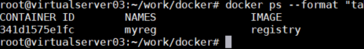
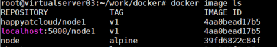
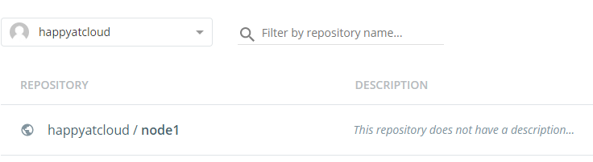
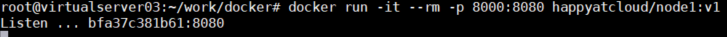
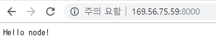
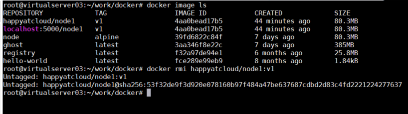
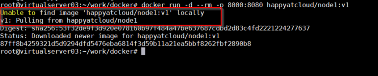
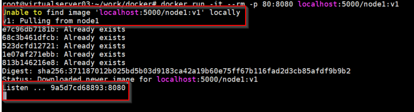
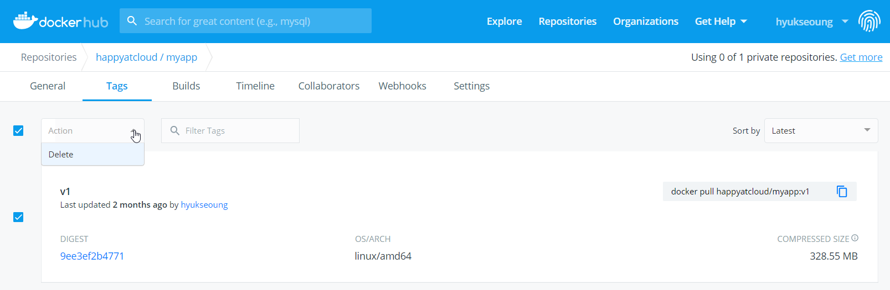

# **나만의 이미지를 만들고 실행해 보기**

여러분이 만든 응용프로그램을 이미지로 만들고, registry에 저장한 후 그 이미지를 끌고 와서 컨테이너로 실행해 봅시다. 

## **프로그램 개발**  
실습을 위해 계정의 홈디렉토리에 work 폴더를 만들고 앞으로 작성하는 파일들을 생성하도록 합니다.

```console
# 홈디렉토리 이동, work 폴더 생성 및 이동
$ cd ~
$ mkdir work && cd work

# 파일 생성
$ vi myapp.js
```
  아래와 같이 node.js로 간단한 프로그램을 작성합니다. port번호는 마음대로 바꾸셔도 됩니다. 
```javascript
var http = require('http');
var os = require('os');
var port = 8080;

http.createServer( (req, res) => {
  console.log('Requested: ' + req.url);
  res.writeHead(200, { 'Content-Type':'text/plain' });
  res.write('Hello node!');
  res.end();
}).listen(port, () => {
  console.log('Listen ... ' + os.hostname()+':'+port);
});
```
※ vi editor가 익숙하지 않은 분은 위 소스를 CTRL-C로 복사하고, 아래와 같이 vi editor창에 붙이십시오.
```
- CTRL-C 로 소스 복사
- 콘솔에서 'vi myapp.js' 입력
- ESC키 누르고 ':'입력 후 command 창에 'set paste' 라고 입력
```
 
```
- ESE키 누르고 키보드의 'I' 입력
- 우측 마우스 버튼 클릭
- 키보드의 ESC키 입력 후 ':' 입력
- 'wq'입력하여 저장하고 종료 
```

## **이미지 생성 파일 만들기**

이미지를 만들기 위해서는 이미지 생성 파일을 만들어야 합니다. 
파일이름은 마음대로 부여해도 됩니다. 이미지 만들 때 이미지 생성 파일명을 지정하고 싶지 않으면 Dockerfile이라는 이름으로 생성하십시오.

Dockerfile에 대한 설명은 아래를 참조하세요.  
 <https://docs.docker.com/engine/reference/builder/>

```dockerfile
$ vi Dockerfile
# 아래 내용을 입력하고 저장하십시오.
FROM node:alpine
COPY myapp.js .
EXPOSE 8080
CMD node myapp
```
  
 Dockerfile 구성에 대한 도움말은 아래 링크를 참조하십시오.
먼저 한글 도움말을 참고하십시오.  
 <https://rampart81.github.io/post/dockerfile_instructions/>

좀 더 자세히 알고 싶으면 docker 공식문서를 참고하세요.  
<https://docs.docker.com/engine/reference/builder/>

> RUN vs CMD vs ENTRYPOINT에 대해
>
>3개 item 모두가 컨테이너 안에 명령을 내리는 거라 헷갈릴겁니다. 
>아래와 같이 간단하게 이해하고 넘어가시면 됩니다.
>- RUN : FROM에 정의된 image를 끌고 온 후 CMD나 ENTRYPOINT 수행 전에 실행할 명령 정의. 보통 추가 라이브러리 설치 시 사용됨.
>- CMD: 컨테이너의 최초 실행을 정의. 딱 한번만 정의해야 함
>- ENTRYPOINT: 컨테이너 구동 후 실행할 명령 정의. 여러번 정의할 수 있음


## **이미지 만들기**

docker build라는 명령어를 사용합니다. 
image를 만들 때 이미지 명과 태그에 대한 규칙이 있습니다. 
규칙은 조금 이따 설명하고 일단 만들어 봅시다.

1) 로컬 registry 저장 목적으로 build하기
   - private registry가 컨테이너로 실행되고 있는지 먼저 확인합니다.  
`$ docker ps` 로 확인하면 됩니다. 
   - 아래와 같이 일부 컬럼만 나오게 할 수도 있습니다.  
`$ docker ps --format "table {{.ID}}\t{{.Names}}\t{{.Image}}"`    

   - 만약 private registry컨테이너가 중지되었다면 다시 실행하십시오. 
`$ docker ps -a`로 registry 컨테이너의 상태를 확인해 봅니다. 
   - 컨테이너가 없으면 아래 명령어로 실행시킵니다.  
`$ docker run -dit -–name myreg -p 5000:5000 registry`
   - 중지된 컨테이너가 있다면 다시 실행합니다.  
`$ docker restart myreg`
   - 이미지를 build합니다.   
`$ docker build -t localhost:5000/node1:v1 .`  


2) Public registry 저장 목적으로 build 하기    
   `$ docker build -t docker.io/happyatcloud/node1:v1 .`

 >
 > <u>build 이미지 명 규칙 설명</u>  
 >  위와 같이 이미지 명은 private registry와 public registry가 조금 다릅니다. 
 >  규칙은 아래와 같습니다. 
 >  - private registry: <private registry 주소>/<'namespace'>/<이미지명>:<태그>  
 >  - public registry: <public registry 주소>/<'organization'>/<이미지명>:<태그>
>
>   ※ docker hub registry는 public registry 주소가 docker.io인대 생략할 수 있습니다.  
>
>  `$ docker build -t happyatcloud/node1:v1 .`  
>
>   ※ 가장 단순한 형태로 '이미지명'만 줄 수도 있습니다.   
>   `$ docker build -t node1 .`   
>   registry에 푸시할때는 docker tag 명령어로 바꿔주면 됩니다.  
>   `$ docker tag node1 happyatcloud/node1:v1`
  

3) 생성된 이미지 확인  
`$ docker image ls`    
   
 위와 같이 나오면 image가 잘 만들어진 겁니다. 


## **registry에 image push 하기**  

build된 image는 로컬머신의 docker host에 생성된 겁니다.
이제 registry에 push 해 봅시다.  

1) private registry에 푸시하기  
  `$ docker push localhost:5000/node1:v1`  

2) public registry에 푸시하기. docker hub에 로그인한 후 수행합니다.  
  ```console
     $ docker login
     $ docker push happyatcloud/node1:v1
  ```
   <https://hub.docker.com>으로 접근해서 정상적으로 push되었는지 확인해 봅니다.  
    
    

## **실행하기**  
컨테이너를 실행할 때 (docker run) 사용되는 이미지를 먼저 로컬 docker host에서 찾습니다. 로컬에 없으면 지정된 image registry에서 가져 옵니다. 

1) 로컬 image를 지우지 않고 바로 실행해 봅니다.  
`$ docker run -d --rm -p 8000:8080 happyatcloud/node1:v1`
     
   브라우저를 열고 http://{VM public ip}:8000 을 입력합니다. 
아래와 같이 나오면 성공입니다.  
  
    
> ※ 실행옵션   
> -d : 백그라운드로 실행. 컨테이너 실행 후 prompt가 바로 떨어 집니다.  
>--rm: docker stop으로 컨테이너 실행을 중지하면 container를 바로 삭제 합니다.  

2) 로컬 image를 지우고, 실행해 봅니다.  
  `$ docker image ls `  
  `$ docker rmi happyatcloud/node1:v1`  
   image를 지울때는 rmi 라는 명령을 사용합니다.  

> ※ image 삭제옵션
> -f : 강제 삭제. 실행중인 image도 삭제됨. 

3) 다시 container를 실행합니다.  
이번에는 로컬 docker hub에 image가 없으므로, docker hub에서 다시 image를 가져와서 실행하는 것을 볼 수 있습니다.  
`$ docker run -d --rm -p 8000:8080 happyatcloud/node1:v1`


## **private registry 에서 image가져와서 실행하기**
```console
$ docker rmi localhost:5000/node1:v1
$ docker run -it --rm -p 80:8080 localhost:5000/node1:v1
```
  


## **docker hub image 삭제하기**

필요없는 image를 docker hub에서 삭제하는 방법

