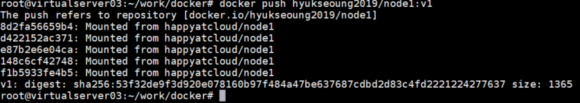
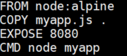
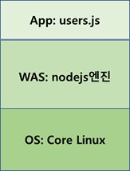
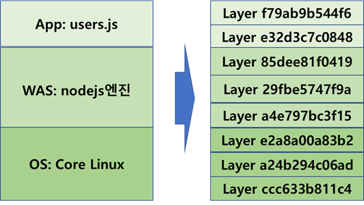
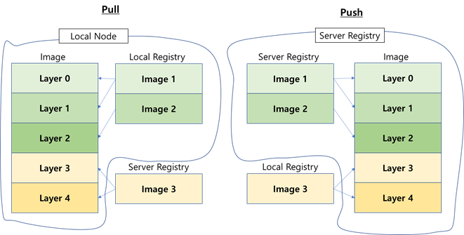
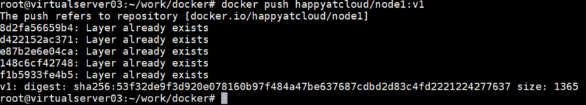

# **Image의 Layer구조 이해하기**

Registry에서 로컬 VM으로 가져온 것을 Image라고 하였습니다. 또한 그 Image위에 응용 프로그램을 제작하여 build한것도 Image입니다.  그런데 이 Image들은 내부적으로 잘게 쪼개진 layer들로 구성되어 만들어집니다. 아래는 registry로 push할때의 결과 화면입니다. 앞에 id처럼 나오는것들이 layer입니다.   
 

이 layer들의 정체는 무엇일까요 ? image를 build하는 Docker파일을 한번 봅시다.  
  
  
FROM에 명시된 node:alpine이 COPY문에 있는 user.js를 구동시켜주는 nodejs WAS입니다.   
WAS가 구동 되려면 OS가 있어야 합니다. 그래서 users-img라는 Image는 아래와 같이 구성됩니다.  
  

Core Linux는 최소한의 OS기능 수행을 위한 매우 가벼운 OS입니다. VM의 Guest OS와는 비교가 안될 정도로 매우 작은 크기입니다.  

Docker engine은 OS, WAS, App을 또 잘게 쪼갭니다. 이 잘게 쪼갠 것을 Layer라고 합니다. 어떻게 쪼개는지는 docker engine이 알아서 하는거니 알 수도 없고 사실 알 필요도 없습니다.

  

그럼 왜 이미지를 Layer로 잘게 쪼갤까요?   
**Image build, registry로의 pull/push를 빠르게 하기 위해**서 Layer로 쪼개는 것입니다.  
 
자, 그럼 이유는 이해하겠는데 어떻게 동작하길래 build, pull, push가 빨라지는 걸까요?   
  
이걸 Docker engine이 pull할때와 push할때 동작 방법으로 표현하면 아래와 같습니다.
물론 build할 때도 동일합니다. 

  

이와 같이 Image는 Image build, registry로의 pull/push를 빠르게 하기 위해서 Layer로 구성되는 것이며, 가까운 registry의 Image를 먼저 이용하는 방법으로 Layer를 구성합니다.  
실제 Image를 Push를 해 보면 아래와 같이 이미 Server registry에 있는 layer는 push하지 않는 것을 확인할 수 있습니다.  

