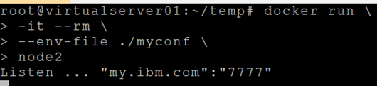

# **좀 더 알아야 할 것들**  

우리는 Registry에서 필요한 image를 갖고 와서 컨테이너를 실행하고, 내가 만든 프로그램을 image로 만들어 registry에 등록하는 것을 해 봤습니다.   

Docker에서 우리가 알아야 할 것이 뭐가 더 있을까요?  컨테이너 간의 연결까지 생각하면 복잡하니, 독립적으로 돌아가는 하나의 컨테이너에 대해서 궁금한걸 생각해 봅시다.  

간단히 생각해 보면 아래와 같은 것이 있을 겁니다. 
-	실행중인 컨테이너 안에 telnet으로 어떻게 접근할까?
-	실행중인 컨테이너의 제반 정보(CPU, Memory, IP, Port 등)를 어떻게 볼까?
-	실행중인 컨테이너의 로그를 보는 방법은?
-	실행중인 컨테이너로 파일을 복사하거나, 컨테이너 안의 파일을 가져올 수 있는가?
-	실행중인 컨테이너를 이미지로 만드는 방법은?
-	registry에 push/pull하지 않고 Image를 다른 서버로 복사할 수는 없는가? 
-	컨테이너 내부 프로그램에 환경변수를 넘기고, 프로그램에서 이용하는 방법은?

이번장에서는 간단한 궁금증만 해결하고, 좀 더 복잡한 기능들은 다음장에서 알아 봅시다.  
이미지명이 너무 길어 tag명령어로 이미지에 태그를 달아 사용하겠습니다.  
`$ docker tag happyatcloud/node1:v1 node1`

## **컨테이너 접근**  
우리가 만든 myapp.js 을 다시 실행하고, 그 컨테이너 안으로 들어가 봅시다.  
`$ docker run -d --rm --name myapp -p 80:8080 node1`  
-d : 백그라우드로 실행. foreground 실행시에는 -it 옵션 사용  
--rm: 컨테이너를 중지하면 컨테이너를 바로 삭제 시킴  

`$ docker exec -it myapp /bin/sh`  
exec라는 명령은 컨테이너에게 어떤 명령을 내리는 겁니다. 이를 응용하여 sh 쉘을 실행시키는 방법을 쓰면 됩니다.   
-it : interactive & tty옵션을 주지 않으면 컨테이너 안에 접근이 안됩니다.  
아래와 같이 단순히 파일 리스트만 보려면 -t 옵션만 주어서 terminal로 결과를 내보내게만 하시면 됩니다.  
`$ docker exec -t myapp ls -al `  

※ docker attach myapp과 같이 attach명령어를 이용하는 방법이 있는데 생각처럼 동작하지 않기도 하고 컨테이너가 종료되는 문제도 있어 exec명령어를 쓰는게 일반적이다.  

## **컨테이너 정보 보기**  
`$ docker inspect myapp `  
inspect명령은 컨테이너 뿐 아니라, 모든 docker 객체유형(image, network, volume등)의 정보를 볼 때 사용할 수 있습니다.  

## **컨테이너 로그 보기**  
`$ docker logs myapp`  
`$ docker logs -f -t myapp`  
실시간으로 콘솔로그를 터미널에 보여줍니다. 

`# docker logs --tail 10 myapp `  
가장 최신 10줄을 보여줍니다.

Log파일 위치는 아래와 같이 확인하시면 됩니다.  
`# docker inspect myapp | grep LogPath`


## **컨테이너와 파일 Pull/Push**  
- 컨테이너로 파일 복사  
  `$ docker cp <소스파일경로> <컨테이너ID OR 컨테이너명>:<타겟파일경로>` 

  
- 컨테이너 안의 파일 가져오기  
  `$ docker cp <컨테이너ID OR 컨테이너명>:<소스파일경로>  <타겟파일경로>`  

   

## **실행중인 컨테이너 이미지로 만들기**  
`$ docker commit myapp hellonode-copy`  
컨테이너를 hellonode-copy라는 이미지를 복사하여 만듭니다.  


## **Image를 다른 서버로 복사**  
인터넷이 안되거나, registry를 사용할 수 없을때는 압축파일로 만들어서 Export하고 Import하는 방법을 사용할 수 있습니다. 
- 이미지를 하나의 압축파일(tar)로 만듭니다.  
`# docker save <이미지명> -o <압축파일경로>`  
  
  
- 압축파일을 적절한 방법으로 다른 서버로 복사합니다.
- 복사된 다른 서버에서 압축파일을 이용하여 이미지를 만듭니다.  
`# docker load -i <압축파일경로>`  
 
  

**docker export / import**   
또 다른 방법은 export / import를 이용하는 방법이 있는데 이 방법은 현실에서는 거의 쓸 일이 없을 듯 합니다.  
- 사용하는 경우: 컨테이너안의 OS, WAS등을 한 덩어리로 만들어서 이미지를 만들고 싶은 경우.  
이미지는 그 안에 있는 OS, WAS, 소스 등을 Docker가 알아서 여러개의 Layer로 쪼개서 만들어 집니다. Image를 만들 때 이미 있는 layer는 그대로 쓰고 변경된 layer(보통 프로그램 소스)만 변경하면 되기 때문입니다.  특수한 경우에 이렇게 쪼개진 layer를 한개의 layer로 묶고 싶을 때 export 명령어를 사용합니다.  
- 사용 방법: export는 Image가 아니라 container를 이용하여 만듭니다.  
`# docker export <Container ID 또는 Container명> -o <압축파일 경로>`  
`# docker export myapp -o ./myapp-copy.tar`
- Import 방법  
`# docker import -i <압축파일경로> <이미지명>`  
`# docker import -i ./myapp-copy.tar mynode:v2`  
- 주의사항: export 명령어로 만들어진 압축파일에는 이미지를 build할 때 정의한 CMD, ENV, ENTRYPOINT가 사라져서 만들어집니다. 따라서 import한 이미지를 실행해도 제대로 동작하지 않습니다. docker run할 때 옵션으로 지정해 줘야 동작합니다. 

**save와 export의 압축파일 구조 차이 예**  
압축을 해제해 보면 아래와 같이 save는 layer구조가 유지되는데, export는 한개 layer로 합쳐진것을 확인할 수 있습니다.  
<docker save로 압축한 파일>  
   

<docker export로 압축한 파일>  
   


## **환경변수 이용하기**  
- myapp.js를 복사하여 myapp2.js를 만듭니다.  
`# cp myapp.js myapp2.js`
- myapp2.js를 아래와 같이 변경합니다.  
node.js에서 환경변수값은 process.env.<변수명>으로 가져옵니다.  
java에서는 System.getenv(<변수명>)을 이용하면 됩니다.
```javascript
$ vi myapp2.js
var http = require('http');
var os = require('os');
var host = process.env.HOST;
var port = process.env.PORT;
if(host == "") host = os.hostname();
if(port == "") port = 8080;

http.createServer( (req, res) => {
  console.log('Requested : ' + req.url);
  res.writeHead(200, { 'Content-Type':'text/plain' });
  res.write('Hello node!');
  res.end();
}).listen(port, () => {
  console.log('Listen ... ' + host+':'+port);
});
```
- myapp2를 build할 Docker file을 만듭니다.  
```dockerfile
$ cp Dockerfile Dockerfile2
$ vi Dockerfile2

  FROM node:alpine
  COPY myapp2.js .
  EXPOSE 8080
  CMD node myapp2
```  
- image로 빌드 합니다. build할 때 사용할 파일을 -f 옵션으로 지정합니다.  
`$ docker build -f Dockerfile2 -t node2 . `
- myapp2를 실행하면서 -e 옵션을 이용하여 변수값을 넘깁니다.  
`$ docker run -it --rm -e HOST=abc.com -e  PORT=8888 node2`  
  
   build용 Dockerfile2 안에서 지정할 수도 있습니다. ENV라는 item으로 지정하면 됩니다. 만약 Dockerfile과 docker run에서 동일한 이름으로 변수값을 지정하였다면, docker run할때 지정한 값이 적용 됩니다.  
   

* 환경변수가 많은 경우 환경설정 파일을 지정할 수도 있습니다.  
`$ vi myconf`   
  
실행 시 --env-file을 이용합니다.  
   

* 참고로 java에서 사용 예제는 아래와 같습니다.  
   
 

