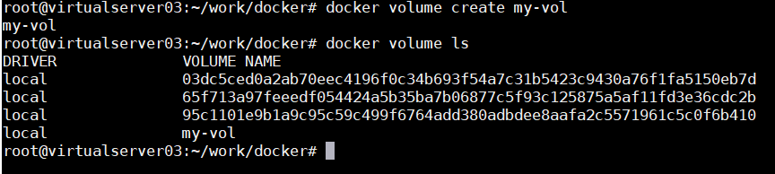

# **More Advanced (네트워크, Volume, 컨테이너 간 연결)**  
지금까지 설명한것만 이해하셔도, 쿠버네티스를 배우는데 큰 문제가 없습니다.  
하지만 이왕 시작한 거 조금 깊게 들어가 봅시다.  

## **Network**  
실행되는 컨테이너의 네트워크 설정에 대한 부분이며, `docker run`할때 `--net` 옵션으로 지정합니다.  
지정할 수 있는 값에는 4가지 종류가 있는데 용도만 이해하시고, 자세한건 <https://bluese05.tistory.com/38>을 참조하십시오.  

종류|설명|
|---|---|
|bridge(Default) |	컨테이너와의 통신에 docker 기본 네트워크 방식을 사용|  
|host | 컨테이너와의 통신에 HOST 네트워크를 그대로 사용  |
|container  | 컨테이너와의 통신에 다른 컨테이너 네트워크를 사용|
|none |	컨테이너와의 통신 없음 (단, 컨테이너 안에서 네트워크 설정을 수동으로 구성하여 통신을 가능하게는 할 수 있음)|

## **Volume : 공유 데이터 공간**  
여러 컨테이너가 동일한 데이터 공간을 이용해야 하는 경우가 많을 겁니다.  

예를 들어 전역변수나 전역 환경설정 파일을 여러 컨테이너가 공유하거나, 각 컨테이너의 로그를 동일한 디렉토리에 Write하고자 할 수 있습니다.  

Volume은 컨테이너 내부에서 참조하는 HOST 데이터 공간입니다.  

Volume을 사용하는 방법은 3가지가 있는데, Volume 사용 방식을 사용하시고 나머지 방식은 이해만 하십시오.  
  

|종류|특징|
|---|---|
|volume |- HOST에 volume 객체를 생성하여, 컨테이너 안의 디렉토리로 mount함 - HOST의 volume은 사용하는 컨테이너만 접근할 수 있음|
|bind mount|- HOST의 특정 디렉토리를 컨테이너 안의 디렉토리에 mount함 - HOST의 특정 디렉토리는 권한이 있으면 아무나 읽고 쓸 수 있음|
|tmpfs|- HOST의 메모리를 volume으로 이용하는 방식|

좀 더 자세한 설명은 아래 링크를 참조하세요.  
[Volume을 활용한 Data 관리](https://medium.com/dtevangelist/docker-%EA%B8%B0%EB%B3%B8-5-8-volume%EC%9D%84-%ED%99%9C%EC%9A%A9%ED%95%9C-data-%EA%B4%80%EB%A6%AC-9a9ac1db978c)  

volume 사용법은 아래와 같습니다.

|작업|설명|
|---|---|
|volume 생성|`$ docker volume create <volume 명> ` `$ docker volume create my-vol` `$ docker volume ls`    실제 어느 HOST의 어느 디렉토리인지는 docker inspect로 보면 됩니다. `$ docker inspect my-vol`   |
|container실행하면서 volume 정의|`# docker run -d --rm --name voltest \` `--mount source=my-vol,target=/volume \` `happyatcloud/node1:v1` `$ docker exec -it voltest sh`    위와 같이 container 내에 volume이라는 디렉토리로 마운트되었습니다.     -v 옵션을 이용하여 HOST의 특정 디렉토리를 컨테이너에 마운트 시키는 방법도 있는데 DOCKER공식문서에서 --mount 옵션을 사용할 것을 권고하고 있어, 사용하지 마시기 바랍니다. |
|테스트|컨테이서 안에 mount된 'volume'디렉토리에 파일을하나 생성합니다.      `# exit` `$ docker inspect my-vol` exit로 컨테이너를 빠져 나온후, 'my-vol' volume의 물리적 위치를 docker inspect로 확인합니다.     컨테이너 안에 생성한 파일이 동일하게 my-vol 디렉토리에 생성된것을 볼 수 있습니다.   |
|기존의 컨테이너의 volume 공유하기| voltest 컨테이너의 /volume 디렉토리를 새로운 컨테이너에서 동일하게 공유할 수도 있습니다. `# docker run -d --rm --name voltest2 \` `--volumes-from voltest \` `happyatcloud/node1:v1`  아래와 같이 새로운 컨테이너 'voltest2'도 동일하게 '/volume'디렉토리가 마운트 되었고, 동일한 파일을 공유함을 확인할 수 있습니다.   |
|사용하지 않는 volume삭제|컨테이너가 종료되어도 volume이 자동으로 삭제되지는 않습니다. 다른 컨테이너가 사용할수 도 있으니까요. docker volume rm으로 특정 volume을 지울 수 있습니다.  사용되지 않는 모든 volume을 지울땐 prune 명령을 이용하십시오. docker stop으로 정지한 컨테이너에서 사용하는 volume은 삭제 되지 않습니다. `$ docker volume prune`  |
 

  별도의 파일 서버(NAS, SAN disk 등)의 데이터공간을 공유하는 방법이 있긴 한데, 굳이 모르셔도 될 것 같습니다. 왜냐하면 쿠버네티스에서 더 나은 방법을 제공하기 때문입니다.  

 
## **컨테이너 간 연결**  

컨테이너 간에는 기본적으로 서로 연결이 안되어 있습니다.  
아래와 같이 net1컨테이너에서 net2 컨테이너로 접근할 수가 없습니다.  
 
   

컨테이너끼리 어떻게 네트워크를 연결할지를 생각해 보겠습니다.   

이해를 쉽게 하기 위해 컨테이너 하우스를 다시 생각해 봅시다.  

여러분이 컨테이너 하우스를 갖고 캠핑장에 갔습니다. 만약 왼쪽 그림처럼 직접 물탱크를 찾아 연결해야 한다면 많이 귀찮고 힘들겁니다. 오른쪽 그림처럼 물탱크를 연결해 주는 사람이 있다면 여러분은 그 사람에게 요청만 하면 됩니다.  

  

docker에서 컨테이너 간에 연결할 때는 직접 연결할 수도 있고, network이라는 중계자 객체를 만들어서 연결할 수도 있습니다. 하지만 직접 연결하는 방식은 곧 없어질것이기 때문에 우리는 network객체를 통한 연결방식만 배우도록 하겠습니다.  

참고로 직접 연결하는 방식은 `docker run` 옵션에 `--link` <대상컨테이너명>의 형태로 사용합니다.

  
|작업|	특징|
|---|---|
|network 객체 만들기|`# docker network create myip` `$ docker network ls`  |
|컨테이너를 실행하면서 network 객체 를 이용하여 컨테이너간 연결|`--net` 옵션에 network객체명을 지정합니다.  |
|테스트	|  |
|network 삭제|volume 삭제와 동일한 기능이 제공됩니다. `$ docker network rm ip1 ip2` `$ docker network prune ` |  

  
  ## **실습하기**  
지금까지 배운걸 이용해서 블로그 사이트를 만들어 보겠습니다.  

  

Dockerfile 작성 정보
1) mywp 컨테이너  
Image명은 wp-img로 하십시오.

|항목|	특징|
|---|---|
|registry Image|wordpress|
|환경설정값|WORDPRESS_DB_HOST=sqldb:3306 WORDPRESS_DB_USER=wordpress WORDPRESS_DB_PASSWORD=wordpress WORDPRESS_DB_NAME=wordpress|

2) sqldb 컨테이너  
Image명은 spqdb-img로 하십시오.  

|항목|	특징|
|---|---|
|Registry Image|mysql:5.7|
|환경설정값|MYSQL_ROOT_PASSWORD=password MYSQL_DATABASE=wordpress MYSQL_USER=wordpress MYSQL_PASSWORD=wordpress|

※ docker run 할때 주의사항: sqldb 컨테이너를 먼저 실행하고, mywp 컨테이너를 실행하십시오.  

자 그럼, 직접 해 보시기 바랍니다.   

언어선택 --> 계정등록 --> 로그인 후 아래와 같이 나오면 성공입니다. 

