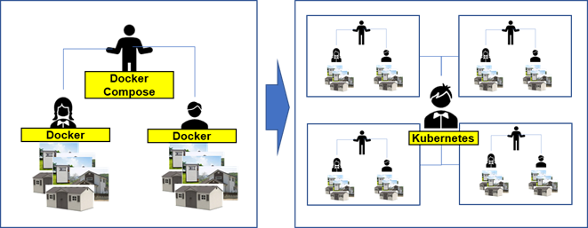
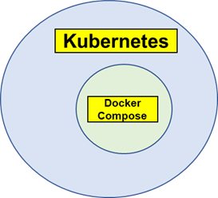
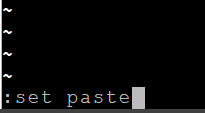
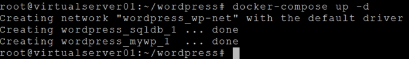
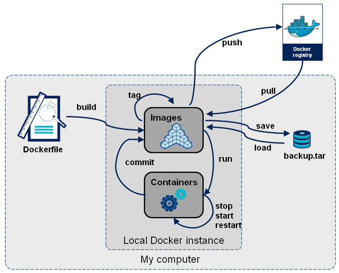

# **Docker Compose**  


지금까지는 적은 수의 컨테이너를 갖고 서비스하는 방법을 배웠습니다.  

하지만, 실제 운영환경에서는 훨씬 많은 수의 컨테이너를 갖고 서비스와 운영을 해야 합니다.  

그래서 나온 것이 docker compose, kubernetes입니다..   

 
## **Docker vs Docker compose vs Kubernetes**  


**Docker compose**는 **한 지역의 Container 관리자**로 생각하시면 되고,   
**Kubernetes**는 **여러 지역의 컨테이너 관리자**로 생각하시면 됩니다.  

IT용어로 다시 정의하면 **Docker compose는 단일 HOST컨테이너 관리자이고, Kubernetes는 멀티 HOST 컨테이너 관리자**입니다.  

여기서 HOST란 물리적인 머신 또는 가상머신(VM:Virtual Machine)을 의미합니다.  
kubernetes와 유사한 기능을 제공하는 것이 **Docker Swarm**입니다. 하지만 점점 더 kubernetes를 많이 사용하고 있기 때문에 Docker swarm은 Kubernetes와 유사한 거라고만 알고 계시면 됩니다.  

  

기능상으로 보면 아래와 같이 Kubernetes가 Docker compose의 모든 기능을 갖추고 있습니다.  
 
  

따라서 Kubernetes만 아시면, 굳이 Docker compose까지 아실 필요는 없습니다.   
docker compose는 word press 예제를 갖고 간략하게 짚고 넘어가겠습니다.  


## **Docker compose**  

1) Docker compose 설치  
```console
$ curl -L "https://github.com/docker/compose/releases/download/<버전>/docker-compose-$(uname -s)-$(uname -m)" -o /usr/local/bin/docker-compose
$ chmod +x /usr/local/bin/docker-compose
```
버전은 여기를 참조 -> <https://github.com/docker/compose/tags>  

```console
ex) 
$ sudo curl -L "https://github.com/docker/compose/releases/download/1.29.2/docker-compose-$(uname -s)-$(uname -m)" -o /usr/local/bin/docker-compose

```

2) build & 실행 파일 작성  
docker compose는 build와 run에 대한 전체 설정을 yaml(야믈)파일로 관리합니다.  
아래는 word press를 위한 yaml 파일 예제입니다. 내용을 복사하여 vi 에디터안에 붙여 넣으십시오.  
docker compose의 기본 파일명은 docker-compose.yml입니다.  
* vi editor에 붙이실 때 command 창에서 'set paste'실행 후 해야 들여쓰기가 제대로 됩니다.


  


`$ vi docker-compose.yml  `  
~~~
version: '3.5'
services:
  sqldb:
    image: mysql:5.7
    volumes:
      - type: volume
        source: wp-vol
        target: /var/lib/mysql
    networks:
      - wp-net
    restart: always
    environment:
      MYSQL_ROOT_PASSWORD: password
      MYSQL_DATABASE: wordpress
      MYSQL_USER: wordpress
      MYSQL_PASSWORD: wordpress
  mywp:
    image: wordpress
    networks:
      - wp-net
    restart: always
    environment:
      WORDPRESS_DB_HOST: sqldb:3306
      WORDPRESS_DB_USER: wordpress
      WORDPRESS_DB_PASSWORD: wordpress
      WORDPRESS_DB_NAME: wordpress
    ports:
      - "8081:80"
    depends_on:
      - sqldb

volumes:
  wp-vol:
networks:
  wp-net:
~~~  

3) 컨테이너 실행  
  `$ docker-compose up -d`
 
  

- docker-compose up : image build 후 container 실행
- docker-compose create: image build만 수행
- docker-compose start: container 실행
* -d : 백그라운드로 실행  


4) 웹 브라우저에서 확인  
  http://{VM IP}:8081 로 접근 시 언어선택 페이지가 나오면 됩니다.  
  언어선택 --> 환경설정 --> 로그인 후 제대로 초기 페이지가 나오는 지 확인합니다.  


5) 컨테이너 종료  
  `$ docker-compose down`
- docker-compose down : container 종료 및 container 삭제
- docker-compose stop : container 종료만 수행
- docker-compose rm : 종료된 container 삭제


## **Summary**  

Docker에 대해 아래 과정을 학습하였습니다.  

- 1장 Docker 설치하기: Docker를 Linux에 설치
- 2장 Registry 준비: Private registry와 Public registry인 docker hub 사용법 이해
- 3~6장 image: 기존 image를 이용한 container실행과 새로운 Image build 및 실행
- 7장 Network & Volume: Network, Volume, 컨테이너간 연결 방법을 이해하고 word press 제작 실습
- 8장 Docker Compose: docker-compose를 이해하고 Docker compose로 word press 제작 실습


