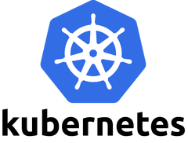
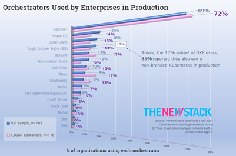
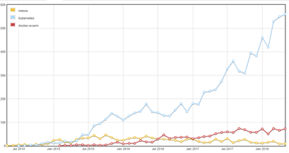
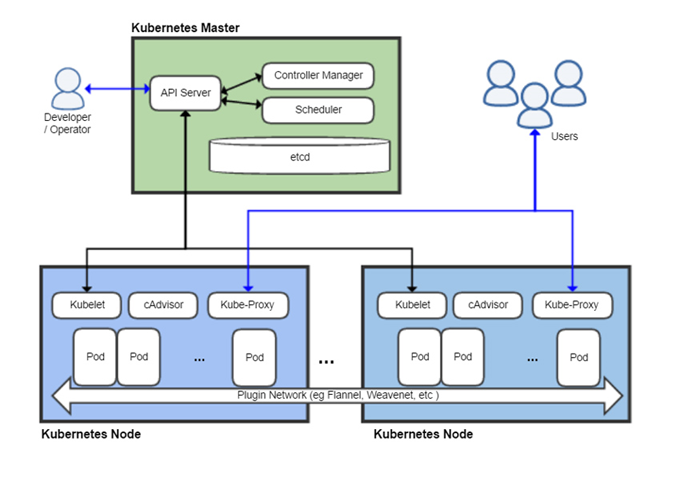
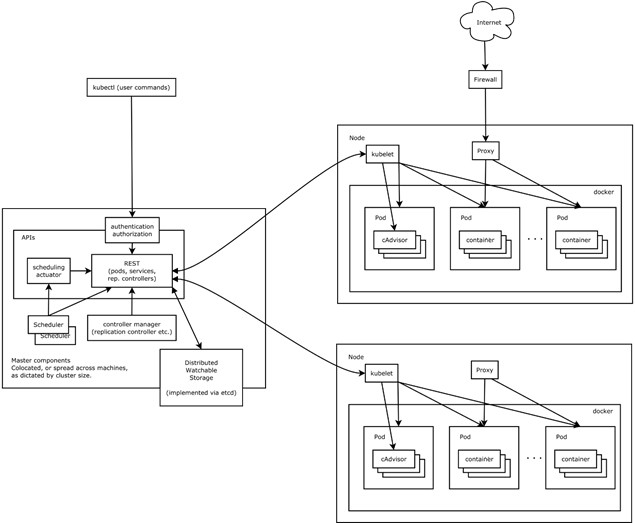
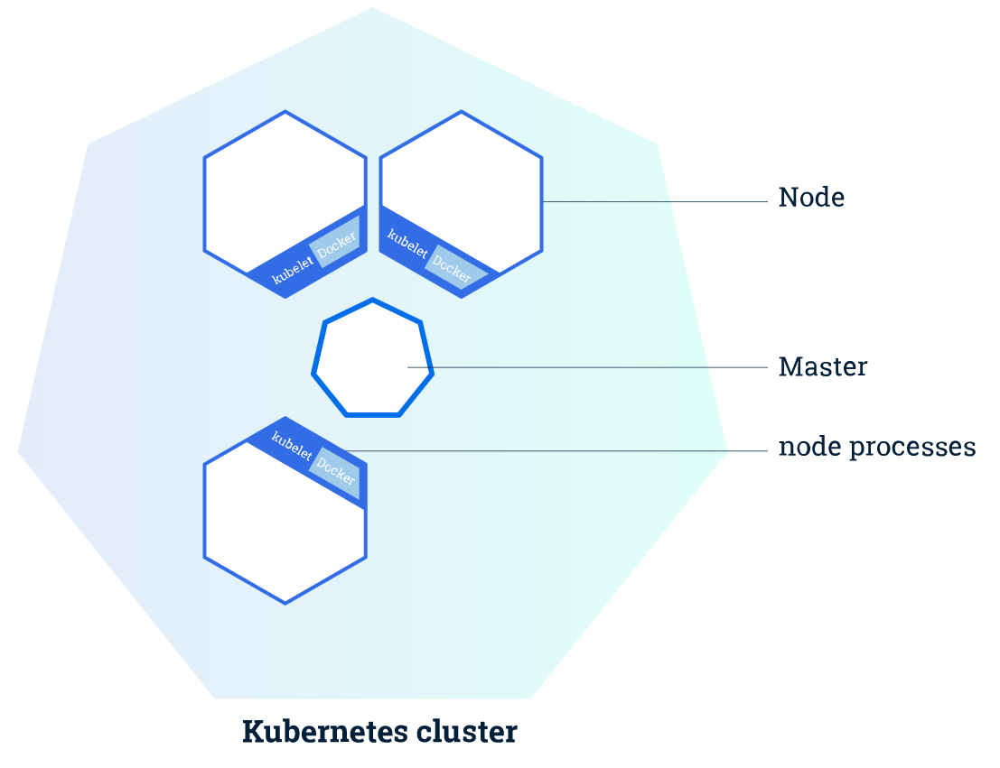

# **What is Kubernetes?**
##	**Kubernetes 필요성에 대한 이해**

   
“여러 서버에 분산된 서비스 통합 지휘”  
Container Orchestration

Kubernetes는 여러 서버에 분산된 서비스(컨테이너)를 통합 관리하기 위해 필요합니다. 

- Kubernetes는 그리스어이며 '조정', '통제'라는 의미입니다. 
- kubernetes는 약자로 k8s라고도 표기합니다. (k와 s사이에 8개 글자가 있기 때문임)  
   

2015년까지만 해도 Container Orchestration의 3강인 K8s, Docker swarm, mesos가 각축을 벌였으나, 이제는 더 이상 통계가 무의미할 정도로 kubernetes가 절대 강자라고 할 수 있습니다.  
   
   
Kubernetes, Mesos and Docker-swarm based on Number of questions asked in StackExchange from Saved You An Analyst Read on Kubernetes Growth (2018 Edition) by Ruben Orduz

## **Kubernetes 아키텍처에 대한 이해**  

IT적인 Kubenetes의 아키텍처는 아래와 같습니다.
   

좀 더 자세한 아키텍처는 아래와 같습니다.  
 

Master  

|구성요소 | 설명|
|---|---|
|API Server | 개발/운영자와 k8s 구성요소간 통신 수행|
|Controller Manager | Node에 배포된 Pod, Disk 등 관리|
|Scheduller | Node에 신규 Pod 분배|
|etcd |	Pod 상태와 제반 설정 저장|  
  
Node(Worker Node라고도 함)
  
|구성요소|설명|
|---|---|
|kubulet | API Server의 명령을 받아 Node관리|
|kube-proxy. | end user 요청을 Node내에 전달|
|cAdvisor | Pod상태 모니터링하고 master에 전송|
|Pod | 업무단위로 묶인 Container 그룹|
|Container | 수행 어플리케이션|  

Cluster는 Master와 Node들 전체를 부르는 구성요소입니다. 

실제 운영환경에서 Master와 각 개별 노드는 별도의 VM 또는 물리적인 서버에 분산되어 배치합니다.
시스템 규모에 따라 여러개의 Cluster(Master+Node들)로 구성할 수도 있습니다.

k8s의 좀 더 기술적인 설명은 아래를 참조하십시오.  

https://kubernetes.io/docs/concepts/architecture/
 
  

