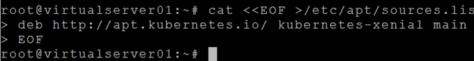
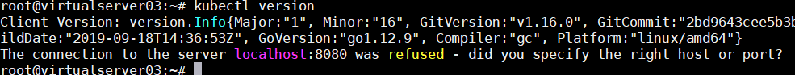
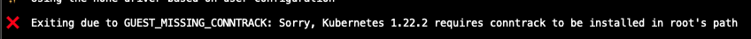
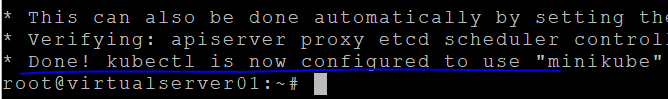
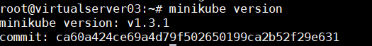
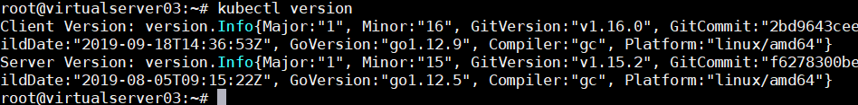

#  **설치하기**

정식으로 kubernetes를 설치하는 것은 교육에서 해 보기에는 좀 복잡하기 때문에 우리는 light한 kubernetes인 minikube를 이용하겠습니다.  
kubernetes 설치는 아래 공식문서를 참조하십시오.  
https://kubernetes.io/docs/setup/production-environment/tools/kubeadm/install-kubeadm/

## **VM 준비**  
Docker 교육때 사용한 VM을 사용합니다.

## **kubectl 설치**  
kubectl은 kubernetes의 API Server에 수행을 요청하는 프로그램입니다.  
우리가 사용하는 VM의 OS는 Ubuntu이므로 아래와 같이 설치합니다.  
kubectl 설치 전에 docker가 먼저 설치되어 있어야 합니다.(설치는 docker교육교재를 참조)  
Centos, RHEL에 설치하는 방법은 아래 링크를 참조하세요.  

https://kubernetes.io/docs/tasks/tools/install-kubectl-linux/


```console
# Ubuntu 업데이트
$ apt-get update  

# 필요 라이브러리 설치 
$ apt-get install -y apt-transport-https  

# 프로그램 다운로드 접근 key추가
$ curl -s https://packages.cloud.google.com/apt/doc/apt-key.gpg | apt-key add -

# repository를 추가
$ cat <<EOF >/etc/apt/sources.list.d/kubernetes.list

# 위 명령어 입력 후 아래 2줄 입력
deb http://apt.kubernetes.io/ kubernetes-xenial main
EOF
```
    
```console
# ubuntu 업데이트
$ apt-get update

# kubectl 설치
$ apt-get install -y kubectl

# 설치확인	
$ kubectl version
```  
  


Client version만 나오고 서버는 연결할 수가 없다고 나올겁니다.
minikube설치하면 제대로 연결되니 그대로 진행하세요.


## **Minikube 설치**  
아래와 같이 설치하십시오.

```console
# minikube설치	
$ curl -Lo minikube https://storage.googleapis.com/minikube/releases/latest/minikube-linux-amd64 && chmod +x minikube

# minikube 실행파일 이동
$ mv ./minikube /usr/bin
# 어느 위치에서든 실행될 수 있도록 /usr/bin디렉토리로 이동함

# minikube 시작
# 먼저 사용하고 있는 VM의 public IP를 확인합니다.

# 아래 명령중 IP주소를 본인 VM IP로 변경하여 실행합니다.
$ minikube start --vm-driver=none \
 --docker-env http_proxy=http://169.56.76.90:8080\
 --docker-env https_proxy=http://169.56.76.90:8080\
 --docker-env no_proxy=localhost,127.0.0.1,::1,169.56.76.90

```
아래와 같은 메시지가 나오면 contrack을 설치 하고 minikube start를 다시 실행 합니다.


```
$ apt-get install -y conntrack
```


아래와 같은 메시지가 나오면 성공적으로 시작된겁니다.

  
```console
# 설치확인
$ minikube version
```  




```console
# kubectl version을 다시 확인해 보면 이제 kubernetes서버에 연결된 걸 확인할 수 있습니다.  
$ kubectl version
```  



## **Minikube 삭제**  

minikube를 사용하다 보면 실수나 어떠한 이유로 kubernetes가 정상동작하지 않을 수 있습니다.  
이때는 삭제하고 다시 설치하시면 됩니다.

```console
# minikube중지	
$ minikube stop

# minikube 삭제	
$ minikube delete

# 모든 컨테이너 중지	
$ docker ps -aq 
# 하여 수행중인 container있는 경우만 수행
$ docker stop $(docker ps -aq)

# minikube 설치 파일 제거	
$ rm -r ~/.kube ~/.minikube

# mount 제거	
$ systemctl stop '*kubelet*.mount'

# minikube 관련 파일 제거	
$ sudo rm -rf /etc/kubernetes/

# 사용하지 않는 volume 제거	
$ docker system prune -af --volumes

# minikube실행파일 제거	
$ rm /usr/bin/minikube
```

