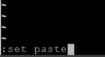

# **Getting Started**

이번장에서는 kubernetes에서 기본 제공하는 대시보드를 실행하여, 개발에서 배포까지 해보겠습니다.  
그리고 kubectl 사용법과 주요 예제를 살펴 보도록 하겠습니다.


## **kubernetes 대시보드 실행하기**  
kubernetes 대시보드는 전체 서비스 상황을 보고 k8s 기능들을 실행할 수 있는 웹사이트입니다.

```console
# 대시보드 실행	
$ minikube dashboard --url
# --url은 브라우저를 바로 실행하지 말라는 옵션임
# 주소가 나오면 CTRL-C를 눌러 prompt상태로 돌아 가십시오.
```
  
```console
# 외부접근 proxy실행
$ kubectl proxy --address='0.0.0.0' --disable-filter=true &

# 사용하고 있는 PC에서 대시보드를 접근하기 위해 proxy서버를 실행합니다.
#'Starting to...'라는 메시지가 나오면 Enter를 눌러 prompt상태로 돌아 가십시오.
# 명령어 맨 마지막에 '&'를 붙이면 백그라운드로 띄울 수 있습니다. 
# 그런데 이 경우 일정시간 경과하면 자동으로 서버가 내려갑니다. 
# 별도의 terminal을 하나 더 띄우고 '&' 안 붙이고 proxy 서버를 띄우는 것이 좋습니다.
```


**대시보드 접근**  
웹브라우저를 띄우고 아래 주소를 입력하십시오. IP는 본인 VM의 IP로 바꾸십시오.  

http://{VM IP}:8001/api/v1/namespaces/kubernetes-dashboard/services/http:kubernetes-dashboard:/proxy/

아래와 같이 나오면 성공입니다.
 


## **Namespace에 대한 이해**  
대시보드 왼쪽 메뉴를 보면 namespace 선택하는게 보일 겁니다.  
다른 기능들은 4장에서 설명할텐데 namespace에 대해선 이해를 하고 넘어갈 필요가 있습니다.  
namespace를 쉽게 이해하기 위해 프로젝트 수행조직 예를 갖고 설명하겠습니다.
  

     
위 그림은 프로젝트의 조직도입니다. 크게 4파트로 구성하고, 각 하위에 수행팀을 구성 했습니다.  
namespace는 프로젝트 수행 파트처럼 **어떤 목적을 위해 분할한 가상공간**입니다.  
IT시스템에서 "어떤 목적"은 여러가지 경우가 있습니다.  
예를 들어 제공하는 서비스 목적(그룹웨어, ERP 등), 대상 사용자그룹(내부직원, 외부사용자 등), 개발계/운영계 구분 등이 될 수 있습니다.  
대시보드에서 kube-system이라는 namespace를 선택하고, Pod를 클릭하면 아키텍처에서 설명한 k8s구성요소를 확인하실 수 있을 겁니다.  
즉 기본적으로 제공되는 namespace는 서비스 목적별로 나뉘어져 있습니다. 
  

  
자세한 기술적 설명은 여기를 참조하십시오.  
https://kubernetes.io/docs/concepts/overview/working-with-objects/namespaces/


## **개발에서 배포까지 체험해 보기**  
이제 간단한 프로그램을 컨테이너화(Image로 만들기)하여 k8s에 배포한 후 웹브라우저를 통해 접근해 보겠습니다. 이번에는 강력한 k8s가 있으니 로드밸런싱까지 적용하여 실제 운영과 비슷하게 만들어 보겠습니다.  

아키텍처는 아래와 같습니다.  

Ingress와 Service라는 처음 보는 k8s 객체가 나오는데 ingress는 사용자의 요청에 맞는 Service를 연결해주는 거고, Service는 요청을 Pod로 분배해주는 Load Balancer라고 생각하시면 됩니다.   

**Ingress : Service discovery, Service: Load Balancer**
  

  
아래 순서대로 위 아키텍처를 구현해 봅시다.  

본 실습의 목적은 k8s의 동작원리를 대략 이해하는 것이므로, 세세하게 내용을 이해하려고 할 필요는 없습니다.  자세한 것은 4장에서 설명하겠습니다.  


### **1) 작업 디렉토리 생성**  
mykube, mykube/start 디렉토리를 만들고, ~/mykube/start로 이동합니다.  
  
 
### **2) docker hub에 organization 작성**  
docker hub에 k8s 이미지를 저장할 새로운 organization을 작성합니다.  
최초에 자동으로 만들어진 것(username과 동일)을 그대로 사용하셔도 됩니다.  
  
 
### **3) 프로그램 개발**  
아래와 같이 node.js로 간단한 프로그램을 작성합니다. Port번호는 8080을 합니다.  
```javascript
$ vi users.js
var http = require('http');

http.createServer(function(req, res) {
  res.writeHead(200, {'Content-Type':'text/plain'});
  res.write('This is users service');
  res.end();
}).listen(8080);
```  

> vi editor가 익숙하지 않은 분은 위 소스를 CTRL-C로 복사하고, 아래와 같이 vi editor창에 붙이십시오.
> 1) CTRL-C 로 소스 복사
> 2) 콘솔에서 vi myapp.js 입력
> 3) ESC키 누르고 ':'입력 후 command 창에 set paste 라고 입력  
>    
> 4) ESE키 누르고 키보드의 ‘I’ 입력
> 5) 우측 마우스 버튼 클릭
> 6) 키보드의 ESC키 입력
> 7) ‘wq’입력하여 저장하고 종료
> 
> ※ 전체 내용 삭제하기  
> 'ESC'키 -> ':'콜론 -> 1 입력 -> 지울 라인수를 넉넉히 입력하고 'dd'입력

```javascript
$ vi products.js
var http = require('http');

http.createServer(function(req, res) {
  res.writeHead(200, {'Content-Type':'text/plain'});
  res.write('This is PRODUCTS service');
  res.end();
}).listen(8081);
```

### **4) 각 프로그램을 build할 파일 작성**  
```dockerfile
$ vi build-users
FROM node:alpine
EXPOSE 8080
COPY users.js .
CMD node users

$ vi build-products
FROM node:alpine
EXPOSE 8081
COPY products.js .
CMD node products
```

### **5) Image 제작**  
```console
$ docker build -f build-users -t ondalk8s/users-img .
$ docker build -f build-products -t ondalk8s/products-img .
```

### **6) registry에 push**  
```console
# k8s에서 배포하려면 먼저 registry에 등록이 되어 있어야 합니다. 
# registry 로그인 후 image를 푸시합니다.
$ docker login
$ docker push ondalk8s/users-img
$ docker push ondalk8s/products-img
```

### **7) 배포: users-pod**  
k8s 대시보드 웹 페이지를 접근합니다.  
http://{VM IP}:8001/api/v1/namespaces/kube-system/services/http:kubernetes-dashboard:/proxy/  
만약, 페이지가 안 뜨면 proxy서버를 다시 실행합니다.  
`kubectl proxy --address='0.0.0.0' --disable-filter=true`  
좌측에서 네임스페이스를 'default'를 선택합니다.  
본 교육에서는 편의를 위해 default 네임스페이스를 사용합니다.  
  
아래 내용을 붙여넣기 하고, [업데이트]를 누릅니다.  
```yaml
apiVersion: apps/v1
kind: Deployment
metadata:
  name: users-pod
spec:
  replicas: 2
  selector:
    matchLabels:
      tag: users
  template:
    metadata:
      name: users-pod
      labels:
        tag: users
    spec:
      containers:
      - name: users-container
        image: ondalk8s/users-img
        imagePullPolicy: Always
        ports:
          - containerPort: 10001
```  
  
 

### **8) 배포: products-pod**  
위와 동일하게 아래 내용을 붙여넣기 하고, [업데이트]를 누릅니다.  
```yaml
apiVersion: apps/v1
kind: Deployment
metadata:
  name: products-pod
spec:
  replicas: 3
  selector:
    matchLabels:
      tag: products
  template:
    metadata:
      name: products-pod
      labels:
        tag: products
    spec:
      containers:
        - name: products-container
          image: ondalk8s/products-img
          imagePullPolicy: Always
          ports:
            - containerPort: 10002
```  

### **9) 배포확인**  
디플로이먼트 메뉴를 클릭해 보면 replicas에 지정한 수만큼 Pod가 정상 실행된 것을 확인할 수 있습니다.   
  
  
### **10) Service생성: users-svc**  
생성된 Pod를 Load Balancing할 Service를 작성합니다.  
아래 내용을 대시보드에서 작성합니다.  
service PORT는 80이고, 연결 대상 Pod의 포트는 users.js에서 지정한 8080인것만 이해하시면 됩니다.  
```yaml
apiVersion: v1
kind: Service
metadata:
  name: users-svc
spec:
  selector:
    tag: users
  type: NodePort
  ports:
    - name: users-port
      port: 80
      protocol: TCP
      targetPort: 8080
```  

### **11) Service 생성: products-svc**  
아래 내용을 대시보드에서 작성합니다.  
```yaml
apiVersion: v1
kind: Service
metadata:
  name: products-svc
spec:
  selector:
    tag: products
  type: NodePort
  ports:
    - name: products-port
      port: 80
      protocol: TCP
      targetPort: 8081
```  

### **12) Service 생성 확인**  
서비스 메뉴를 클릭하여 확인합니다.  
  
  
내부 엔드포인트 결과를 이해해 봅시다.  
엔드포인트는 연결접점 주소를 말합니다.  
users-svc는 80포트로 요청을 받아 31600포트로 연결한다는 거고, products-svc는 80포트로 요청 받아 31790포트로 연결한다는 겁니다.    
분명히 Service 정의 시 users-svc는 8080포트이고, products-svc는 8081포트로 지정했는데 왜 엉뚱한 포트로 연결할까요?   
8080이나 8081는 컨테이너 내부의 포트이기 때문에 Service와 같은 컨테이너 밖에서는 그 포트로 연결할 수 없습니다.  
docker run 시 -p 80:8080 와 같이 외부에서 접근할 포트를 지정한 것을 생각해 보십시오. k8s는 배포 시 각 컨테이너를 접근할 수 있는 외부 포트를 자동으로 배정 합니다. 그래서 Service 생성 시 이 자동 생성된 31600이나 31790포트로 Pod 안의 컨테이너를 연결하는 겁니다.  
  

### **13) Ingress 기능 활성화**  
자 이제 요청에 따라 맞는 서비스를 연결해 주는 Ingress를 만들어 봅시다.  
먼저 k8s에 ingress 서비스를 enable 시켜야 합니다.  

```console
# minikube에서는 아래 명령어를 수행하면 됩니다.  
$ minikube addons enable ingress  

# 약 2~3분 후에 아래 명령어를 실행해서 ingress Pod가 실행되었는지 확인합니다.
$ kubectl get pod -n kube-system
```  
  

### **14) Ingress 생성: mying**  
대시보드에서 아래 내용을 생성합니다.  
URL패턴에 따라 연결할 서비스 이름과 포트를 정의한 부분을 이해하시면 됩니다.   
```yaml
apiVersion: networking.k8s.io/v1
kind: Ingress
metadata:
  name: mying
  annotations:
    kubernetes.io/ingress.class: nginx
    nginx.ingress.kubernetes.io/rewrite-target: /
    nginx.ingress.kubernetes.io/ssl-redirect: "false"
spec:
  rules:
  - http:
      paths:
      - path: /users
        pathType: Prefix
        backend:
          service:
            name: users-svc
            port:
              number: 80
      - path: /products
        pathType: Prefix
        backend:
          service:
            name: products-svc
            port:
              number: 80
```  

### **15) 최종 테스트**  
Ingress 생성 후 정상 실행까지 1~2분 기다려야 합니다. Ingress가 Service를 찾는 방식이 batch이기 때문에 즉시 동작하지 않습니다.  
웹 브라우저를 띄우고 아래와 같이 http://{VM IP}/users 와 http://{VM IP}/products를 입력해 보십시오.  
  
  

  

이제 여러분은 k8s의 동작원리와 어떻게 프로그램을 배포하는지를 대충 이해하셨을 겁니다.  

-----


## **kubectl 사용하기**  

kubectl은 k8s에 어떠한 수행을 요청하는 CLI(Command Line Interface)라고 했습니다.  
k8s 대시보드를 사용하면 kubectl로 할 수 있는것을 대부분 할 수 있지만 자주 사용하는 명령은 알고 계시는게 좋습니다. 처음엔 좀 불편해도 사용하다 보면 kubectl이 더 편한 경우도 많습니다.  

본 교육에서는 자주 사용하는 핵심적인 명령들만 설명합니다.  
먼저, kubectl의 문법 구조를 이해하십시오.  

- kubectl [COMMAND] [Resource TYPE] [Resource Name] [Options]

항상 위 4개 부분이 다 필요한게 아니라, 명령어에 따라 Resource type까지만 입력해도 됩니다.  

> ex) kubectl describe deploy deploy-users -o yaml  

deployment 리소스인 deploy-users에 대한 자세한 설명을 표시하는데 결과는 yaml파일 형식으로 해라  

> ex) kubectl get pods : 현재 namespace의 모든 pod 목록을 표시해라  

  
### **1) 주요 Resource type**  
resource type은 's'를 빼고 단수로 사용 가능  


|resource type fullname|type 약어 |
|---|---|
|pods |	po |
|services |svc |
|deployments |deploy |
|daemonsets |ds |
|jobs |job |
|statefulsets | |
|ingresses |ing |
|configmaps |cm |
|secrets |  |

### **2) 자주 사용하는 명령어**  

|명령어 |기능	|예제|
|---|---|---|
|get|	Resource 리스트 요청|	`$ kubectl get all`<br>`$ kubectl get all -n kube-system`<br>`$ kubectl get pods`<br>`$ kubectl get ingress,service,deploy,pod`|
|create|-f 옵션 뒤의 파일 실행하여 Resource 생성|`$ kubectl create -f deploy-users.yaml`<br>`$ kubectl create -f deploy-users.yaml,deploy-products.yaml`<br>쉼표로 구분하여 여러개 지정 가능함|
|apply|	-f 옵션 뒤의 파일 내용을 적용하여 Resource 생성 또는 변경|`$ kubectl apply -f deploy-users.yaml`<br>* 쉼표로 구분하여 여러개 지정 가능함|
|replace|	-f 옵션 뒤의 파일 내용대로 현재 Resource를 변경|`$ kubectl replace -f deploy-users.yaml`<br>* 쉼표로 구분하여 여러개 지정 가능함|
|delete|	Resource 삭제|`$ kubectl delete svc users-svc`<br>`$ kubectl delete svc users-svc products-svc`<br>`$ kubectl delete pods --all`<br>* 여러개 지정할 땐 space 사용|
|describe|	Resource에 대한 상세 수행 내용 표시. debug 시 사용|`$ kubectl describe svc users-svc`|
|logs|Container 수행 로그 표시<br>- docker logs와 동일 파라미터<br>- Pod 내 container가 하나이면 pod명만 지정<br>- Pod내 Container가 여러개면 -c 옵션 뒤에 container명 지정|`$ kubectl logs users-pod-79c8b6b55b-nxrmg`<br>`$ kubectl logs -f users-pod-79c8b6b55b-nxrmg`<br>docker logs와 동일하게 로그를 콘솔창에 계속 표시.  CTRL-C로 중단<br>`$ kubectl logs -f users-pod-79c8b6b55b-nxrmg -c users-container`<br>Pod안에 container가 여러개인 경우 컨테이너명을 지정하여 로그를 볼 수 있음|
|exec|Container 내의 명령실행<br>- docker exec와 동일 파라미터<br>- Pod 내 container가 하나이면 pod명만 지정<br>- Pod내 Container가 여러개면 -c 옵션 뒤에 container명 지정|`$ kubectl exec -it  products-pod-68dcd8fb9-rwffr /bin/bash`<br>`$ kubectl exec -it users-pod-79c8b6b55b-nxrmg -c users-container /bin/bash`<br>Pod내 특정 container내에서 명령 수행|
|edit|	실행중인 Resource정의를 편집<br>저장하면 내용 변경된 경우 수정내용을 반영함|`$ kubectl edit deploy users-pod`|
  
  
더 자세한 내용은 아래 링크에 잘 설명이 되어 있으니 참조 하십시오.  
https://kubernetes.io/docs/reference/kubectl/overview/
     
-----


### dashboard에서 Pod의 CPU, Memory 사용량 볼 수 있는 방법
```
$ minikube addons enable metrics-server
```


> TIP : Kubernetes Pod의 CPU, Memory 사용량 볼 수 있는 방법
> - 통계서비스 활성화 :  kubernetes 버전에 따라 적용 방법 다름  
> 
> ```console
> # 작업할 폴더 생성 및 이동
> $ mkdir metric
> $ cd metric
>
> # metrics-server 최신버전으로 적용을 위해 git clone
> $ git clone https://github.com/kubernetes-incubator/metrics-server.git
> $ cd metrics-server
> $ kubectl apply -f deploy/1.8+/
> 
> # metrics-server deployment 수정(아래 이미지 처럼)
> $ kubectl edit deploy metrics-server -n kube-system
> ```
>
> 
>  
>`$ kubectl top node`  
>
>  
>
>  
>


### 현재 namespace를 바꾸는 방법    
```console
# namespace 변경 방법 1
$ kubectl config set-context $(kubectl config current-context) --namespace=<바꿀 namespace>

# namespace 변경 방법 2
$ kubectl config set-context --current --namespace=<바꿀 namespace>
```

### yaml 파일형식으로 resource 보기
```
$ kubectl get deploy products-pod -o=yaml > deploy1.yaml
$ vi deploy1.yaml
```

### 다음 실습을 위해 Resource들을 모두 삭제
```
$ kubectl delete deploy --all
$ kubectl delete svc --all
$ kubectl delete ing -all
```


> Tip: kubernetes 명령, 리소스타입, 리소스명 자동완성 적용하기
즉시 적용하기  
> `$ source <(kubectl completion bash)`  
> 영구적으로 설정하기  
> `$ kubectl completion bash | sudo tee /etc/bash_completion.d/kubectl`
>>예) 자동완성 사용예
>>1) 명령  
>> `$ kubectl del`만 치고 tab누르면 `kubectl delete`로 완성시켜줌
>>2) resource type  
>> `$ kubectl get dep` 만 입력하고 탭 key를 누르면 dep로 시작하는 resource type을 찾아줌
>>3) resource  
>> `$ kubectl get pod`
>> `$ kubectl get pod my`만 치고 tab누르면 `kubectl get pod my-release-`로 완성시켜주고, w한자만 더 치고 tab누르면 `$ kubectl get pod my-release-wordpress-7866f8b4d8-6kt5x`까지 완성 시켜 줌  
>>  
>>   