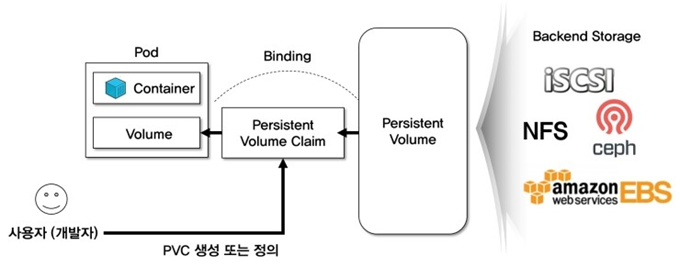

# **Kubernetes Resources 이해**   
이제 k8s 플랫폼 위에서 어플리케이션을 개발하고 배포하는데 필요한 Resource Type들에 대해 자세히 알아보도록 하겠습니다.  
응용프로그램을 사용자들에게 서비스하기 위해 필요한 과정을 생각해 봅시다.  
대략 다음 순서로 작업이 이루어질 것입니다. 이번 장의 구성도 여기에 맞추어 구성되었습니다.  
 
* 이번 장을 실습할때는 yaml파일 내용을 COPY-PASTE하지 마시고 직접 입력하시기 바랍니다.  
  그래야 좀 더 빠르게 각 resource type에 대해 이해하실 수 있습니다.  

## **데이터 저장공간(Storage): Volume**  

Volume이란 데이터 저장 공간인 Storage를 의미합니다.  
Storage를 크게 두개로 나눠보면 내장 스토리지와 외장 스토리지로 나눌 수 있습니다. PC를 예로 든다면 내장 스토리지는 PC내부에 탑재된 하드 디스크이고 외장 스토리지는 보통 USB포트에 연결하여 사용하는 외장디스크를 말합니다.  PC가 아닌 서버 에서는 USB로 연결하는게 아니라 네트워크로 붙이기 때문에 네트워크 스토리지라고 합니다.  

k8s의 Volume도 동일하게 Local Storage와 Network strage를 모두 사용할 수 있습니다.  

Local Storage volume종류에는 emptyDir과hostPath가 있습니다.  

Network storage volume 종류는 무지하게 많습니다. 그 종류는 아래 를 참고하십시오.  
https://kubernetes.io/docs/concepts/storage/volumes/#types-of-volumes  

개념적인 아키텍처는 아래와 같습니다.  

k8s에서는 Container에 volume이 마운트(스토리지 연결)되는것이 아니라, Pod에 연결된다는 차이에 주목하세요. 이렇게 해야 Pod안의 Container들이 Storage를 사용할 수 있기 때문입니다.  
  
  
 
자 그럼 Local Strage를 사용하는 방법과 Network stroage 중 NFS(Network File System)를 사용하는 방법을 배워 보겠습니다.  

Pod 안에서 Storage를 사용하는 목적에 따라 적절한 volume type을 이용하세요.  

|Pod 안에서 Storage 사용 목적| Volume type|
|---|---|
Pod 안에서 임시로만 사용할 volume이고, Pod가 삭제되면 volume은 사라져야 함| emptyDir|
|- volume의 데이터는 Pod가 삭제되어도 유지 필요<br>- 한 Node내의 Pod들이 사용하면 되고, 다른 Node의 Pod들은 volume을 공유할 필요가 없음 |hostPath|
|- volume의 데이터는 Pod가 삭제되어도 유지 필요<br>- 여러 Node내의 Pod들이 동일한 스토리지를 공유해야 함| Network volume type들<br>예) NFS, GlusterFS 등|


volume 실습을 위해 mykube 밑에 volume이라는 디렉토리를 만드세요.
```console
$ mkdir ~/mykube/volume
$ cd ~/mykube/volume

* '~'는 현재 계정의 home디렉토리(/home/<계정명>)를 의미함
```  

### **emptyDir 사용 방법**  
k8s대시보드에서 아래 내용을 입력하고, 실행하십시오.   
```console
$ vi deploy-pod.yaml
```  
   

  
Pod를 배포합니다.
```
$ kubectl apply -f deploy-pod.yaml
```  

실행후 kubectl로 각 컨테이너 안에 제대로 volume이 마운트 되었는지 확인해 봅시다.

  
  
 
> emptyDir volume은 Host Node의 어디에 생길까요?  
>  Host Node에 생기지 않습니다. Pod 구동 시 Pod안에서 임시로 생겼다가, Pod가 삭제되면 없어집니다.


이제 hostPath와 네트워크 스토리지 사용으로 넘어 갑니다.  

시작하기에 앞서 **PV(Permanent Volume)과** **PVC(Permanent Volume Claim)** 에 대해서 이해해야 합니다.  

PV는 물리적으로 만들어진 스토리지 공간이고, PVC는 Pod로 Mount하기 위해 만들어진 스토리지 공간입니다. PV와 PVC는 반드시 1:1입니다. 즉, 1개의 PV를 여러개의 PVC가 나눠서 사용하는게 아니라는 뜻입니다. 100G짜리 PV를 만들고, 처음에는 50G짜리 PVC만 쓰다가 늘리거나 줄이는 방식으로 사용하는 겁니다.

그런데 왜 귀찮게 2개의 Resource type으로 나눴을까요?  

왜냐하면 물리적인 스토리지를 구성하는 건 스토리지 제품에 따라 상이하여 매우 까다롭기 때문입니다.  

그래서 k8s에서는 PV를 만드는 건 인프라 전문가에게 맡기고 개발자는 필요한 만큼의 스토리지를 PVC로 정의해서 요청만 하면 사용할 수 있게 한 겁니다.  

그래서 IT적으로 PV와 PVC의 모습은 아래와 같습니다.  
  
  
  
PV/PVC를 이용하려면 아래와 같은 순서로 작업 하셔야 합니다.  


1) PV 만들기 
   - 용량을 얼마로 할까?  
   - 여러개의 Pod에서 쓰게 할까? 오직 한 Pod에서만 쓰게 할까?  
   - PVC를 삭제하면 PVC 스토리지 안의 데이터를 지울까? 유지할까?  
2) PVC만들기  
   - 용량은 얼마나 신청할까?  
   - 어떤 PV에 연결할까?  
   (예: local OR network, 100G OR 200G?)  
3) Pod와 PVC연결하기  
   - 어떤 PVC를 연결할까?
  

### **Local volume: hostPath**  

Host의 특정 디렉토리를 스토리지로 사용하는 방식입니다.  


#### **1. PV 만들기**    
1) Host에 사용할 디렉토리를 만듭니다.  
   `$ mkdir -p ~/mykube/volume/local-data`  
2) PV를 만듭니다.  
   - 용량을 얼마로 할까?  
     -> capacity: storage  
   - 여러개의 Pod에서 쓰게 할까? 오직 한 Pod에서만 쓰게 할까?  
     -> accessModes  
   - PVC를 삭제하면 PVC 스토리지 안의 데이터를 지울까? 유지할까?  
     -> PersistentVolumeReclaimPolicy  
     `$ vi hostpath-vol.yaml`  
          
     `$ kubectl apply -f hostpath-vol.yaml`   
3) 생성 확인: status가 Available인것을 일단 기억해 주세요.  
  
  
>- accessModes  
>  . ReadWriteOnce: 한 Pod에서만 사용  
>  . ReadOnlyMany: 여러 Pod에서 사용가능하나 읽기 전용  
>  . ReadWriteMany: 여러 Pod에서 읽고 쓰기 가능    
>  
>- persistentVolumeReclaimPolicy  
>  . Retain: PVC삭제 후에도 데이터 유지  
>  . Recycle: PVC 삭제 후 데이터 삭제. 다른 PVC에 할당 될 수 있음.  
>  . Delete: PVC 삭제 되면 PV도 삭제됨    
>  
>- volumeMode도 있음(Default는 Filesystem)  
>  . Filesystem: 파일 디렉토리  
>  . Block: DB 스토리지    
>  
>- storageClassName  
>  . storageClassName은 스토리지의 종류에 따라 다릅니다. 이 부분은 인프라 담당자가 스토리지에 따라 만들어서 PVC를 사용하는 개발자에게 전달해 줘야 합니다.  
>  . 테스트 용도로 사용시에는 minikube 기본 storageClass인 'standard'를 사용하거나, 아무 이름이나 지정하시면 됩니다. 


#### **2. PVC만들기**  
- 용량은 얼마나 신청할까?  
  -> resources: requests: storage:
- 어떤 PV에 연결할까? (예: local OR network, 100G OR 200G?)  
  -> selector: matchLabels: {label key}: {label value}  

아래 예제는 type이 local인 PV와 연결하는 것입니다.  
만약, selector가 정의되어 있지 않으면 신청 용량을 수용할 수 있는 PV에 알아서 연결됩니다.  
또한, storageClassName을 지정하면 동일 storageClassName을 가진 PV에 연결됩니다.    storageClassName을 생략하면 현재 지정된 k8s의 기본 storage class를 사용하게 됩니다.  

> ※ 기본 storage class 확인 / 변경 방법  
>`$ kubectl get storageclass`  
>  
>  
>
>변경은 아래 명령 참조
>```console
>$ kubectl patch storageclass <your-class-name> -p '{"metadata": {"annotations":{"storageclass.kubernetes.io/is-default-class":"false"}}}'
>$ kubectl patch storageclass standard -p '{"metadata": {"annotations":{"storageclass.kubernetes.io/is-default-class":"false"}}}'
>```  
>  
>
>보다 자세한 내용은 여기를 참조  
>https://kubernetes.io/docs/concepts/storage/storage-classes/  

`$ vi hostpath-pvc.yaml`  
  
`$ kubectl apply -f hostpath-pvc.yaml`  

어떤 PV에 연결되었는지 볼까요?  
  
  

  

연결된 PV의 상태가 어떻게 변했을까요?  
Available에서 Bound로 바뀌었네요.  
  
  
  
PVC를 삭제하고, 다시 PV의 상태를 볼까요 ?  
이제는 Released로 바뀌네요  
PV는 최초 생성시에는 Available이고, PVC에 할당되면 Bind가 되었다가 PVC와 연결이 끊어지면 Released로 바뀐다는걸 기억해 주십시오.  
  
  

다음 실습을 위해 PV, PVC 삭제  
```console
$ kubectl delete pv --all
$ kubectl delete pvc --all
```
  
#### **3. Pod와 PVC연결하기**  
어떤 PVC를 연결할까 ?  
-> persistentVolumeClaim:   
     claimName: <PVC명>  
  
```console
# PV, PVC 생성
$ kubectl apply -f hostpath-vol.yaml
$ kubectl apply -f hostpath-pvc.yaml

# voltest pod 수정(아래 이미지 참고)
# voltest pod 배포
$ kubectl apply -f voltest-pod.yaml
```  

    
  
volumeMounts부분을 'tmp-vol' 하나로 바꾸었습니다.  동일한 PVC를 volume명만 바꿔서 사용할 수는 없기 때문입니다. 


제대로 Pod가 동작하는지 mount는 잘 되었는지 확인해 봅시다.  
잘 돌고 있고, /tmp로 마운트도 잘 되었고, users와 products 컨테이너가 동일한 volume을 공유하는걸 확인할 수 있으면 성공입니다.  
```console
root@virtualserver03:~/mykube/volume# kubectl exec -it voltest -c users touch /tmp/abc.txt
root@virtualserver03:~/mykube/volume# kubectl exec -it voltest -c users ls /tmp
abc.txt
root@virtualserver03:~/mykube/volume# kubectl exec -it voltest -c products ls /tmp
abc.txt
```


### **Network volume: NFS**  

network volume 중 NFS를 연계하는 방법은 아래를 참고하십시요.   
먼저, IBM Cloud에서 NFS 서버를 만듭니다.  
  
#### **1. 스토리지 파일 서버 준비**  
a) https://cloud.ibm.com에서 본인 계정으로 로그인  
b) [리소스작성] 버튼 클릭 후 좌측메뉴에서 '스토리지'클릭하고, '파일 스토리지'를 선택  
  
 
c) 아래와 같이 요청  
    

#### **2. VM에서 File Server접근 허용**  
몇 분정도 기다리면 리소스 목록에 파일서버가 표시됩니다.  
상세 페이지로 들어간 후 우측에서 [Actions]를 클릭하고, Authorize Host를 선택하십시오.  
   


본인이 사용하는 VM이 접근할 수 있도록 셋팅하십시오.
 
  

---

 그럼, NFS서버를 연결하여 volume을 사용해 봅시다  


 #### **1. PV 만들기**  
 - 용량을 얼마로 할까 ?  
  -> capacity: storage  
- 여러개의 Pod에서 쓰게 할까? 오직 한 Pod에서만 쓰게 할까?   
  -> accessModes
- PVC를 삭제하면 PVC 스토리지 안의 데이터를 지울까? 유지할까?  
  -> PersistentVolumeReclaimPolicy  
  
 
- nfs : hostPath 대신에 nfs라는 item밑에 NFS서버 정보를 입력
본인의 파일서버 정보에서 Mount Point 참조하여 작성  
  
   

- storageClassName은 구글에서 ' storageClassName ibm file server'과 같이 검색하면 사용할 수 있는 storage class를 구할 수 있음  

잘 생성되었는지 확인해 봅시다.  
   
  

#### **2. PVC만들기**  
- 용량은 얼마나 신청할까?  
  -> resources: requests: storage:
- 어떤 PV에 연결할까? (예: local OR network, 100G OR 200G?)  
  -> selector: matchLabels: <label key>: <label value>  
  
  
   
 
#### **3. Pod와 PVC연결하기**  
- 어떤 PVC를 연결할까 ?  
  -> persistentVolumeClaim: claimName: <PVC명>

제대로 Pod가 동작하는지 mount는 잘 되었는지 확인해 봅시다.
```console
$ kubectl get po
```  
    

---

### **NFS : hostpath 이용**  
NFS서버를 Node에 mount 시킨 후 hostPath volume을 정의하여 사용할 수도 있습니다.  


#### **1. Node에 마운트 시키기**  
1) mount할 디렉토리 생성  
`$ mkdir /nfsdata`
2) fstab에 추가  
`$ vi /etc/fstab`  
 맨 아래에 추가  
***fsf-seo0101b-fz.adn.networklayer.com:/SL02SEV1937565_1/data01*** /nfsdata nfs4 hard,intr,rw,sec=sys 0 0  

bold체 부분은 자신의 파일서버에 맞게 수정  
※ 'hard,intr,rw,sec=sys' 부분은 file server에 맞는 옵션을 설정하는 부분입니다. fstab에 마운트 설정을 하는 것은 인프라 담당자가 하니 너무 크게 신경 쓰지 않으셔도 됩니다.  

3) 마운트  
`$ mount -a `

※ unmount 하는 방법  
`$ umount /nfsdata`

#### **2. PV,PVC,Pod**  
위 hostPath사용법 설명을 참조하여 동일하게 하면 됨  

---  


### **Dynamic Provioning**  

PV를 생성하지 않고, PVC만 생성한 경우, k8s는 자동으로 PV를 생성하여 binding합니다.  
이때 주의할점이 있습니다.  

PV가 PVC로 binding될 때 storageClassName과 selector의 label을 이용하는데 그 조건에 해당하는 PV가 있으면 자동으로 또 하나의 PV를 만들지는 않는다는 겁니다. 그 조건에 해당하는 PV에 binding됩니다.  

따라서, PVC에 storageClassName을 지정한 경우, 그 storageClassName으로 생성한 PV가 없다면, 자동 binding되지 않습니다. 아래 첫번째 예제에서는 manual이라는 storage class로 생성된 PV가 없기 때문에 자동으로 PV가 생성되지 않습니다.  

테스트를 위해서는 기존 pv, pvc를 모두 지우셔야 합니다.  
```console
$ kubectl delete pv --all
$ kubectl delete pvc --all
```  
그리고, 아래와 같이 실습하십시오.  
  
      

하지만, minikube 기본 storage class인 'standard'를 이용하면, 자동 생성합니다.  
  
selector에 해당하는 PV가 없더라도 자동 생성합니다.  
  
    
    
  
'standard' storage class의 정의가 아래와 같이 즉시 binding되도록 설정했기 때문입니다.  
  
      
  


## pv, pvc 강제 삭제

```
pv나 pvc삭제시 kubectl delete pv/pv-name or pvc/pvc-name으로 안될때

--grace-period=0 이 옵션을 해보고 안되면 --grace-period=0 --force

이것도 안될경우

edit후 

- kubernetes.io/pv-protection

해당 부분이 존재하는지 확인해본다
만약 있다면

kubectl patch pvc pvc_name -p '{"metadata":{"finalizers":null}}'

kubectl patch pv pv_name -p '{"metadata":{"finalizers":null}}'

kubectl patch pod pod_name -p '{"metadata":{"finalizers":null}}'

```