# **모니터링**  

모니터링은 안정적인 서비스를 위해 절대적으로 필요하고 중요합니다.  
모니터링은 Host, Container, App, K8s에 대해서 수행되며 각각 모니터링 대상이 다릅니다.  
  
  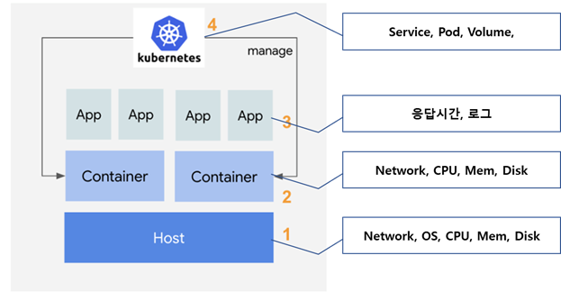  
 
모니터링 툴 중 가장 많이 사용하고 있는 조합은 아래 2가지 입니다.  
1) 프로메테우스(Prometheus) + InfluxDB + Grafana
2) 프로메테우스(Prometheus) + ELK 스택(Elastic Search + LogStash + Kibana)  

k8s에서 기본 제공하던 힙스터(Heapster)는 depreciated 되고 metrics-server로 바뀌었습니다.   
오픈소스 모니터링툴에 대한 한글 비교자료는 아래 링크를 참조하세요.  
http://www.opennaru.com/apm/open-source-monitoring-tool/  

이번 장에서는 Prometheus와 Grafana에 대하여 실습하도록 하겠습니다.  
참고로, IBM의 ICP(IBM Cloud Private)는 모니터링으로 2번 조합을 지원하고 있습니다.  

## **Prometheus 아키텍처**  
  
  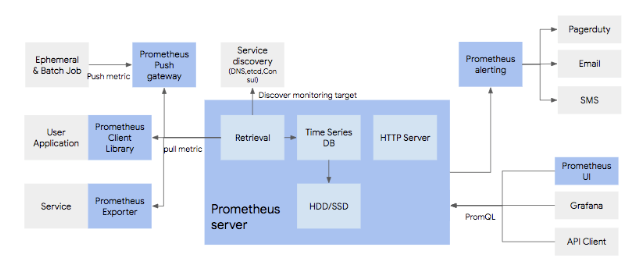  

- 데이터 수집: Prometheus Server가 주기적으로 pull하는 방식  
- Service discovery: DNS서버 또는 Service discovery툴(etcd, ZooKeeper, Netflix의 Eureka, Hashcorp의 consul)과 연동하여 Service Registry의 정보를 읽음  
- 저장: 내부 저장소에 저장  
- 시각화: 자체 UI제공(보기 어려움). Prometheus API를 전문 시각화 툴 사용(대표적으로 Grafana)  
- 통지: 지표에 대한 규칙을 설정하여 통보 필요 시 Email이나 SMS로 통지. SMS는 외부 서비스 연동 필요.  
  

## **Prometheus와 Kubernetes 연동 방법**  
  
  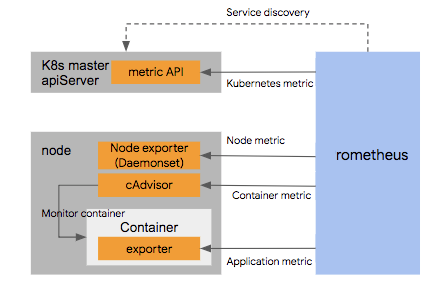  

- Service discovery: k8s API를 이용하여 k8s 리소스 목록을 label selector로 수집  
- k8s 모니터링: k8s metric Http service 이용하여 수집(/metric)  
- Node 모니터링: k8s에 Node Exporter라는 Daemonset Pod를 설치하여 수집  
- Container 모니터링: k8s의 cAdvisor 이용  
- App 모니터링: App에 맞는 Exporter 제작 필요  
  

## **Prometheus 설치**  

가장 간단한 설치 방법은 Helm 툴을 이용하는 겁니다. Helm은 node.js의 npm툴과 같이 서비스 설치에 필요한 제반 요소들을 패키징할 수 있게 해주는 툴입니다.  
Helm설치의 제일 간단한 방법은 snap이라는 설치 툴을 이용하는겁니다.  
```console
$ snap install helm --classic
```  
  
  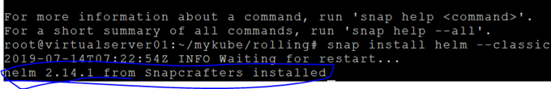  


Helm시작은 아래 명령어를 실행하면 됩니다. 주의할점은 localhost가 hosts파일에 정의 되어야 있어야 합니다.   
```console
$ cat /etc/hosts
# hosts 파일에서 확인
```

```console
$ helm init
```  
  
  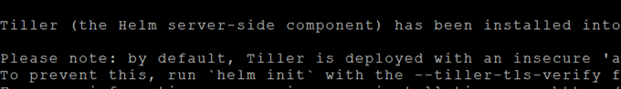  

```console
$ helm version
# version확인 시 Client와 Server(Tiller)의 버전이 정상적으로 표시되어야 합니다.  
```  
  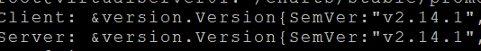  

만약 Server쪽에 아래와 같은 에러 메시지가 나오면 socat을 설치하십시오.  
```console
$ apt-get install -y socat
```  
  
  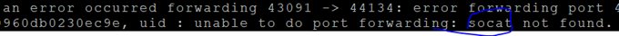  

---

자 이제 prometheus 설치 준비가 끝났습니다. 설치해 봅시다.

### **1. Home 디렉토리로 이동**  
```console
$ cd ~
```

### **2. 설치**  
prometheus의 helm chart를 git에서 가져옵니다. helm chart는 설치에 필요한 제반 요소를 정의한 파일들입니다.  
```console
$ git clone https://github.com/kubernetes/charts
$ cd charts/stable/prometheus
$ helm install -f values.yaml stable/prometheus --name prometheus --namespace prometheus
```  
values.yaml파일에 정의된대로 prometheus라는 namespace에 prometheus라는 이름으로 설치합니다.  

### **3. Service 생성**  
```console
$ kubectl get pod -n prometheus
```  
  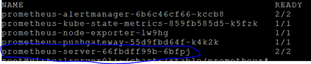  

server pod의 정보를 읽어, label이 뭔지 찾아 냅니다.  
```console
$ kubectl get pod prometheus-server-66fbdff99b-6bfpj -n prometheus -o=yaml
```  
  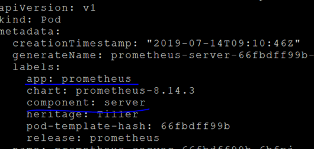  

Service를 배포할 yaml파일을 작성합니다.  
```yaml
$ vi svc.yaml

apiVersion: v1
kind: Service
metadata:
  name: prometheus-svc
  namespace: prometheus
spec:
  selector:
    app: prometheus
    component: server
  type: NodePort
  ports:
    - name: http
      port: 9090
      protocol: TCP
      targetPort: 9090
```
```console
$ kubectl create -f svc.yaml
$ kubectl get svc -n prometheus
```  
  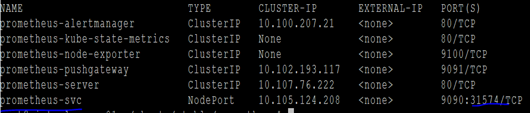  

### **4. 테스트**  
웹 브라우저에서 http://{VM IP}:{Service Port}로 접근합니다.  
  
  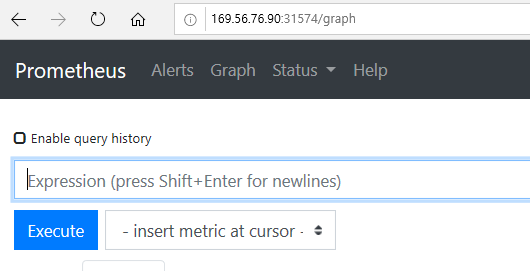  

Service Discovery 메뉴를 클릭하여 어떤 데이터를 어떻게 수집하는지 확인할 수 있습니다.  
  
  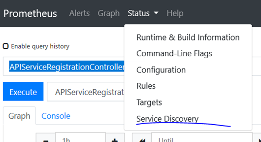  

각 통계지표별로 현황을 확인할 수 있습니다.  
  
  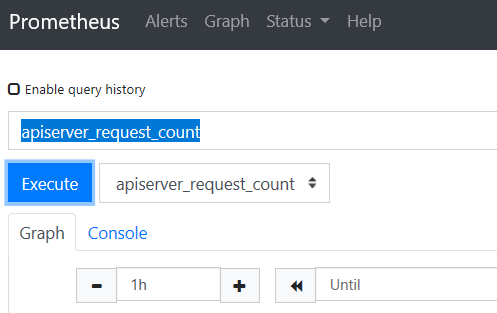  
  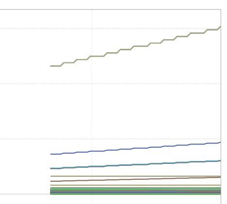  
 
 ---

Prometheus는 모니터링을 위한 각종 데이터를 수집하는 좋은 툴이지만 시각화에는 한계가 있습니다.   
그래서 Prometheus의 데이터를 이용하여 시각화된 결과를 보여주는 툴이 Grafana입니다.   
Kibana(키바나)도 많이 쓰이고 있는 시각화 툴입니다.  

## **Grafana 설정**  

### **1. grafana helm chart디렉토리로 이동**  
```console
$ cd ~/charts/stable/grafana
```

### **2. admin 암호 셋팅**  
```console
$ vi values.yaml
```  
  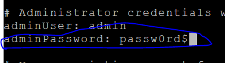  

 
### **3. 설치**  
```console
$ helm install -f values.yaml stable/grafana --name grafana --namespace grafana
```

### **4. Service 생성**  
```console
$ kubectl get pod -n grafana
```  
  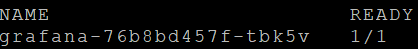  

```console
$ kubectl get pod grafana-76b8bd457f-tbk5v -n grafana -o=yaml
```  
  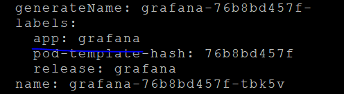  

server 배포 파일 작성
```yaml
$ vi svc.yaml

apiVersion: v1
kind: Service
metadata:
  name: grafana-svc
  namespace: grafana
spec:
  selector:
    app: grafana
  type: NodePort
  ports:
    - name: grafana-port
      port: 3000
      protocol: TCP
      targetPort: 3000
```
```console
$ kubectl create -f svc.yaml
```  

### **5. 테스트**  
외부 노출 포트 확인
```console
$ kubectl get svc -n grafana
```  
  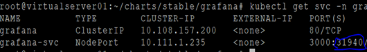  


웹브라우저에서 http://{VM IP}:{Port}로 접근  
  
  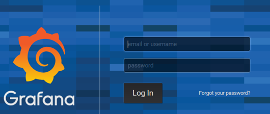  
  

### **6. 프로메테우스를 데이터소스로 추가**  
프로메테우스를 데이터 제공자로 연결시켜 줍니다.  
  
  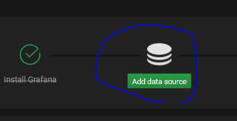  

  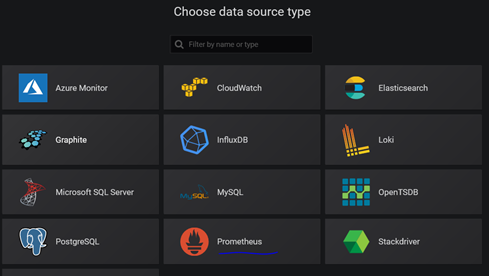  
  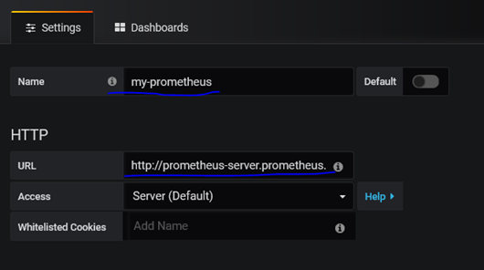
 
위 url은 prometheus-server의 Service L/B 주소를 입력합니다.  
`$ kubectl get svc -n prometheus`로 service 이름을 확인합니다.  
prometheus와 grafana의 namespace가 다르므로 URL은 전체 주소를 입력해야 합니다.  
**<서비스명>.<namespace명>.svc.cluster.local** 형식입니다. 
여기 예에서는 http://prometheus-server.prometheus.svc.cluster.local 입니다.  
  
  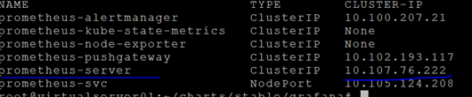  
  
### **7. 시각화 템플릿 적용**  
시각화할 UI를 직접 개발할 수도 있지만, 기존에 다른 사람이 잘 만들어 놓은것을 가지고 올 수도 있습니다.  
좌측 메뉴 제일 위의 '+' > Create > Import를 클릭하십시오.  
  
  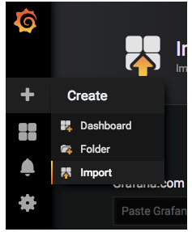  
  
다른 브라우저 탭에서 https://grafana.com 을 들어가서 dashboard를 클릭하십시오.  
  
  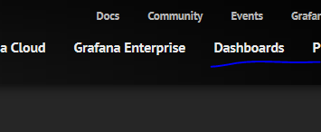  

import할 대시보드 템플릿을 선택하면 우측에 고유번호가 있습니다.  
  
  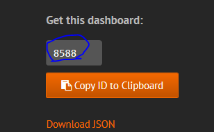  
  
이 번호를 Import 페이지에 넣으십시오.  
번호를 넣고 조금 기다리면 Import페이지가 표시됩니다.  
prometheus항목에 방금 전 작성한 data source를 선택하고,  [Import]버튼을 클릭하십시오.  
  
  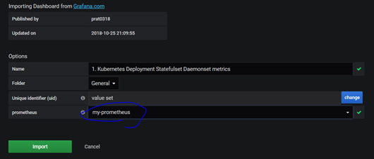
 
### **8. 대시보드 보기**  
멋진 모니터링 대시보드가 완성되었습니다.  
  
  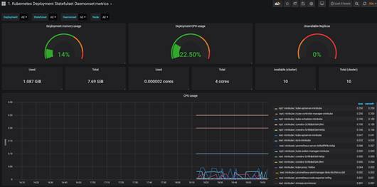  
  
 

