# **Pod 배포 Controller: Deployment, DaemonSet, Job, CronJob, StatefulSet**  

k8s에서 Pod를 배포하는 Controller type에는 8가지가 있습니다.  
그중 Pod, ReplicationController와 ReplicaSet은 Deployment로 대체하여도 됩니다.  
* workload라는 말이 자주 나오는데 '배포되는 응용프로그램'으로 생각하시면 됩니다.   
* Pod배포는 각 목적별 Controller에 의해 수행됩니다.  
* kubectl에 익숙해 지기 위해 k8s대시보드 대신 콘솔을 사용하여 실습 하십시오.  


아래는 각 Controller의 사용 목적입니다.

|Controller | 언제 사용하는가 ?|
|---|---|
|Pod |응용프로그램을 하나의 Pod에 배포 시 사용 |
|ReplicationController<br>(rc) |응용프로그램을 여러 Node에 배포 시 사용|
|ReplicaSet<br>(rs) |RC의 새 버전|
|Deployment |응용프로그램을 여러 Node에 분산 배치 시 사용. 가장 일반적인 배포 형태.<br>RS의 기능 강화 버전. RC와 RS를 추상화(한번 더 감쌈)함|
|DaemonSet |모든 Woker node에 1개씩 배치할 때 사용. 예) 로그 수집 Pod|
|Job| 한번만 수행되는 Pod 배포시 사용. 예) 데이터 마이그레이션 Pod |
|CronJob |주기적으로 실행하는 Pod 배포 시 사용. 예) 사용자정보 daily batch로 가져오기 |
|StatefulSet |Deployment와 동일하게 지정된 수의 Pod를 여러 Node에 분산 배치 시 사용.<br>단, 각 Pod에는 일련번호가 붙어서 배치됨. 예를 들어 3개의 Pod가 배치된다면 pod-0, pod -2,  pod-3과 같이 생성되고, 1개가 줄어들 때는 pod-3번이 제거됨. DB Pod는 StatefulSet 타입으로 배포하는게 일반적임.<br>예) DB pod 배포. DB는 Master Pod는 절대 삭제되지 말아야 하기 때문에 Master pod는 일련번호가 0번으로 부여됨. DB를 Deployment 타입으로 배포하면, 0번 Master pod가 삭제되어 장애가 일어날 가능성이 매우 큼.|  

Pod는 4.1 장에서 실습을 했고, RC와 RS는 Deployment를 사용해도 되니, 본 교육에서는 Deployment, DaemonSet, Job, CronJob, StatefulSet만 설명하도록 하겠습니다.  

Resource정의는 yaml(야믈)파일 또는 json파일로 정의합니다. 우리는 yaml파일을 사용합니다.(json파일은 큰 따옴표 입력으로 좀 더 타이핑이 많음)  

> YAML(YAML Ain't Markup Language™)    
> https://yaml.org/

yaml 리소스 정의 파일의 공통적인 구성과 문법은 아래와 같습니다.  
  
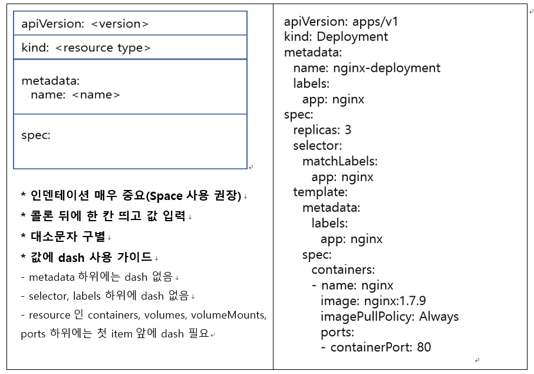  

apiVersion, resource type list는 아래 링크를 참조하세요.  
https://kubernetes.io/docs/reference/kubectl/overview/  

Editor에 공백과 탭 표시 옵션을 enable하고 쓰시기 바랍니다.  
**NotePad++**  
  
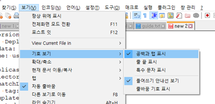  

**VisualStudio Code**
  
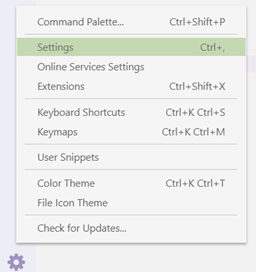  
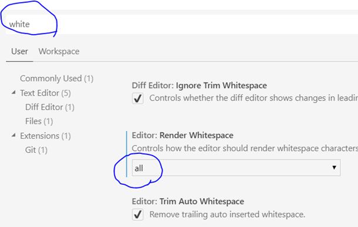  


먼저, 각 Controller 실습을 위해 간단한 프로그램 하나를 작성하고 image를 만듭니다.  

### **1. 디렉토리 생성 및 이동**  
```console
$ mkdir -p ~/mykube/deployment
$ cd ~/mykube/deployment
```  

### **2. 앱 작성**  
```javascript
$ vi myapp.js

var http = require('http');
var os = require('os');
const host = process.env.HOST;
const port = process.env.PORT;

http.createServer( (req, res) => {
  console.log('requested: ' + req.url);
  res.writeHead(200, {'Content-Type':'text/plain'});
  res.write('This is myapp service');
  res.end();
}).listen(port, () => {
  console.log('Listen ...' + host +':'+port);
});
```

### **3. Dockerfile작성**  

```Dockerfile
$ vi Dockerfile

FROM node:carbon
RUN mkdir -p ~/work/myapp
WORKDIR ~/work/myapp
COPY myapp.js .
EXPOSE 8080
ENV HOST myhost.ibm.com
ENV PORT 8080
CMD node myapp
```

### **4. Build & push**  
본인의 docker hub에 푸시하기 위한 image를 build합니다. 
(Docker교재의 Public Registry 참조)
```console
$ docker build -t ondalk8s/myapp:v1 .
$ docker login
$ docker push ondalk8s/myapp:v1
```  

### **5. Test**  
```console
$ docker run -it --rm --name myapp -p 8888:8080 ondalk8s/myapp:v1
```  
- 웹브라우저에서 http://{VM IP}:8888 실행
- 정상 실행되면 콘솔에서 CTRL-C로 컨테이너 종료


## **Deployment**  

응용프로그램을 여러 Node에 배치하려면 정의해야 할 것이 무엇일지 생각해 봅시다. 

### **Think**  

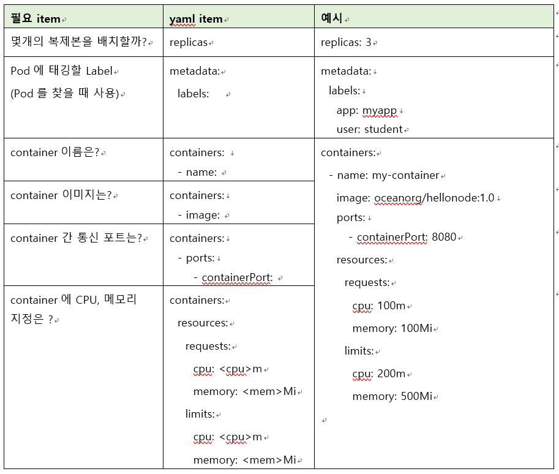  
  

그럼 예제를 통해 deployment를 연습해 보겠습니다.  
  
### **Practice**  
  
#### **1. 배포 yaml 작성**  
```
$ vi deploy.yaml
```
  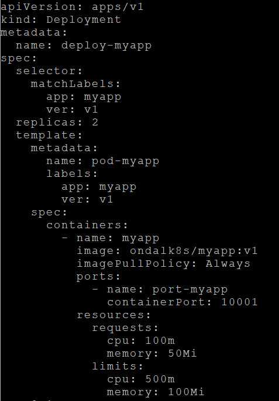  

- spec.selector: Pod 확장/축소, 삭제 시 Pod를 찾는 방법임  
- spec.template 하위에 새로운 Pod를 생성할 때 필요한 item들을 정의함  
- spec.template.spec.containers.imagePullPolicy: image registry에서 항상 가져오려면 Always.  
로컬host에 한번 가져와서 캐싱된 image를 사용하려면 IfNotPresent.  
default는 IfNotPresent인데 최신의 Image를 항상 가져오고 싶으면 Always로 지정  
- spec.template.spec.containers.resources : 지정하지 않으면 VM에서 가용한 자원을 모두 사용.  
실제 운영환경에서는 지정해 주는 것이 좋음.  
limits에 지정한 리소스 이상은 사용하지 못하게 강제함.  
리소스 사용량에 따른 Autoscaling은 4.8장에서 설명합니다.  

#### **2. 배포**  
```
$ kubectl apply -f deploy.yaml  
```
  
#### **3. 확인**  
`$ kubectl get pod` 명령어로 지정한 수만큼 복제본이 생성되었는지 확인  

Deployment로 배포되는 Pod는 Worker node가 여러대일때 master node의 scheduler에 의해 자동으로 배치 됩니다.  
HorizontalPodAutoscaler를 이용하면 Autoscaling되면서 역시 무작위로 node에 배치 됩니다.  
따라서 Deployment로 배치되는 Micro Service는 어떤 Pod에 연결되도 정상적인 서비스가 되도록 상태정보(예: 사용자 인증세션, 로그파일 등)를 갖고 있으면 안됩니다.  이걸 Stateless한 Micro service라고 합니다.  

#### **4. 테스트**  
실행중인 Pod중 하나를 지우면 어떻게 될까요 ?
`$ kubectl get pod`로 pod list를 보고 그중에 하나를 지워봅시다.  

아래와 같이 Deployment controller에 의해 자동으로 새로운 Pod가 생기는걸 확인할 수 있습니다.  
  
  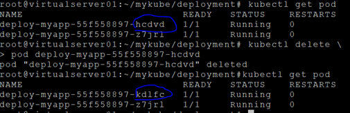   
  
 
  


## **DaemonSet**  

**"1개 Daemon 배포"**  

DaemonSet 컨트롤러는 각 Node에 1개씩만 Pod를 배치할 때 사용합니다.  
일반적으로 Logging, Monitoring, Storage를 위한 데몬을 배치할 때 사용합니다.  
  
  
### **Think**  
  
  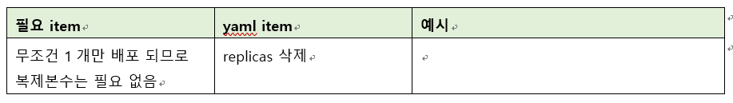  

### **Practice**
  
#### **1. yaml 작성**  
```
$ cd ~/mykube/deployment
```  

Deployment yaml파일과 2가지만 다릅니다. 
- Kind: DaemonSet
- replicas : 삭제
```yaml
$ vi daemonset.yaml

```  
   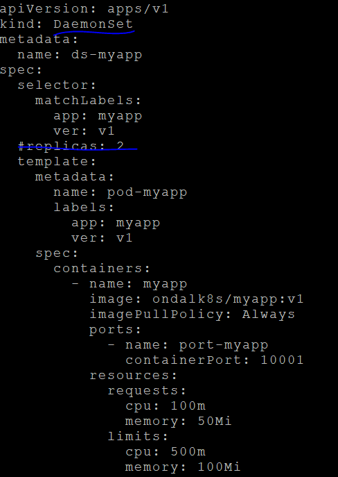  
  

#### **2. 배포**  
```
$ kubectl apply -f daemonset.yaml  
```

#### **3. 확인**  
1) daemonset 컨트롤러 확인  
```
$ kubectl get daemonset
```  
2) Pod확인  
```
$ kubectl get pod
```  
  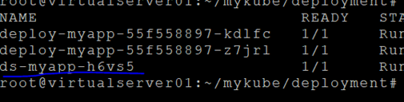  
  
    

## **Job**  

**"1회성 Job 수행"**  

어떤 주어진 일만 하고 바로 종료되어야 하는 어플리케이션을 배포할 때 사용됩니다.  
예를 들어 기존 데이터의 마이그레이션이나 테이블 생성같은 프로그램은 1번만 실행되면 됩니다.  
  
  

### **Think**  
  
  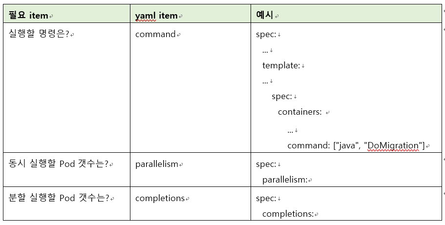  
  
### **Practice**  
  
  
#### **1. yaml 작성**  
```
$ cd ~/mykube/deployment
```
Job은 ..
- apiVersion: batch/v1
- selector는 불필요하므로 제거함

```
# vi job.yaml
```  
  
  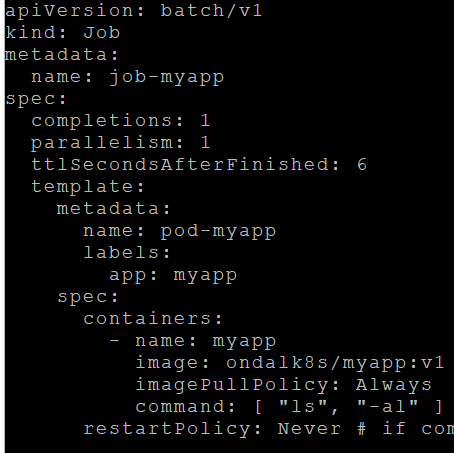    

  
#### **2. 배포**  
```
$ kubectl apply -f job.yaml  
```
  
#### **3. 확인**  
  
  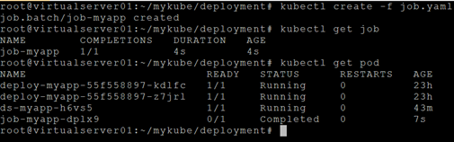    

#### **참고**  
동시실행수(parallelism)가 2이고, 분할실행수(completions)가 5인 경우  
  
  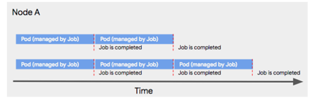  

* 출처: 조대협의 블로그
  


## **CronJob**  
  
**"주기적 Job 수행"**  
주기적으로 어떤 작업을 수행해야 하는 어플리케이션을 배포할 때 사용됩니다.  
  
### **Think**  
  
  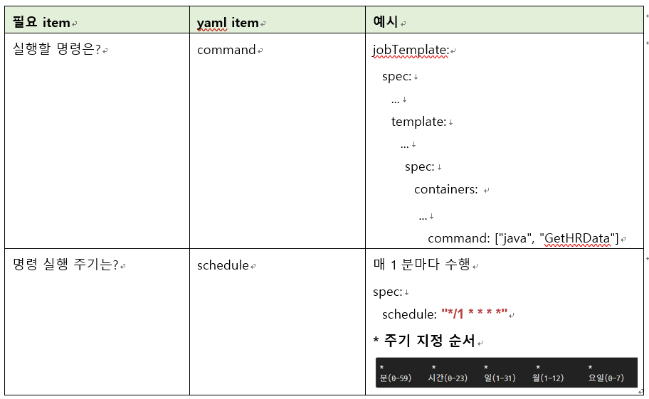  
  
### **Practice**  
  
#### **1. yaml 작성**  
```
$ cd ~/mykube/deployment
```  

CronJob은 Job과 몇가지가 다르다.
- apiVersion: batch/v1
- jobTemplate
- schedule  

```
$ vi cronjob.yaml
```  
  
  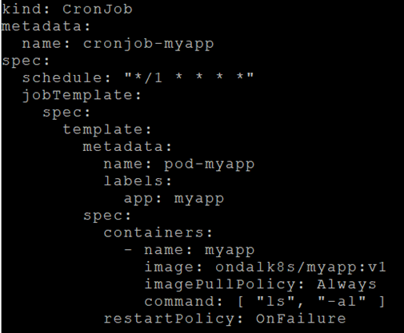  
  
  
#### **2. 배포**  
```
$ kubectl apply -f cronjob.yaml  
```

#### **3. 확인**  
   
  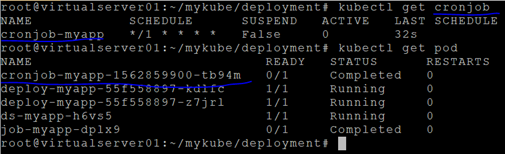  
  
  
## **StatefulSet**  

**"Stateful(상태정보 유지)한 프로그램 배포"**  
컨테이너 내의 프로그램은 Stateless(상태정보 없음)하게 만들어야 하는게 기본 정책이나, 특수한 프로그램은 Stateful(상태정보 유지)하게 만들어야 할 필요가 있습니다.  
Stateful과 Stateless의 차이점 이해를 위해 예를 들어 설명하겠습니다.  
여러분이 Call center에 전화로 상담하는 상황을 생각해 봅시다.  상담원A와 상담을 하다가 갑자기 전화가 끊겨서 다시 전화를 했더니, 상담원B와 연결이 되었습니다. 상담원A가 본인의 노트에만 상담내용을 기록했다면, 상담원B는 다시 처음부터 상담을 시작해야 합니다.  
  
  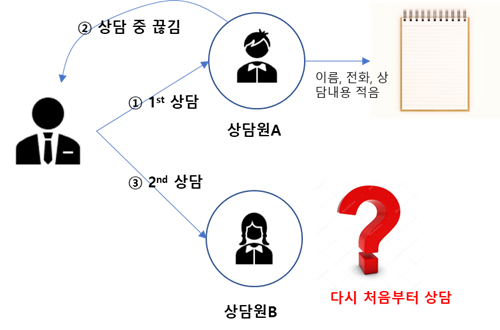  
  

상담원들을 컨테이너화된 서비스로 생각해 봅시다.  
위 예와 같이 각 컨테이너가 자신의 진행상태 정보를 유지해야 한다면, 다른 컨테이너로 연결되었을 때 서비스에는 문제가 발생합니다.  
또 다른 예는 인증상태 정보를 각 컨테이너가 관리할때의 문제입니다.  
아래 그림을 보시면 쉽게 이해가 되실 겁니다.  
  
  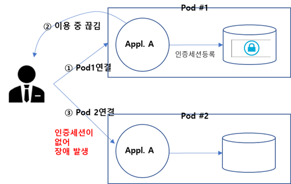    
  

컨테이너는 상황에 따라 없어지거나 늘어나야 되기때문에 각 컨테이너가 상태정보를 유지하는 Stateful한 어플리케이션은 문제가 발생합니다.  
하지만 예외가 있습니다. 대표적으로 Database 컨테이너입니다.  
Database는 상호 Consistency를 위해 자신이 몇번째 DB인지 알고 있어야 합니다. 그렇지 않으면 Master DB컨테이너가 삭제되는 재앙이 발생할 수 있습니다.  
  
  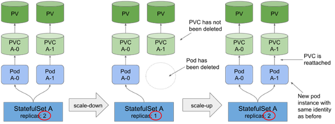  
  
  
이렇게 Stateful한 프로그램 배포를 위한 Controller가 StatefulSet입니다.  

### **Think**  
  
StatefulSet은 상태를 유지할 필요가 있다는것 외에는 Deployment와 동일할 것입니다.  
다만, DB workload를 배포할 때는 DB에 따른 환경변수나 volume이 추가적으로 필요합니다.  
  
  
### **Practice**  
  
#### **1. yaml 작성**  
```console
$ cd ~/mykube/deployment
$ vi statefulset.yaml
```  
  
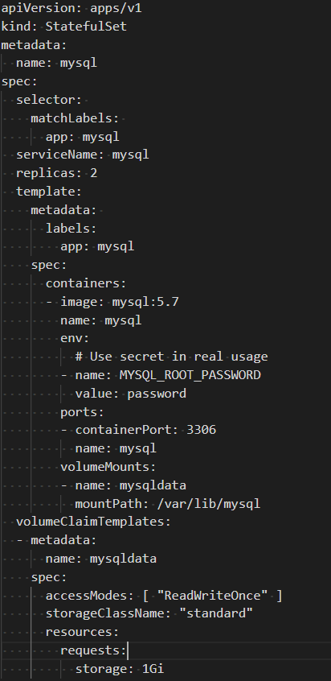  

  
#### **2. 배포**  
  
```console
$ kubectl apply -f statefulset.yaml
```

#### **3. 확인**  
```console
$ kubectl get pod
```
지정한 2개의 Pod가 실행되고 있습니다.   
  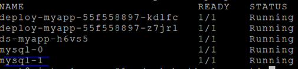   

이제 Pod의 갯수를 3개로 늘렸다가, 1개로 줄여 보겠습니다.  
아래 명령어로 yaml파일을 수정하지 않고, 복제본 수를 조정할 수 있습니다.  
```
$ kubectl edit statefulset mysql
```
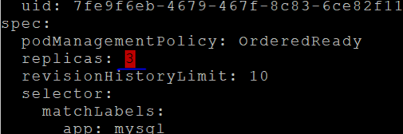   
  

※ 커서를 2 위에 올리고 'r'을 누른 후 '3'으로 바꾸면 됩니다. ESC누르고 ':' 입력 후 'wq'를 수행하여 저장 후 파일을 닫습니다.  

수정 사항은 즉시 반영됩니다. 아래와 같이 일련번호가 붙어서 3개로 늘어난걸 확인할 수 있습니다.  
```
$ kubectl get pod
```  
  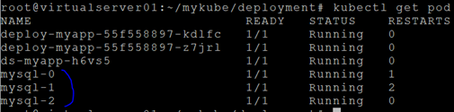   

이젠 1개로 줄여보겠습니다. 위와 동일하게  kubectl edit를 이용하여 1개로 줄여 봅니다.  mysql-2 -> mysql-1 순서로 삭제되는것을 확인할 수 있을 겁니다.  
```
$ kubectl get pod
```  
   
  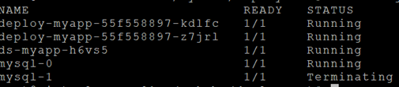   
  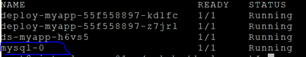   


### **Tip: 원하는 Node에 Pod 배포 하기**  

특정 Node들에만 Pod를 배치할 수 있습니다.  
좀 더 자세한 사항은 링크를 참조하세요:  
https://blog.naver.com/PostView.nhn?blogId=alice_k106&logNo=221511412970  

Node에 label 부여부터 합니다.  
```
- kubectl label nodes <node name> <key>=<value>  
  예) kubectl label nodes minikube spec=light

* label 지우기: kubectl label nodes <node name> <key>-
  예) kubectl label nodes minikube spec-
```
```
$ kubectl get nodes --show-labels
```  
  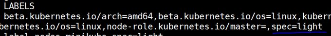  
  

affinity.nodeAffinity에 조건을 정의합니다. 정의 형식은 아래와 같습니다.  
  
  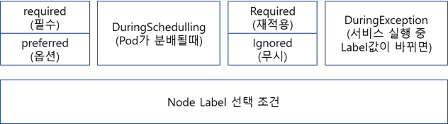  
  

예) RequiredDuringSchedullingIgnoredDuingException: Node Label 선택 조건에 해당하는 노드에 반드시 Pod를 배포한다. 단, Pod가 실행중에 label값이 바뀌는 건 무시한다.  

```yaml
apiVersion: v1
kind: Pod
metadata:
  name: with-node-affinity
spec:
  affinity:
    nodeAffinity:
      requiredDuringSchedulingIgnoredDuringExecution:
        nodeSelectorTerms:
        - matchExpressions:
          - key: kubernetes.io/e2e-az-name
            operator: In
            values:
            - e2e-az1
            - e2e-az2
      preferredDuringSchedulingIgnoredDuringExecution:
      - weight: 1
        preference:
          matchExpressions:
          - key: another-node-label-key
            operator: In
            values:
            - another-node-label-value
  containers:
  - name: with-node-affinity
    image: k8s.gcr.io/pause:2.0
```  
  

  
### **Tip: 원하는 Pod가 실행중인 Node에 Pod 배포 하기**  
예를 들어 Web server와 DB Pod가 있는데 Web server Pod는 DB Pod와 반드시 같이 배치되어야 한다면 affnity.podAffinity 를 이용할 수 있습니다.  

반대로 Web server POD는 WAS Pod와는 절대 같이 배포되면 안된다면 affinity.podAntiAffinity를 이용하면 됩니다.  podAntiAffinity를 응용하면 한 Node에 Pod가 집중되는것도 막을 수 있습니다.  

affnity.podAffinity 또는 affinity.podAntiAffinity는 아래와 같이 구성됩니다.  
  
  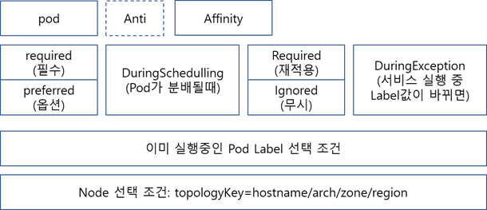  

* topologyKey: kubectl get nodes --show-labels로 값 확인 가능함  
  - hostname: 현재 노드. 모든 node의 hostname이 다르기 때문임  
  - arch: 동일 CPU type(예: amd64)인 노드  
  - zone: 동일 zone의 노드  
  - region: 동일 region의 노드  

아래 정의를 쉽게 풀면 아래와 같습니다.  
- 동일 zone에 있는 노드에 배포해 주세요.  
- 그 노드들 중에 Label 'webserver' 값에 'nginx'가 포함된 Pod가 실행중인 노드에 반드시 배포해 주세요.  
- Pod실행중에 label바뀌는건 무시해 주십시오.  
  
  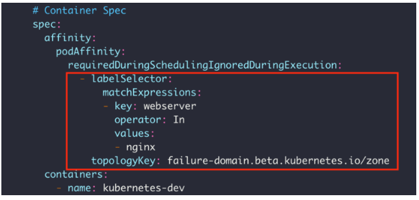  
  

- 현재 노드에 배포해 주세요.
- 단, 현재 노드에 webserver 값에 nginx가 포함된 Pod가 이미 실행중일때만 배포해 주세요.  
  
  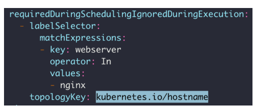  
  
  
podAntiAffinity로 한 Node에 Pod가 집중되는것을 방지할 수 있습니다.  
- 현재 노드에 배포해 주세요.  
- 단, 현재 노드에 app값에 myapi가 포함된 Pod가 실행중이면 절대 배포하지 마세요.  
- Pod실행중에 label이 바뀌는건 무시해 주세요.  
  
  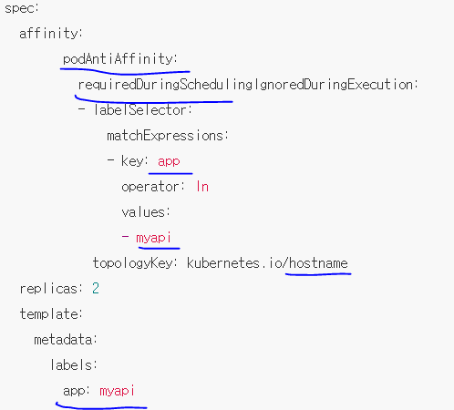  
  
 


