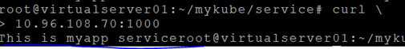

# **배포한 Pod 연결: Service**  

**Service는 Pod를 연결해 주는 Load Balancer입니다.**  
Pod로 사용자가 직접 접근할 수는 없습니다. 왜냐하면 Pod는 언제라도 추가, 삭제될 수 있기 때문입니다.  
만약, 직접 Pod를 연결했는데 그 Pod가 없어진다면 장애가 발생할 것입니다.  
k8s는 이 문제를 해결하기 위해 Pod를 연결해 주는 Service라는 리소스type을 제공합니다.  
* 일반적 의미의 Service와 헷갈릴 수 있는데 사용자관점에서는 Pod와 Pod내 Container는 감춰져 있고 Service 리소스만 노출되어 있으므로 일반적 의미의 Service 또는 Micro Service 또는 어플리케이션과 같은 의미로 생각해도 될 것 같습니다.  의미가 모호할 때는 Service L/B라는 용어를 사용하도록 하겠습니다.  
  
    

* API G/W: API 통합관리. L/B뿐 아니라 인증/권한처리, 로깅과 같은 공통기능 수행, 메시지 형식 변환, API과금 관리 등의 기능이 있음.  
  - 오픈소스: Kong, Try.io, Express Gateway.  
  - 상용: Google APIgee, IBM API Connect, Amazon AWS API G/W, Azure API G/W  
* Ingress: Service L/B는 요청URL에 따른 분기는 못하는 단순 L/B라면, Ingress는 요청 Host나 URL에 따른 Service L/B 분기를 할 수 있는 Load Balancer임. 기술적으로 Service L/B는 L4 L/B라고 하고, Ingress는 L7 L/B라고 함.  
  
그럼 Service L/B를 정의할 때 필요한 요소를 생각해 볼까요 ?  
  
  

## **Service types**  

Service L/B는 상황에 따라 4가지 종류를 사용할 수 있습니다.  

|상황 |type |
|---|---|
|클러스터 내에만 Port 오픈<br>예) DB는 대부분 클러스터 내부의 Service들에서만 접근하면 됨 |ClusterIP |
|클러스터 외부에도 Port 오픈 |NodePort, LoadBalancer<br>* LoadBalancer는 Public Cloud에서만 사용하는데, Cloud에서 제공하는 물리적인 Load Balancer를 사용하기 위한 설정임|
|내부 Pod를 연결 하는 것이 아니라, 클러스터 외부의 Service를 연결하는 proxy service를 만들 때 사용.<br>컨테이너 내 프로그램에서는 클러스터 외부의 서비스를 직접 접근할 수 없습니다. 그래서 클러스터 외부 연결을 중계(proxying)할 External name 서비스를 만들어서 사용합니다.<br>예) Pod내 프로그램에서 외부망의 환율DB를 접근하는 경우 |ExternalName |  


## **Service 접근**  

동일 클러스터내의 Pod 간 통신할때도 Service L/B를 통해 접근합니다.  

이때 Service L/B의 IP가 아니라 Service L/B의 주소를 이용하여야 합니다. 왜냐하면 Service L/B는 삭제 후 재 생성되면 IP가 바뀌기 때문입니다.  

Service L/B의 주소는 **<서비스명>.<name space명>.svc.cluster.local** 입니다. 같은 namespace에서는 service L/B의 name만으로도 접근이 가능합니다.  

> 중요) Pod간 Service통한 통신    
> 동일 클러스터내의 Pod 간 통신할때는 Service를 통해 접근하도록 합니다.     
> 아래 그림에서 svc1은 background API를 제공하는 Service라 외부에 노출할 필요가 없다고 가정해 봅시다.     
> Pod에서 이 Service를 호출할 때는 Service의 name으로 접근할 수가 있습니다.      
> 같은 namespace에 있는 Service는 ```http://<Service name>:<Service Port>```로 접근할 수 있습니다.    
> 다른 namespace에 있는 Service는 ```http://<Service name>.<namespace>.svc.cluster.local:<Service Port>```로 접근할 수 있습니다.    
> * Service Port는 Service가 사용하는 Port입니다. Service는 이 port로 요청을 받아 targetPort인 8000으로 Pod를 연결합니다.     


  
    
  


이 Service L/B 주소는 각 Pod내에서만 인식됩니다. VM Host에서는 인식이 안됩니다.  
  
    
   

Pod내에서는 인식됩니다.  
  
    
    

## **실습하기**  
그럼, 각 type별로 실습하면서 그 차이를 체험해 보겠습니다.
- 작업할 디렉토리를 만듭니다 : `$ mkdir -p ~/mykube/service && cd ~/mykube/service`
- deploy.yaml을 복사합니다 : `$ cp ~/mykube/deployment/deploy.yaml .`  
- Pod를 배포합니다.  

기존 배포된 pod를 모두 삭제  
 workload controller 를 보고 있으면 모두 삭제(daemonset, job, cronjob, statefulset 조회)  
   
    
  
예) `$ kubectl delete deploy --all`  

deploy.yaml의 myapp 프로그램을 배포합니다.  
```
$ kubectl apply -f deploy.yaml
```

### **ClusterIP**  

#### **1. yaml파일 작성**  
```
$ vi svc-clusterip.yaml
```  
    

※ Pod의 label값을 쉽게 보려면 --show-labels 옵션을 이용
```
$ kubectl get pod --show-labels
```  

#### **2. 서비스 생성**  
```
$ kubectl apply -f svc-clusterip.yaml
$ kubectl get svc
```  
  
    

#### **3. 테스트**  
```
$ curl 10.96.108.70:1000
```  

    

```
* ExternalIPs 로 ClusterIP Service 접근   
ClusterIP로 만든 Service도 Cluster외부에서 접근할 방법이 있습니다.   
위 yaml에 externalIPs를 worker node IP로 추가(복수 worker node추가 가능)한 후, 기존 service를 지우고 다시 생성해 보십시오.       

ports:

  ...

externalIPs:
- <worker node ip>
    
​그럼 이제 <worker node ip>:<service port>로 접근이 됩니다. 
```
​

### **NodePort**  

#### **1. yaml파일 작성**  
```
$ vi svc-nodeport.yaml
```

    

#### **2. 서비스 생성**  
```
$ kubectl apply -f svc-nodeport.yaml
$ kubectl get svc
```  
    


#### **3. 테스트**  
클러스터 ip로 접근해서 테스트 해 봅니다.
```
$ curl 10.97.210.228:1000
```
웹브라우저에서 http://{VM ip}:{Node Port}로 테스트 해 봅니다.
{Node Port}는 위와 같이 k8s가 자동 배정합니다. 30000 ~ 32767사이 port가 배정됩니다.  
  
    


※ 만약, Node Port를 직접 지정하려면 아래와 같이 nodePort에 값을 지정하면 됩니다. 30000~32767사이의 Port로 지정해야 합니다.  
  
    

 
### **LoadBalancer**  

사용법은 NodePort와 동일합니다. 다만, LoadBalancer의 물리적 ip를 loadBalancerIP에 지정하는 것만 다릅니다. 구글, 아마존, 애저, IBM 등 일부 퍼블릭 클라우드 환경에서만 사용 가능합니다. 각 벤더마다 물리적 L/B의 IP를 구하는 방법이 다르니, 자세한 사항은 클라우드 벤더에게 문의하여야 합니다.  
  
    


### **ExternalName**  

내부 Pod연결이 아니라, 외부의 서비스를 연결할 때 사용합니다.  
  
    
  

상황별로 ExtenalName을 쓰는게 좋을때와 EndPoint를 사용하는게 좋을 경우가 있습니다.  
ExternalName은 주로 퍼블릭클라우드나 3rd party의 서비스를 접근할 때 사용됩니다.  
사내에서는 EndPoint로 Private IP를 사용하는 방식을 사용 하는것이 좋습니다.  

ExternalName을 사용하는 방법은 간단하여 실습하지 않고 설명만 하겠습니다.  
퍼블릭클라우드에 있는 mongo DB를 연결하려면 아래와 같이 하면 될 겁니다.  
그러나 켄테이너 안에서는 이렇게 연결할 수가 없습니다.  
```
mongodb://<dbuser>:<dbpassword>@ds149763.mlab.com:49763/dev
```
아래와 같이 ExternalName Service를 만듭니다.  
  
    


이제, 컨테이너 안에서는 아래와 같이 DB를 연결하면 됩니다.  
```
mongodb://<dbuser>:<dbpassword>@mongo:<port>/dev
```
ExternalName이 아니라 End Point를 이용하는 방법은 실습을 해 보겠습니다.  
  
    
  

node.js로 VM Host에 exapp을 8000번 포트로 구동합니다.  
Pod내에서 직접 접근 안되므로, Service L/B 'svc-ep'를 통해서 접근 시킵니다.  


#### **1. exapp.js 작성**  
```javascript
$ vi exapp.js

var http = require('http');
var os = require('os');
const host = "myhost.ibm.com";
const port = 8000;

http.createServer( (req, res) => {
  console.log('requested: ' + req.url);
  res.writeHead(200, {'Content-Type':'text/plain'});
  res.write('This is EXTERNAL service');
  res.end();
}).listen(port, () => {
  console.log('Listen ...' + host+':'+port);
});
```  

#### **2. node.js 설치**  
```
$ apt-get install nodejs
```
#### **3. exapp실행**  
```
$ node exapp
# 실습을 위해 계속 실행상태 유지
```  

#### **4. service yaml 작성**  
```
# ssh 터미널을 새로 열고 해당 폴더로 이동해서 수행
$ vi svc-ep.yaml
```
  
    
  

type은 ClusterIP로 합니다.  

#### **5. end point yaml 작성**  
```
$ vi ep-myapp.yaml
```

    

※ name은 반드시 service name과 동일하게 해야 합니다.  
※ VM의 Private IP를 지정합니다. private ip는 아래와 같이 확인할 수 있습니다.  
```
$ ip addr | grep eth0
```
    

※ Port는 exapp.js가 수신하고 있는 8000번을 지정합니다.  

```console
$ kubectl apply -f svc-ep.yaml
$ kubectl apply -f ep-myapp.yaml
```

#### **6. Pod안에서 exapp 접근 테스트**  
`$ kubectl get pod`으로 pod확인하고, 첫번째 pod안을 들어갑니다.  
  
  
 
```
$ curl svc-ep
```
  
  

### **Headless Service**  
Headless Service는 접근 IP가 없는 Service입니다. 보통 아래와 같이 각 Service에는 Cluster IP나 External IP가 부여되는데 Headless Service는 접근할 IP를 배정하지 않는 Service입니다.  
  
    


왜 Headless Service가 필요할까요 ?    
Service 리소스를 통한 통신이 아니라, Pod간에 직접 통신하고 싶을 때 사용합니다.     
Pod는 언제라도 죽었다 살아날 수 있고, 그때마다 IP가 바뀌기 때문에 URL형식으로 접근해야 합니다.     
Pod의 주소는 아래와 같습니다.     
{pod name}.{service name}.{name space}.svc.cluster.local     
여기서 2번째 part에 service name이 필요 합니다.    
따라서 Pod의 로드밸런싱 목적이 아니라 Pod를 직접 연결하기 위해 service가 필요하기 때문에 Headless서비스를 만듭니다. 

**주의할점은 statefulset으로 배포된 pod만 위 pod url로 접근이 가능하다는 것입니다.**     
**참고로, statefulset으로 배포된 pod접근시에는 service가 headless가 아니어도 됩니다.**  
    
방법은 단순합니다. service 정의 시 type을 ClusterIP로 하고, clusterIP: None으로 하면 됩니다.  
  
  
    


### **로드밸런싱 방법 선택**  

Default L/B방식은 라운드로빈 방식(랜덤하게 Pod연결)입니다.  
List Connection방식. 즉, 한번 연결된 Pod로 계속 연결하고 싶을 때는 아래와 같이 sessionAffinity: ClientIP라고 지정하시면 됩니다.  
  
    
  


