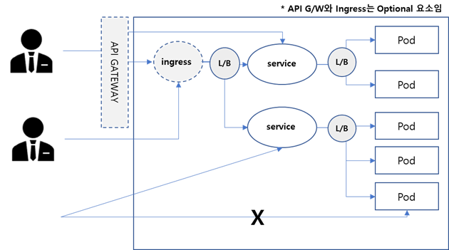
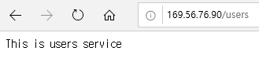
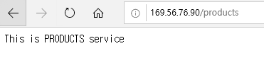
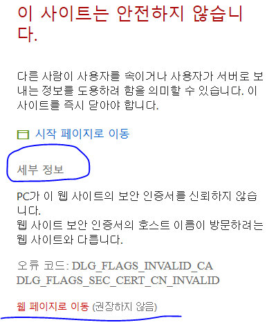

# **Service 로드밸런싱: Ingress**  

Ingress는 Service L/B를 http의 URL패턴에 따라 Load Balancing하는 Resource입니다.   
k8s는 아직 http와 https프로토콜만 지원하며, http는 80포트, https는 443포트만 지원합니다.  
즉 Ingress로 접근하는 url은 http://{url} 또는 https://{url}형식이어야 합니다.  
http://www.abc.com:8080과 같은 형식은 지원하지 않습니다.  

    
  

앞장 service에서 만든 users-svc와 products-svc를 Ingress로 연결하는것을 다시 한번 살펴 보겠습니다.  

### **1. 디렉토리 작성**  
```
$ mkdir -p ~/mykube/ingress && cd ~/mykube/ingress
```  

### **2. Deployment, Service 생성**  
앞장에서 생성한 yaml파일 내용을 이용하여 Deployment, Service yaml파일을 생성합니다.  
```console
$ vi deploy-users.yaml
$ vi deploy-products.yaml
$ vi svc-users.yaml
$ vi svc-products.yaml
```
pod, service를 생성합니다.
```console
$ kubectl apply -f deploy-users.yaml
$ kubectl apply -f deploy-products.yaml
$ kubectl apply -f svc-users.yaml
$ kubectl apply -f svc-products.yaml
```  
### **3. Ingress 생성: mying**  
```yaml
$ vi mying.yaml

apiVersion: networking.k8s.io/v1
kind: Ingress
metadata:
  name: mying
  annotations:
    kubernetes.io/ingress.class: nginx
    nginx.ingress.kubernetes.io/rewrite-target: /
    nginx.ingress.kubernetes.io/ssl-redirect: "false"
spec:
  rules:
    - http:
        paths:
          - path: /users
            pathType: Prefix
            backend:
              service: 
                name: users-svc
                port: 
                  number: 80
          - path: /products
            pathType: Prefix
            backend:
              service: 
                name: products-svc
                port: 
                  number: 80
```

- annotations: 단순한 주석이 아니라 부가적인 옵션을 지정하는 부분입니다.  
  . rewrite-target: 연결할 Service의 root path  
  . ssl-redirect: 자동으로 ssl(https)로 변경하지 않게 함  
- rules: URL패턴에 따라 연결할 service 명과 port를 정의  

### **4. 최종 테스트**  
```console
$ kubectl apply -f mying.yaml
```
  
Ingress 생성 후 정상 실행까지 1~2분 기다려야 합니다. Ingress가 Service를 찾는 방식이 batch이기 때문에 즉시 동작하지 않습니다.  
웹 브라우저를 띄우고 아래와 같이 http://{VM IP}/users 와 /products를 입력해 보십시오.  
  
    
    
  
  
  

이번에는 https로 접근할 수 있도록 SSL 지원 방법을 실습해 보겠습니다.  

### **1. ssl 인증서 작성**  
SSL인증서는 실제 운영환경에서는 외부 신뢰된 인증기관(베리타스)으로 부터 받습니다.  
우리는 실습을 위해 테스트 SSL인증서를 만들어서 사용하도록 하겠습니다.  
가장 많이 쓰는 openssl을 이용하여 아래와 같이 만드십시오.  
```console
$ cd ~/mykube/ingress
$ mkdir ssl_cert
$ openssl genrsa -out ssl_cert/myssl.key 2048
$ openssl req -new -key ssl_cert/myssl.key -out ssl_cert/myssl.csr
```
Common name과 password만 넣어도 됩니다.  
  
    

```console
$ openssl x509 -req -in ssl_cert/myssl.csr -signkey ssl_cert/myssl.key -out ssl_cert/myssl.crt
```  

### **2. Secret 생성**  
Secret은 환경설정값 중 암호와 같이 보안이 필요한 정보를 위해 생성하는 resource입니다. 
```console
$ kubectl create secret tls mying-secret --key ./ssl_cert/myssl.key --cert ./ssl_cert/myssl.crt
$ kubectl get secret
```
  
### **3. mying.yaml 수정 및 적용**  
```console
$ vi mying-https.yaml
```  
  
  

수정된 내용을 적용합니다.
```console
$ kubectl apply -f mying-https.yaml
$ kubectl get ing
```  
  
    

### **4. 테스트**  
웹 브라우저에서 https://{VM ip}/users, https://{VM IP}/products로 접근하여 정상적으로 실행되는지 확인합니다.  
테스트 인증서라 아래와 같이 경고문구가 나옵니다. 아래 그림 처럼 수행하십시오.  
  
    
    

## **TIP: 웹으로 서비스하는 경우 ingress 예제**  

웹 프로그램 내의 폴더는 매우 많습니다. 이를 일일이 proxying설정하는건 매우 힘든일입니다.  
아래 예제와 같이 재귀식을 사용하면 쉽게 해결할 수 있습니다.  
- host를 부여함:   
  - kubectl get ing 했을때 나오는 IP를 DNS에 등록하여 부여합니다.
  - 만약 DNS에 등재가 어렵다면 wildcard DNS를 이용할 수 있습니다.  
  형식은 {sub domain}.{ingress IP}.nip.io입니다.  
     (예: myapp.**169.56.75.53.nip.io**)
- path: /(.*)  
  {host}/하위에 어떤 path가 들어와도 지정된 service를 연결합니다.  
- **ingress.kubernetes.io/rewrite-target: /$1**  
  $1은 위 path에서 정의한 '/' 뒤의 '(.*)'를 의미합니다. 즉, 사용자가 입력한 디렉토리를 그대로 service에 전달시키는 것입니다.  

```yaml
apiVersion: networking.k8s.io/v1
kind: Ingress
metadata:
  name: ing-cloudb
  namespace: cloudb
  annotations:
    kubernetes.io/ingress.class: nginx
    ingress.kubernetes.io/rewrite-target: /$1
    kubernetes.io/ssl-redirect: "false"
spec:
  tls:
    - secretName: cloudb-secret
  rules:
    - host: cloudb.169.56.75.53.nip.io
      http:
        paths:
          - path: /(.*)
            backend:
              service
                name: cloudb-svc
                port:
                  number: 8080
```

다음 실습을 위해 모든 resource를 삭제합니다.
```console
$ kubectl delete deploy --all
$ kubectl delete svc --all
$ kubectl delete ing --all
```

 

 

 
