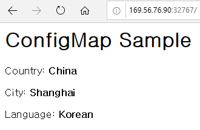
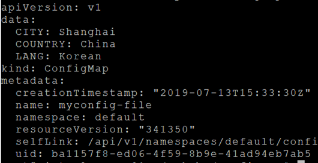
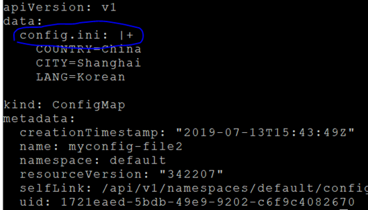
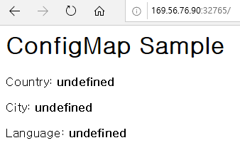
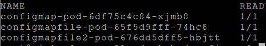
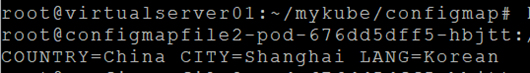
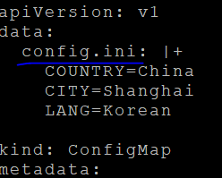
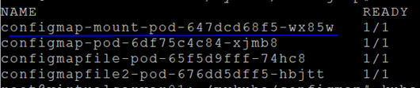
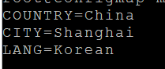

# **환경설정값 이용 : ConfigMap**  

ConfigMap은 여러 프로그램에서 사용할 환경변수를 저장한 resource입니다.   
ConfigMap은 문자열과 파일을 이용하여 생성할 수 있습니다.  

## **Literal(문자열) 방식**  

### **1. 프로그램 작성**  
```javascript
$ vi configmap.js

var http = require('http');
var os = require('os');

http.createServer( function(req, res) {
  res.writeHead( 200, {'Content-Type':'text/html'});
  res.write('<h1>ConfigMap Sample</h1>');
  res.write('<p><p>');
  res.write('Country: <b>'+process.env.COUNTRY+'</b><p>');
  res.write('City: <b>'+process.env.CITY+'</b><p>');
  res.write('Language: <b>'+process.env.LANG+'</b><p>');
  res.end();
}).listen(8080);
```  

### **2. Dockerfile, build, push**  

```dockerfile
$ vi Dockerfile

FROM node:carbon
COPY *.js .
EXPOSE 8080

$ docker build -t ondalk8s/configmap:v1 .
$ docker push ondalk8s/configmap:v1
# Dockerfile에 CMD가 없습니다. Pod배포 시 지정하기 위해 여기서는 지정 안합니다.
```  
### **3. ConfigMap생성**  
```
$ vi myconfig.yaml
```
아래와 같이 data 하위에 key: value 형식으로 정의합니다.  
```yaml
apiVersion: v1
kind: ConfigMap
metadata:
  name: myconfig
data:
  lang: Korean
  country: China
  city: Shanghai
```  
ConfigMap을 생성합니다.  
```
$ kubectl apply -f myconfig.yaml

# configmap을 생성하는 방법은 command line에 --from-literal=<key>=<value>형식으로 파라미터를 지정하여 생성할 수도 있습니다.
예) kubectl create configmap myconfig2 --from-literal=lang=Korean --from-literal=country=China --from-literal=city=Shanghai
```

### **4. Deploy**  
Deployment yaml 생성  
```yaml
apiVersion: apps/v1beta2
kind: Deployment
metadata:
  name: configmap-pod
spec:
  selector:
    matchLabels:
      app: configmap
  replicas: 1
  template:
    metadata:
      name: configmap-pod
      labels:
        app: configmap
    spec:
      containers:
        - name: configmap
          image: ondalk8s/configmap:v1
          imagePullPolicy: Always
          ports:
            - containerPort: 8000
          command: [ "node", "configmap" ]
          env:
            - name: COUNTRY
              valueFrom:
                configMapKeyRef:
                  name: myconfig
                  key: country
            - name: CITY
              valueFrom:
                configMapKeyRef:
                  name: myconfig
                  key: city
            - name: LANG
              valueFrom:
                configMapKeyRef:
                  name: myconfig
                  key: lang
```
* command: Container 구동 시에 command 명령이 수행되어 앱이 실행되게 합니다.  
* env 항목 하위에 container에 제공할 환경변수를 모두 정의합니다.  
* ConfigMap을 사용하지 않고 Pod배포 파일에 바로 지정하려면 아래와 같이 하십시오.  
```
        .... 
        env:
           - name: LANG
              value: Korean
            - name: COUNTRY
              value: China
            - name: CITY
               value: Seoul
```
```console
$ kubectl apply -f deploy.yaml
```

### **5. Service 생성**  
```yaml
$ vi svc.yaml

apiVersion: v1
kind: Service
metadata:
  name: configmap-svc
spec:
  type: NodePort
  selector:
    app: configmap
  ports:
    - name: configmap-port
      port: 80
      protocol: TCP
      targetPort: 8080
      nodePort: 32767
```
외부에 32767포트로 오픈했습니다.
```
$ kubectl apply -f svc.yaml
```
  
### **6. 테스트**  
웹브라우저에서 http://{VM IP}:32767로 접근합니다.  
  
    

 
## **File 방식**  

파일을 이용하여 ConfigMap을 만들 수 있습니다.  
2가지 방식이 있는데 방식에 따라서 Pod배포파일에서 사용하는 방법이 다릅니다.  
먼저, config.ini라는 파일을 아래 내용으로 만듭니다.  
```
COUNTRY=China
CITY=Shanghai
LANG=Korean
```

|파라미터 |설명 |
|---|---|
|--from-env-file |`$ kubectl apply configmap myconfig-file --from-env-file=./config.ini`<br>`$ kubectl get configmap myconfig-file -o=yaml`<br>|
|--from-file |`$ kubectl apply configmap myconfig-file2 --from-file=./config.ini`<br>`$ kubectl get configmap myconfig-file2 -o=yaml`<br>파일명이 key가 됨<br>|  


각 방식별로 실습해 보겠습니다.  
```
kubectl apply configmap myconfig-file --from-env-file=./config.ini
```  

### **1. ConfigMap생성**  
```console
$ kubectl apply configmap myconfig-file --from-env-file=./config.ini
```  

### **2. Pod배포**  
```yaml
$ vi deploy-file.yaml

apiVersion: apps/v1beta2
kind: Deployment
metadata:
  name: configmapfile-pod
spec:
  selector:
    matchLabels: 
      app: configmapfile
  replicas: 1
  template: 
    metadata:
      name: configmapfile-pod
      labels:
        app: configmapfile
    spec:
      containers:
        - name: configmapfile
          image: ondalk8s/configmap:v1
          imagePullPolicy: Always
          ports:
            - containerPort: 8000
          envFrom:
            - configMapRef:
                  name: myconfig-file
```
```
$ kubectl apply -f deploy-file.yaml
```  

### **3. Service 생성**  
```yaml
$ vi svc-file.yaml

apiVersion: v1
kind: Service
metadata:
  name: configmapfile-svc
spec:
  type: NodePort
  selector:
    app: configmapfile
  ports:
    - name: configmapfile-port
      port: 80
      protocol: TCP
      targetPort: 8080
      nodePort: 32766
```   
```
$ kubectl apply -f svc-file.yaml
```

### **4. 테스트**  
웹 브라우저에서 http://{VM IP}:32766 접근  
  
    

---

```
kubectl apply configmap myconfig-file --from-file=./config.ini
```  

### **1. ConfigMap생성**  
```
$ kubectl apply configmap myconfig-file --from-file=./config.ini
```
### **2. Pod배포**  
```yaml
$ vi deploy-file2.yaml

apiVersion: apps/v1beta2
kind: Deployment
metadata:
  name: configmapfile2-pod
spec:
  selector:
    matchLabels:
      app: configmapfile2
  replicas: 1
  template:
    metadata:
      name: configmapfile2-pod
      labels:
        app: configmapfile2
    spec:
      containers:
        - name: configmapfile
          image: ondalk8s/configmap:v1
          imagePullPolicy: Always
          ports:
            - containerPort: 8000
          command: [ "node", "configmap" ]
          env:
            - name: CONFIG
              valueFrom:
                configMapKeyRef:
                  name: myconfig-file2
                  key: config.ini  
```
파일명이 key가 되어 아래와 같이 configmap이 만들어지므로, 위 파일과 같이  
  
    
  
```
$ kubectl apply -f deploy-file2.yaml
```  

### **3. Service 생성**  
```yaml
$ vi svc-file2.yaml

apiVersion: v1
kind: Service
metadata:
  name: configmapfile2-svc
spec:
  type: NodePort
  selector:
    app: configmapfile2
  ports:
    - name: configmapfile-port
      port: 80
      protocol: TCP
      targetPort: 8080
      nodePort: 32765
```
```
$ kubectl apply -f svc-file2.yaml
```

### **4. 테스트**  
웹 브라우저에서 http://{VM IP}:32765 접근  
값이 제대로 안 나올것입니다.  
소스에 process.env.CONFIG로 불러서 문자열을 parsing하여 표시하도록 바꿔야 제대로 나옵니다.  
  
    

테스트로 Pod내로 들어가 CONFIG환경변수가 어떻게 리턴되는지 봅시다.  
```
$ kubectl get pod
```  
  
    
  
```
$ kubectl exec -it configmapfile2-pod-676dd5dff5-hbjtt bash
$ echo $CONFIG
```

     
  
---  

## **ConfigMap을 Pod 내에 mount하여 사용**  
--from-file로 만든 configmap은 Pod내에 파일로 mount하여 Pod내 프로그램에서 참조할 수 있습니다.  

### **1. ConfigMap생성**  
```
$ kubectl apply configmap myconfig-file --from-file=./config.ini
```  

### **2. Pod배포 yaml생성/실행**  
```yaml
$ vi deploy-mount.yaml

apiVersion: apps/v1beta2
kind: Deployment
metadata:
  name: configmap-mount-pod
spec:
  selector:
    matchLabels:
      app: configmap-mount
  replicas: 1
  template:
    metadata:
      name: configmap-mount-pod
      labels:
        app: configmap-mount
    spec:
      containers:
        - name: configmap-mount
          image: ondalk8s/configmap:v1
          imagePullPolicy: Always
          ports:
            - containerPort: 8000
          command: [ "node", "configmap" ]
          volumeMounts:
            - name: myvol
              mountPath: /config
      volumes:
        - name: myvol
          configMap:
            name: myconfig-file2  
```  

myconfig-file2라는 ConfigMap을 Pod의 /config에 파일로 생성합니다. 이때 생성되는 파일명은 myconfig-file2 의 key명입니다.  
  
    
  
```
$ kubectl apply deploy-mount.yaml
```

### **3. 테스트**  
실행된 Pod내에서 /config/config.ini값을 체크해 봅니다.

```
$ kubectl get pod 
```  
  
    

```
$ kubectl exec -it configmap-mount-pod-647dcd68f5-wx85w bash
$ cd /config && cat config.ini
```  
  
    
  

※ 다음 장 실습을 위해 생성한 모든 resource를 삭제해 주세요.  

