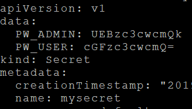
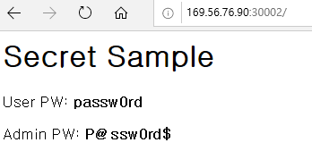
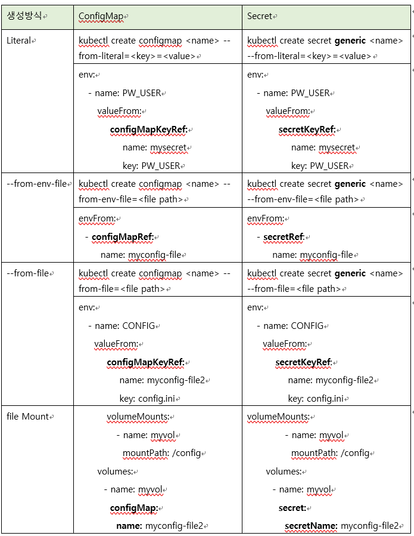

# **인증정보를 위한 환경설정값 이용: Secret**  

Secret은 암호, 인증정보를 저장하고 있는 Resource type입니다.  
인증정보를 사용하는 예제는 4.4 Service 로드밸런싱: Ingress를 참조하시기 바랍니다.  
Secret은 보안을 위해 메모리에 적재됩니다. 하나의 Secret의 최대 size는 1M입니다.  
본 장에서는 사용자암호와 관리자암호를 Secret에 저장하여 사용하는 예제를 학습하도록 하겠습니다.  

## **Literal(문자열)로 생성**  


### **1. 디렉토리 생성**  
```
$ mkdir ~/mykube/secret && cd ~/mykube/secret
```
### **2. 프로그램 작성**
```javascript
$ vi secret.js

var http = require('http');
var os = require('os');

http.createServer( function(req, res) {
  res.writeHead( 200, {'Content-Type':'text/html'});
  res.write('<h1>Secret Sample</h1>');
  res.write('<p><p>');
  res.write('User PW: <b>'+process.env.PW_USER+'</b><p>');
  res.write('Admin PW: <b>'+process.env.PW_ADMIN+'</b><p>');
  res.end();
}).listen(8080);
```

### **3. build,push**  
```dockerfile
# vi Dockerfile

FROM node:carbon
EXPOSE 8080
COPY . .
WORKDIR .
CMD node secret

$ docker build -t ondalk8s/secret:v1 .
$ docker push ondalk8s/secret:v1
```
### **4. Secret 생성**  
```console
$ kubectl create secret generic mysecret --from-literal=PW_USER=passw0rd --from-literal=PW_ADMIN=P@ssw0rd$

# generic은 문자열이나 디렉토리/파일에서 읽어 secret을 만드는 명령입니다.
$ kubectl get secret mysecret -o=yaml
```  
  
    

```yaml
# yaml파일로 Secret을 생성하려면 위와 같은 형식으로 만들면 됩니다. 

apiVersion: v1
kind: Secret
metadata:
  name: mysecret
data:
  PW_USER: cGF....
  PW_ADMIN: UEB....
```
```console
# 값은 base64로 encoding된 값입니다. base64 encoding/decoding은 echo 명령을 이용하면 편합니다.
$ echo "passw0rd" | base64
$ echo "cGFzc3cwcmQK" | base64 -d
```

### **5. Pod배포파일 정의**  
```yaml
# vi deploy.yaml

apiVersion: apps/v1beta2
kind: Deployment
metadata:
  name: secret-pod
spec:
  selector:
    matchLabels:
      app: secret
  replicas: 1
  template:
    metadata:
      name: secret-pod
      labels:
        app: secret
    spec:
      containers:
        - name: secret
          image: ondalk8s/secret:v1
          imagePullPolicy: Always
          ports:
            - containerPort: 8000
          env:
            - name: PW_USER
              valueFrom:
                secretKeyRef:
                  name: mysecret
                  key: PW_USER
            - name: PW_ADMIN
              valueFrom:
                secretKeyRef:
                  name: mysecret
                  key: PW_ADMIN
```
```console
# ConfigMap에서의 configmapKeyRef가 Secrect에서는 secretKeyRef로 바뀌면 됩니다.
$ kubectl create -f deploy.yaml
```

### **6. Service**  
```yaml
$ vi svc.yaml

apiVersion: v1
kind: Service
metadata:
  name: secret-svc
spec:
  type: NodePort
  selector:
    app: secret
  ports:
    - name: http
      port: 80
      protocol: TCP
      targetPort: 8080
      nodePort: 30002
```
```console
$ kubectl create -f svc.yaml
```

### **7. 테스트**  
웹 브라우저를 열고 http://{VM IP}:30002로 접근하십시오.  
  
    

파일을 이용하여 Secret을 만드는 방법은 ConfigMap과 동일합니다.  
이 부분은 Config Map의 설명을 참조하여 각자 실습하시기 바랍니다.  
아래 표는 각 방식별로 ConfigMap과 다른 점입니다.  

  


