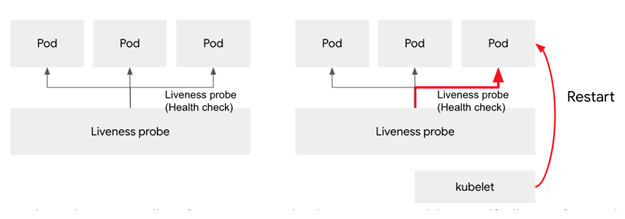
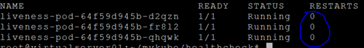
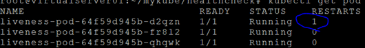
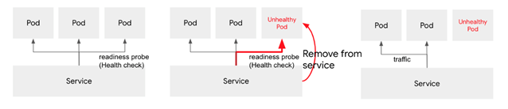
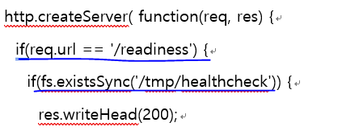
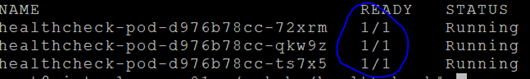
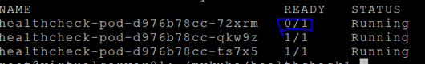
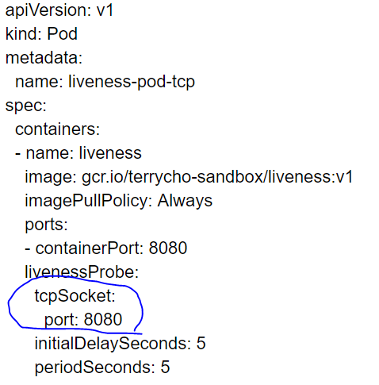

# **Pod 생존 및 사용가능성 검사: Health check & Auto healing**  

쿠버네티스는 각 컨테이너의 상태를 주기적으로 체크해서, 문제가 있는 컨테이너를 자동으로 재시작하거나 또는 문제가 있는 컨테이너(Pod)를 서비스에서 제외할 수 있습니다. 이러한 기능을 헬스 체크라고 하는데, 크게 두가지 방법이 있습니다.  

컨테이너가 살아 있는지 아닌지를 체크하는 방법이 Liveness probe 그리고 컨테이너가 서비스가 가능한 상태인지를 체크하는 방법을 Readiness probe 라고 합니다. (Probe: 조사)  

Liveness probe와 Readiness Probe에서 사용하는 방법은 3가지가 있습니다.  
- Command Probe: shell 명령을 수행하여 결과값에 따른 처리  
- HTTP Probe: http get명령을 수행하여 결과값에 따른 처리  
- TCP Probe: 지정된 포트에 TCP로 연결을 시도하여 결과값에 따른 처리  

본 장에서는 Liveness는 Command Probe방식으로, Readiness는 HTTP Probe방식으로 실습해 보도록 하겠습니다.  

## **Liveness Probe**  
  
    
  
Liveness Probe는 실패 시 해당 Pod를 재시작 시킵니다.  
  
### **1. 디렉토리 생성**  
```console
$ mkdir ~/mykube/healthcheck && cd ~/mykube/healthcheck
```

### **2. 프로그램 작성**  
```javascript
$ vi app.js

var os = require('os');
var http = require('http');
var fs = require('fs');

http.createServer( function(req, res) {
  if(req.url == '/readiness') {
    if(fs.existsSync('/tmp/healthcheck')) {
      res.writeHead(200);

      res.end('Ready! hostname:'+os.hostname());
    } else {
      res.writeHead(500);
      res.end('Not ready! hostname:'+os.hostname());
    }
  } else {
    res.writeHead(200, { "Content-Type":"text/plain" });
    res.write("Hello node! hostname:"+os.hostname());
    res.end();
  }
}).listen(8080);
```  
요청되는 url이 /readiness이면 tmp/healthcheck라는 파일이 있는지 검사하여 그 결과를 200 또는 500코드로 리턴합니다.  

### **3. build, push**  
```dockerfile
$ vi Dockerfile

FROM node:carbon
EXPOSE 8080
COPY app.js .
COPY healthcheck /tmp
CMD node app.js
```
```console
$ touch healthcheck
# 빈 healthcheck파일 생성

$ docker build -t ondalk8s/healthcheck:v1 .
$ docker push ondalk8s/healthcheck:v1
```

### **4. Pod배포**  
```yaml
$ vi liveness.yaml

apiVersion: extensions/v1beta1
kind: Deployment
metadata:
  name: liveness-pod
spec:
  selector:
    matchLabels:
      app: liveness
  replicas: 3
  template:
    metadata:
      name: liveness-pod
      labels:
        app: liveness
    spec:
      containers:
        - name: liveness
          image: ondalk8s/healthcheck:v1
          imagePullPolicy: Always
          ports:
            - containerPort: 8080
          livenessProbe:
            exec:
              command:
                - cat
                - tmp/healthcheck
            initialDelaySeconds: 5
            periodSeconds: 5
```
- initialDelaySeconds: Pod가 모두 running상태가 된 후 5초후에 체크 시작
- periodSeconds: 5초 마다 Healthcheck 수행
```console
$ kubectl apply -f liveness.yaml
```

### **5. 테스트**  
3개의 Pod가 실행중인 것 확인. 재시작 횟수는 모두 0임.
```console
$ kubectl get pod
```  
  
    

첫번째 Pod의 tmp/healthcheck파일을 수동으로 삭제  
```
$ kubectl exec -t liveness-pod-64f59d945b-d2qzn rm /tmp/healthcheck
```
5~6초 후에 pod 리스트를 다시 조회합니다.  
```
$ kubectl get pod
```
첫번째 Pod가 재시작한것을 확인할 수 있습니다. 이제는 /tmp/healthcheck 파일이 있기 때문에 더 이상 재시작 하지는 않습니다.  
  
    

 
 ---  

## **Readiness Probe**  
  
    

readiness probe는 문제 있는 Pod를 서비스에서 격리시킵니다.  
  

### **1. Pod배포파일 생성**  
```yaml
# ~/mykube/healthcheck 폴더
$ vi healthcheck.yaml

apiVersion: extensions/v1beta1
kind: Deployment
metadata:
  name: healthcheck-pod
spec:
  selector:
    matchLabels:
      app: healthcheck
  replicas: 3
  template:
    metadata:
      name: healthcheck-pod
      labels:
        app: healthcheck
    spec:
      containers:
        - name: healthcheck
          image: ondalk8s/healthcheck:v1
          imagePullPolicy: Always
          ports:
            - containerPort: 8080
           readinessProbe:
            httpGet:
              path: /readiness
              port: 8080
            initialDelaySeconds: 5
            periodSeconds: 5
```
* Pod가 모두 running상태가 되고 5초 후에 체크를 시작하고, 5초마다 http로 /readiness를 8080포트로 호출합니다.  
* 리턴코드가 200 또는 300대가 아니면 실패로 간주합니다.  
```console
$ kubectl apply -f healthcheck.yaml
```

### **2. 서비스 배포**  
```yaml
$ vi svc.yaml

apiVersion: v1
kind: Service
metadata:
  name: mysvc
spec:
  selector:
    app: healthcheck
  type: NodePort
  ports:
  - name: myport
    port: 80
    protocol: TCP
    targetPort: 8080
```
```console
$ kubectl apply -f svc.yaml
```  
### **3. 테스트**  
app.js의 소스를 보면, /readiness가 호출되었을때 /tmp/healthcheck파일이 있는지 없는지에 따라서 결과를 리턴합니다.  따라서, 특정 Pod의 /tmp/healthcheck파일을 삭제하여 테스트할 수 있습니다.  
  
    

```console
$ kubectl get pod
```  
  
    

```console 
$ kubectl exec -it healthcheck-pod-d976b78cc-72xrm -- rm /tmp/healthcheck
```
5~6초 후에 다시 pod 리스트를 확인하십시오.  
```
$ kubectl get pod
```  
  
    
  

첫번째 Pod는 서비스에서 제외 된것을 확인할 수 있습니다.  
  

---

## **TCP Probe**  
  
TCP Probe는 실습하지 않고 예제를 통하여 사용법만 이해하고 넘어가겠습니다.  
아래와 같이 tcpSocket이라는 항목에 port를 지정하면 됩니다.  
  
    
  


   

