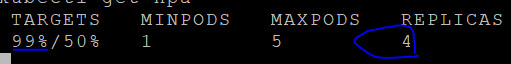

# **Auto scaling: HorizontalPodAutoscaler**  

Pod 실행 시 CPU와 Memory의 Limit를 지정하고, HPA(Horizontal Pod Authscaler)를 이용하여 자동하여 Pod를 늘리거나 줄일 수 있습니다.  

간단한 실습을 통해 HPA에 대하여 이해하시기 바랍니다.  

자세한 설명은 여기를 참조하십시오.  
https://kubernetes.io/ko/docs/tasks/run-application/horizontal-pod-autoscale-walkthrough/  
  

실습은 myapp image를 이용하여 2개의 Pod를 배포한 후, HPA를 이용하여 1개에서 5개까지 자동으로 Scale In/Out하도록 하는것입니다.  

## **1. 작업디렉토리 작성**  
```console
$ mkdir -p ~/mykube/scale && cd ~/mykube/scale
```
## **2. metrics-server 실행**  
```console
$ minikube addons enable metrics-server
# HPA에서는 metric server에서 취합한 정보를 이용하여 scaling합니다.
```

## **3. Pod배포파일 생성**  
```yaml
$ vi deploy.yaml

apiVersion: apps/v1
kind: Deployment
metadata:
  name: deploy-myapp
spec:
  selector:
    matchLabels:
      app: myapp
      ver: v1
  replicas: 2
  template:
    metadata:
      name: pod-myapp
      labels:
        app: myapp
        ver: v1
    spec:
      containers:
        - name: myapp
          image: ondalk8s/myapp:v1
          imagePullPolicy: Always
          ports:
            - name: port-myapp
              containerPort: 10001
          resources:
            requests:
              cpu: 50m
              memory: 50Mi
            limits:
              cpu: 100m
              memory: 100Mi
```
```console
$ kubectl apply -f deploy.yaml
```

## **4. Service**  
```yaml
$ vi svc.yaml

apiVersion: v1
kind: Service
metadata:
  name: svc-myapp
spec:
  selector:
    app: myapp
    ver: v1
  ports:
    - name: port-myapp
      port: 80
      targetPort: 8080
  type: NodePort
```
```console
$ kubectl apply -f svc.yaml
```

## **5. HPA**  
```yaml
$ vi hpa.yaml

apiVersion: autoscaling/v1
kind: HorizontalPodAutoscaler
metadata:
  name: hpa-myapp
spec:
  scaleTargetRef:
    apiVersion: apps/v1
    kind: Deployment
    name: deploy-myapp
  minReplicas: 1
  maxReplicas: 5
  targetCPUUtilizationPercentage: 50
```
deploy-myapp을 모니터링하여 CPU사용량이 50%를 넘으면 5개까지 Scale Out합니다.  
```console
$ kubectl apply -f hpa.yaml
```  

## **6. 부하주기**  
```console
# 새로운 터미널을 생성합니다.  
$ kubectl run -it load-generator --image=busybox /bin/sh

# 프람프트가 뜨면 아래 명령을 실행합니다.
$ while true; do wget -q -O- http://svc-myapp; done
```  

## **7. 진행상황보기**  
다시 원래 터미널로 돌아와 아래 명령어로 상태를 봅니다.  
처음에는 2개일겁니다.  
```console
$ kubectl get hpa
```  
  
    
  
몇 분 정도 기다렸다가, 다시 hpa상태를 보십시오.  
```console
# kubectl get hpa
```  
  
    

부하주기를 중단하고, 또 몇 분 정도 기다렸다가 hpa상태를 보십시오.  
```console
$ kubectl get hpa
```

다음 장 실습을 위해 모든 resource를 삭제하십시오.


 [](../attachments/scale.zip) 