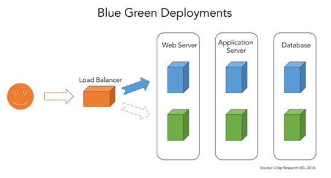
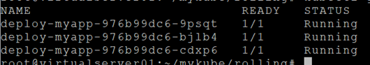

# **무중단 업그레이드/롤백하기**  

새로운 버전을 서비스 중단없이 배포하고, 문제 발생 시 롤백하는 방법에는 Blue/Green방식, 롤링업데이트 방식, 카나리 방식등이 있습니다.  

본 장에서는 롤링업데이트와 카나리 방식을 체험해 보도록 하겠습니다. Blue/Green방식은 아래 링크를 참조하세요.  

https://www.ianlewis.org/en/bluegreen-deployments-kubernetes  

- Blue/Green: 신버전(Blue)을 구버전(Green)과 동일한 테스트 및 운영환경에 설치합니다. Blue버전에서 모든 테스트가 끝나면, Green 버전으로 보내던 트래픽을 Blue버전으로 보내서 업그레이드를 합니다.  

  
  

- 롤링업데이트:  구버전은 하나씩 줄이고, 신버전은 하나씩 늘리면서 업그레이드하는 방법입니다. 무중단배포 시 가장 많이 사용하는 방법 중 하나입니다.  

  
  
  
  
   출처: 조대협의 블로그  

- 카나리 배포: 신버전을 미리 배포하여 문제가 없는지 시험한 후 업그레이드하는 방법입니다. 새 기능 미리 체험하기 서비스를 오픈하여 피드백을 받은 후 보완해서 업그레이드 하는 방법입니다.  
  

## **롤링업데이트**  

예전에는 RC(Replication Controller)를 이용했으나, 최근에는 Deployment가 더 쉽기 때문에 이걸 더 많이 사용합니다. 우리는 Deployment controller를 이용한 방법을 실습해 보겠습니다.  

### **1. 작업디렉토리 작성**  
```
$ mkdir -p ~/mykube/rolling && cd ~/mykube/rolling
```
### **2. 프로그램 준비**  
```javascript
$ vi myapp-v1.js

var http = require('http');
http.createServer(function(req, res) {
  res.writeHead(200, {'Content-Type':'text/plain'});
  res.write('This is Version1 service');
  res.end();
}).listen(8080);
```
```javascript
$ vi myapp-v2.js

var http = require('http');
http.createServer(function(req, res) {
  res.writeHead(200, {'Content-Type':'text/plain'});
  res.write('This is Version2 service');
  res.end();
}).listen(8080);
```

### **3. build, push**  
```dockerfile
$ vi build-v1

FROM node:carbon
EXPOSE 8080
COPY myapp-v1.js .
CMD node myapp-v1
```
```dockerfile
$ vi build-v2

FROM node:carbon
EXPOSE 8080
COPY myapp-v2.js .
CMD node myapp-v2
```
```console
$ docker build -f build-v1 -t ondalk8s/myapp:v1.0 .
$ docker build -f build-v2 -t ondalk8s/myapp:v2.0 .
$ docker push ondalk8s/myapp:v1.0
$ docker push ondalk8s/myapp:v2.0
```

### **4. Pod배포파일 생성**  
```yaml
$ vi deploy.yaml

apiVersion: apps/v1
kind: Deployment
metadata:
  name: deploy-myapp
spec:
  selector:
    matchLabels:
      app: myapp
  replicas: 3
  template:
    metadata:
      name: pod-myapp
      labels:
        app: myapp
    spec:
      containers:
        - name: myapp
          image: ondalk8s/myapp:v1.0
          imagePullPolicy: Always
          ports:
            - name: port-myapp
              containerPort: 10001         
```
버전 1.0으로 먼저 배포합니다.  
```console
$ kubectl apply -f deploy.yaml
```

### **5. Service 생성**  
```yaml
$ vi svc.yaml

apiVersion: v1
kind: Service
metadata:
  name: svc-myapp
spec:
  selector:
    app: myapp
  ports:
    - name: port-myapp
      port: 80
      targetPort: 8080
  type: NodePort
```  
이제 version 1.0으로 사용자들에게 서비스를 시작했습니다.  
  
    


### **6. 신 버전 배포**  
새로운 version 2.0으로 서비스를 중단하지 않고 배포를 해 보겠습니다.  
방법은 간단합니다.  

`kubectl set image deployment`명령을 이용해서 Pod내의 각 컨테이너의 이미지를 새 버전으로 바꿔주기만 하면 됩니다.  
```console
# kubectl set image deployment <deploy 명> <컨테이너명>=<Image 경로>  
$ kubectl set image deployment deploy-myapp myapp=ondalk8s/myapp:v2.0
```
또 다른 방법은 pod배포 yaml파일을 변경한 후 `kubectl replace -f <yaml 파일 경로>`를 이용하는 방법도 있습니다.  
또는 `kubectl edit deployment` 명령어로 직접 Image를 바꿀 수도 있습니다.
```console
$ kubectl edit deploy deploy-myapp
```
어떠한 방법이든, Image를 새 버전으로 바꾸고 적용하면 아래와 같이 구 버전은 순차적으로 제거되고, 새 버전이 적용되게 됩니다.   
  
    
    
   
 
### **7. 롤백하기**  
롤백도 새버전을 배포하는것과 동일하게 Image 경로만 바꿔주면 됩니다.  
하지만 Pod내에 컨테이너가 여러개라면 Pod전체를 이전 버전으로 롤백하는게 더 편하겠죠.  

`kubectl rollout undo deployment <deploy 명> --to-revison=<롤백 버전명>`과 같이 롤백이 가능합니다.  
여기서 롤백 버전명을 확인하려면 `kubectl rollout history` 명령을 사용하십시오.  
```console
$ kubectl rollout history deploy deploy-myapp
```  
  
    

시간 순서대로 롤백 버전명이 표시됩니다. 즉, 1이 처음, 2가 그 다음 버전입니다.  
한번 이전 버전으로 롤백을 해 봅시다.  
```console
$ kubectl rollout undo deploy deploy-myapp --to-revision=1
```  
  
    
  
구 버전으로 하나씩 롤백 되는게 보일겁니다.  

**※ rollback history에 change-cause 남기기**  

위 rollback history의 change-cause에 아무것도 안 보여서 불편하실 겁니다.  
실제 운영시에는 업그레이드나 롤백 시 간단한 메모를 남기는것이 좋을겁니다.  
kubectl annotate명령으로 현재 배포에 change-cause를 update할 수 있습니다.  
```console
$ kubectl annotate deploy deploy-myapp kubernetes.io/change-cause="initial deploy:2019-11-11 19:23:20"
```  
또는 Pod배포 yaml파일에 annotations 항목을 이용할 수도 있습니다.  
  
    

---

## **카나리 배포**  

새 기능 체험 서비스를 현재 버전과 같이 서비스하는 배포 방식입니다. k8s에서는 label을 이용하여 새 서비스를 현재 서비스에 병행 사용하게 할 수 있습니다.  

### **1. v1.0으로 Pod배포**  
실습을 위해 기존 배포는 다시 v1.0으로 돌립니다.
```console
$ kubectl delete deploy deploy-myapp
$ vi deploy.yaml
```
label에 version을 추가합니다.  
  
    
  
```console
$ cp deploy.yaml deploy2.yaml
$ vi deploy2.yaml
```
version2.0용 yaml파일을 만들고, label의 version과 image경로를 수정합니다.  
1개 Pod만 투입합니다.  
  
  i  
  
두 버전을 모두 배포합니다.  
```console
$ kubectl apply -f deploy.yaml
$ kubectl apply -f deploy2.yaml
$ kubectl get pod
```  
  
    

### **2. Service생성**  
ver1.0과 ver2.0이 모두 서비스 될 수 있도록, selector의 label에는 ver 태그를 사용하지 않습니다.  
```yaml
apiVersion: v1
kind: Service
metadata:
  name: svc-myapp
spec:
  selector:
    app: myapp
  ports:
    - name: port-myapp
      port: 80
      targetPort: 8080
  type: NodePort
```  

### **3. 테스트**  
`$ kubectl get svc` 로 외부 port 확인 후 웹 브라우저에서 페이지를 계속 refresh하면서 테스트.  
version2 page가 안 보이면 `kubectl edit deploy deploy-myapp`명령으로 들어가 replicas수를 1로 줄여 보십시오.  
    
  
 


