# **Kubernetes 보안**   

NewStack(신기술 관련 뉴스와 분석 서비스 회사)이 2017년에 발표한 자료 보면, k8s사용자가 가장 우려하고 있는 것이 보안이라는 조사결과가 있습니다.  

k8s가 보안에 취약하다는 의미가 아니라 컨테이너화된 분산 서비스들의 보안이 그만큼 어렵다는 뜻일 것입니다.  
또한, 가장 중요한 것 중의 하나가 보안이라고 많은 사람들이 생각하고 있다는 거죠.  
  
  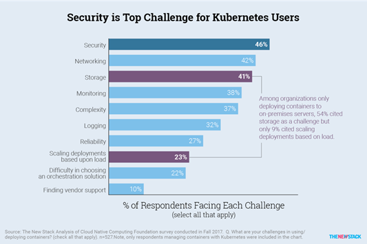  

이번 5장에서는 기본적인 쿠버네티스의 보안 요소를 설명하겠습니다.  
minikube에서는 보안요소에 대한 실습하기 어렵습니다. 실제 예제를 통해 개념을 이해할 수 있도록 하겠습니다.  

## **보안-인증과 권한관리(RBAC)**  

### **1) 인증**  

인증의 방식에는 아래와 같이 3가지 방법이 있습니다. 결론적으로 말하면 가장 많이 사용하는 방식은 Access Token 방식인데 이것도 실제 운영에서는 proxy서버를 이용하여 더 쉽게 사용할 수 있습니다.  

- Basic HTTP Auth: id/pw를 URL의 파라미터로 전달하는 방식  
- Access Token: HTTP헤더에 인증토큰값을 전달하는 방식  
- Client Cert: 개인인증서 사용 방식  

 
Access Token이용 사용 예제는 아래와 같습니다. secret에 미리 저장해 놓은 인증정보를 header에 심어서 인증시키는 방식입니다.  
  
  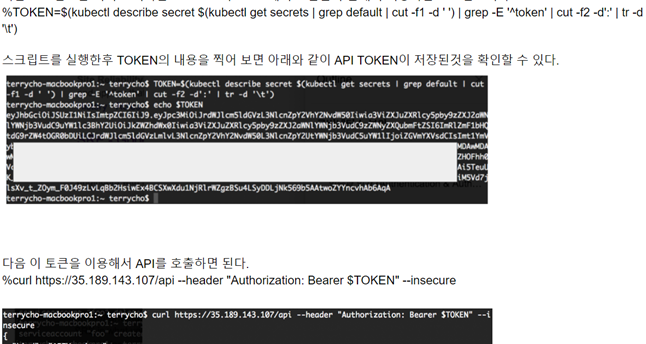  
출처: 조대협의 블로그  
  

하지만, 실제 운영환경에서는 SDK를 이용하여 인증을 구현하게 됩니다.  
SDK도 secret에 있는 인증정보를 이용하여 인증 처리를 합니다. SDK는 아래 링크를 참조하십시오.  
https://kubernetes.io/docs/reference/using-api/client-libraries/#officially-supported-kubernetes-client-libraries  

### **2) 권한관리**  

k8s의 권한관리 체계는 Role기반입니다. 이를 줄여서 RBAC(알백-Role Based Access Control)이라고 부릅니다.  
간단히 말하면 리소스에 대한 권한을 Role로 정의하고, 사용자/그룹과 Role을 연결해 주는 RoleBinding을 통해 권한을 부여하는 방식입니다.  
아래 예제를 통해 다시 설명 드리겠습니다.  
  
  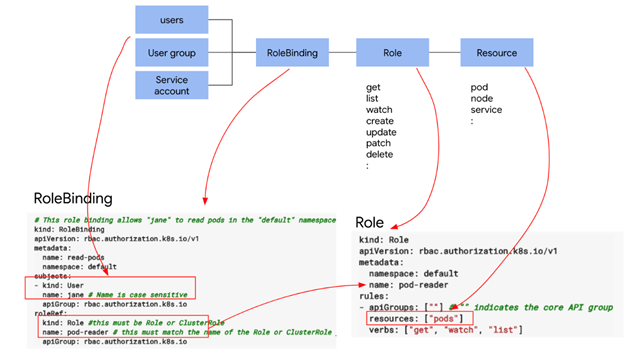  
출처: 조대협의 블로그  

- Role정의: Pod리소스에 get, watch, list권한을 부여한 pod-reader Role을 작성  
- RoleBinding: Jane이라는 사용자에게 pod-reader Role을 연결함  
* Service Account: 사용자 유형 중 사람이 아닌 시스템 계정을 의미함  

Role에는 일반 Role과 Cluster Role이 있습니다. Cluster Role은 전체 cluster에 적용되는 role이고, 일반 Role은 특정 namespace에 적용되는 role입니다.  
Cluster Role은 편의를 위해 미리 정해진 아래와 같은 role이 있습니다.  
  
  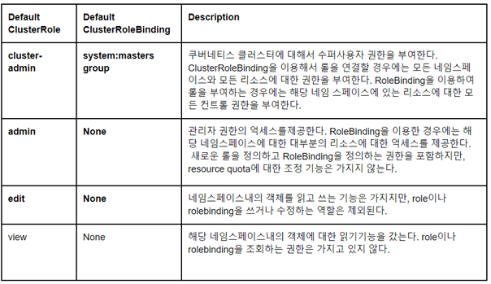  
  
아래 예제는 sa-viewer는 Service Account를 만들고 view라는 cluster role을 binding한 것입니다.  
  
  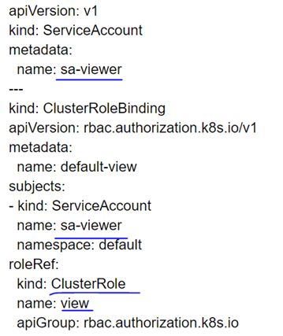  
출처: 조대협의 블로그  

RBAC에 대한 보다 자세한 내용은 아래 link를 참조하세요.  
https://kubernetes.io/docs/reference/access-authn-authz/rbac/  

---

## **보안-Pod에 대한 Inbound/Outbound 트래픽 통제: NetworkPolicy**  

지금부터 3가지 개념의 보안 요소를 설명할텐데 각 요소의 역할은 아래와 같습니다.  
- Network Policy: Pod로의 in/out 권한 제어  
- Security Context: 1) Pod 또는 Container를 실행하는 User/Group제어와 2) Pod/Container가 Host 머신 커널에 대한 수행권한을 제어  
- Pod Security Policy: Pod/Container에 적용할 보안 정책 정의  
  
  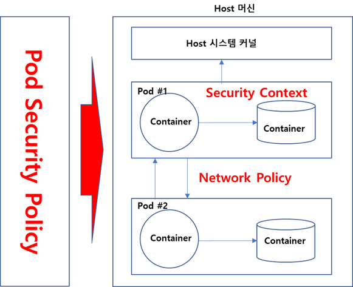  

예제를 통해 Network Policy를 설명하도록 하겠습니다.  
  
  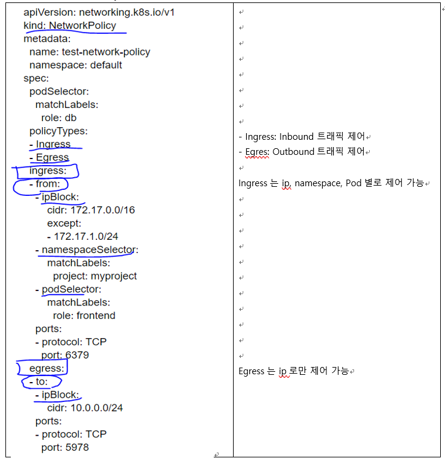  
  
※ TIP: 상황별 Network Policy 예제는 아래 링크를 참조하십시오. 꼭 보시기 바랍니다.  
  
  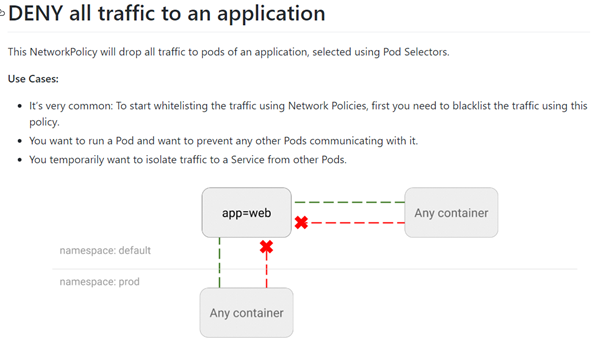  

https://github.com/ahmetb/kubernetes-network-policy-recipes  

## **보안-Container, Pod, Node에 대한 실행자와 권한 통제: SecurityContext**  

Security Context는 **1) Pod 또는 Container를 실행하는 User/Group제어와 2) Pod/Container가 Host 머신 커널에 대한 수행권한을 제어**하기 위해 사용됩니다.  

### **1) Pod/Container 실행 User/Group제어 예제**  
  
  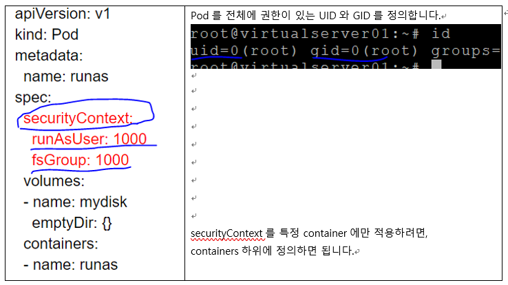  

### **2) Host 커널 접근 제어 예제**  
  
  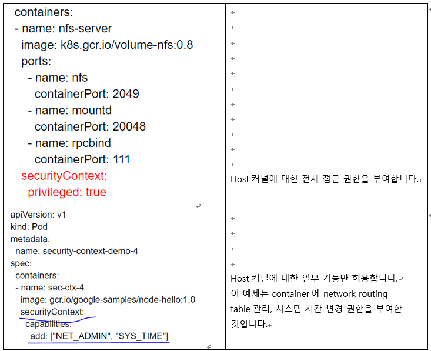  

더 자세한 내용은 여기를 참조 하십시오.  
https://kubernetes.io/docs/tasks/configure-pod-container/security-context/  

## **보안-Pod에 대한 보안정책 관리: PodSecurityPolicy(PSP)**  

Pod를 생성할 때 Pod에 적용된 Security Context와 Cluster전체에 적용된 Pod Security Policy를 비교하여 위배가 된다면 Pod 생성을 중단시키는 보안 기능입니다. 대표적인 예는 아래와 같이 PSP는 Host커널 접근을 금지 시켰는데, Pod에서는 접근하겠다고 권한을 부여하려고 하면 Pod생성을 중단시키는 것입니다.  
  
  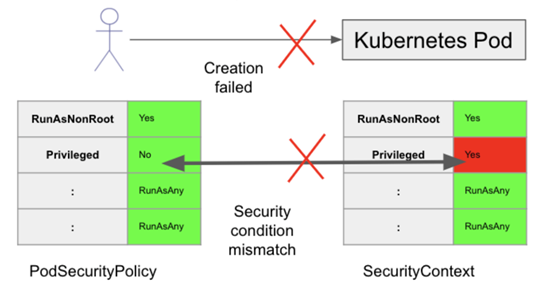  

PSP는 클러스터 내의 모든 Pod에 적용됩니다.  
PSP의 보안 정책 리스트는 아래와 같습니다.  
  
  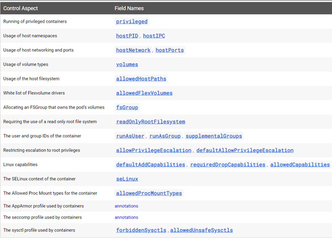  

  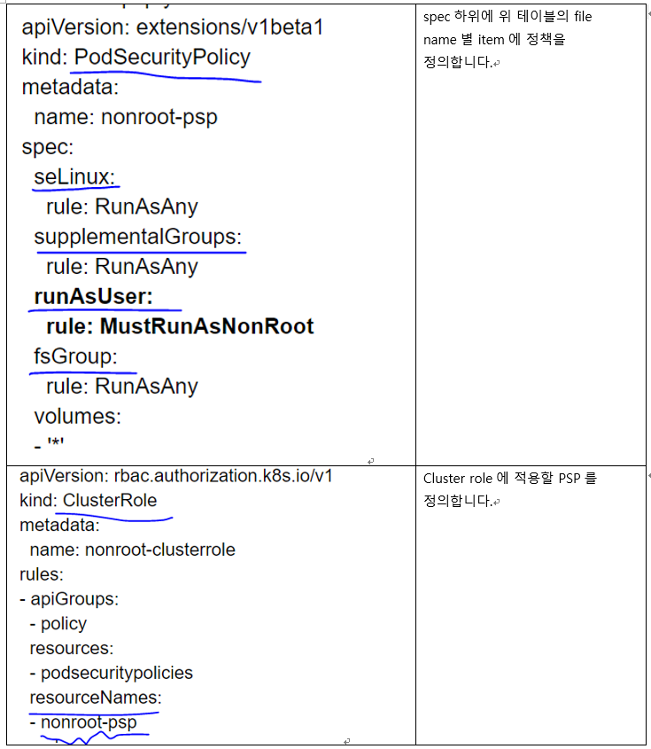  
  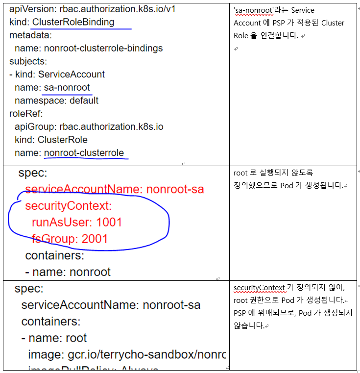  

# **Summary**  

지금까지 Kubernetes에 대해 아래 과정을 학습하였습니다.  
- 1장 What is Kubernetes : k8s의 필요성과 아키텍처에 대해 이해
- 2장 설치하기: kubectl, Minikube 설치
- 3장 Getting Started: k8s대시보드로 개발에서 배포까지 체험하고, kubectl 주요 명령어를 학습
- 4장 Kubernetes Resources 이해: k8s 리소스 type인 Volume, Pod배포 Controllers, Service, Ingress, ConfigMap, Secret에 대해 이해하고, 운영을 위한 health check, Auto Scaling, 무중단 배포, 모니터링에 대해 학습
- 5장 Kubernetes 보안: 인증과 권한관리(RBAC), Network Policy, Security Context, Pod Security Policy에 대해 이해
  
여기까지 학습하시느라 정말 수고 많으셨습니다.  

본 교재가 여러분이 Kubernetes를 시작하는데 조금이나마 보탬이 되기를 희망하며,  
  
여러분의 Cloud 여행이 즐거우시길 빕니다.   
  
감사합니다. 