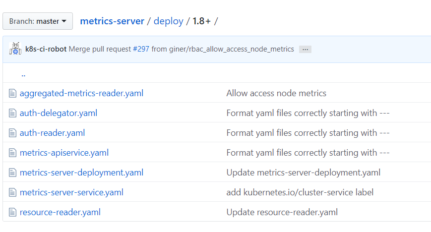
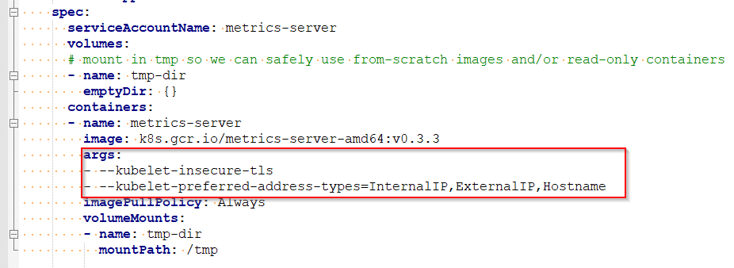
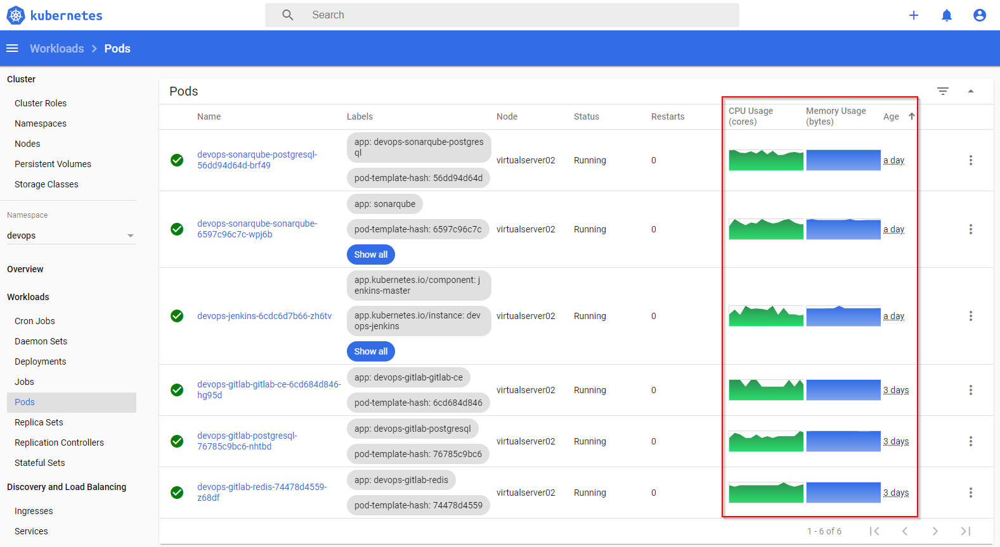

# k8s metrics server 설치

## metrics-server 설치

```console
git clone https://github.com/kubernetes-incubator/metrics-server.git
cd metrics-server
kubectl apply -f deploy/1.8+/
# 해당 폴더에 있는 7개 yaml 파일 적용 -> 아래 이미지 참고
```


인증서 관련 설정 변경 필요 -> metrics-server-deployment.yaml 파일 수정

```
# edit metric-server deployment to add the flags
# args:
# - --kubelet-insecure-tls
# - --kubelet-preferred-address-types=InternalIP,ExternalIP,Hostname
$ kubectl edit deploy -n kube-system metrics-server
```


```console
# 몇분후 아래 명령어로 확인
root@virtualserver01:~/work# kubectl get apiservices |egrep metrics
v1beta1.metrics.k8s.io                 kube-system/metrics-server   True        23m
```

```console
root@virtualserver01:~/work# kubectl top node
NAME              CPU(cores)   CPU%   MEMORY(bytes)   MEMORY%
virtualserver01   296m         14%    2324Mi          29%
virtualserver02   551m         27%    5628Mi          71%
```


