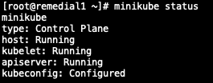
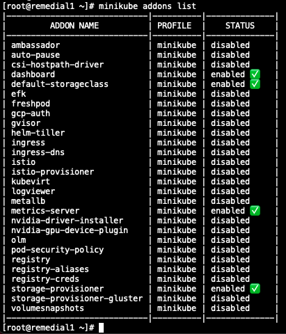

# minikube install on centos

```console
# minikube 설치
curl -Lo minikube https://storage.googleapis.com/minikube/releases/latest/minikube-linux-amd64 && chmod +x minikube

# minikube start
./minikube start --vm-driver=none

# 위 명령어로 실행시 오류나면 아래 설치
yum install -y conntrack


# kubectl 설치 repo 추가
cat <<EOF > /etc/yum.repos.d/kubernetes.repo 
[kubernetes] 
name=Kubernetes 
baseurl=https://packages.cloud.google.com/yum/repos/kubernetes-el7-x86_64 
enabled=1 
gpgcheck=1 
repo_gpgcheck=1 
gpgkey=https://packages.cloud.google.com/yum/doc/yum-key.gpg https://packages.cloud.google.com/yum/doc/rpm-package-key.gpg 
EOF

# kubectl 설치
yum install -y kubectl

# 상태확인
./minikube status

# minikube start
./minikube start --vm-driver=none

# dashboard addons enables
./minikube dashboard

# proxy 
kubectl proxy --address='0.0.0.0' --disable-filter=true &

# proxy 실행후 아래 url로 접근
http://{VM IP}:8001/api/v1/namespaces/kubernetes-dashboard/services/http:kubernetes-dashboard:/proxy/
```

minikube 상태 확인
```console
minikube status
```



minikube addon 확인
```
minikube addons list
```


