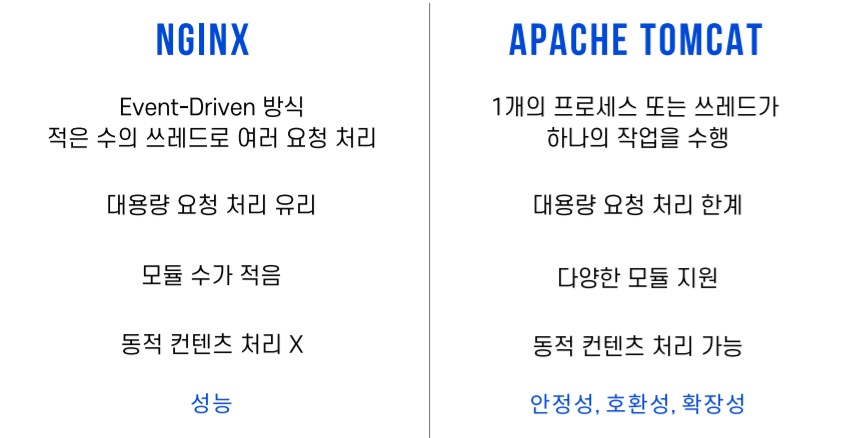

## 로컬 추가코드

로컬환경에서 실행합니다.

### 0. Django/settings.py

- staticfiles 경로 추가
  - `STATICFILES_DIRS`을 사용하는 경우 동일한 경로 사용불가(이름변경 `ex. staticfiles=>static`)

```python
# settings.py
STATIC_ROOT = os.path.join(BASE_DIR, 'staticfiles')
```


- ALLOWED_HOSTS
  - EC2 서버주소를 등록
  - 편하게 배포하기 위하여 `*` 로 등록 후 추후 수정가능

```python
# settings.py
ALLOWED_HOSTS = [
    '.compute.amazonaws.com',
    '*',
]
```


### 1. 의존성 저장

- 깃에 올리기 전 다른 컴퓨터에서 깔기 쉽도록 의존성을 pip list를 저장한다.

```shell
pip freeze > requirements.txt
```


### 2. git push

- 원격저장소에 업로드

```bash
$ git add .
$ git commit -m "{커밋메세지}"
$ git push -u origin {브랜치명}
```


### 3. Cloud환경 세팅

클라우드 환경에서 실행합니다.

- git을 설치해 줍니다.

```bash
$ sudo apt install git
$ git --version
$ git config --global user.name "{이름}"
$ git config --global user.mail "{메일}"
```

- git clone을 떠줍니다.

```bash
$ git clone {git clone 주소}
```

- 로컬과 버전이 맞는 파이썬을 설치해 줍니다.

```bash
$ sudo apt-get update 
$ sudo apt-get update -y 
$ sudo apt install build-essential git 
$ sudo apt-get install nginx python3.8 python3.8-venv python3.8-dev
```

- 파이썬 버전을 확인하고 venv를 설정합니다.
  - 어떤 명령어가 원하는 파이썬인지 확인

```bash
$ python --version
$ python3 --version
$ python3.8 --version
```
- venv 폴더 설정 후, venv폴더 생기는지 확인

```bash
$ cd {프로젝트 주소}
$ python3.8 -m venv venv
$ ls
```
- venv 활성화

```bash
$ source venv/bin/activate
```

- pip 버전 확인 후 , requirements.txt 설치

```bash
$ pip --version
$ pip3 --version
$ pip install -r requirements.txt
```


### Clooud에서 django 실행

- static 모은 후, migrate

```bash
$ python3.8 manage.py collectstatic
$ python3.8 manage.py migrate
```

- 외부 ip와 바인딩 되도록 실행

```bash
$ python3.8 manage.py runserver 0.0.0.0:8000
```

- 만약, 쟝고가 없다는 에러가 난다면 https://twpower.github.io/49-how-to-use-newrelic-apm-in-pyenv-and-virtualenv 확인


### WSGI

- wsgi는 Uwsgi와 gunicorn이 있는데 쉽고 짱짱 빠른 Gunicorn 쓸거임
- venv 상태인 것 확인하고 gunicorn 설치

```bash
$ pip install gunicorn
```

- gucicorn으로 프로젝트를 바인드해 실행해보기(wsgi파일 생성 겸)

```bash
$ gunicorn --bind 0.0.0.0:8000 {프로젝트 이름}.wsgi
```

- 잘 실행 된다면 venv 끄기

```bash
$ deactivate
```


### Gunicorn 환경설정

gunicorn을 처음 설정한다면 서비스가 없을 것임.

- gunicorn.service 파일 생성

```bash
$ sudo vi /etc/systemd/system/gunicorn.service
```

- 안에 내용 작성
  - WorkingDirectory는 manage.py가 있는 경로임
  - ExecStart는 엔터없이 경로 바꿔서 모두 붙여서 작성

```gunicorn.service
[Unit]
Description=gunicorn daemon
After=network.target
[Service]
User={유저명}
Group={유저그룹}
WorkingDirectory=/home/ubuntu/distribution/distribution 
ExecStart=/home/ubuntu/distribution/distribution/venv/bin/gunicorn --accesslogfile - --workers 3 --bind unix:/home/ubuntu/distribution/distribution/distribution.sock distribution.wsgi:application
[Install]
WantedBy=multi-user.target
```


### Gunicorn.service 실행

- daemon-reload

```bash
$ sudo systemctl daemon-reload
```

- gunicorn.service 실행

```bash
$ sudo systemctl enable gunicorn.service
$ sudo systemctl start gunicorn.service
$ sudo systemctl status gunicorn.service
```


### Nginx와 연결

- Apache와 Nginx의 차이점



- Apache2와 포트번호 중복이슈가 있다. 이를 해결하려면 Apache2를 삭제 혹은 포트번호를 돌려야 한다.

Nginx 로드밸런싱 작업

```bash
$ sudo vi /etc/nginx/sites-available/default
```

conf파일 수정

```conf
server {
	listen 80 default_server;
	listen [::]:80 default_server;
	
	root /home/ubuntu/distrubution/app;
	
	index index.html index.htm;
	server_name {서버 아이피 혹은 도메인 이름};
	
	location / {
		try_files $uri $uri/ /index.html;
	}
	
	location /api {
		root /home/ubuntu/distrubution/distribution;
		rewrite ^/api(/.*)$ $1 break;
		proxy_pass http://unix:/home/ubuntu/distrubution/distribution/distribution.sock;
	}

	location /admin/ {
		root /home/ubuntu/distrubution/distribution;
		proxy_pass http://unix:/home/ubuntu/distrubution/distribution/distribution.sock;
	}
```

- Nginx 실행 혹은 재실행

```bash
$ sudo systemctl start nginx.service
$ sudo systemctl status nginx.service
```

- 외부 아이피에서 `/api`를 붙여 써서 django에 접속이 되는지 확인한다.