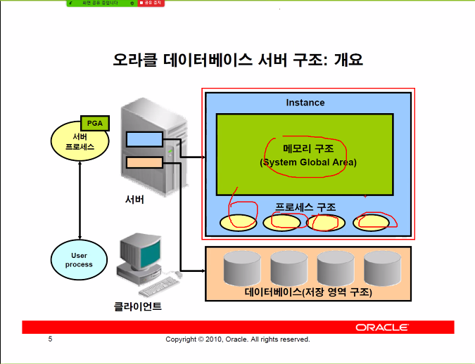
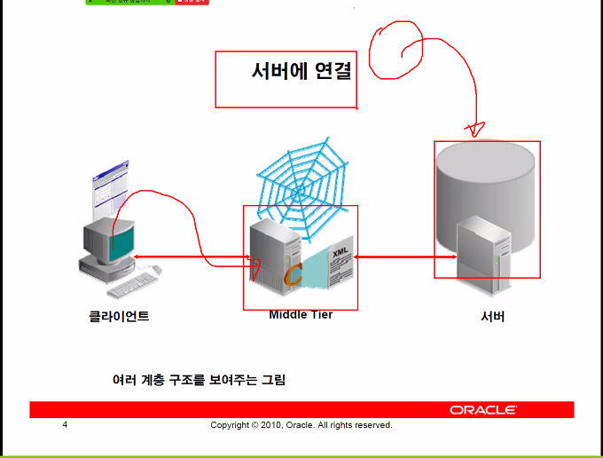
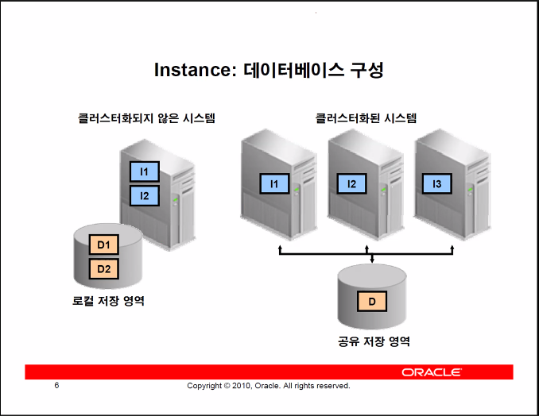
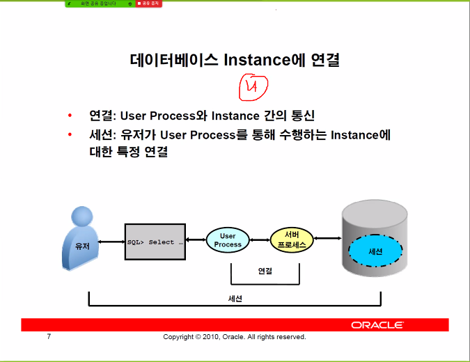

# Oracle

- 서버는 프로세스와 실제 저장을 하는 데이터 베이스로 이루어져 있다.

- 인스턴스는 작업을 진행하는 장소인 메모리 구조와 작업을 진행시키는 프로세스 구조로 이루어져 있다.

- 유저 프로세스는 서버 프로세스와 연결을 이루고 서버 프로세스가 인스턴스를 조작함으로써 움직인다.

  - `SQL developer` 등이 유저 프로세스 이고 이를 사용해서 DB에 접속하고 DB를 조작한다.

  - 사용자는 user process에서 쿼리를 작성해서 날리면 -> server process에서 이를 받아 서버가 실행한다.
  - 100명의 사용자가 있다면 100개의 server process들이 실행되어야 한다.

- SGA

  - 시스템이 모두 공유하면서 사용하는 메모리 영역

- PGA

  - 각각의 프로세스가 차지하는 메모리 영역을 뜻함.
  - 모든 프로세스는 실행된 프로세스라면 메모리 영역을 차지한다.

- 따라서 가장 처음에 해야하는 일은 클라이언트 PC에서 서버에 접속하는 것이다.
-  Middle Tier : Django, Spring boot처럼 xml을 날려주는 중간 서버

### Clustering

- 데이터를 저장하기 위해 로컬 저장영역이 아닌 하나의 서버 저장영역을 사용하여 저장하는 환경을 구축하는 것
- 정전 및 다양한 이유로 인해 프로세스가 죽었을 때, 데이터가 휘발되는 것을 막을 수 있음.
  - L1의 OS가 종료되더라도 L2의 OS가 살아있기 때문에 commit데이터는 살아있음
- 다만, 이 과정에선 배우지 않고 하나의 클러스터링만 배우게 될 것임.

### Connection & Session

- Connection
  - 서로의 ip 주소와 통신규약, 포트번호 등의 주소를 알고 이를 통해 연결을 진행하면 커넥션이 진행되었다고 함.
- Session
  - login부터 logout 까지의 사용자가 서버를 조작하는 환경

- Connection >=  Session
  - 커넥션이 먼저 일어나고 세션이 이후에 일어난다.(세션은 유저별로 더 작은 범위의 연결이라고 이해)

### server process - SELECT

서버 프로세스가 쿼리문을 처리하는 단계

Parse -> Bind -> Execute -> Fetch

1. Parse(구문 분석)

   - 실행계획을 확보한다.
   - 테이블의 주소를 미리 찾아놓고 인덱스를 참조할지, Full Scan을 사용할지 등을 결정한다.

   - parsing의 과정
     1. 문법 검사
     2. 객체, 권한 유/무 확인
        - 서버는 권한 및 객체명이 존재하는지 등을 확인하기 위해 메타데이터를 조회해야 한다.
        - 메타데이터 또한 테이블이고 이를 조회하려면 셀렉트문이 필요하다.
        - 여기에 사용되는 메모리 영역이 **Shared Pool**이다.
        - 데이터 딕셔너리 캐시에 메타데이터를 저장함으로써 많은 셀렉트문을 빠르게 처리한다.
     3. IF (동일 문장 실행)
        - 실행 계획 재사용 준비
        
        else: 
        
        - 실행 계획 생성/저장
        
          
        
        - PGA안에 Cursor가 기존에 Library cash을 검색하여 기존의 실행계획이 있는지를 검색한다.
        
        - 동일 문장 인식은 완벽하게 같은 문장이여야 함(SELECT != select).
        
        - 다만 바인드 변수를 사용했다면 변수명이 달라도 실행계획은 변함 없음.
        
          - 바인드 변수 : `select * from tab where id = {:a}` 이런식으로 :a 해당하는 숫자를 적는 것이 아닌 변수를 넣는것 
          - 바인드변수를 사용하면 shared pool내에서 최초 한번 실행한 sql은 다음의 똑같은 sql이 왔을때 다시 hard parse를 하지 않고 이미 parse된 쿼리로 사용하게 되기 때문에 성능이 좋다.

2. Bind(바인드 변수 사용시)

   - 바인드 변수에 값 입력

3. Execute: (실행계획대로) 실행함.

   - 디스크 영역을 확보
   - 디스크를 찾아냄.
   - 다수의 접속자가 접속했을 때, 디스크 영역의 테이블을 PGA에 저장하는 것은 메모리 낭비가 심함.
   - 또한 커밋등의 명령어가 발생했을 때, 테이블을 PGA에 저장하면 남의 것까지 일일히 찾아서 수정해야함.
   - 따라서 **데이터베이스 버퍼 캐시**라는 데이터 블록의 복사본을 SGA에 저장함.

4. Fetch : 인출

   - SGA의 데이터베이스 버퍼 캐시에서 PGA가 운반단위에 생성된 테이블을 모아서 전달.

### server process - UPDATE, DELETE, CREATE

서버 프로세스가 쿼리문을 처리하는 단계

1. Parse

   > (Select 때와 동일.)

   1. 문법 검사
   2. 객체 존재 유무 및 권한
   3. 과거의 실행 유무를 검사

2. Bind(바인드 변수가 있을 시)

   - select 때와 동일

3. Execute

   1. DATA, UNDO BLOCK 을 확보해 놓음.

      - 이전 상태의 값을 따로 저장해 놓음(RollBack을 위해 undo data라 부름)
      - 따라서 이를 위해 저장공간을 확보해 놓는 작업.

   2. LOCK 생성 !!

      - 하나하나의 행마다 다른 쿼리문이 접근해서 수정하는 것을 막기 위해 LOCK을 생성함.
      - 없다면 생각하지 못한 결과가 발생할 수도 있음.

      -  `commit` 및 `Rollback`으로 LOCK을 해제할 수 있음.

   3. `Redo Log Record 생성`

      - `ReDo Log buffer`는 모든 변경사항을 저장하는 버퍼임.

      - SGA의 순환 버퍼임
      - 어떤 작업을 실행했는지 를 저장함.

   4. 갱신

      - 갱신함

commit 작업시 데이터 베이스에 저장하는 것이 아닌 리두 로그 서버에 따로 저장함. 리두로그 버퍼를 비움.