### DataBase의 구성 파일들

- Control files
  - open시 사용되는 파일
  - 메타데이터 정보가 저장됨
- 데이타의 위치 정보, 리두로그파일의 위치 정보, 백업파일의 위치정보등이 저장된다.
- Data files
- Redo log files

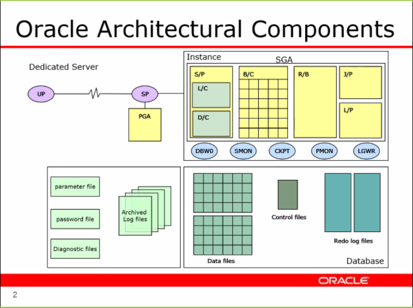

- Dedicated Server

UserProcess와 ServerProcess가 하나씩 커넥트되는 환경으로 만든 서버

### Dictionary Cache

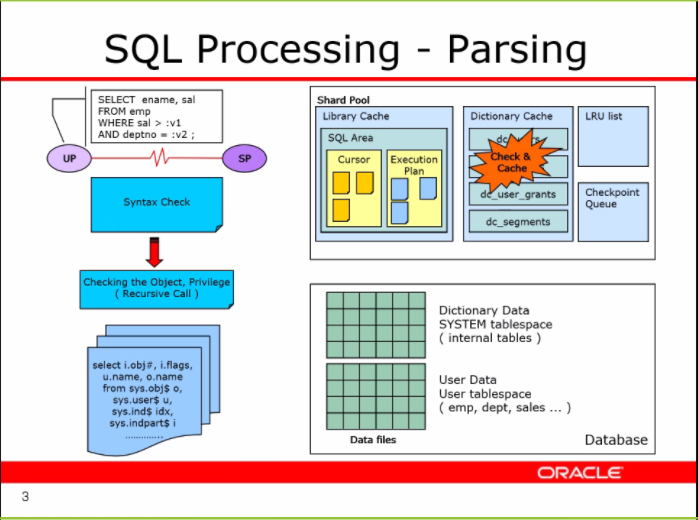

checking The Object

- 권한 및 실제 이러한 데이터가 명령어에 있는지 검색한다.(Recursive Call)

Dictionary Cache

- recursive call 호출이 너무 오래걸리니 여기서 나온 값을 저장해놓는 공간
- Disk I/O작업이 오래걸리니 테이블 당 이러한 권한유무와 객체명을 저장한다.


### SQL Area

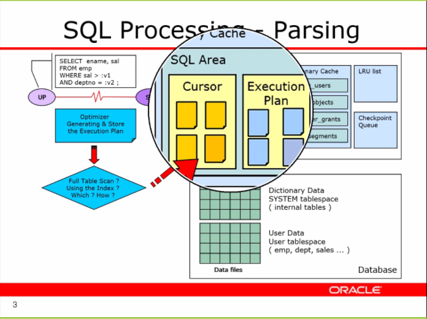

Optimizer를 통해 실행계획을 생성한다.

그리고 Hash 함수를 통해 주소값을 생성하는데 Execution Plan이 없다면 이를 저장해 놓는다.

실행계획을 만드는 것이 리소스를 많이 차지 하기 때문에 이를 Execution Plan을 저장할 공간을 만들어 놓는다.


### Execute

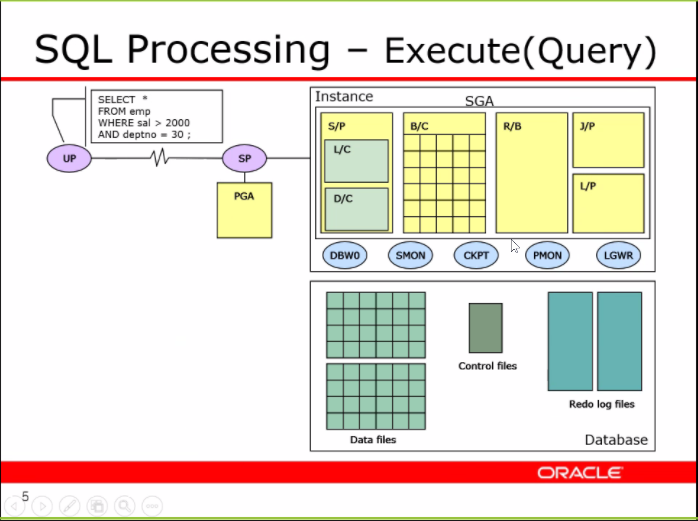

data files는 실제 데이터들이 블럭으로 저장된다.

이 데이터들은 불변의 주소를 지니고 있으며 Buffer Cashe에 저장되었다가 보내준다.

버퍼캐시 또한 데이터블록과 똑같은 크기의 블럭으로 나누어져 있으며 데이터 파일의 일정 부분을 올려서 담아둔다.

데이터파일에서 매번 찾기에는 데이터 파일이 너무 크기 때문에 자주 사용하는 데이터를 저장하는 버퍼캐시가 필요하다. 

---

### DATA BUFFER CASH

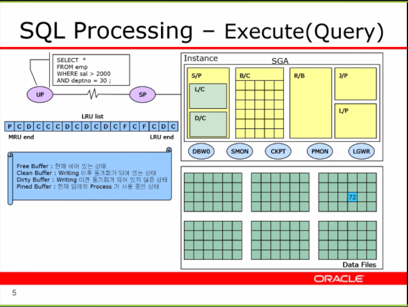

- LRU list
  - 메모리를 저장하는 알고리즘
  - 사용을 안할수록 뒤로 밀려나가는 알고리즘이다.
- 디스크 I/O를 줄이기 위해 자주 사용하는 데이터를 버퍼에 저장해놓는다.

---

### DML

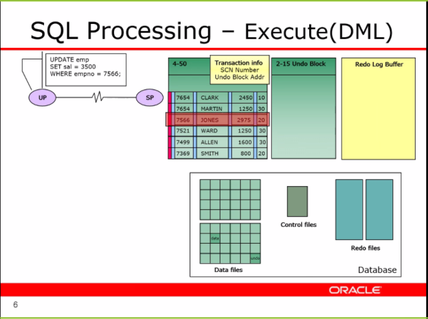

1. data 와 undo block 확보
2. Lock 생성
3. 리두로그 버퍼에 바뀐 내용 저장.
   - 여러명이 사용하다 보니 한번에 데이터를 리두 파일에 저장하는 것은 충돌이 일어날 가능성이 있다.
   - 따라서 리두 로그 버퍼에 저장했다가 비동기적으로 한번에 저장한다.
   - 로그 라이터는 혼자 작성하기 때문에 빠르다.

4. commit 시 일어나는 행동
   - 리두로그 버퍼에서 리두 파일로 움직임
   - disk I/O 작업 을 줄이기 위해 데이터 베이스는 발전했다.

> 왜 바로 데이터로 저장되지 않는 것일까?
>
> 블록형태로 data가 저장되는 datafile은 한번 접근할 때마다 저장하는 것은 비효율적이다.
>
> 리두파일즈에 옮겨놔서 한번에 저장하는 것이 효율적이다.
>
> (한자한자 타이핑 후 저장하지 않는다.)


### Buffer

- dirty buffer
  - 데이터파일과 버퍼의 데이터가 다른 버퍼 
- clean buffer
  - 데이터파일과 버퍼의 데이터가 같은 버퍼 


### DBA 명령어

```mysql
select * from V$database;
```

```mysql
SELECT * FROM v$INSTANCE;
```


```mysql
SELECT * FROM V$SGA;
```

```mysql
SELECT * FROM V$SGASTAT;
```

```mysql
SELECT * FROM dba_datA_FILES;
SELECT * FROM V$DATAFILE;
SELECT * FROM V$LOGFILE;
SELECT * FROM V$CONTROLFILE;
```


- ORACLE은 유료 프로그램이기 때문에 모든 SGA의 내용이 나오지는 않는다.


### SHARED POOL

- 많은 부분이 비공개이나 단 두부분이 밝혀져 있다
- Library cash
- Dictionary Cash


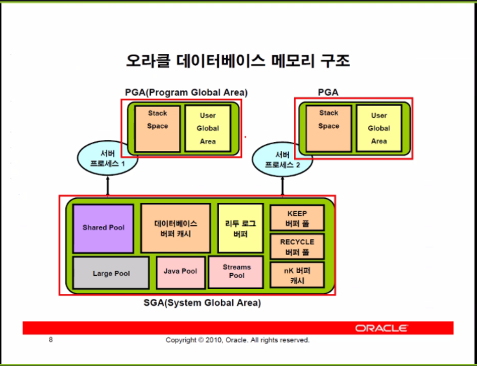


# SGA(System Global Area)

하나의 인스턴스에서 하나의 SGA를 갖는다.

다른 프로세스랑 같이 공유하기 때문에 잠금장치를 획득해야만 접속이 가능하다.

(경합이 발생할 수 있다.)

세가지의 필수 메모리 자원(메모리가 0이면 db사용 불가능)

- shared pool
- database buffer cash
  - disk 물리적 I/O작업을 줄이기 위해 복사본을 저장해 놓는다.
- redo log buffer
  - 단순한 큐 구조로 이루어져 있으며 오랫동안 저장하려는 알고리즘 없이 작동한다.

나머지는 옵셔널한 메모리 공간이다.


### PGA(Program Global Area)

독립적으로 작동하며(공유가 불가능하며) 각각의 프로세스에서만 사용하는 메모리 영역

다른 프로세스랑 같이 공유하지 않기 때문에 잠금장치를 획득할 필요가 없다.

- stack Space
  - 우리가 어쩔 수 없는 공간이다.
  - 자신이 작업하기 위한 메모리를 확보하기위한 자원이다.
- User Global Area
  - 유저 프로세스가 서버프로세스와 connect될 때, Cursor등이 생성되는 곳,
  - 유저의 명령문과 여러가지 작업을 처리하기 위한 메모리.


### Large Pool

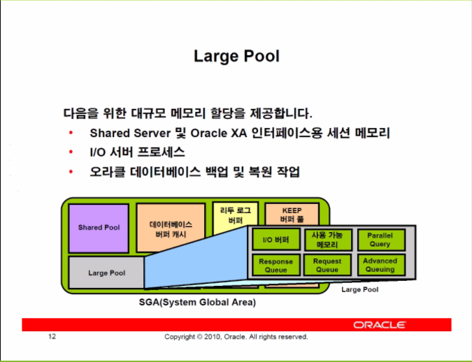

- shared server : dedicated 서버가 아닌 여러명이 하나의 Sp를 공유할 수도 있음.
- I/O 서버 : 주 서버를 보조하는 서버의 프로세스

> 라지 풀이 없더라도 위의 기능들은 사용가능하다. 다만 SharedPool에서 공간을 활용하기 때문에 SharedPool의 부담이 늘어난다.

- 필요한 만큼만 메모리를 잡아 사용하고 사용이 끝난 후 반환한다.


### Java Pool& streams Pool

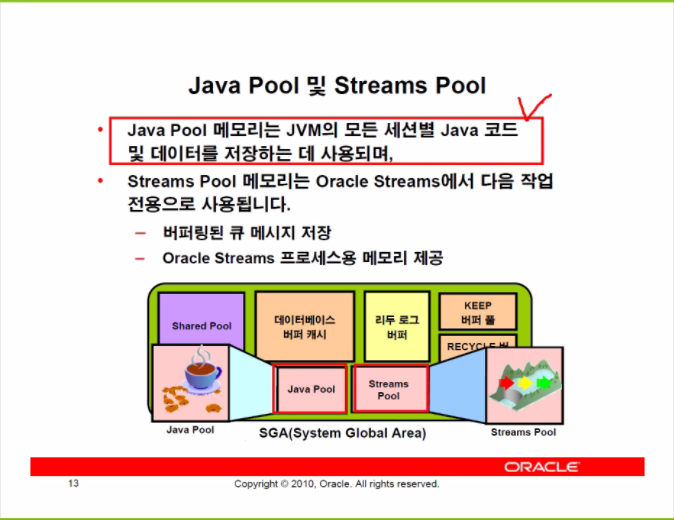

- stream 서비스
  - 두 개 이상의 DB를 사용하는 경우, A DB에 접속하더라도 B DB에 같이 쿼리가 흘러가 같이 조작하는 기술


# PGA

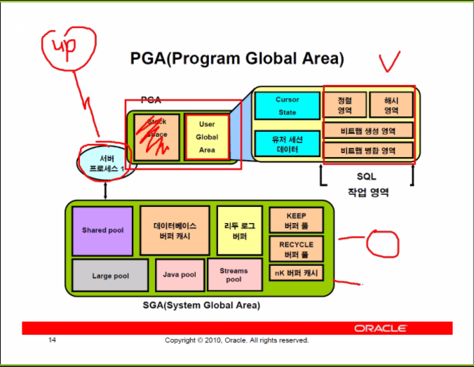

모든 프로세스는 PGA를 지니고 있는데 UGA가 있고 없고가 유저가 프로세스에 참여되느냐 없느냐를 결정하지 Stack Space는 모두 사용된다.


# 프로세스 구조

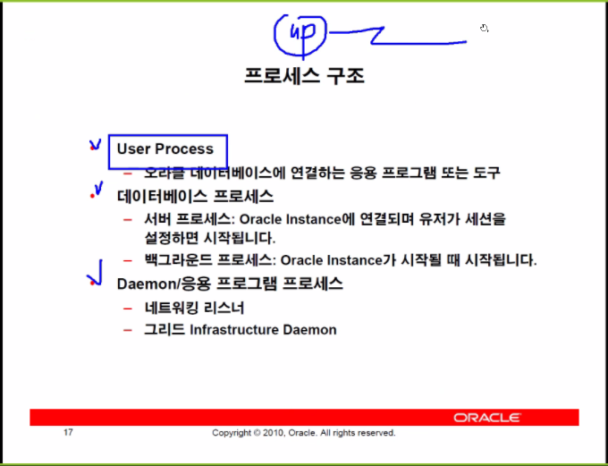

- 서버 프로세스는 유저프로세스와 삶을 같이 한다.

- Daemon/응용 프로그램 프로세스

  - 네트워킹 리스너 : 서버프로세스와 유저프로세스를 연결 시켜주거나 서버프로세스를 종료시켜주는 역할을 한다.

  - 그리드 Infrastructure Daemon : Daemon을 실행 시켜 백그라운드로 실행되게 해준다.

    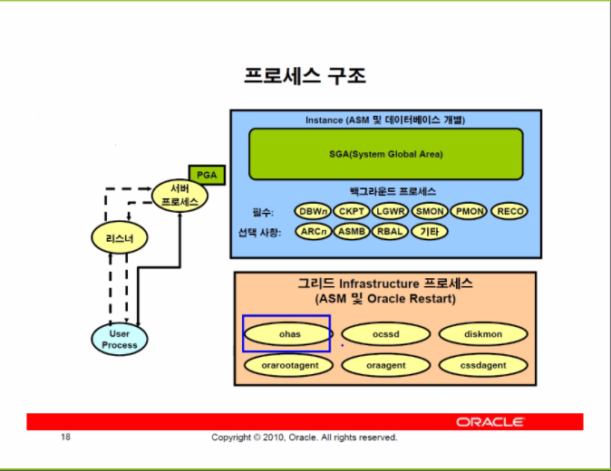