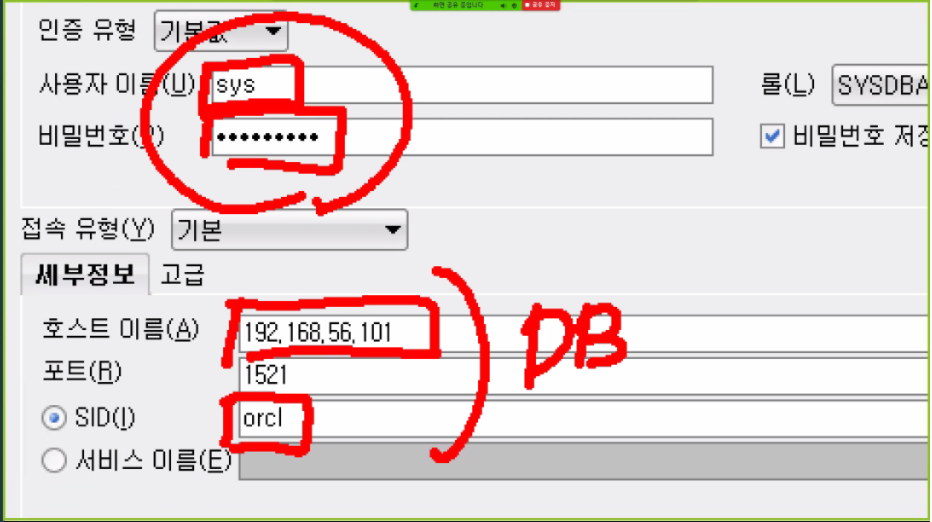
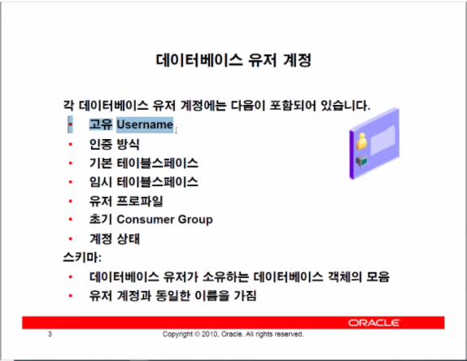
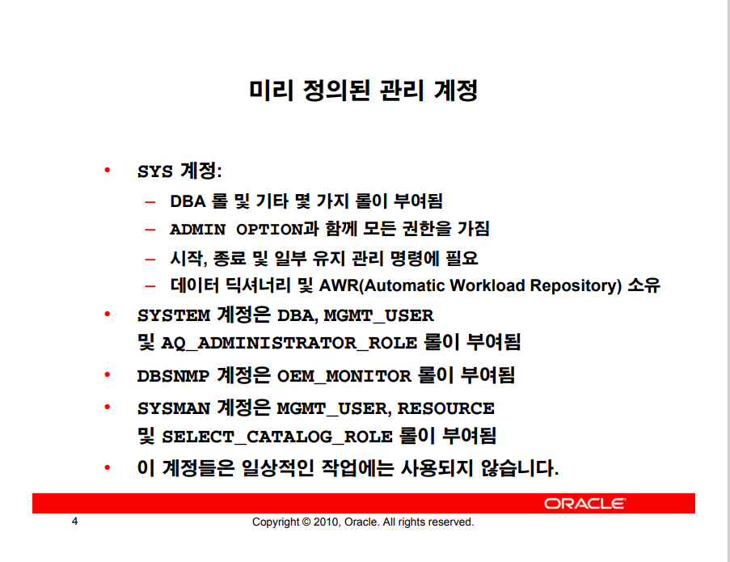
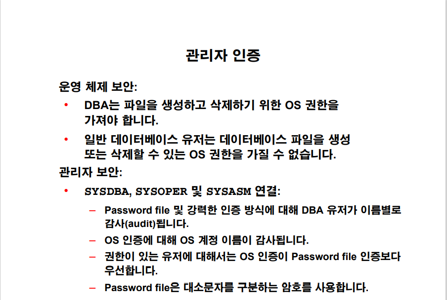

database buffer cashe

이또한 데이터블록과 같은 용량의 작업단위로 이루어져 있다. 이 똑같은 크기의 메모리 영역을 buffer라고 한다.

만약 데이터 테이브


테이블 스페이스에서 블록사이즈를 변경한다면  데이터 버퍼 캐쉬의 메모리를 잡아줘야한다.

테이블 스페이스는 오프라인을 걸어줄 수 있다.


질문

32g 안되더라 왜 설정파일 때문인가?

unlimited설정과 31g의 차이가 있는가?

alter system set db_16k_cache_size = 16M


- 테이블 스페이스의 공간 부족 시 해결 방법

- ```mysql
  ALTER TABLESPACE tbs2
   ADD DATAFILE '/home/oracle/tbs2_1.dbf' SIZE 10M ;
  ```

- ```mysql
  ALTER DATABASE DATAFILE '/home/oracle/tbs2.dbf' RESIZE 20M ; 
  ```

- ```mysql
  ALTER DATABASE DATAFILE '/home/oracle/tbs2.dbf' AUTOEXTEND ON NEXT 10M MAXSIZE 100M ;
  ```


# 8.유저보안관리

- ```mysql
  create user {username}
  identified by {password};
  ```

  위의 명령어로 유저를 만든다.

DB에 저장되는 데이터는 크게 2개가 있다. 딕셔너리 데이터와 유저 데이터.

### user$

딕셔너리데이터중 system에서 관리하는 user$라는 테이블이 있다.

user$테이블은 id와 비밀번호를 포함하고 있으며 관리자만이 접속할 수 있다.

또한, 서버프로세스와 유저프로세스가 연결(세션)로그인을 할 때 사용된다.

instance가 위의 작업을 실행하므로 항상 데이타베이스는 스타트업(open)된 상태에서 사용가능하다.

단, sys는 DB의 인스턴스를 키고 끌수 있는 권한이 있으므로 instance가 관리하는 user가 아니다.


### sys의 권한 관리

db는 os위에 올려져 있는 프로그램이다. 따라서 os의 로그인이 먼저 실행된다. 이 os 권한을 지닌 자는 oracle을 삭제할 수도 있는 권한을 지니고 있다. DB밖에서 권한을 받고 들어오는 `sys`는 OS가 관리한다.


`sqlplus {id}/{password} as sysdba`여기서 os관리자 권한이 있다면 id password가 생략 가능하다.




하지만 sqldeveloper를 사용하여 로그인을 진행할 때, os호스트의 아이디와 비밀번호를 적지는 않는다.

여기서 대신 os에서 관리하는 `orapw{sid}`이라는 파일에서 권한을 얻어 실행된다.

이 `orapw{sid}`을 지우면 인스턴스 작동에는 문제가 없지만 다시 접속을 얻을 때 문제가 생긴다.

하지만 os로그인이 된 상태에서`sqlplus / as sysdba`로 로그인을 한다면 로그인이 된다.

> `sqlplus sys/oracle@orcl as sysdba`의 명령어로 실행 되면 접속이 안된다.
>
> 이는 orapw를 사용하여 orcl의 권한을 얻어 실행하라는 명령어이기 때문이다.


지운 `orapw{sid}`파일을 다시 만들려면 `orapwd file=orapworcl password=oracle`명령어를 쳐주면 된다.


### USER



user의 데이터를 저장하는데도 테이블 스페이스가 필요하다.

##### - default tablespace

테이블을 만들 때, 테이블 스페이스를 지정하지 않는다면 유저가 가지고 있는 기본테이블 스페이스에 저장된다.

- ##### 임시 테이블 스페이스

임시 테이블을 만들 때, 

##### - 유저 프로파일, 컨서머 그룹

 일단은 성능향상을 위한것으로 이해하고 넘어가자

- ##### 계정상태

  계정의 잠금 유무


- ##### 스키마

  데이터베이스 유저가 소유하는 데이터베이스 객체의 모음.

  `create table hr.t1(id number)`여기서 hr은 스키마명을 지정하는 것임.




sys 계정을 제외한것은 무시해도 쌉가능.


실제 user를 만들어도 할 수있는 일은 하나도 없다.

```bash
login as: oracle
oracle@192.168.56.101's password:
Last login: Mon Nov 30 14:09:17 2020 from 192.168.56.1
[orcl:~]$ sqlplus / as sysdba

SQL*Plus: Release 11.2.0.1.0 Production on Tue Dec 1 16:11:40 2020

Copyright (c) 1982, 2009, Oracle.  All rights reserved.


Connected to:
Oracle Database 11g Enterprise Edition Release 11.2.0.1.0 - Production
With the Partitioning, Automatic Storage Management, OLAP, Data Mining
and Real Application Testing options


-- 빈껍데기 유저를 만들었다. 하지만 아무것도 못함.
SYS@orcl>create user ryu
  2  identified by oracle
  3  default tablespace users
  4  temporary tablespace temp;

User created.

-- 하지만 로그인은 되지 않는다.
SYS@orcl> conn ryu
Enter password:
ERROR:
ORA-01045: user RYU lacks CREATE SESSION privilege; logon denied


Warning: You are no longer connected to ORACLE.


@>conn / as sysdba
Connected.

-- 세션권한을 준다면 
SYS@orcl>grant create session to ryu;

Grant succeeded.


-- 로그인이 잘된다.
SYS@orcl>conn ryu/oracle
Connected.


-- 하지만 테이블 생성도 안되고
RYU@orcl>create table t1 (id number);
create table t1 (id number)
*
ERROR at line 1:
ORA-01031: insufficient privileges

-- 테이블 조회도 안된다.
RYU@orcl>select * from scott.emp;
select * from scott.emp
                    *
ERROR at line 1:
ORA-00942: table or view does not exist


-- 다시 sysdba계정에서 권한들을 줘보자.
RYU@orcl>conn / as sysdba
Connected.
SYS@orcl>grant create table, create view, create sequence TO ryu;

Grant succeeded.

SYS@orcl>grant select on scott.emp to ryu;

Grant succeeded.


-- 류 계정에서 연결해서보니
SYS@orcl>conn ryu/oracle
Connected.

-- 조회는 잘 된다.
RYU@orcl>select * from scott.emp
  2  ;

     EMPNO ENAME      JOB              MGR HIREDATE         SAL       COMM     DEPTNO
---------- ---------- --------- ---------- --------- ---------- ---------- ----------
      7369 SMITH      CLERK           7902 17-DEC-80        800                    20
      7499 ALLEN      SALESMAN        7698 20-FEB-81       1600        300         30
      7521 WARD       SALESMAN        7698 22-FEB-81       1250        500         30
      7566 JONES      MANAGER         7839 02-APR-81       2975                    20
      7654 MARTIN     SALESMAN        7698 28-SEP-81       1250       1400         30
      7698 BLAKE      MANAGER         7839 01-MAY-81       2850                    30
      7782 CLARK      MANAGER         7839 09-JUN-81       2450                    10
      7788 SCOTT      ANALYST         7566 19-APR-87       3000                    20
      7839 KING       PRESIDENT            17-NOV-81       5000                    10
      7844 TURNER     SALESMAN        7698 08-SEP-81       1500          0         30
      7876 ADAMS      CLERK           7788 23-MAY-87       1100                    20
      7900 JAMES      CLERK           7698 03-DEC-81        950                    30
      7902 FORD       ANALYST         7566 03-DEC-81       3000                    20
      7934 MILLER     CLERK           7782 23-JAN-82       1300                    10

14 rows selected.


-- 테이블 생성 또한 잘 된다.
RYU@orcl>create table t1 (id number);

Table created.


-- 하지만 실제 데이터 용량을 차지하는 insert 구문은 작동을 안하는데..
RYU@orcl>insert into t1 values (1234);
insert into t1 values (1234)
            *
ERROR at line 1:
ORA-01950: no privileges on tablespace 'USERS'


-- 할당량을 안줘서 그렇다. 계정 바꿔서 다시 ㄱㄱ
RYU@orcl>conn / as sysdba
Connected.

-- 류의 할당량을 10m 줘보자.
SYS@orcl>alter user ryu quota 10m on users;

User altered.


--계정을 바꿔 다시 실행
SYS@orcl>conn ryu/oracle
Connected.

-- insert 잘된당~
RYU@orcl>insert into t1 values(1234);

1 row created.

RYU@orcl>commit;

Commit complete.


```


보통의 권한은 이런식으로 테이블 스페이스를 준다.

```mysql
conn / as sysdba
grant unlimited tablespace to {사원}
```


### 유저 인증

가장 많이 사용하는 방식은 Password이다.

External은 외부의 인증을 받고 들어오는 환경이다.

Global은 다양한 데이터 베이스에서 인증을 여러번 옮겨다니기 귀찮으니 오라클에서 인증을 통합관리해주는 설정이다.





### 유저계정 Lock

```mysql
-- 로그인 안되게 
ALTER USER {사원}
ACCOUNT LOCK;

-- 로그인 락풀기
ALTER USER {이름}
ACCOUNT UNLOCK;

-- 비밀번호 바꾸기
ALTER USER RYU 
IDENTIFIED BY oracle ; 
```


### 권한

- 시스템 권한
  - 
- 객체 권한


- ADMIN OPTION

```mysql
GRANT CREATE TABLE TO RYU WITH ADMIN OPTION ; 
```

​	ADMIN 옵션은 류가 다른 사람에게 권한을 재부여할 수 있는 권리까지 주는것이다.

​	다만 리보크(권한뺏기)하더라도 류가 제 3자에게 이양한 권한은 다시 돌려주지 않는다.

- GRANT OPTION

```mysql
GRANT SELECT ON SCOTT.EMP TO RYU WITH GRANT OPTION; 
```

​	그랜트 옵션은 어드민과 마찬가지로 재부여 할 수 있는 권리가 주어지나

​	리보크시 제 3자에게 이양한 권한까지 돌려준다.


### ROLE

```mysql
CREATE ROLE MANAGER ; 
GRANT CREATE TABLE TO MANAGER ; 
GRANT CREATE USER  TO MANAGER ; 
GRANT MANAGER TO RYU
```

권한관리를 용이하게 사용하고 선택적 가용성이 가능하다.

롤을 롤에게 부여가능하다.


```mysql
CREATE ROLE MANAGER   
IDENTIFIED BY ORACLE; 
```

비밀번호를 알아야지만 매니저 롤을 사용가능한 보안 롤이다.


> PASSWORD EXPIRE 속성
>
> ```mysql
>  CREATE USER inventory
> IDENTIFIED BY oracle_4U
> PROFILE default
>  DEFAULT TABLESPACE inventory
> TEMPORARY TABLESPACE temp
> ACCOUNT UNLOCK
> PASSWORD EXPIRE ; 
> ```
>
> 여기서 PASSWORD EXPIRE 속성을 주면 만료된 비밀번호라는 알림이 뜨고 USER가 바로 수정이 가능하다.

OS로그인으로 들어올 수 있는 USER OPS$ORACLE로 외부인증이 가능하다.